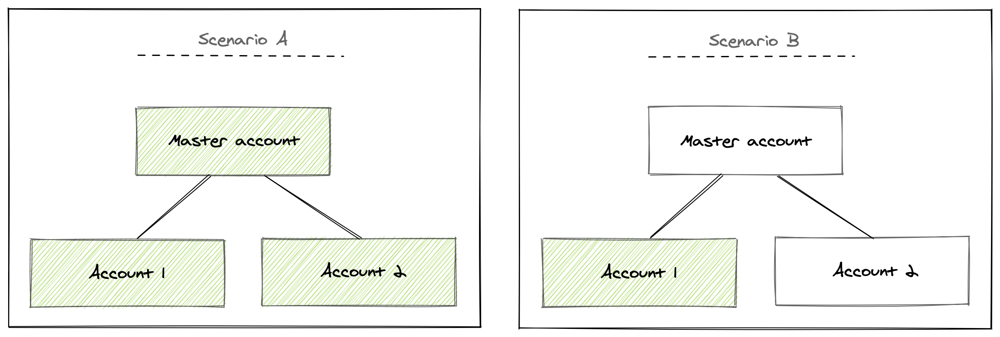

<Intro>

Understand the requirements for managing and using Nerdpacks in New Relic One.

</Intro>

## Capabilities at a glance

Your ability to manage and use Nerdpacks depends on your user's:

- Model (original or New Relic One model)
- Type
- Role

Whether you're on the [original user model](https://docs.newrelic.com/docs/accounts/original-accounts-billing/original-users-roles/users-roles-original-user-model/) or the [New Relic One user model](https://docs.newrelic.com/docs/accounts/accounts-billing/new-relic-one-user-management/new-relic-one-user-model-understand-user-structure/), review the tables below for a summary of your Nerdpack capabilities.

### Original user model

If your organization was created before July 30, 2020 and you haven't transitioned to our New Relic One pricing model, you're on the [original pricing plan](https://docs.newrelic.com/docs/accounts/original-accounts-billing/product-pricing/product-based-pricing/). Capabilities for our [original user model](https://docs.newrelic.com/docs/accounts/original-accounts-billing/original-users-roles/users-roles-original-user-model/) differ from those of our [new user model](https://docs.newrelic.com/docs/accounts/accounts-billing/new-relic-one-user-management/new-relic-one-user-model-understand-user-structure/):

| | Basic user | Full user without the Nerdpack Manager add-on role | Full user with the Nerdpack Manager add-on role | Owner/Admin user |
|:--|:-:|:-:|:-:|:-:|
| Serve Nerdpacks | yes | yes | yes | yes |
| Publish Nerdpacks | no | no | yes | yes |
| Subscribe to Nerdpacks | no | no | yes | yes |
| Tag Nerdpacks | no | no | yes | yes |
| Use Nerdlets or visualizations created by your accounts | no | yes | yes | yes |
| Use Nerdlets created by New Relic | no* | yes | yes | yes |
| Use visualizations created by New Relic | no | yes | yes | yes |

_* There are a few Nerdlets that basic users are allowed to use. See [Basic users](#basic-users) for more information._

### New Relic One user model

If your organization is part of the [New Relic One pricing model](https://docs.newrelic.com/docs/accounts/accounts-billing/new-relic-one-pricing-billing/new-relic-one-pricing-billing/), the user types, privileges, and capabilities are different than those of our original user model:

| | Basic user | Full user |
|---|---|---|
| Serve Nerdpacks | yes | yes |
| Publish Nerdpacks | no | yes |
| Subscribe to Nerdpacks | no | yes |
| Tag Nerdpacks | no | yes |
| Use Nerdlets or visualizations created by your accounts | no | yes |
| Use Nerdlets created by New Relic | no* | yes |
| Use visualizations created by New Relic | no | yes |

_* There are a few Nerdlets that basic users are allowed to use. See [Basic users](#basic-users-1) for more information._

## Nerdpack permissions: Original user model

Learn the differences between how basic users, full users, and admins can use and manage Nerdpacks in the [original user model](https://docs.newrelic.com/docs/accounts/original-accounts-billing/original-users-roles/users-roles-original-user-model/).

### Basic users

If you're a basic user in the original user model, you're limited in your Nerdpack capabilities. You can only create and serve Nerdpacks locally. To publish, tag, subscribe to, and use your Nerdpacks, an admin must upgrade you to a full user.

<Callout variant="tip">

If you're a basic user, you generally can't use any Nerdpacks. However, there are some Nerdlets that New Relic maintains that you can use. These are rare and there is currently no way for you to distinguish them in our web interface. And even if you can use a Nerdlet in a Nerdpack, you're never able to use custom visualizations. For this, you must be upgraded to a full user.

</Callout>

### Full users

If you're a full user in the original user model, you either:

- Have the **Nerdpack Manager** add-on role
- Don't have the **Nerdpack Manager** add-on role

The **Nerdpack Manager** role is required to publish, subscribe to, and tag Nerdpacks. So if you don't have the **Nerdpack Manager** role, you can only create and serve Nerdpacks locally and use Nerdpacks that your accounts have already been subscribed to.

To publish, tag, or subscribe to a Nerdpack, an admin must upgrade you to a full user or grant you the **Nerdpack Manager** add-on role.

### Owner/Admin users

If you're an owner or admin user, you can perform any of the Nerdpack capabilities. You can create, serve, publish, tag, subscribe to, and use any and all nerdpack items, both Nerdlets and visualizations. This includes Nerdpacks built by New Relic or by one of your accounts.

## Nerdpack permissions: New Relic One user model

Learn the differences between how basic users and full users can use and manage Nerdpacks in the [New Relic One user model](https://docs.newrelic.com/docs/accounts/accounts-billing/new-relic-one-user-management/new-relic-one-user-model-understand-user-structure/).

### Basic users

If you're a basic user in the New Relic One user model, you're limited in your Nerdpack capabilities. You can only create and serve Nerdpacks locally. To publish, tag, subscribe to, and use your Nerdpacks, an admin must upgrade you to a full user.

<Callout variant="tip">

If you're a basic user, you generally can't use any Nerdpacks. However, there are some Nerdlets that New Relic maintains that you can use. These are rare and there is currently no way for you to distinguish them in our web interface. And even if you can use a Nerdlet in a Nerdpack, you're never able to use custom visualizations. For this, you must be upgraded to a full user.

</Callout>

### Full users

If you're a full user in the New Relic One user model, you either:

- Have the **Nerdpacks "modify"** privilege
- Don't have the **Nerdpacks "modify"** privilege

The **Nerdpacks "modify"** privilege is required to publish, subscribe to, and tag Nerdpacks. So if you don't have the **Nerdpacks "modify"** privilege, you can only create and serve Nerdpacks locally and use Nerdpacks that your accounts have already been subscribed to.

To publish, tag, or subscribe to your Nerdpack, an admin must grant you the **Nerdpacks "modify"** privilege.

<Callout variant="tip">

The **Nerdpacks "modify"** privilege is included in both the **User** and **Admin** groups, the only groups available by default. So in most cases, you'll have the ability to manage Nerdpacks as a full user. However, if you're a full user assigned to a custom group that doesn't include the **Nerdpacks "modify"** privilege, you won't be able to manage Nerdpacks.

</Callout>

## Master/Sub-account Capabilities

Some accounts, called master accounts, have sub-accounts that report data back up to them. This organizational hierarchy affects Nerdpack capabilities.

In general, the flow of control moves downstream:

In this example scenario **A**, the master account publishes a Nerdpack. This means that all three accounts, **Master**, **Account 1**, and **Account 2**, can subscribe to it. If you subscribe the master account to the Nerdpack, then users of all three accounts can use it. If you subscribe **Account 1** to it, only **Account 1** users can use it, because neither **Master** nor **Account 2** is downstream in the hierarchy.

In scenario **B**, the sub-account, **Account 1**, publishes a Nerdpack, so you can't use or subscribe to the Nerdpack from **Master** or **Account 2**.