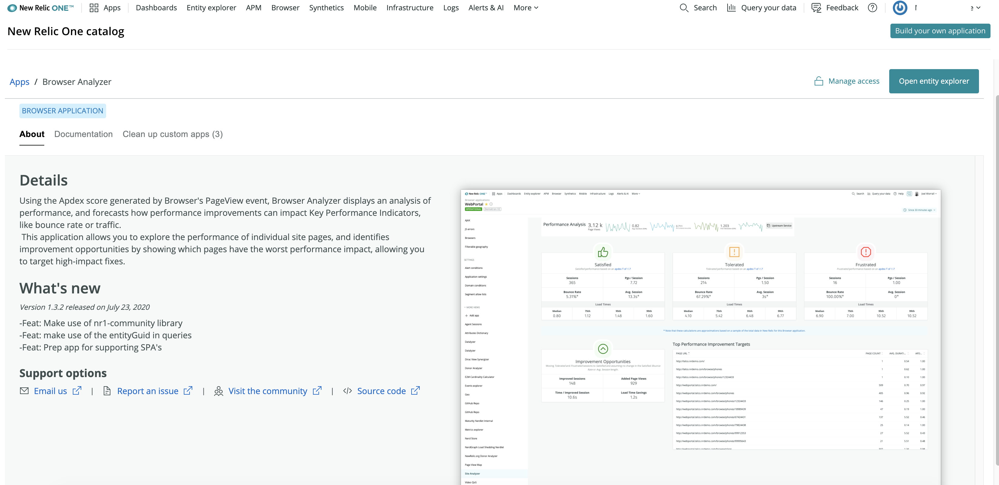

<Intro>

When you build a New Relic One app, chances are you'll want to share it with others in your organization. You might even want to share it broadly through our open source channel. But first, you probably want to try it out locally to make sure it's working properly.

</Intro>


From the New Relic One **Apps** page, you can review available apps and subscribe to the ones you want for accounts you manage. The **Your apps** section shows launchers for New Relic apps, as well as any third-party apps that you subscribe to. The New Relic One catalog provides apps that you haven't subscribed to, some developed by New Relic engineers to provide visualizations we think you'll want, like Cloud Optimizer, which analyzes your cloud environment, or PageView Map, which uses Browser events to chart performance across geographies. Your apps in the catalog are created by third-party contributors and are submitted via [opensource.newrelic.com](https://opensource.newrelic.com). All are intended to help you visualize the data you need, the way you want it.

Here, you learn to:

- [Serve your app locally](#serve-your-app-locally)
- [Add images and metadata to your app](#add-images-and-metadata-to-your-apps)
- [Publish it](#publish-your-app)
- [Subscribe and unsubscribe accounts you manage to the app](#subscribe-or-unsubsribe-apps)
- [Handle duplicate applications](#handle-duplicate-applications)

## Before you begin

This guide requires the following:

- A New Relic One app or Nerdpack
- New Relic One CLI
- A Nerdpack manager role for publishing, deploying, and subscribing apps.

## Serve your app locally

You can locally serve the app you create to New Relic One to test it out.

<Steps>

<Step>

1.  In the parent root folder of your Nerdpack, run `nr1 nerdpack:serve`.
2.  Go to [one.newrelic.com/?nerdpacks=local](http://one.newrelic.com/?nerdpack=local). The `?nerdpacks=local` URL suffix will load any locally served Nerdpacks that are available.

When you make a change to a locally served Nerdpack, New Relic One will automatically reload it.

</Step>

</Steps>

## Add images and metadata to your apps

Application creators can include a description of what their apps do and how they're best used when they build an app. They can also include screenshots, icons, and metadata that help to make them easy to spot amongst other applications.

Some metadata is added automatically when an app is published:

- Related entities, listed if there are any.
- Origin label to indicate where the app comes from: local, custom, or public.



The New Relic One CLI enables you to provide the information and images you want to include with your application. Then it's a matter of kicking off a catalog command that validates the information and saves it to the catalog.

<Steps>

<Step>

Update the New Relic One CLI to ensure you're working with the latest version.

```
nr1 update
```

</Step>

<Step>

Add catalog metadata and screenshots.

Run `nr1 create` and then select `catalog` to add a catalog folder to your New Relic One project. The folder contains the following empty files and folder. Add the information as described in the following sections for the process to succeed.

### screenshots folder

A directory that must contain no more than 6 images and meet these criteria:

- 3:2 aspect ratio
- PNG format
- landscape orientation
- 1600 to 2400 pixels wide

### `documentation.md`

A markdown file that presents usage information pulled into the **Documentation** tab for the application in the catalog.

### `additionalInfo.md`

An optional markdown file for any additional information about using your application.

<>

### `config.json`

A JSON file that contains the following fields:

- `tagline`: A brief headline for the application. Must not exceed 30 characters.
- `repository`: The URL to the GitHub repo for the application. Must not exceed 1000 characters.
- `details`: Describes the purpose of the application and how to use it. Information must not exceed 1000. Use carriage returns for formatting. Do not include any markdown or HTML.
- `support`: An object that contains:
  - `issues`: A valid URL to the GitHub repository's issues list, generally the GitHub **Issues** tab for the repo.
  - `email`: A valid email address for the team supporting the application.
  - `community`: URL to a support thread, forum, or website for troubleshooting and usage support.
- `whatsNew`: A bulleted list of changes in this version. Must not exceed 500 characters. Use carriage returns for formatting. Do not include markdown or HTML.

Example:

```json
{
  "tagline": "Map your workloads &amp; entities",
  "repository": "https://github.com/newrelic/nr1-workload-geoops.git",
  "details": "Describe, consume, and manage Workloads and Entities in a geographic \n
  model that supports location-specific KPI's, custom metadata, drill-down navigation into Entities \n
  and Workloads, real-time configuration, and configuration via automation using the newrelic-cli.",
  "support": {
    "issues": {
      "url": "https://github.com/newrelic/nr1-workload-geoops/issues"
    },
    "email": {
      "address": "opensource+nr1-workload-geoops@newrelic.com"
    },
    "community": {
      "url": "https://discuss.newrelic.com/t/workload-geoops-nerdpack/99478"
    }
  },
  "whatsNew": "\n-Feat: Geographic mapping of Workloads and Entities\n
  -Feat: Programmatic alerting rollup of underlying Entities\n
  -Feat: Custom KPI measurement per location\n
  -Feat: Empty-state edit workflow\n
  -Feat: JSON file upload format\n-Feat: Published (in open source docs) guide to automating configuration using the newrelic-cli"
}
```

</>

</Step>

<Step>

Save the metadata and screenshots to the catalog.

This validates the information you added to the catalog directory against the criteria described in the previous step, and saves it to the catalog.

```
nr1 catalog:submit
```

</Step>

</Steps>

## Publish your app

Publishing places your Nerdpack in New Relic One. To publish or deploy, you must be a **Nerdpack manager**.

New Relic One requires that only one version (following semantic versioning) of a Nerdpack can be published at a time. 

<Tip>

If you know what channel you want to deploy to (as described in the Deploy your app section that follows), you can run `nr1 nerdpack:publish --channel=STABLE` or `nr1 nerdpack:publish --channel=BETA`.

</Tip>

<Steps>

<Step>

Update the `version` attribute in the app's `package.json` file. 

This follows semantic versioning, and must be updated before you can successfully publish.

</Step>

<Step>

To publish your Nerdpack, run `nr1 nerdpack:publish`.

</Step>

</Steps>

## Deploy your app

Deploying is applying a Nerdpack version to a specific channel (for example, BETA, or STABLE). A channel can only have one Nerdpack version deployed to it at one time. If a channel has an existing Nerdpack associated with it, deploying a new Nerdpack version to that channel will undeploy the previous one. Channels are meant to be an easier way to control application version access than having to be concerned with specific version numbers.

<Steps>

<Step>

To deploy an application, run `nr1 nerdpack:deploy`.

</Step>

</Steps>

## Subscribe or unsubsribe apps

Whether you want to subscribe accounts to an app you've created or to apps already available in the catalog, the process is the same. Note that if you subscribe to an app in the catalog, you'll automatically get any updates that are added to the app.

To learn about the appropriate permissions for subscribing, see [Permissions for managing applications](/build-apps/permission-manage-apps).

<Steps>

<Step>

Subscribe accounts to an application.

1. Select an application you want to add to your New Relic account.
2. Click **Add this app**. Note that this button says **Manage access** if the app has already been subscribed to an account you manage.
3. On the **Account access** page listing the accounts you can subscribe to an application:

- Select the accounts you want to subscribe the app to.
- Choose the channel you want to subscribe the app to, **Stable** or **Dev**. This can only be **Stable** for the public apps created by New Relic.
- Click the update button. Now you and members of the accounts you have subscribed to the app can launch it from New Relic One.

</Step>

<Step>

Unsubsribe from an application.

1. On the **Apps** page, open the app you want to unsubscribe.
2. Click **Manage access**.
3. Clear the check box for any accounts you want to unsubscribe, and then click the update button. The application is no longer listed in the **Your apps** section of the **Apps** page, and you have unsubscribed.

</Step>

</Steps>

## Handle duplicate applications

You might end up with duplicate applications on your New Relic One **Apps** page. This can happen when you subscribe to the same app using both the CLI and the catalog. Or if you clone an app, modify, and deploy it, but keep the original name. You can manage duplicates with the catalog.

Good to know before you start:

- You need a user role with the ability to manage Nerdpacks for accounts that you want to unsubscribe and undeploy from applications.
- You can't remove the public apps.
- When a duplicate application has no accounts subscribed to it, you undeploy it. For applications that have accounts subscribed to them, you **unscubscribe** and **undeploy**.
- The unsubscribe and undeploy process happens in a batch. To remove an account from an application, but ensure that other accounts continue to be subscribed, select the checkbox, **Resubscribe these accounts to the new application**.

<Steps>

<Step>

Remove duplicates.

1. In the New Relic One catalog, click a public application that has one or more duplicates. (You can only manage duplicates from the public version of the application.)
2. On the application information page, select **Clean up applications**.
3. Review the information about the application that's open, as well as any duplicates. Click **Manage app** for duplicates you want to remove.
4. If needed, select **Resubscribe these accounts to the new application**.
5. Click **Unsubscribe and undeploy**, and agree to the terms and conditions.

</Step>

</Steps>
