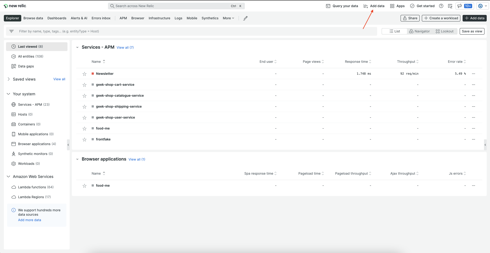

<Intro>

Publish your Nerdpack, whether it's still in development, ready for testing, or stable, to share it with others.

</Intro>

## Update your CLI

Before you run any commands, ensure that you have the latest version of the CLI:

```sh
nr1 update
```

## Check your permissions

When you publish your Nerdpack, it's registered with the Instant Observability catalog. From there, some users can subscribe to your Nerdpack. Subscribing users need to have:

- Access to the account that published the Nerdpack
- The [necessary permissions for managing Nerdpacks](/build-apps/permission-manage-apps)

## Update your package version

You can only publish a package version to the Instant Observabiltiy catalog one time. For example, you can't publish two instances of version _1.0.0_. So, each time you want to deploy a new version of your code, you need to increment its version in the Nerdpack's _package.json_ file:

```json fileName=package.json lineHighlight=4
{
  "private": true,
  "name": "demo-app",
  "version": "1.0.0",
  "scripts": {
    "start": "nr1 nerdpack:serve",
    "test": "exit 0"
  },
  "nr1": {
    "uuid": "ab123c45-678d-9012-efg3-45hi6jkl7890"
  },
  "dependencies": {
    "prop-types": "^15.6.2",
    "react": "^16.6.3",
    "react-dom": "^16.6.3"
  },
  "browserslist": ["last 2 versions", "not ie < 11", "not dead"]
}
```

<Callout variant="tip">

Nerdpack versions follow semantic versioning. Read the [documentation](https://semver.org) to learn more.

</Callout>

## Generate a UUID for your Nerdpack

If you built your Nerdpack from scratch with `nr1 create --type nerdpack`, then your Nerdpack has a unique identifier. Find this identifier in the root directory's _nr1.json_ file:

```json fileName=nr1.json lineHighlight=3
{
  "schemaType": "NERDPACK",
  "id": "ab123c45-678d-9012-efg3-45hi6jkl7890",
  "displayName": "DemoApp",
  "description": "Nerdpack demo-app"
}
```

This ID must be unique to your Nerdpack when you publish it to the catalog. The platform will reject your Nerdpack if it recognizes the ID. So, if you cloned an existing Nerdpack or are otherwise using open source code, generate a new UUID:

```sh
nr1 nerdpack:uuid --generate --force
```

<Callout variant="tip">

Read the [`nr1 nerdpack:uuid`](/explore-docs/nr1-nerdpack#nr1-nerdpackuuid) documentation to learn more. Or, view the `nr1` help page:

```sh
nr1 nerdpack:uuid --help
```

</Callout>

## Publish your Nerdpack

<Steps>

<Step>

In the root folder of your Nerdpack, run `nr1 nerdpack:publish`:

```sh
nr1 nerdpack:publish
```

If you've successfully published your Nerdpack, you should see some success output, including:

```sh
[output] {green}✔{normal}  Nerdpack published successfully!
[output] {green}✔{normal}  Tagged {purple}ab123c45-678d-9012-efg3-45hi6jkl7890{normal} version {blue}1.0.0{normal} as {blue}STABLE{normal}.
```

This output describes the published Nerdpack. First, it states the Nerdpack's ID (`ab123c45-678d-9012-efg3-45hi6jkl7890`). Then, its version (`1.0.0`). Finally, its version tag (`STABLE`).

You already managed your Nerdpack's ID and version, but the version tag is new. To manage your Nerdpack's versions, you can tag them with an arbitrary tag. For example, if a version is still in development, you can tag it with a `DEV` tag. If the version moves to a QA phase, you can tag it with `QA`. If it's ready for production, you can tag it with `STABLE`.

<Callout variant="tip">

Read our [tag guide](/build-apps/publish-deploy/tag) to learn more.

</Callout>

Use the `-t` or `--tag` option to publish your Nerdpack with a tag:

```sh
nr1 nerdpack:publish --tag DEV
```

As you saw in the `nr1 nerdpack:publish` output, if you don't pass a tag, `nr1` applies the `STABLE` tag automatically. However, you can tell it to not apply any tags to a release with the `-T` or `--skip-tag` option:

```sh
nr1 nerdpack:publish --skip-tag
```

You can also perform a dry run to make sure you publish your Nerdpack the way you want to:

```sh
nr1 nerdpack:publish --dry-run
```

</Step>

<Step>

Once you've successfully published your Nerdpack, go to [New Relic](https://one.newrelic.com):


Because you're going to view a published Nerdpack, rather than a locally served one, you don't need to pass the `?nerdpacks=local` query string.

</Step>

<Step>

Navigate to **Instant Observability**:



Whether you published a New Relic One application or a custom visualization, you'll find your project under **Instant Observability**.

</Step>

<Step>

Find your published Nerdpack using the Apps filter or search bar:


<Callout variant="tip">

Only Nerdpacks with tagged versions are shown in Instant Observability. So, if you published without a tag or removed a tag from your published Nerdpack, you won't see it in the catalog.

</Callout>

</Step>

</Steps>

## Resolve issues with accessing your published Nerdpack

Sometimes, when you publish your Nerdpack, you may come across issues. Whether you can't publish your Nerdpack due to some issue with your code or you can't find your Nerdpack in Instant Observability, consider some common solutions for resolving these issues.

### Debug your command

When you attempt to publish your Nerdpack, carefully read the output of your `nr1` command. You may receive success output, including:

```sh
[output] {green}✔{normal}  Nerdpack published successfully!
[output] {green}✔{normal}  Tagged {purple}ab123c45-678d-9012-efg3-45hi6jkl7890{normal} version {blue}1.0.0{normal} as {blue}STABLE{normal}.
```

However, the output may show some errors in your Nerdpack instead. For example:

```sh
[output] Publishing Nerdpack DemoApp ({purple}ab123c45-678d-9012-efg3-45hi6jkl7890{normal})
[output] {error}›{normal}   Error: There is already a Nerdpack with given id & version.
[output] {error}›{normal}   Code: 409
```

It may also help you to view more verbose output. Use the `--verbose` command to show more content:

```sh
nr1 nerdpack:publish --verbose
```

## Reveal your published Nerdpack information

If you don't find your Nerdpack in New Relic, it may not be tagged. Remember, at least one version of your published Nerdpack must have a tag for it to show on the **Apps** page. See more information about your published Nerdpack with `nr1 nerdpack:info`:

```sh
nr1 nerdpack:info
[output] Id: {purple}ab123c45-678d-9012-efg3-45hi6jkl7890
[output] Region: {muted}us
[output] Account ID: 3014918
[output] Local version: 1.0.0
[output] Subscription Model: OWNER_AND_ALLOWED
[output] Version Count: 1
[output]
[output] {white}Version  Date         Tags
[output] -------  -----------  ----
[output] 1.0.0    {muted}3 hours ago
```

In this example, there is one published version, but it isn't tagged. You can tag a published version with:

```sh
nr1 nerdpack:tag --from-version=1.0.0 --tag=DEV
```

Now, if you refresh your browser page, you should see your Nerdpack on **Apps**.

<Callout variant="tip">

Read our [`nr1 nerdpack:tag`](/explore-docs/nr1-nerdpack#nr1-nerdpacktag) documentation to learn more.

</Callout>

## Check your local profile

With `nr1`, you can [set a default New Relic profile](/explore-docs/nr1-common#nr1-profiles). This profile is used for all commands unless otherwise specified with the command's `--profile` option. When you publish your Nerdpack, only users who can access your account can see your published Nerdpack.

So, if you don't find your Nerdpack in New Relic but you know it's published, compare your local profile with the profile you're using in the browser to make sure they're the same.
