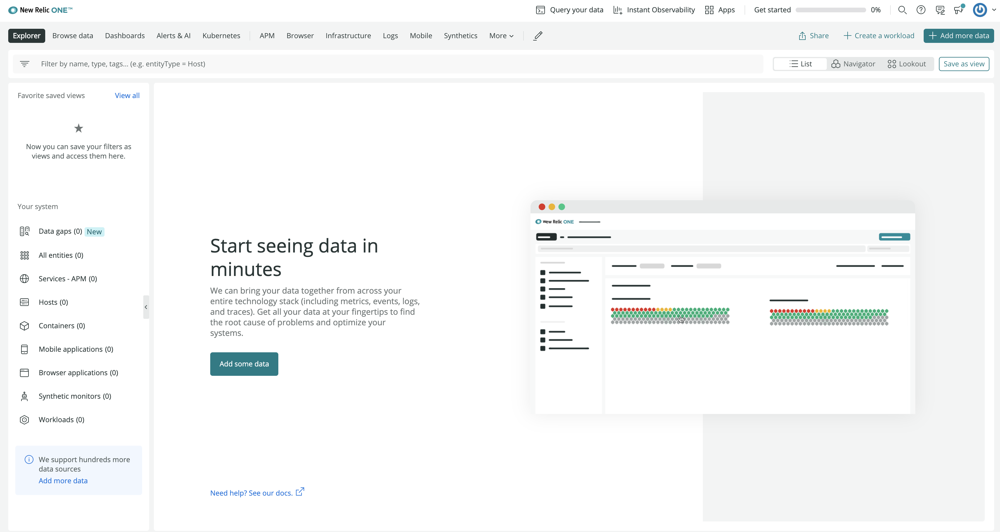
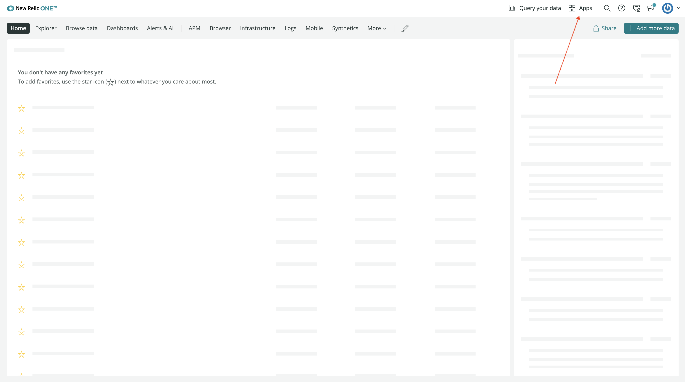
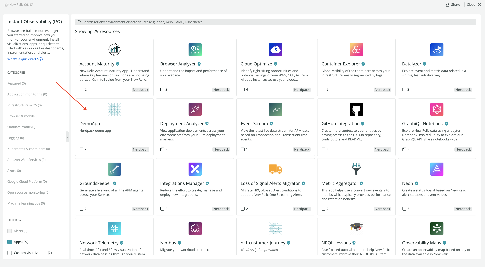
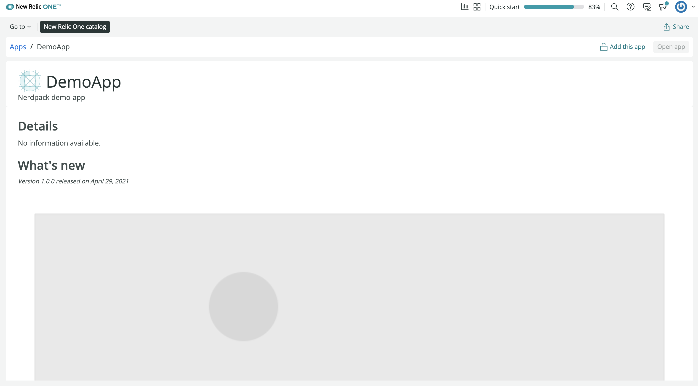
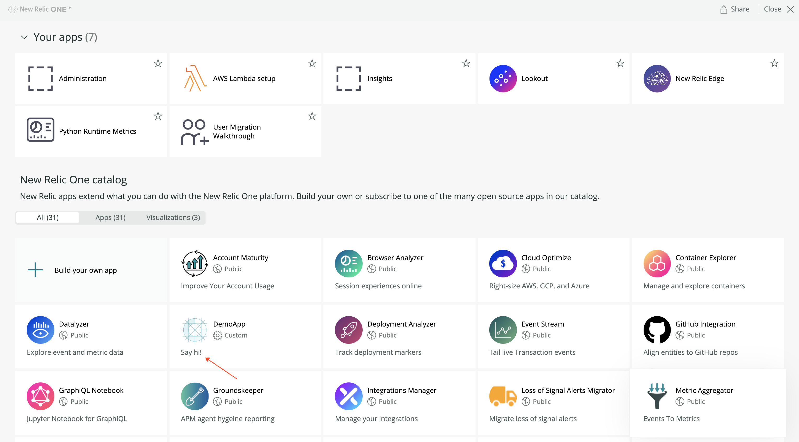
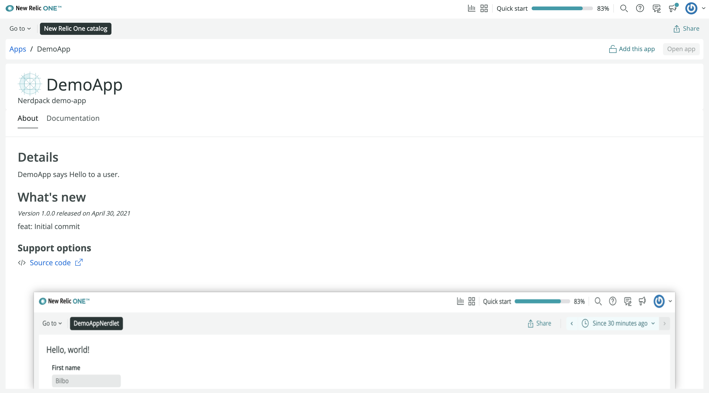
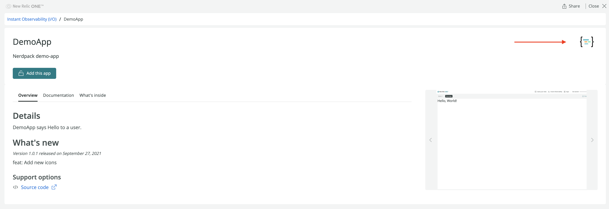
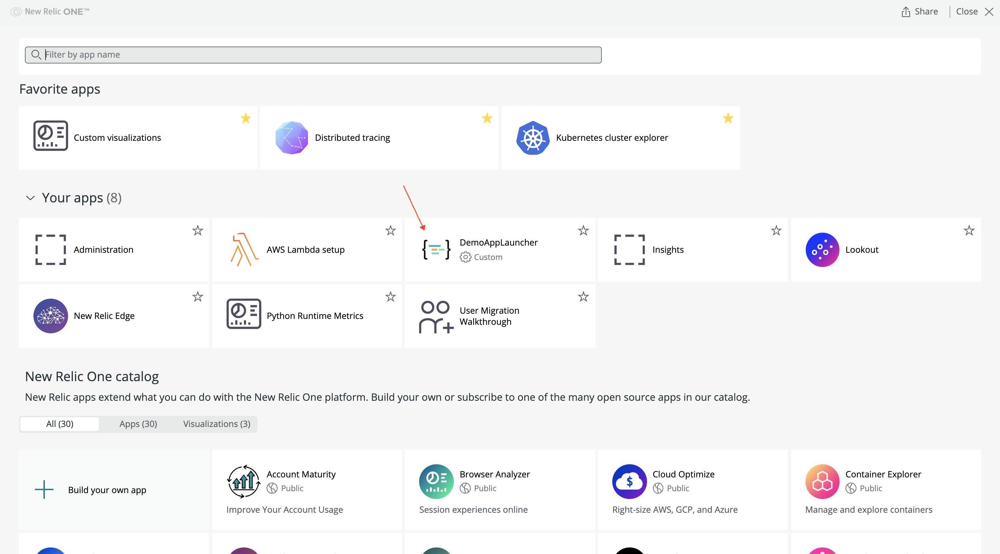

<Intro>

Add screenshots, descriptions, and other metadata to your Nerdpack, and upload it all to the New Relic One catalog.

</Intro>

## Update your CLI

Before you run any commands, ensure that you have the latest version of the CLI:

```sh
nr1 update
```

## Check your permissions

To publish your Nerdpack and update its catalog information, you need:

- Access to the account that published it
- The [necessary permissions for managing Nerdpacks](/build-apps/permission-manage-apps)

## Publish your Nerdpack

You need to [publish](/build-apps/publish-deploy/publish) Nerdpacks that you create before you can update their catalog information.

## Update your Nerdpack's catalog metadata

After you've published your Nerdpack to the New Relic One catalog, update the Nerdpack's metadata to let users know all about your Nerdlets or visualizations.

<Tutorial>

<Project>

```md fileName=catalog/documentation.md
```

```json fileName=catalog/config.json
{
  "tagline": "",
  "details": "",
  "repository": "",
  "whatsNew": "",
  "support": {
    "email": {
      "address": ""
    },
    "issues": {
      "url": ""
    },
    "community": {
      "url": ""
    }
  }
}
```

</Project>

<Steps>

<Step>

Go to [New Relic](https://one.newrelic.com):



</Step>

<Step>

Navigate to **Apps**:



</Step>

<Step>

Find your published Nerdpack under **New Relic One catalog**:



Notice that there is no information on the **Apps** or details page other than the Nerdpack's name and the brief description found in _nr1.json_:



There are no screenshots, icons, details, or what's new features. To add these, your Nerdpack needs a _catalog_ directory.

</Step>

<Step>

From the root of your Nerdpack, create _catalog_ directories to house your Nerdpack's screenshots and metadata:

```sh
nr1 create --type catalog
[output] {success}✔{normal}  created: launchers/launcher/catalog
[output] {success}✔{normal}  created: nerdlets/home/catalog
[output]
[output] {success}✔{normal}  catalog created successfully!
[output]    {purple}catalog{normal} is available at "./catalog"
```

Inside your root _catalog_ directory, you'll find specific files and directories for portraying information about your Nerdpack to your users:

```sh
ls catalog
[output] README.md         additionalInfo.md config.json       documentation.md  {blue}screenshots
```

| File                | Description                                                                                                                                                                                                                                                                                                                                                                                                                                                                                                                                                                                                                                                                                                                                                                                                                                                                                                                                                                                                                                                                                                                                                          |
| ------------------- | -------------------------------------------------------------------------------------------------------------------------------------------------------------------------------------------------------------------------------------------------------------------------------------------------------------------------------------------------------------------------------------------------------------------------------------------------------------------------------------------------------------------------------------------------------------------------------------------------------------------------------------------------------------------------------------------------------------------------------------------------------------------------------------------------------------------------------------------------------------------------------------------------------------------------------------------------------------------------------------------------------------------------------------------------------------------------------------------------------------------------------------------------------------------- |
| _README.md_         | A markdown file that instructs you how to use the information and metadata in _catalog_                                                                                                                                                                                                                                                                                                                                                                                                                                                                                                                                                                                                                                                                                                                                                                                                                                                                                                                                                                                                                                                                              |
| _config.json_       | A JSON file that contains the following fields:<br /><br /><ul><li>`tagline`: A brief headline for the application. This cannot exceed 30 characters.</li><li>`repository`: The URL for the Nerdpack's remote repository. This cannot exceed 1000 characters.</li><li>`details`: The purpose of the Nerdpack and how to use it. This cannot exceed 1000 characters. Use newlines for formatting, and don't include any markdown or HTML.</li><li>`support`: An object that contains:</li><ul><li>`issues`: A URL for the repository's issues list. For example, the **Issues** tab if using GitHub.</li><li>`email`: A valid email address for the team supporting the application</li><li>`community`: A URL for a support thread, forum, or website for troubleshooting and usage support</li></ul><li>`whatsNew`: A bulleted list of changes in the current release version. This cannot exceed 500 characters. Use newlines for formatting, and don't include markdown or HTML.</li></ul>Check out our [Pageview Map application's _config.json_](https://github.com/newrelic/nr1-pageview-map/blob/main/catalog/config.json) to see a real-life implementation. |
| _documentation.md_  | A markdown file that tells users how to use the Nerdpack's Nerdlets or visualizations. This shows in the detail view's **Documentation** tab.                                                                                                                                                                                                                                                                                                                                                                                                                                                                                                                                                                                                                                                                                                                                                                                                                                                                                                                                                                                                                        |
| _additionalInfo.md_ | An optional markdown file for any additional information about using your application                                                                                                                                                                                                                                                                                                                                                                                                                                                                                                                                                                                                                                                                                                                                                                                                                                                                                                                                                                                                                                                                                |
| _screenshots_       | A directory that contains screenshots of your Nerdlets or visualizations. This can contain no more than 6 images. All screenshots must meet the following criteria:<br /><br /><ul><li>3:2 aspect ratio</li><li>PNG format</li><li>landscape orientation</li><li>1600 to 2400 pixels wide</li></ul>                                                                                                                                                                                                                                                                                                                                                                                                                                                                                                                                                                                                                                                                                                                                                                                                                                                                  |

This command also generates a `catalog` directory for each launcher, nerdlet, and visualization in your Nerdpack. Inside you'll find a directory that allows you to add screenshots for each artifact.

```sh
ls launchers/launcher/catalog
[output] {blue}screenshots
[output]
ls nerdlets/home/catalog
[output] {blue}screenshots
```

</Step>

<Step>

Update your Nerdpack's _documentation.md_ file:

```md fileName=catalog/documentation.md
Enter your first and last name into the fields provided. When you're done, press **Submit** to see a personalized "Hello!" message.
```

</Step>

<Step>

Update your _config.json_ file:

```json fileName=catalog/config.json
{
  "tagline": "Say hi!",
  "details": "DemoApp says Hello to a user.",
  "repository": "https://github.com/newrelic/developer-website",
  "whatsNew": "feat: Initial commit"
}
```

</Step>

<Step>

Include screenshots in your root _screenshots_ directory or any Nerdpack item _screenshots_ directory.

</Step>

<Step>

Submit the information to the New Relic One catalog:

```sh
nr1 catalog:submit
[output] Uploading screenshots from demo-app...
[output]  {success}✔{normal}  Screenshots uploaded from: demo-app
[output] Uploading screenshots from demo-app/launchers/launcher...
[output]  {success}✔{normal}  Screenshots uploaded from: demo-app/launchers/launcher
[output] Uploading screenshots from demo-app/nerdlets/home...
[output]  {success}✔{normal}  Screenshots uploaded from: demo-app/nerdlets/home
[output]  {success}✔{normal}  Updated metadata for DemoApp 1.0.0
```

</Step>

<Step>

Go to the catalog to see your changes:



Click your Nerdpack to see the new details:



</Step>

</Steps>

## Update your Nerdpack's icons

Within a Nerdpack, you can set two types of icons:

- One for your entire Nerdpack, which represents your Nerdpack in the catalog
- One for each of your launchers, which represents your Nerdlets

Replace these icons and publish your Nerdpack to see the changes.

<Steps>

<Step>

Update the _icon.png_ in the root of your Nerdpack. This icon is used in the catalog and the Nerdpack's detail page.

</Step>

<Step>

If you're building a Nerdpack with one or more launchers, update the _icon.png_ in each of your launcher's subfolders.

</Step>

<Step>

Update your _package.json_ version:

```json fileName=package.json lineHighlight=4
{
  "private": true,
  "name": "demo-app",
  "version": "1.0.1",
  "scripts": {
    "start": "nr1 nerdpack:serve",
    "test": "exit 0"
  },
  "nr1": {
    "uuid": "f2dbc999-e9a3-49b9-933d-5a704c6750bd"
  },
  "dependencies": {
    "prop-types": "^15.6.2",
    "react": "^16.6.3",
    "react-dom": "^16.6.3"
  },
  "browserslist": ["last 2 versions", "not ie < 11", "not dead"]
}
```

This allows you to publish a new version of your Nerdpack.

</Step>

<Step>

[Publish](/build-apps/publish-deploy/publish) your Nerdpack:

```sh
nr1 nerdpack:publish
```

</Step>

<Step>

Update your `whatsNew` string in _catalog/config.json_:

```json fileName=catalog/config.json
{
  "tagline": "Say hi!",
  "details": "DemoApp says Hello to a user.",
  "repository": "https://github.com/newrelic/developer-website",
  "whatsNew": "feat: Add new icons"
}
```

This will tell users what you added in the latest version of your Nerdpack.

</Step>

<Step>

Submit this new metadata to the catalog:

```sh
nr1 catalog:submit
[output] Uploading screenshots from demo-app...
[output]  {success}✔{normal}  Screenshots uploaded from: demo-app
[output] Uploading screenshots from demo-app/launchers/launcher...
[output]  {success}✔{normal}  Screenshots uploaded from: demo-app/launchers/launcher
[output] Uploading screenshots from demo-app/nerdlets/home...
[output]  {success}✔{normal}  Screenshots uploaded from: demo-app/nerdlets/home
[output]  {success}✔{normal}  Updated metadata for DemoApp 1.0.1
```

</Step>

<Step>

Go to the catalog and [subscribe to your Nerdpack](/build-apps/publish-deploy/subscribe) to see your new icon:





</Step>

</Steps>

</Tutorial>

## Resolve issues with submitting catalog information

Sometimes, when you work with catalog metadata, you may run into issues. Consider some common solutions for resolving these issues.

### Publish your Nerdpack

Remember that you can only submit catalog metadata for Nerdpacks that have already been published. If you try to submit information for a Nerdpack that hasn't been published, the CLI will try to help:

```sh
nr1 catalog:submit
[output] Uploading screenshots...
[output]  {error}›{normal}   Error: {error}1 error while updating DemoApp 1.0.0
[output]  {error}›
[output]  {error}›   Invalid Version: Nerdpack version 1.0.0 not found. Have you run `nr1 nerdpack:publish` yet?
[output]  {error}›{normal}   Code: UNKNOWN
```

### Resize your images

Screenshots for the catalog must meet the criteria specified previously in this guide. If they don't, the CLI will try to help:

```sh
nr1 catalog:submit
[output] Uploading screenshots...
[output]  {error}›{normal}   Error: {error}2 errors while updating DemoApp 1.0.1
[output]  {error}›{normal}
[output]  {error}›{normal}   {blue}catalog/screenshots/screenshot.png
[output]  {error}›{normal}   {red}Invalid Screenshot: screenshot.png has a size ratio of 4:2. Update size ratio to 3:2.
[output]  {error}›{normal}
[output]  {error}›{normal}   {blue}catalog/screenshots/screenshot.png
[output]  {error}›{normal}   {red}Invalid Screenshot: screenshot.png has a width of 3054px. Update size to be between 1600px and 2400px.
[output]  {error}›{normal}   Code: UNKNOWN
```

### Check the length of your strings

Most of the content in _config.json_ has string-length requirements. Make sure you review those requirements and adhere to them when you update your _config.json_ file. Otherwise, you'll see errors when you try to submit your configuration to the catalog:

```sh
nr1 catalog:submit
[output] Uploading screenshots...
[output]  {success}✔{normal}  Screenshots uploaded
[output]  {error}›{normal}   Error: {error}2 errors while updating DemoApp 1.0.1
[output]  {error}›{normal}
[output]  {error}›{normal}   {blue}catalog/config.json
[output]  {error}›{normal}   {error}Invalid Metadata: `details` has a character length of 2204. Must be no longer than 1000 characters
[output]  {error}›{normal}
[output]  {error}›{normal}   {blue}catalog/config.json
[output]  {error}›{normal}   {error}Invalid Metadata: `tagline` has a character length of 266. Must be no longer than 30 characters
[output]  {error}›{normal}   Code: UNKNOWN
```
