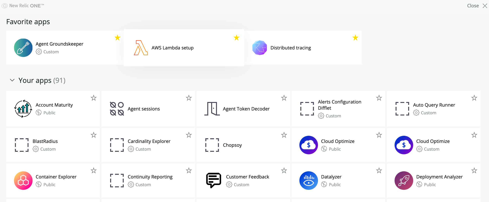

<Intro>

When you build a New Relic One app, chances are you'll want to share it with others in your organization. You might even want to share it broadly through our open source channel. But first, you probably want to try it out locally to make sure it's working properly.

</Intro>

From the New Relic One **Apps** page, you can review available apps and subscribe to the ones you want for accounts you manage. The **Your apps** section shows launchers for New Relic apps, as well as any third-party apps that you subscribe to. The New Relic One catalog provides apps that you haven't subscribed to, some developed by New Relic engineers to provide visualizations we think you'll want, like Cloud Optimizer, which analyzes your cloud environment, or PageView Map, which uses Browser events to chart performance across geographies. Your apps in the catalog are created by third-party contributors and are submitted via [opensource.newrelic.com](https://opensource.newrelic.com). All are intended to help you visualize the data you need, the way you want it.