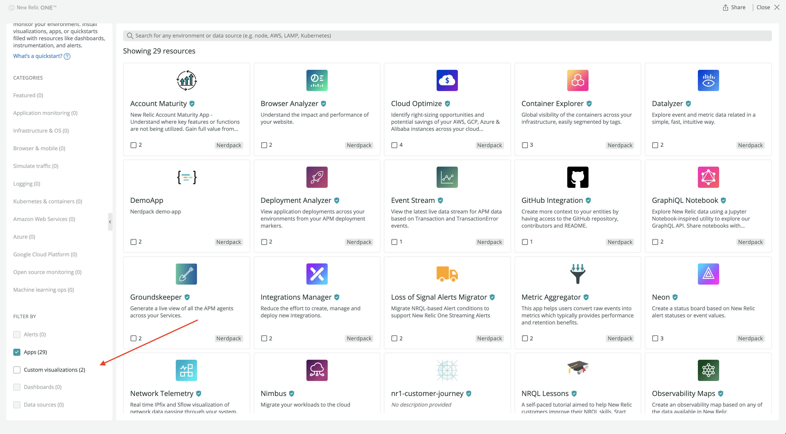
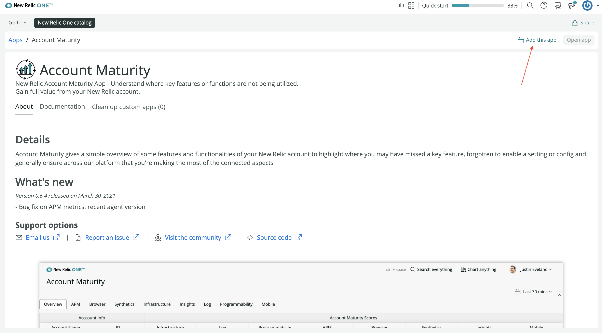
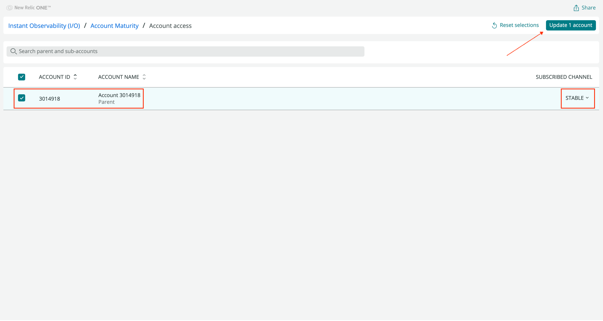
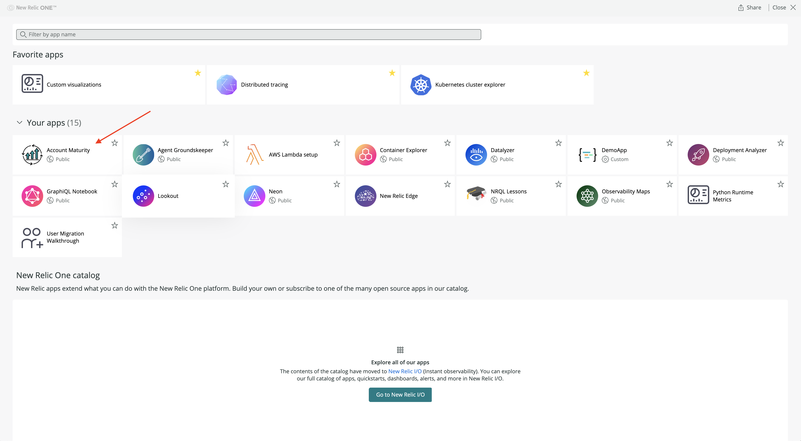
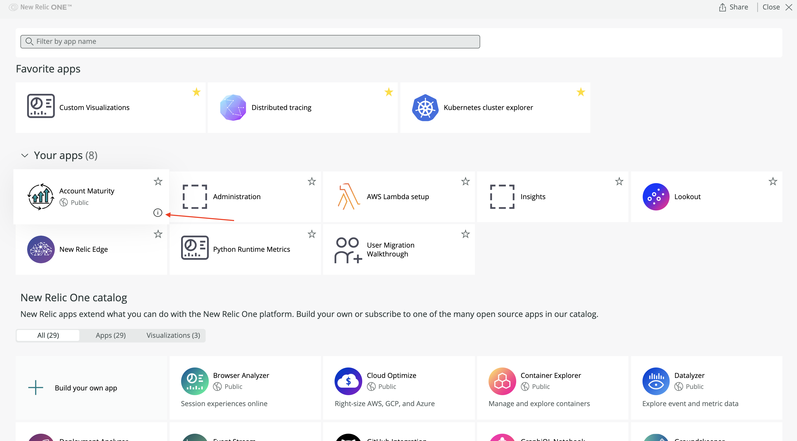
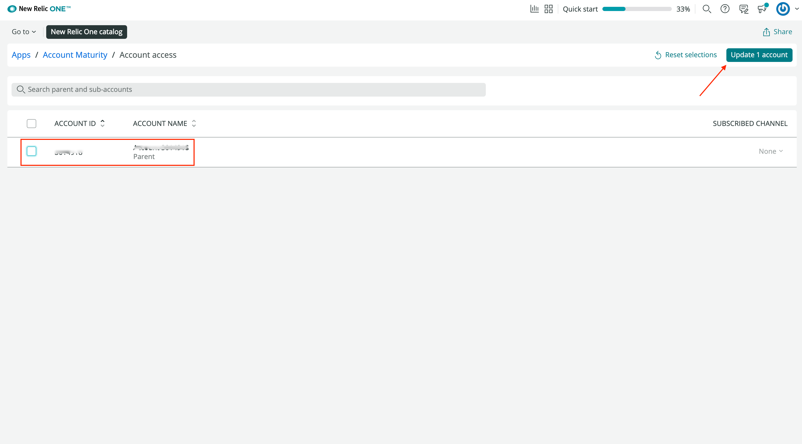
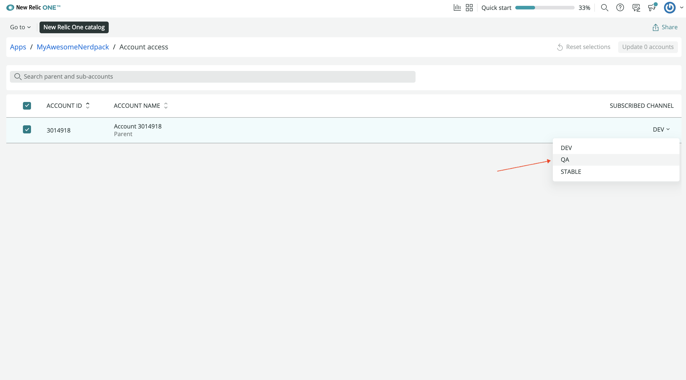

<Intro>

Subscribe to a Nerdpack to use it in the New Relic platform. Unsubscribe from Nerdpacks you no longer use.

</Intro>

## Update your CLI

Before you run any commands, ensure that you have the latest version of the CLI:

```sh
nr1 update
```

## Check your permissions

To subscribe to a Nerdpack, you need:

- Access to the account that published it
- The [necessary permissions for managing Nerdpacks](/build-apps/permission-manage-apps)

## Publish your Nerdpack

You need to publish Nerdpacks that you create before you can subscribe to them:

1. [Publish your Nerdpack](/build-apps/publish-deploy/publish)
2. [Tag your Nerdpack](/build-apps/publish-deploy/tag) if it's published and doesn't yet have a tag

## Subscribe to a Nerdpack

Subscribe to a published Nerdpack, with either the web UI or the `nr1` CLI, to use it in your account. Subscribing allows you to select the tagged version you want to use as well as the account you want to subscribe with. This lets you control what Nerdpacks you use in your account.

<Callout variant="tip">

When the tag you've subscribed to gets an update, New Relic updates your Nerdpack automatically.

</Callout>

<Steps>

<Step>

Go to [New Relic](https://one.newrelic.com):


</Step>

<Step>

Navigate to **Instant Observability**:


</Step>

<Step>

Find your published Nerdpack using the Apps filter or search bar:


All published Nerdpacks are shown in the New Relic One catalog. However, the one you're looking for maybe filtered out. Adjust the filter to find the Nerdpack you're looking for:



</Step>

<Step>

Select the Nerdpack you want to add to your New Relic account:


</Step>

<Step>

Click **Add this app**:



This button says **Manage access** if you're already subscribed to the Nerdpack.

</Step>

<Step>

Select the account to subscribe with and the tagged version to subscribe to. Then, update your account(s):



<Callout variant="tip">

In the web UI, and some places in the CLI, we refer to **tags** as **channels**. This is a relic of a past implementation of Nerdpack versioning. Ignoring historical and implementation details, consider them to be synonyms.

</Callout>

Now you, and members of the accounts you've subscribed with, can launch the Nerdpack from New Relic.

</Step>

<Step>

If you subscribed to an app, find it under **Your apps**:



If you subscribed to a visualization, find it under **Custom visualizations**:


</Step>

</Steps>

## Subscribe from the command line

If you've published your own Nerdpack, it may be quicker to subscribe to your Nerdpack with the `nr1` CLI.

<Steps>

<Step>

Navigate to your Nerdpack's root directory:

```sh
cd my-awesome-nerdpack
```

For simplicity, this guide refers to your Nerdpack as `my-awesome-nerdpack`.

</Step>

<Step>

Ensure that your Nerdpack was published and tagged:

```sh
nr1 nerdpack:info
[output] Id: {purple}ab123c45-678d-9012-efg3-45hi6jkl7890
[output] Region: {muted}us
[output] Account ID: 1234567
[output] Local version: 1.0.0
[output] Subscription Model: OWNER_AND_ALLOWED
[output] Version Count: 1
[output]
[output] Version  Date               Tags
[output] -------  -----------------  ------
[output] 1.0.0    {muted}a few seconds ago  {green}STABLE
```

You should see at least one [published](/build-apps/publish-deploy/publish) version with a [tag](/build-apps/publish-deploy/tag). It doesn't have to be `STABLE`. You can subscribe to any tagged version.

</Step>

<Step>

Subscribe to your Nerdpack:

```sh
nr1 nerdpack:subscribe --channel=STABLE
[output] Subscribed account {green}1234567{normal} to the nerdpack {purple}ab123c45-678d-9012-efg3-45hi6jkl7890{normal} on the {green}STABLE{normal} channel
```

Here, you've subscribed to the `STABLE` tag. You can also subscribe to `DEV` and `BETA` tags from the CLI, but the subscription command doesn't allow for arbitrary tags. To subscribe to any other tagged version, you need to use the web UI.

Similar to the web UI, the term **channel** `nr1 nerdpack:subscribe` is a reference to an older implementation of Nerdpack versions.

<Callout variant="tip" title="Technical detail">

`nr1 nerdpack:subscribe` is an alias for `nr1 subscription:set`.

Read the [`nr1 subscription:set`](/explore-docs/nr1-subscription#nr1-subscriptionset) documentation to learn more. Or, view the `nr1` help page:

```sh
nr1 subscription:set --help
```

</Callout>

</Step>

</Steps>

## Unsubscribe from a Nerdpack

Unsubscribe from a Nerdpack to remove it from your account.

<Steps>

<Step>

Go to [New Relic](https://one.newrelic.com):


</Step>

<Step>

Navigate to **Apps**:


</Step>

<Step>

Click the "i" icon next to the Nerdpack you're subscribed to:



This opens the detail page.

</Step>

<Step>

Click **Manage access**:


</Step>

<Step>

Deselect the accounts you want to unsubscribe with. Then, update those accounts:



</Step>

</Steps>

## Unsubscribe using the command line

Quickly unsubscribe your CLI profile from Nerdpacks.

<Steps>

<Step>

Navigate to your Nerdpack's root directory:

```sh
cd my-awesome-nerdpack
```

</Step>

<Step>

View your profile's subscriptions:

```sh
nr1 subscription:list
[output] {muted}Listing subscribed deployed nerdpacks on your account:
[output] Version  UUID                                  Name              Date         User
[output] -------  ------------------------------------  ----------------  -----------  -------
[output] 0.6.4    {purple}384de6e5-8e57-4d56-9d13-299ee7ae8641{normal}  Account Maturity  {muted}a month ago{normal}  2774472
```

</Step>

<Step>

Unsubscribe from the Nerdpack with the UUID:

```sh
nr1 nerdpack:unsubscribe --nerdpack-id=384de6e5-8e57-4d56-9d13-299ee7ae8641
[output] Unsubscribed account {green}1234567{normal} from the nerdpack {purple}384de6e5-8e57-4d56-9d13-299ee7ae8641{normal} on the {green}STABLE{normal} channel.
```

<Callout variant="tip">

`nr1 nerdpack:unsubscribe` is an alias for `nr1 subscription:unset`.

Read the [`nr1 subscription:unset`](/explore-docs/nr1-subscription#nr1-subscriptionunset) documentation to learn more. Or, view the `nr1` help page:

```sh
nr1 subscription:unset --help
```

</Callout>

</Step>

</Steps>

## Resolve issues with accessing your published Nerdpack

Sometimes, when you subscribe to a Nerdpack, you may run into issues. Whether you can't subscribe or see duplicate subscriptions in your account, consider some common solutions for resolving these issues.

### Tag your Nerdpack version

When you subscribe to an Nerdpack, you choose a specific tag. So, if the Nerdpack you're trying to subscribe to isn't tagged, or doesn't have the tag you're targeting, [tag](/build-apps/publish-deploy/tag) your release version:

```sh
nr1 nerdpack:subscribe --channel=DEV
[output] {error}›{normal}   Error: Nerdpack {purple}ab123c45-678d-9012-efg3-45hi6jkl7890{normal} is not deployed to channel {green}DEV{normal}. You have to deploy it first
[output] {error}›{normal}   Code: PACKAGE_NOT_DEPLOYED
[output]
nr1 nerdpack:tag --tag=DEV
[output] {success}✔  Tagged {purple}ab123c45-678d-9012-efg3-45hi6jkl7890{normal} version {green}1.0.0{normal} as {green}DEV{normal}.
[output]
nr1 nerdpack:subscribe --channel=DEV
[output] Subscribed account {green}1234567{normal} to the nerdpack {purple}ab123c45-678d-9012-efg3-45hi6jkl7890{normal} on the {green}DEV{normal} channel.
```

If you subscribe without a `--channel` argument, the default channel is `STABLE`, so make sure you have a `STABLE` version in this case:

```sh
nr1 nerdpack:subscribe
[output] {error}›{normal}   Error: Nerdpack {purple}ab123c45-678d-9012-efg3-45hi6jkl7890{normal} is not deployed to channel {green}STABLE{normal}. You have to deploy it first
[output] {error}›{normal}   Code: PACKAGE_NOT_DEPLOYED
```

### Subscribe with the web UI

When you subscribe with the CLI, you pass a `--channel` argument to select a tag. A **channel** is, for all intents and purposes, a **tag**. This term is a relic of a past implementation of Nerdpack versioning.

However, while the terms are synonymous, using `--channel` is limited in the CLI. When you subscribe with a `--channel`, you can only choose between `DEV`, `BETA`, and `STABLE`. So, to subscribe to a different tag, use the web UI:

```sh
nr1 nerdpack:subscribe --channel=QA
[output] {error}›{normal}   Error: Expected --channel=QA to be one of: {green}DEV{normal}, {green}BETA{normal}, {green}STABLE
[output] {error}›{normal}   See more help with --help
[output] {error}›{normal}   Code: UNKNOWN
```


