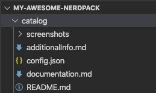

<Intro>

Here's how you can quickly build a "Hello, World!" app and publish it to your local New Relic One Catalog.

In these steps, we'll show you how to create a local version of the New Relic One site where you can prototype your ideas. Then, when you are ready, you can publish your code to New Relic One.

<Video id="ZagZfNQYJEU" type="youtube"/>


</Intro>

## Before you begin

To get started, complete a few easy steps in our installation wizard at [Build New Relic One applications](https://one.newrelic.com/launcher/developer-center.launcher?pane=eyJuZXJkbGV0SWQiOiJkZXZlbG9wZXItY2VudGVyLmRldmVsb3Blci1jZW50ZXIifQ==). The wizard helps you get a personal API key, download the New Relic CLI (command line interface), and configure your environment.

After you complete the wizard, continue with the steps below.


## Create a local verion of the "Hello, World!" application

The command line inteface allows you to run a local version of New Relic One. You can develop your application locally before you publish it in New Relic.

Here's how to create a local verson of "Hello, World!":

<Steps>

  <Step>

  If you haven't already done so in your terminal, change to the new directory named after your nerdpack project. For example, it might look like this:

  ```
  $ cd /my-awesome-nerdpack
  ```
  </Step>

  <Step>

  Open a code editor.

  <Important>Your code editor displays two artifacts: `launchers` (containing the homepage tile) and `nerdlets` (containing your application code).</Important>

  </Step>

  <Step>

  Expand `nerdlets` in your code editor, and open `index.js`.

  </Step>

  <Step>

  Change the default `return` message to `Hello World!` (or anything else):

  ```js
  import React from 'react';
  
  // https://docs.newrelic.com/docs/new-relic-programmable-platform-introduction

  export default class MyAwesomeNerdpackNerdletNerdlet extends React.Component {
      render() {
          return <h1>Hello, World!</h1>;
      }
  }
  ```

  </Step>

  <Step>

  As an optional step, you can add a custom tile icon using any image file named `icon.png`. Replace the default `icon.png` file under `launcher` by dragging in your new image file.

  

  </Step>

  <Step>
  
  To change the name of the launcher to something meaningful, in your code editor under `launchers`, open `nr1.json`.
    
  </Step>  
    
  <Step>

  Change the value for `displayName` to anything you want, and save the file:  

  ```json
  {
    "schemaType": "LAUNCHER",
    "id": "my-awesome-nerdpack-launcher",
    "description": "Describe me",
    "displayName": "INSERT_YOUR_TILE_LABEL_HERE",
    "rootNerdletId": "my-awesome-nerdpack-nerdlet"
}
```

  </Step>

  <Step>

  To see your new changes locally, start the node server with this command in your terminal:

  ```
  npm start
  ```
  </Step>

  <Step>

  Open a browser and go to `https://one.newrelic.com/?nerdpacks='local' (this url is also shown in the terminal).

  </Step>

  <Step>

  When the browser opens, click the new launcher for your application. Here's our example where we inserted a leaf icon:

  

  </Step>

  </Steps>

  After you click the new launcher, your "Hello, World!" appears:

  

## Publish you application to New Relic

Your colleagues can't see your local application, so when you want to share it, publish it to the New Relic One catalog. 

<Steps>

  <Step>

  Execute the following in your terminal:

  ```
  nr1 nerdpack:publish
  ```
  </Step>

  <Step>
  
  Close the development tab for your local New Relic One, and open [New Relic One](https://one.newrelic.com).
  
  </Step>

  <Step>

  Click ***New Relic One Catalog***.

  </Step>

  <Step>

  Under ***Your company applications*** click on your new application.

  </Step>

</Steps>

  When your new application opens, you see that it doesn't have any details. The next section shows you how to add those.

## Add details to describe your project

Now that your new application is in the New Relic One catalog, you can add details that help users understand what your application does and how to use it.

<Steps>

  <Step>

  Go to your project in the terminal and execute the following:  

  

  ```
  nr1 create
  ```

  </Step>

  <Step>

  Select ***catalog***, which creates a stub in your project under the `catalog` directory.

  </Step>

  <Step>

  In the `catalog` directory of your project, add screenshots or various types of metadata to describe your project. For details about what you can add, see [Add catalog metadata and screenshots](https://docs.newrelic.com/docs/new-relic-one/use-new-relic-one/build-new-relic-one/discover-manage-applications-new-relic-one-catalog#clamshell-2).

  </Step>

  <Step>

  After you add the screenshots and descriptions you want, execute the following to save your metadata to the catalog:

  ```
  nr1 catalog:submit
  ```

  </Step>

  <Step>

  Return to the catalog and refresh the page to see your new screenshots and metadata describing your project.

  </Step>

</Steps>


## Subscribe accounts to your application

To make sure other users see your application, you need to subscribe an account to the application. Any user with the NerdPack Manager role can subscribe an account to an application.

<Steps>
  
  <Step>

  If you're not already displaying the description page for your application, click the launcher for the application in the catalog.

  </Step>

  <Step>

  Select ***Add this app***.

  </Step>

  <Step>

  Select the accounts you want to subscribe to the application, and then select ***Update access*** to save your selections.

  </Step>

</Steps>

Return to the New Relic One homepage and see the launcher for your new application.

## Summary

After you completed the steps in this example, you successfully created your first "Hello, World!" application in New Relic One.

## Related information

- [New Relic documentation](https://docs.newrelic.com/docs/new-relic-one/use-new-relic-one/build-new-relic-one/new-relic-one-build-your-own-custom-new-relic-one-application)
