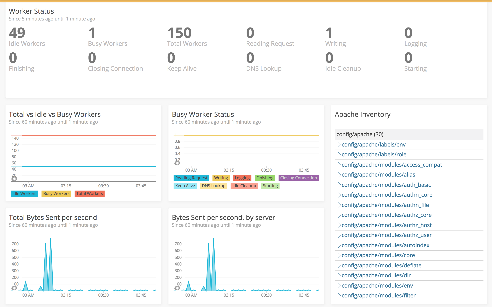

<Intro>

New Relic products report a lot of data “out of the box.” When you use New Relic products like [APM](https://docs.newrelic.com/docs/apm), [Browser](https://docs.newrelic.com/docs/browser), [Mobile](https://docs.newrelic.com/docs/mobile-monitoring), [Infrastructure](https://docs.newrelic.com/docs/infrastructure), or an [integration](https://docs.newrelic.com/docs/integrations), by default you receive performance data.

But you may want to bring data into New Relic that isn't collected by default. Maybe you want an API-based solution that doesn't require install of an agent. Maybe you want to bring telemetry data from another analysis service into New Relic. This page describes several ways to get data into New Relic.

</Intro>

<Steps>

<Step>

## Agent APIs

If you use our APM, Browser, or Mobile agents to report data, you can use their associated APIs to report custom data. For example, if you monitor your application with the New Relic APM Python agent, you can use the [Python agent API](https://docs.newrelic.com/docs/agents/python-agent/api-guides/guide-using-python-agent-api) to set up custom instrumentation.

See the [agent APIs](https://developer.newrelic.com/technology/rest-apis).
</Step>

<Step>

## Telemetry SDK

Our Telemetry SDKs are language wrappers for our [Trace API](https://docs.newrelic.com/docs/apm/distributed-tracing/trace-api/introduction-new-relic-trace-api) and [Metric API](https://docs.newrelic.com/docs/introduction-new-relic-metric-api) (and eventually our Log API and Event API). These SDKs let you easily send metrics and trace data to New Relic without needing to install an agent. For New Relic customers, we offer open-source exporters and integrations that use the Telemetry SDKs to send metrics and trace data: 

- [Istio adaptor](https://github.com/newrelic/newrelic-istio-adapter)
- Prometheus OpenMetrics ([for Docker](https://docs.newrelic.com/docs/new-relic-prometheus-openmetrics-integration-docker) | [for Kubernetes](https://docs.newrelic.com/docs/new-relic-prometheus-openmetrics-integration-kubernetes)) 
- OpenCensus exporter ([for Go](https://github.com/newrelic/newrelic-opencensus-exporter-go) | [for Python](http://github.com/newrelic/newrelic-opencensus-exporter-python)) 
- [DropWizard exporter](https://github.com/newrelic/dropwizard-metrics-newrelic)
- [Micrometer exporter](https://github.com/newrelic/micrometer-registry-newrelic)

Want to build your own solution? [See our Telemetry SDK docs.](https://docs.newrelic.com/docs/telemetry-sdk-send-custom-telemetry-data-new-relic)

</Step>

<Step>

## Trace API

New Relic's [Trace API](https://docs.newrelic.com/docs/apm/distributed-tracing/trace-api/introduction-new-relic-trace-api) lets you send distributed tracing data to New Relic and consolidate tracing data from multiple sources in one place. We accept trace data in two formats: 

- Zipkin format
- New Relic format (if you don’t have Zipkin-format data, you’d use this)

```shell lineNumbers=true
    curl -i -H "Content-Type: application/json" \
     -H "Api-Key: [API KEY HERE]" \
     -H 'Data-Format: newrelic' \
     -H 'Data-Format-Version: 1' \
     -X POST \
     -d '[
           {
             "common": {
               "attributes": {
                 "service.name": "Test Service A",
                 "host": "host123.test.com"
               }
             },
             "spans": [
               {
                 "trace.id": "123456",
                 "id": "ABC",
                 "attributes": {
                   "duration.ms": 12.53,
                   "name": "/home"
                 }
               },
               {
                 "trace.id": "123456",
                 "id": "DEF",
                 "attributes": {
                   "service.name": "Test Service A",
                   "host": "host456.test.com",
                   "duration.ms": 2.97,
                   "name": "/auth",
                   "parent.id": "ABC"
                 }
               }
             ]
           }
         ]' 'https://trace-api.newrelic.com/trace/v1'
```

</Step>

<Step>

## Metric API

You can use our [Metric API](https://docs.newrelic.com/docs/introduction-new-relic-metric-api) to send metric data to New Relic from any source. 

```shell lineNumbers=true
curl -vvv -k -H "Content-Type: application/json" -H "Api-Key: ADD_KEY_HERE" -X POST https://metric-api.newrelic.com/metric/v1 --data ‘[{ "metrics":[{
         	"name":"memory.heap",
             "type":"gauge",
             "value":2.3,
             "timestamp":1531414060739,
             "attributes":{"host.name":"dev.server.com"}
           }]
   	}]’
```

</Step>

<Step>

## Event API

For sending arbitrary events to New Relic, you can use our Event API. We save these events as a new [event type](https://docs.newrelic.com/docs/using-new-relic/welcome-new-relic/get-started/glossary#event), which can then be queried in New Relic via NRQL. (Eventually, the Telemetry SDKs will support the Event API.)

```shell lineNumbers=true
# Hook into the runtime 'at_exit' event
at_exit do
  # Name the custom event
  payload = { 'eventType' => 'CLIRun' }

  # Check to see if the process is exiting due to an error
  if $!.nil? || $!.is_a?(SystemExit) && $!.success?
    payload[:status] = 0
  else
    # Gather any known errors
    errors = ""
    (Thread.current[:errors] ||= []).each do |err|
      errors += "#{err}\n"
    end
    payload[:errors] = errors
  end

  # Send the errors to New Relic as a custom event
  insights_url = URI.parse("https://insights-collector.newrelic.com/v1/accounts/YOUR_ACCOUNT_ID/events")
  headers = { "x-insert-key" => "YOUR_API_KEY", "content-type" => "application/json" }

  http = Net::HTTP.new(insights_url.host, insights_url.port)
  http.use_ssl = true
  request = Net::HTTP::Post.new(insights_url.request_uri, headers)
  request.body = payload.to_json

  puts "Sending run summary to Insights: #{payload.to_json}"
  begin
    response = http.request(request)
    puts "Response from Insights: #{response.body}"
  rescue Exception => e
    puts "There was an error posting to Insights. Error: #{e.inspect}"
  end
end
```

</Step>

<Step>

## Integrations SDK

Build out your own agent to get deep visibility into highly customized, unique, or legacy systems.

Using the [Infrastructure Integrations SDK](https://developer.newrelic.com/technology/infrastructure-sdk), you can get data from specific entities into New Relic without having to worry about timings of harvest cycles. The following example shows a custom Apache Integration built atop the Infrastructure Integrations SDK.



```shell lineNumbers=true
# Code snippet from the Apache integration's main method in Go.
func main() {
  log.Debug("Starting Apache integration")
  defer log.Debug("Apache integration exited")

  integration, err := sdk.NewIntegration(integrationName, integrationVersion, &args)
  fatalIfErr(err)

  if args.All || args.Inventory {
    log.Debug("Fetching data for '%s' integration", integrationName+"-inventory")
    fatalIfErr(setInventory(integration.Inventory))
  }

  if args.All || args.Metrics {
    log.Debug("Fetching data for '%s' integration", integrationName+"-metrics")
    ms := integration.NewMetricSet("ApacheSample")
    provider := &Status{
      CABundleDir:  args.CABundleDir,
      CABundleFile: args.CABundleFile,
      HTTPTimeout:  defaultHTTPTimeout,
    }
    fatalIfErr(getMetricsData(provider, ms))
  }

  fatalIfErr(integration.Publish())
}
```

</Step>

<Step>

## Log API

If our existing [logging integrations](https://docs.newrelic.com/docs/new-relic-logs-documentation) don’t meet your needs, you can use our Log API to send any arbitrary log data to New Relic. (Eventually, the Telemetry SDKs will support the Log API.)

```shell lineNumbers=true
# Example of a JSON POST request.
   POST /log/v1 HTTP/1.1
   Host: log-api.newrelic.com
   Content-Type: application/json
   X-Insert-Key: <YOUR_INSIGHTS_INSERT_KEY>
   Accept: */*
   Content-Length: 133
   {
     "timestamp": 1550086450124,
     "message": "User 'xyz' logged in",
     "service": "login-service",
     "hostname": "login.example.com"
   }
```

</Step>

</Steps>
