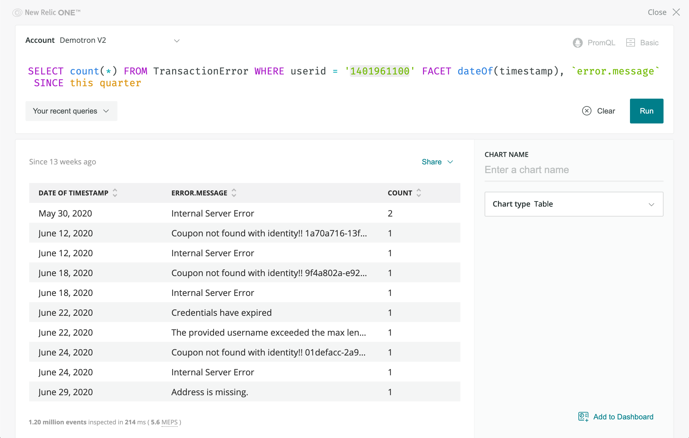

<Intro>

There are countless filters and pivots you might want to apply to your data. By adding custom attributes to your data, you can see beyond your code and analyze your business in-depth.

</Intro>

A common pattern when using custom attributes is to capture user information, such as name, ID, email, and more. This allows you to 'link' your operational data with your business data. For example, if you have the user information, you tie together your service desk and CRM data with the operational data in New Relic.

<Steps>

<Step>

You can add a `userid` custom attribute to your APM-reported data (`Transaction` and `TransactionError events`) with the opensource Java APM agent's API.

```
NewRelic.addCustomParameter("userid", userId);
```

</Step>

<Step>

Once added, you can run a NRQL query that uses the 'userid' custom attribute.

Once you have added a custom attribute like 'userid', you can use it to filter and facet your NRQL queries.



```
-- Get a count of errors experienced by a single filtered userid faceted by date and error message
SELECT count(*) FROM TransactionError WHERE userid = '1401961100' FACET dateOf(timestamp), `error.message` SINCE 1 week ago
```

</Step>

</Steps>
