<Callout variant="course" title="lab">

This procedure is part of a lab that teaches you how to troubleshoot your web app with New Relic browser.

Each procedure in the lab builds upon the last, so make sure you've completed the last procedure, [_Instrument your application with our browser agent_](/collect-data/browser/install-browser-agent), before starting this one.

</Callout>

Until now, your application was working without any errors. Users were able to place their orders and were satisfied with your service. But it's time to deploy some new code to your app.

Change to the `scenario-1` branch.

<>

```bash
git switch scenario-1
[output] Switched to branch 'scenario-1'
[output] Your branch is up to date with 'origin/scenario-1'.
```

</>

Navigate to the root directory of your application, install dependencies, and build your application.

<>

```bash
cd foodme-sample-app
npm install
npm run build
```

</>

Uh oh! You look on social media and see some confused customers:

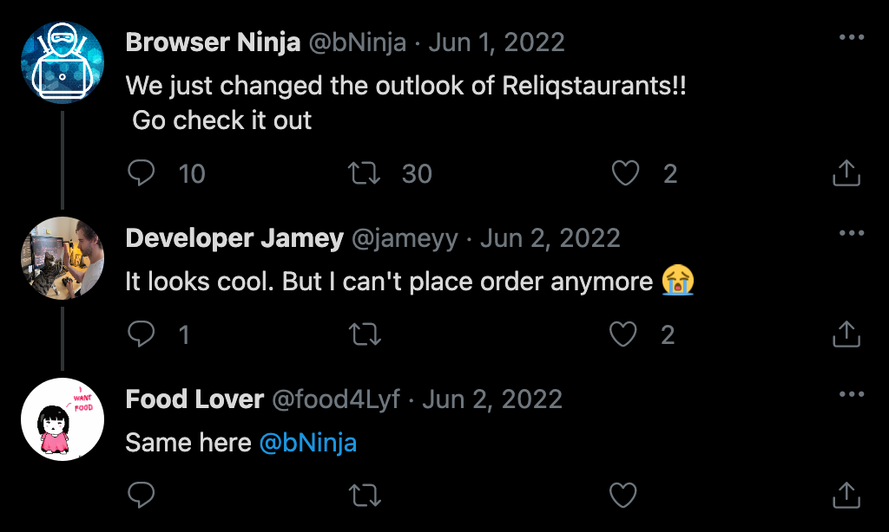

What's wrong with your application? Use New Relic browser to find out.

## Reproduce the issue

You've been notified by your users that they can't place an order on your site. Before you start debugging your code, reproduce the issue for yourself.

<Steps>

<Step>

From the root directory of the project, build and run your application.

<>

```bash
npm run build
npm run newstart
```

</>

This opens your Reliqstaurants application in your browser.


The new outlook of Reliqstaurants looks cool. 

</Step>

<Step>

Enter your delivery address, and search for restaurants.


</Step>

<Step>

Choose a restaurant.


</Step>

<Step>

Select an item or two and click on cart.


</Step>

<Step>

Click **PAY**.


Oops! your payment page is completely blank. No wonder your users haven't been able to place orders. 

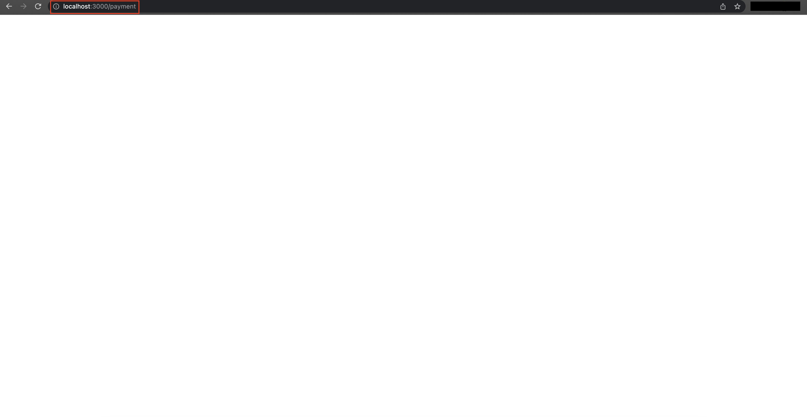

</Step>

<Step>

Observe the console in your browser's developer tools.

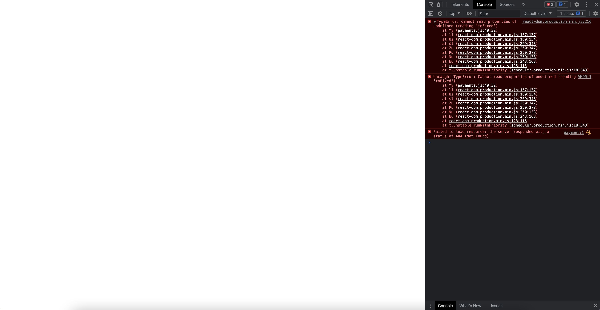

The console shows a bunch of errors indicating that something is wrong with your application.

</Step>

</Steps>

## Debug frontend errors

The bad news is that you've confirmed there's an error in your application. The good news is that you recently instrumented your application with our browser agent! Go to New Relic and sign into your account, if you haven't already.

<Steps>

<Step>

From the New Relic homepage, go to **Browser**.


</Step>

<Step>

Choose your **Reliqstaurants** application.


</Step>

<Step>

Here, you see all the data related to your browser application including **Core web vitals**, **Initial page load and route change**, **User-centric page load times** and others.


</Step>

<Step>

Scroll down to **Page views with javascript errors**.

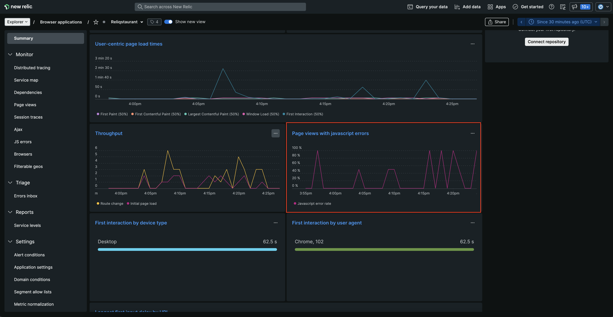

Here, you see that Javascript error rate is going as high as 100%. 

</Step>

<Step>

Navigate to **JS errors** in left navigation bar.

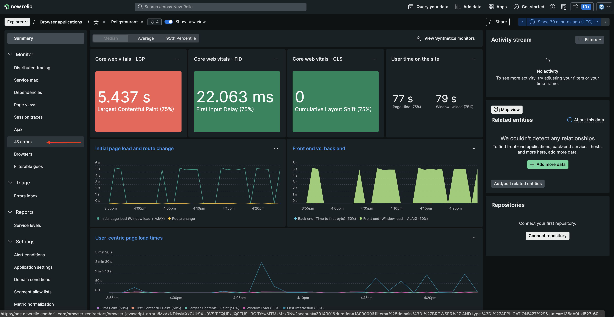

Here, you see all the JS errors along with Total error instances. 

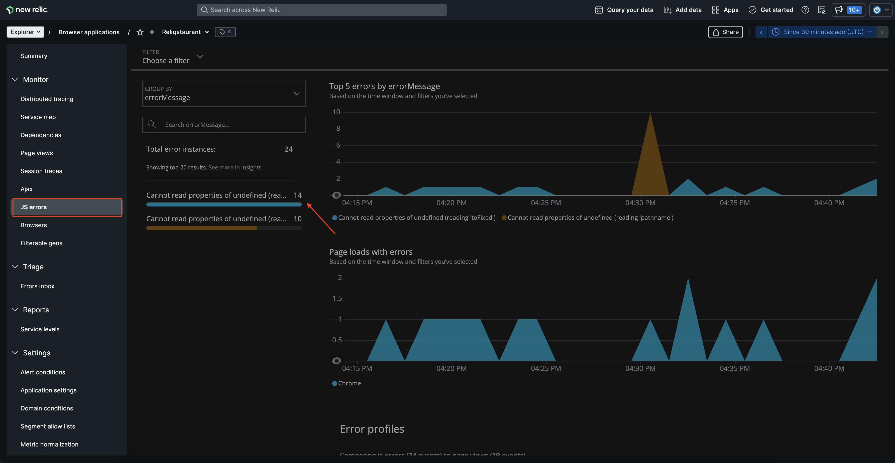

</Step>

<Step>

Click on the top most error for details.

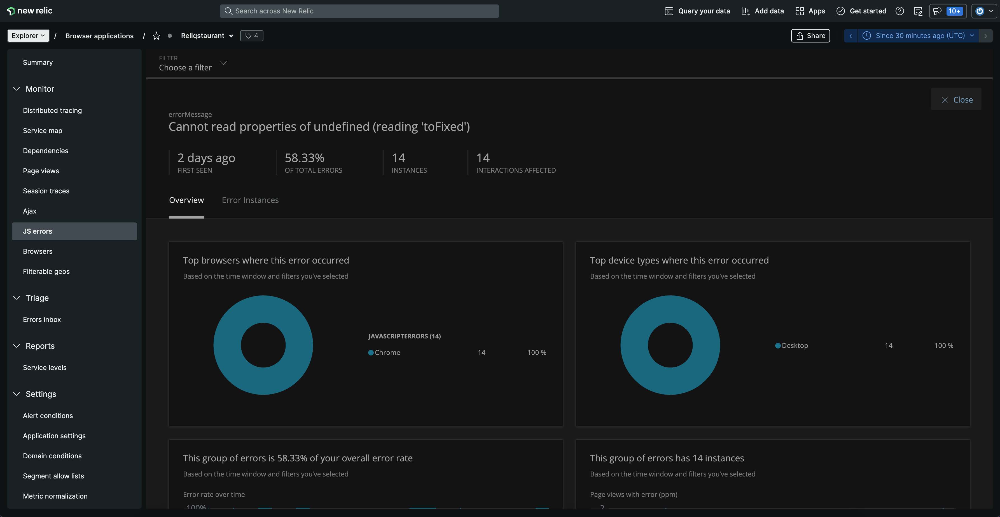

Here, you see **errorMessage**, **INSTANCES**, **INTERACTIONS AFFECTED** and other details related to your error.

Scroll down the page to see where this error is occuring.

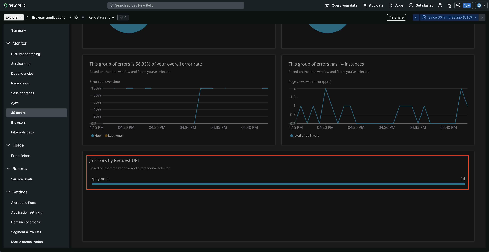

You now know that this error is occuring on **/payment** URI and indeed is the one affecting your service.

</Step>

<Step>

Scroll up and navigate to **Error Instances** tab and expand **Event Log**. 

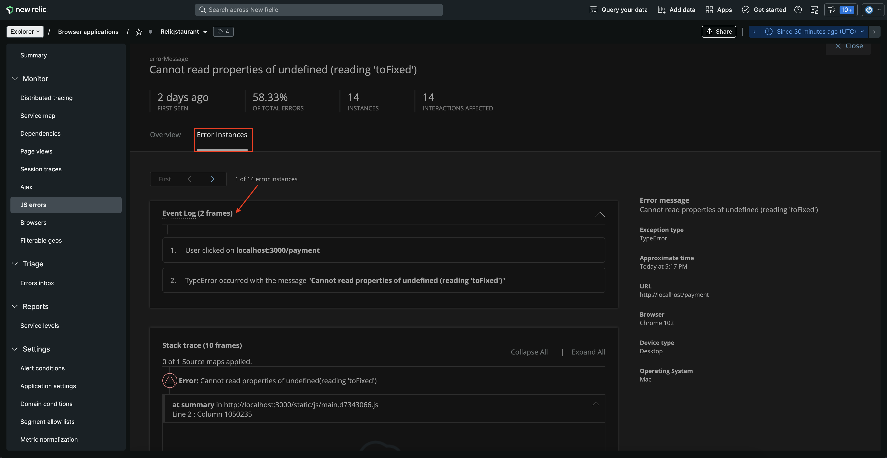

The **Event Log** shows that the error **Cannot read properties of undefined (reading 'toFixed')** is occuring when user visits the payment page. 

</Step>

<Step>

Scroll down on the **Error Instances** page to view the **Stack trace**.

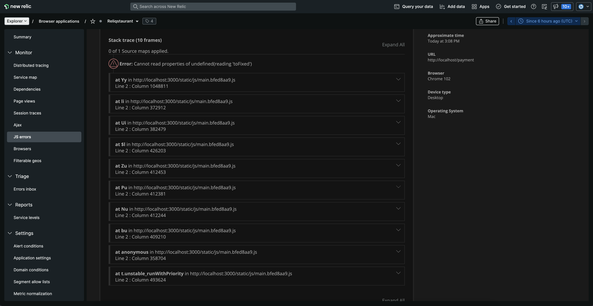

Here, you see the stack trace of your error.

</Step>

</Steps>

Looking at the error details above, you now know the error affecting your services. However, the stack trace shown here is minified and it's hard to understand what's causing this error. To understand that, we need to upload the source map to un-minify the error. 

## Upload source map to un-minify JS error

Minified JavaScript mostly results in hard-to-understand, useless stak traces on browser's errors page. Uploading source maps converts these errors to understandable stack traces. It also provides a useful reference to code lines and makes it easier to debug.
You can upload your soucre map to New Relic via UI, API or npm module. 

Here, we use New Relic UI to upload source map and un-minify the JS error.

<Steps>

<Step>

From JS errors page, navigate to Stack trace of the error and expand it. 

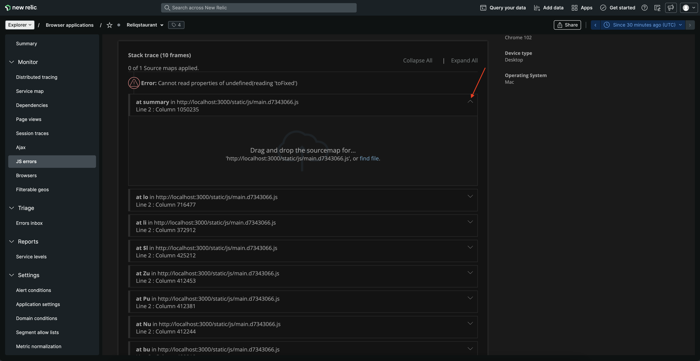

Here, you see an option to upload source map. 

</Step>

<Step>

Click on **find file**. 

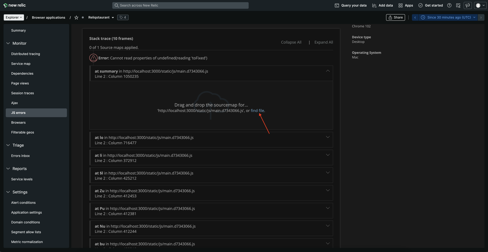

This opens a file explorer window for you to upload source map from your local storage. Find and upload your source map from _build/static/js_ directory of your project.

<Callout variant='tip'>

Source map files have a file extension of `.js.map`. Reliqstraurant is set to generate source maps and you find it under _build/static/js_ directory.
If you're having trouble generating source maps for your project, follow [our documentation](https://docs.newrelic.com/docs/browser/browser-monitoring/browser-pro-features/upload-source-maps-un-minify-js-errors#generate-maps) to learn how to generate one.

</Callout>

</Step>

<Step>

Once your source map is uploaded successfully, you see your error un-minified.

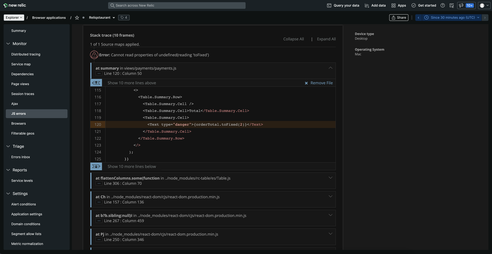

This shows that in your _payment.js_ file, **orderTotal.toFixed(2)** is generating error and affecting your services. Let's take a closer look at this file!

</Step>

<Step>

Click on **Show 10 more lines above**.

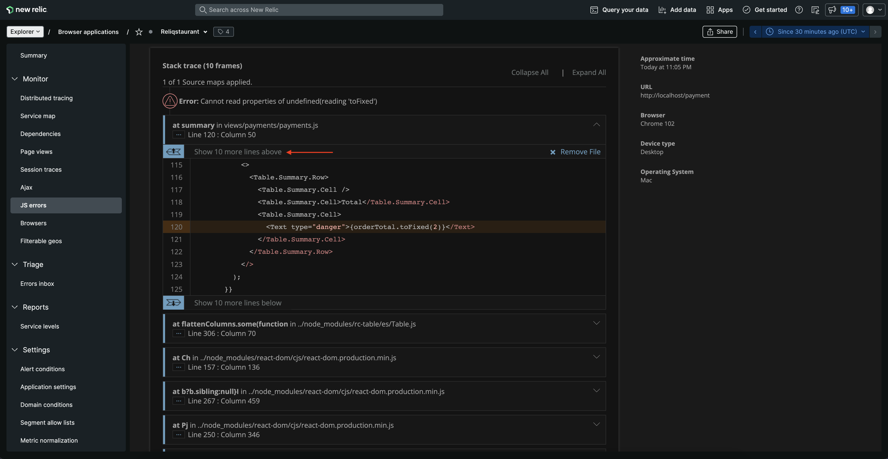

</Step>

<Step>

Take a closer look at the shown code.

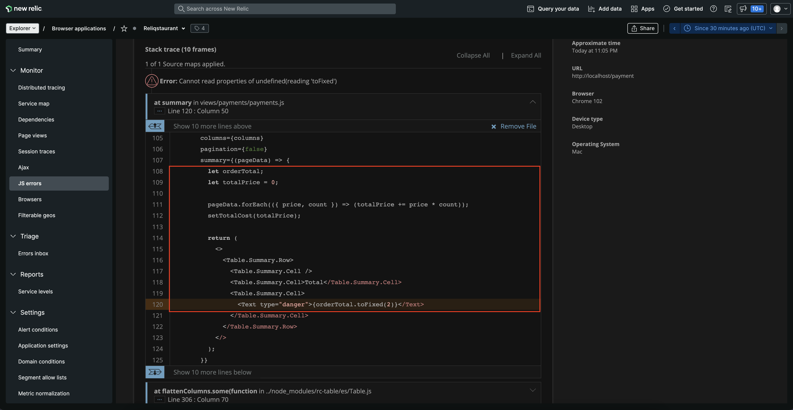

</Step>

</Steps>

There's the problem! The **orderTotal** variable was never assigned a value. Instead, another variable **totalPrice** was declared and used to calculate the total price for the order. Since **orderTotal** is no longer valid, calling this variable generates the error.
Now that you know, you can fix the variable call in your payment service.

## Summary

To recap, you observed an error in your application and used New Relic browser to:
1. Review the error percentage
2. Analyze the JS errors in your application
3. Understand the error instance
4. Debug the JS error by uploading source map

<Callout variant="course" title="lab">

This procedure is part of a lab that teaches you how to troubleshoot your web app with New Relic browser. Next, try to [debug frontend slowness in your application](/collect-data/browser/debug-slowness).

</Callout>