<Tutorial>

<Project>

```js fileName=src/components/layouts/app/app-container/header/app-container-header.js
import { Button, Drawer, Table } from 'antd';
import Text from 'antd/lib/typography/Text';
import { orderList } from 'atoms/order-list.atom';
import { useState } from 'react';
import { Link } from 'react-router-dom';
import { useRecoilState } from 'recoil';
import { Logo, StyledHeader } from './app-header-styled';
import Navi from './navi-items';
import { useNavigate } from 'react-router';

const Header = () => {
  const [isSidebarVisible, setIsSidebarVisible] = useState(false);
  const [orderListState, setOrderList] = useRecoilState(orderList);
  const navigate = useNavigate();

  const onClose = () => {
    setIsSidebarVisible(false);
  };
  const handleSidebarOpen = () => {
    setIsSidebarVisible(true);
  };

  const itemQuantity = (list) => {
    let totalItemQuantity = 0;
    list.forEach((item) => (totalItemQuantity += item.count));

    return totalItemQuantity;
  };

  const handleDeleteItem = (clickedRow) => {
    const reducedData = orderListState.filter((item) =>
      item.name === clickedRow.name ? false : true
    );
    setOrderList(reducedData);
  };

  const columns = [
    {
      title: 'Name',
      dataIndex: 'name',
      key: 'name',
    },
    {
      title: 'Count',
      dataIndex: 'count',
      key: 'count',
    },
    {
      title: 'Price',
      dataIndex: 'price',
      key: 'price',
    },
    {
      title: 'Delete',
      render: (clickedRow) => (
        <Button onClick={() => handleDeleteItem(clickedRow)}>-</Button>
      ),
    },
  ];

  return (
    <StyledHeader>
      <Link to="/">
        <Logo>
          <div>Relicstaurants</div>
          <p>by New Relic</p>
        </Logo>
      </Link>
      <Navi
        sidebarVisible={handleSidebarOpen}
        orderListLength={itemQuantity(orderListState)}
      />
      <Drawer
        size="large"
        title="Cart"
        placement="right"
        onClose={onClose}
        visible={isSidebarVisible}
      >
        <Table
          dataSource={orderListState}
          columns={columns}
          pagination={false}
          summary={(pageData) => {
            let totalPrice = 0;

            pageData.forEach(
              ({ price, count }) => (totalPrice += price * count)
            );

            return (
              <>
                <Table.Summary.Row>
                  <Table.Summary.Cell colSpan={2}>Total</Table.Summary.Cell>
                  <Table.Summary.Cell>
                    <Text type="danger">{totalPrice.toFixed(2)}</Text>
                  </Table.Summary.Cell>
                </Table.Summary.Row>
                <Table.Summary.Row>
                  <Table.Summary.Cell colSpan={3}>
                    <Button
                      disabled={totalPrice > 0 ? false : true}
                      primary
                      onClick={() => {
                        setOrderList([]);
                        setIsSidebarVisible(false);
                      }}
                    >
                      Clear Cart
                    </Button>
                  </Table.Summary.Cell>
                  <Table.Summary.Cell>
                    <Button
                      id="pay"
                      primary
                      onClick={() => {
                        if (!(totalPrice > 0)) {
                          var err = new Error('Cart cannot be empty!');
                          newrelic.noticeError(err); 
                          alert(err)
                          navigate('/')
                          setIsSidebarVisible(false);
                        } else {
                        navigate(`/payment`, { state: totalPrice });
                        setIsSidebarVisible(false);
                        }
                      }}
                    >
                      PAY
                    </Button>
                  </Table.Summary.Cell>
                </Table.Summary.Row>
              </>
            );
          }}
        />
      </Drawer>
    </StyledHeader>
  );
};

export default Header;

```

</Project>

<Callout variant="course" title="lab">

This procedure is part of a lab that teaches you how to troubleshoot your web app with New Relic browser.

Each procedure in the lab builds upon the last, so make sure you've completed the last procedure, [_Instrument your application with our browser agent_](/collect-data/browser/install-browser-agent), before starting this one.

</Callout>

Until now, your application has been working fine. Users were able to place their orders and were satisfied with your service. But now that you have some insights in your application, you notice that it's showing some JavaScript errors.

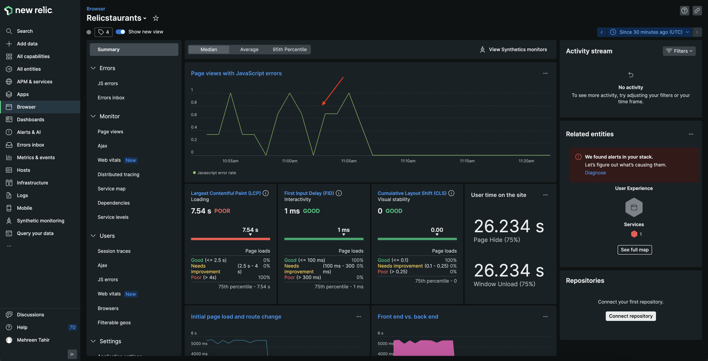

In this procedure, you use New Relic browser to find out what's causing these errors and debug your application timely.

<Callout variant='important'>

In order to see your data in New Relic, you need to enable browser monitoring for this procedure. 

If you haven't already, [instrument your app with our browser agent](/collect-data/browser/install-browser-agent).

</Callout>

## Debug frontend errors

The bad news is that you've confirmed there are some errors in your application. The good news is that you recently instrumented your application with our browser agent! Go to New Relic and sign into your account, if you haven't already.

<Steps>

<Step>

From the New Relic homepage, navigate to **Browser** and choose your **Relicstaurants** application.


</Step>

<Step>

Here, you see all the data related to your browser application including **Page views with JavaScript errors**, **Core web vitals**, **User time on the site**, **Initial page load and route changes**, and others.


</Step>

<Callout variant='tip'>

Not seeing your data? Make sure you enabled browser monitoring and your load generator is running. 

</Callout>

<Step>

Notice **Page views with javascript errors**.

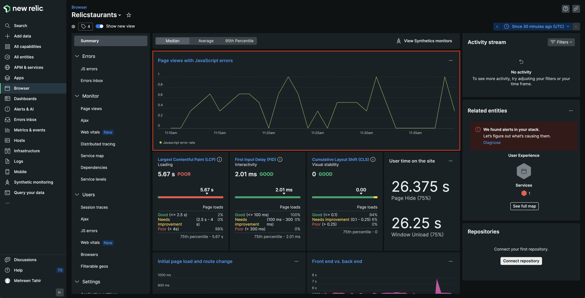

Here, you see spikes showing that your application has some Javascript errors. 

</Step>

<Step>

Click on **Page views with javascript errors**. 

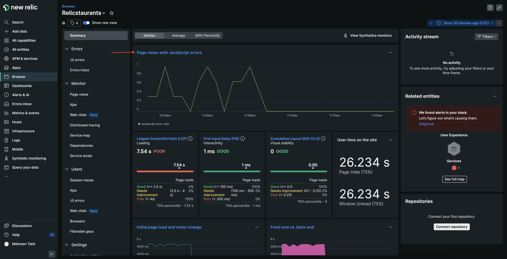

This takes you to **JS errors** page where you see all the JS errors along with Total error instances. 

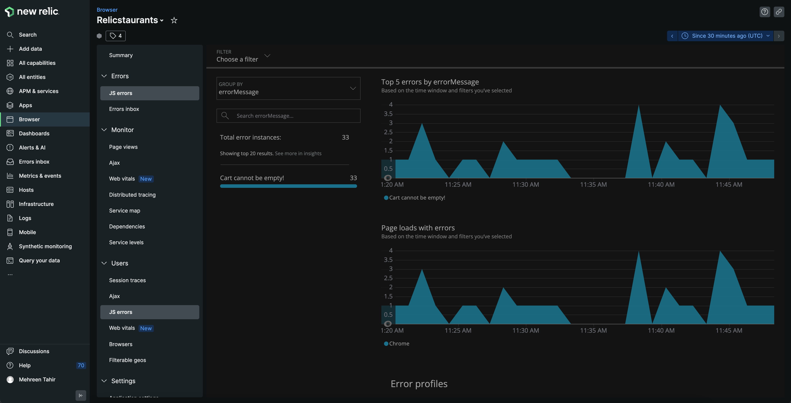

</Step>

<Step>

Click on the **Cart cannot be empty** error for details.

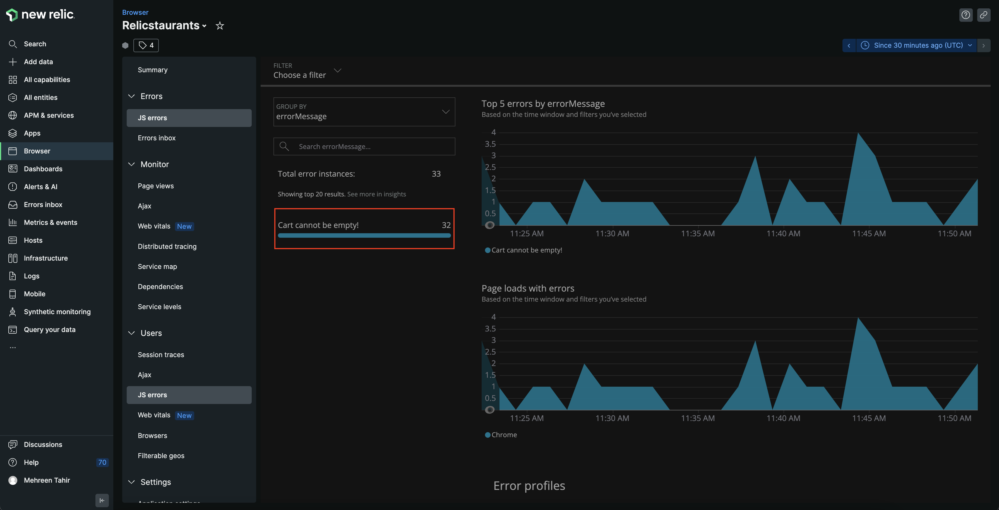

Here, you see **errorMessage**, **INSTANCES**, **INTERACTIONS AFFECTED** and other details related to your error.

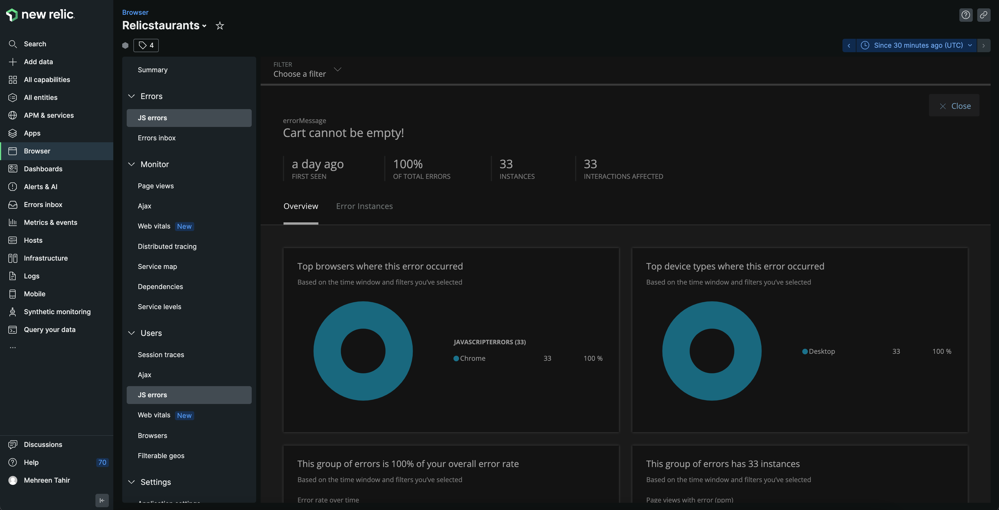

</Step>

<Step>

Next, navigate to **Error Instances** tab. 

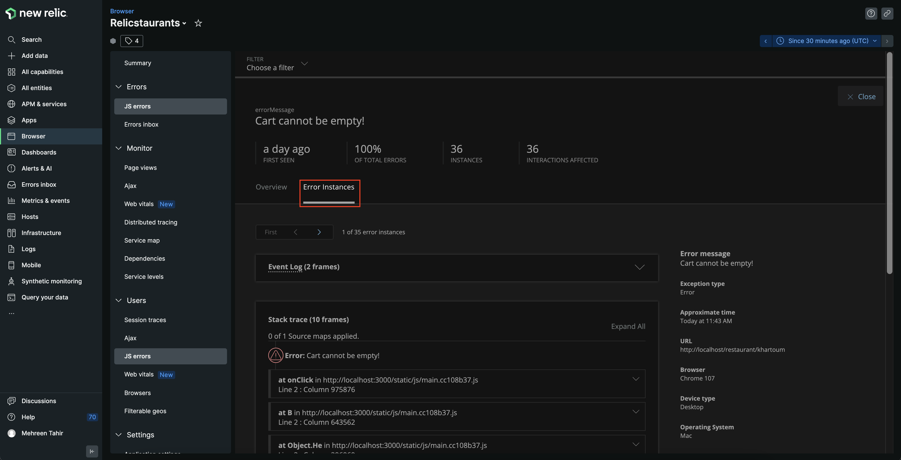

Here, you see more details related to your particular error including **Event Log**, **Stack trace**, and other.

</Step>

<Step>

Scroll down on the **Error Instances** page to view the **Stack trace**.

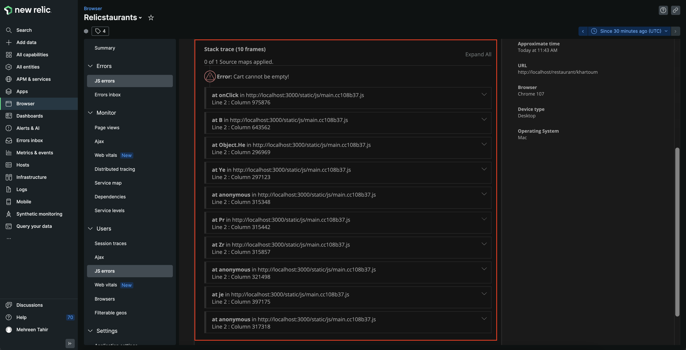

Here, you see the stack trace of your error.

</Step>

</Steps>

Looking at the error details above, you now know the particular error affecting your services. However, the stack trace shown here is minified and it's hard to understand what's causing this error. To understand that, we need to upload the source map to un-minify the error. 

## Upload source map to un-minify JS error

Minified JavaScript mostly results in hard-to-understand, useless stack traces on browser's errors page. Uploading source maps converts these errors to understandable stack traces. It also provides a useful reference to code lines and makes it easier to debug.
You can upload your soucre map to New Relic via UI, API or npm module. 

Here, we use New Relic UI to upload source map and un-minify the JS error.

<Steps>

<Step>

From JS errors page, navigate to Stack trace of the error and expand it. 

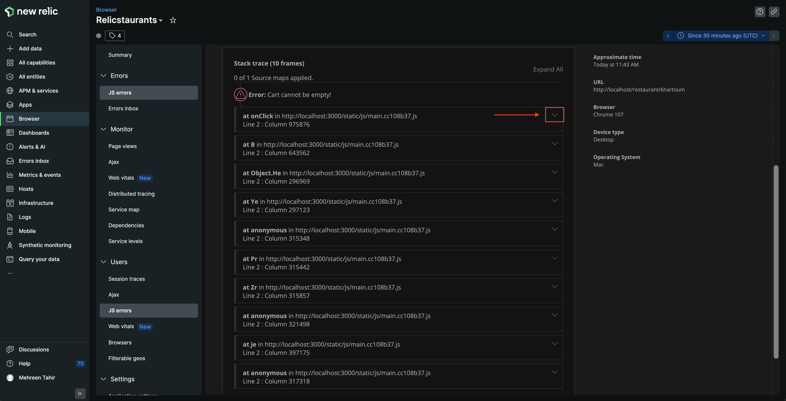

Here, you see an option to upload source map. 

</Step>

<Step>

Click on **find file**. 

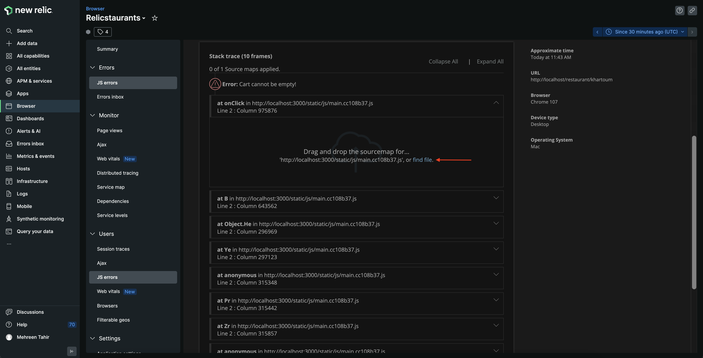

This opens a file explorer window for you to upload source map from your local storage. Find and upload your source map from _build/static/js_ directory of your project.

<Callout variant='tip'>

Source map files have a file extension of `.js.map`. Relicstaurants is set to generate source maps and you find it under _build/static/js_ directory.
If you're having trouble generating source maps for your project, follow [our documentation](https://docs.newrelic.com/docs/browser/browser-monitoring/browser-pro-features/upload-source-maps-un-minify-js-errors#generate-maps) to learn how to generate one.

</Callout>

</Step>

<Step>

Once your source map is uploaded successfully, you see your error un-minified.

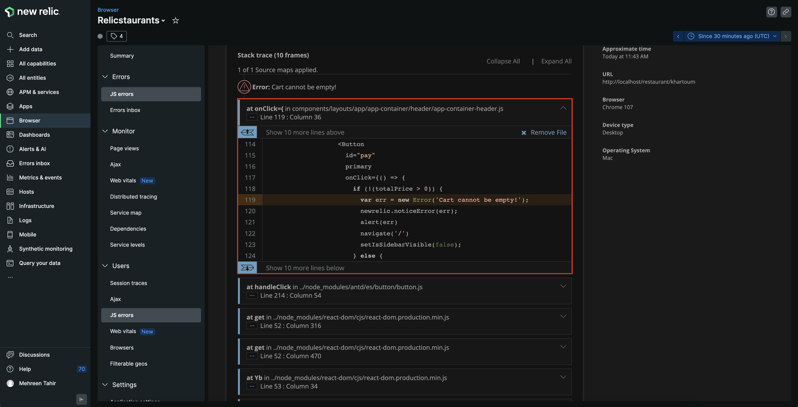

Here, you see the particular file and the line of code that's generating this error. Notice that at line 119, the **Cart cannot be empty!** is associated with **onClick** event in _components/layouts/app/app-container/header/app-container-header.js_ file and is also triggering an alert for the user. Let's take a closer look at this file!

</Step>

<Step>

Open the application in the IDE of your choice and navigate to _src/components/layouts/app/app-container/header/app-container-header.js_ file. Take a closer look at the shown code.

<>

```js fileName=src/components/layouts/app/app-container/header/app-container-header.js
import { Button, Drawer, Table } from 'antd';
import Text from 'antd/lib/typography/Text';
import { orderList } from 'atoms/order-list.atom';
import { useState } from 'react';
import { Link } from 'react-router-dom';
import { useRecoilState } from 'recoil';
import { Logo, StyledHeader } from './app-header-styled';
import Navi from './navi-items';
import { useNavigate } from 'react-router';

const Header = () => {
  const [isSidebarVisible, setIsSidebarVisible] = useState(false);
  const [orderListState, setOrderList] = useRecoilState(orderList);
  const navigate = useNavigate();

  const onClose = () => {
    setIsSidebarVisible(false);
  };
  const handleSidebarOpen = () => {
    setIsSidebarVisible(true);
  };

  const itemQuantity = (list) => {
    let totalItemQuantity = 0;
    list.forEach((item) => (totalItemQuantity += item.count));

    return totalItemQuantity;
  };

  const handleDeleteItem = (clickedRow) => {
    const reducedData = orderListState.filter((item) =>
      item.name === clickedRow.name ? false : true
    );
    setOrderList(reducedData);
  };

  const columns = [
    {
      title: 'Name',
      dataIndex: 'name',
      key: 'name',
    },
    {
      title: 'Count',
      dataIndex: 'count',
      key: 'count',
    },
    {
      title: 'Price',
      dataIndex: 'price',
      key: 'price',
    },
    {
      title: 'Delete',
      render: (clickedRow) => (
        <Button onClick={() => handleDeleteItem(clickedRow)}>-</Button>
      ),
    },
  ];

  return (
    <StyledHeader>
      <Link to="/">
        <Logo>
          <div>Relicstaurants</div>
          <p>by New Relic</p>
        </Logo>
      </Link>
      <Navi
        sidebarVisible={handleSidebarOpen}
        orderListLength={itemQuantity(orderListState)}
      />
      <Drawer
        size="large"
        title="Cart"
        placement="right"
        onClose={onClose}
        visible={isSidebarVisible}
      >
        <Table
          dataSource={orderListState}
          columns={columns}
          pagination={false}
          summary={(pageData) => {
            let totalPrice = 0;

            pageData.forEach(
              ({ price, count }) => (totalPrice += price * count)
            );

            return (
              <>
                <Table.Summary.Row>
                  <Table.Summary.Cell colSpan={2}>Total</Table.Summary.Cell>
                  <Table.Summary.Cell>
                    <Text type="danger">{totalPrice.toFixed(2)}</Text>
                  </Table.Summary.Cell>
                </Table.Summary.Row>
                <Table.Summary.Row>
                  <Table.Summary.Cell colSpan={3}>
                    <Button
                      disabled={totalPrice > 0 ? false : true}
                      primary
                      onClick={() => {
                        setOrderList([]);
                        setIsSidebarVisible(false);
                      }}
                    >
                      Clear Cart
                    </Button>
                  </Table.Summary.Cell>
                  <Table.Summary.Cell>
                    <Button 
                      id="pay" 
                      primary 
                      onClick={() => { 
                        if (!(totalPrice > 0)) { 
                          var err = new Error('Cart cannot be empty!'); 
                          newrelic.noticeError(err);  
                          alert(err) 
                          navigate('/') 
                          setIsSidebarVisible(false); 
                        } else { 
                        navigate(`/payment`, { state: totalPrice }); 
                        setIsSidebarVisible(false); 
                        } 
                      }} 
                    > 
                      PAY 
                    </Button> 
                  </Table.Summary.Cell>
                </Table.Summary.Row>
              </>
            );
          }}
        />
      </Drawer>
    </StyledHeader>
  );
};

export default Header;

```
</>

Here, notice that the error **Cart cannot be empty!** only occurs whenever the user accidently tries to checkout with an empty cart. The function is coded to alert the end user that they can't proceed to checkout with an empty cart. You now know that this error will not affect your services. However, there are better ways to handle this edge case and avoid the error.

</Step>

<Step>

Press `Ctrl+C` in the terminal that's running your application to stop serving it. Update the _src/components/layouts/app/app-container/header/app-container-header.js_ as follows.

<>

```js fileName=src/components/layouts/app/app-container/header/app-container-header.js
import { Button, Drawer, Table } from 'antd';
import Text from 'antd/lib/typography/Text';
import { orderList } from 'atoms/order-list.atom';
import { Message } from 'components/common';
import { useState } from 'react';
import { Link } from 'react-router-dom';
import { useRecoilState } from 'recoil';
import { Logo, StyledHeader } from './app-header-styled';
import Navi from './navi-items';
import { useNavigate } from 'react-router';

const Header = () => {
  const [isSidebarVisible, setIsSidebarVisible] = useState(false);
  const [orderListState, setOrderList] = useRecoilState(orderList);
  const navigate = useNavigate();

  const onClose = () => {
    setIsSidebarVisible(false);
  };
  const handleSidebarOpen = () => {
    setIsSidebarVisible(true);
  };

  const itemQuantity = (list) => {
    let totalItemQuantity = 0;
    list.forEach((item) => (totalItemQuantity += item.count));

    return totalItemQuantity;
  };

  const handleDeleteItem = (clickedRow) => {
    const reducedData = orderListState.filter((item) =>
      item.name === clickedRow.name ? false : true
    );
    setOrderList(reducedData);
  };

  const columns = [
    {
      title: 'Name',
      dataIndex: 'name',
      key: 'name',
    },
    {
      title: 'Count',
      dataIndex: 'count',
      key: 'count',
    },
    {
      title: 'Price',
      dataIndex: 'price',
      key: 'price',
    },
    {
      title: 'Delete',
      render: (clickedRow) => (
        <Button onClick={() => handleDeleteItem(clickedRow)}>-</Button>
      ),
    },
  ];

  return (
    <StyledHeader>
      <Link to="/">
        <Logo>
          <div>Relicstaurants</div>
          <p>by New Relic</p>
        </Logo>
      </Link>
      <Navi
        sidebarVisible={handleSidebarOpen}
        orderListLength={itemQuantity(orderListState)}
      />
      <Drawer
        size="large"
        title="Cart"
        placement="right"
        onClose={onClose}
        visible={isSidebarVisible}
      >
        {orderListState.length > 0 ? (
          <Table
            dataSource={orderListState}
            columns={columns}
            pagination={false}
            summary={(pageData) => {
              let totalPrice = 0;

              pageData.forEach(
                ({ price, count }) => (totalPrice += price * count)
              );

              return (
                <>
                  <Table.Summary.Row>
                    <Table.Summary.Cell colSpan={2}>Total</Table.Summary.Cell>
                    <Table.Summary.Cell>
                      <Text type="danger">{totalPrice.toFixed(2)}</Text>
                    </Table.Summary.Cell>
                  </Table.Summary.Row>
                  <Table.Summary.Row>
                    <Table.Summary.Cell colSpan={3}>
                      <Button
                        disabled={totalPrice > 0 ? false : true}
                        primary
                        onClick={() => {
                          setOrderList([]);
                          setIsSidebarVisible(false);
                        }}
                      >
                        Clear Cart
                      </Button>
                    </Table.Summary.Cell>
                    <Table.Summary.Cell>
                      <Button
                        id="pay"
                        disabled={totalPrice > 0 ? false : true}
                        primary
                        onClick={() => {
                          navigate(`/payment`, { state: totalPrice });
                          setIsSidebarVisible(false);
                        }}
                      >
                        PAY
                      </Button>
                    </Table.Summary.Cell>
                  </Table.Summary.Row>
                </>
              );
            }}
          />
        ) : (
          <Message>Nothing in cart</Message>
        )}
      </Drawer>
    </StyledHeader>
  );
};

export default Header;

```

</>

</Step>

</Steps>

</Tutorial>

Here, you modified the file show a message **Nothing in cart** instead of an error when the cart is empty. The **PAY** button remains disabled until the end users has items in their cart. 

## Restart your application

Now that you've fixed your application, it's time to restart your local server.

<>

```bash
npm run build
npm run newstart
```

</>

Restart your load generator, as well.

<>

```bash
python3 simulator.py
```

</>

<Callout variant="important">

Make sure you're running these commands in the correct terminal windows. If you no longer have those windows, follow the steps in the [setup procedure](/collect-data/browser/set-up-env).

</Callout>

Once the load generator starts sending data to New Relic, notice that the application is no longer reporting JavaScript errors.

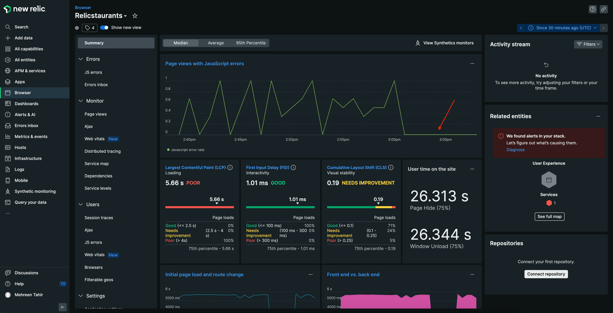

## Summary

To recap, you observed an error in your application and used New Relic browser to:
1. Review the error percentage
2. Analyze the JS errors in your application
3. Understand the error instance
4. Debug the JS error by uploading source map

<Callout variant="course" title="lab">

This procedure is part of a lab that teaches you how to troubleshoot your web app with New Relic browser. Next, try to [debug frontend slowness in your application](/collect-data/browser/debug-slowness).

</Callout>