<Callout variant="course" title="lab">

This procedure is part of a lab that teaches you how to troubleshoot your web app with New Relic browser.

Each procedure in the lab builds upon the last, so make sure you've completed the last procedure, [_Debug errors in your application_](/collect-data/browser/debug-errors), before starting this one.

</Callout>

After fixing JavaScript errors in your application, you and your team are feeling confident. Ready for your down time, you head over to social media but you check Twitter and see some confused customers:

Uh oh! You customers don't look happy. It's time to useNew Relic browser to discover the source of delay. 

<Callout variant='important'>

In order to see your data in New Relic, you need to enable browser monitoring for this procedure. 

If you haven't already, [instrument your app with our browser agent](/collect-data/browser/install-browser-agent).

</Callout>

## Debug slowness in your application

<Steps>

<Step>

From the New Relic homepage, navigate to **Browser** and choose your **Relicstaurants** application.

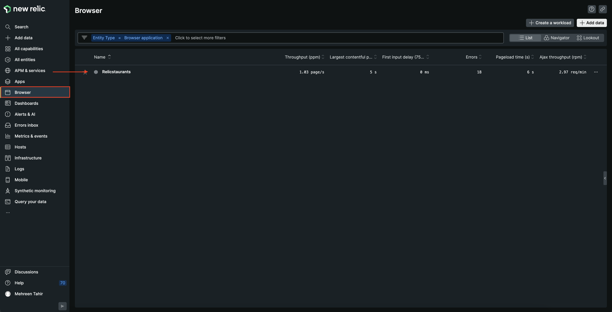

</Step>

<Step>

Here, you see all the data related to your browser application including **Page views with JavaScript errors**, **Core web vitals**, **User time on the site**, **Initial page load and route changes**, and others.

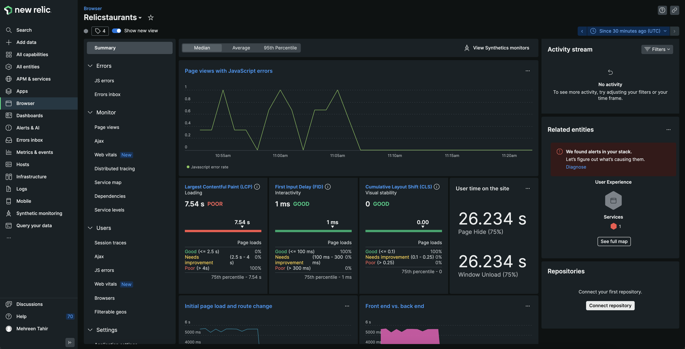

</Step>

Notice the **Largest Contentful Paint (LCP)**.

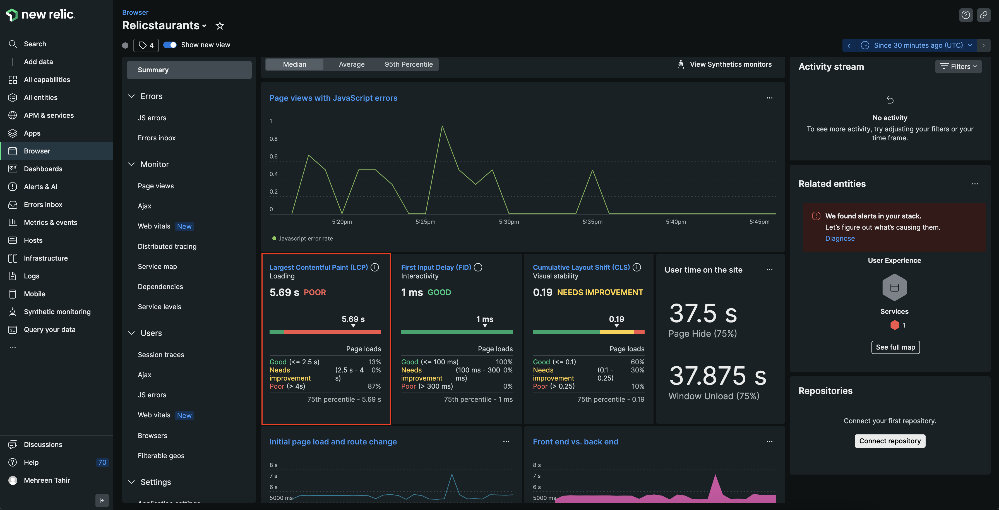

Largest Contentful Paint (LCP) represents how quickly the main content of a web page is loaded. Ideally, the content should not take more than a second or two to load. 
Here, you see that your site is loading in more than 5 seconds. No wonder your users are complaining!  

But what's causing this delay? back end?

<Step>

Scroll down and notice the **Front end vs. back end** graph.

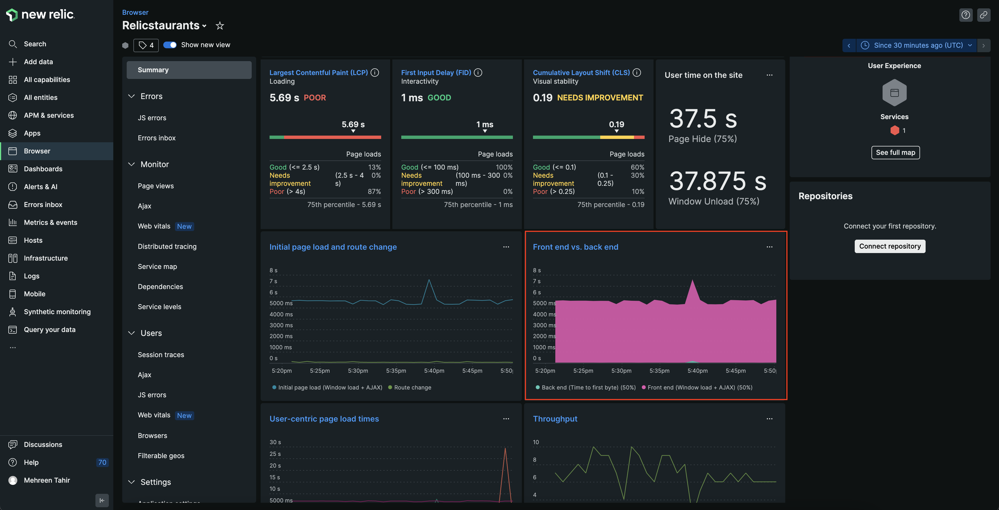

Click on **Back end (time to first byte) (50%)** to filter the graph and see how long backend takes to load. 

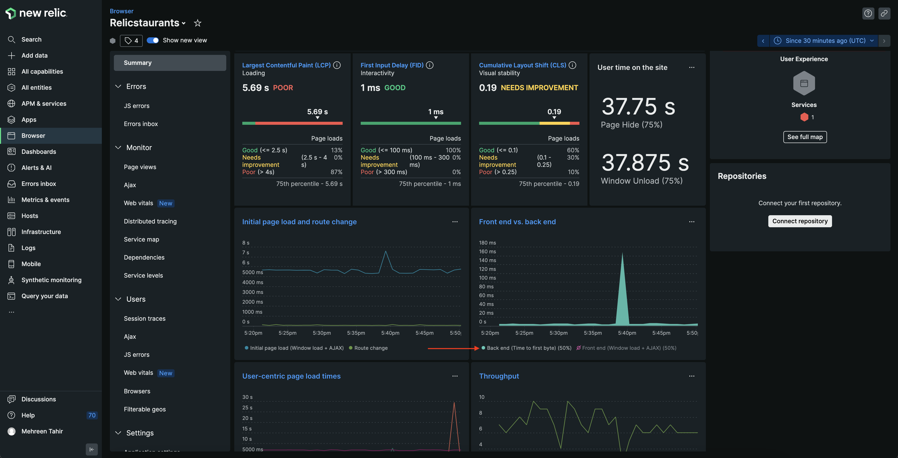

The graph indicates that the back end took maximum 140 mili seconds to process the request in worst case. Does this mean your front end is causing delay? 

Click on **Front end (Window load + AJAX) (50%)**.

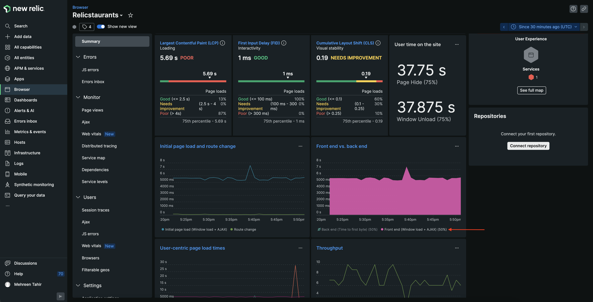

There's the problem! The graph indicates that the delay is happening on front end.

</Step>

<Step>

To narrow down what might be causing the delat on front end, take a closer look at **Initial page load and route change** graph.

</Step>

<Step>

Click on **Initial page load (Window load + AJAX)**.

The graph indicates that **Initial page load (Window load + AJAX)** is taking 5-6 seconds which is alarming. 

</Step>

<Step>

Click **Initial page load and route change** to see more details.

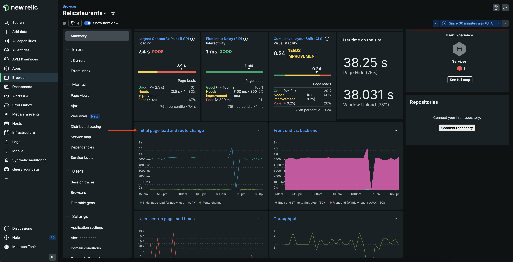

This takes you to **Page views**.

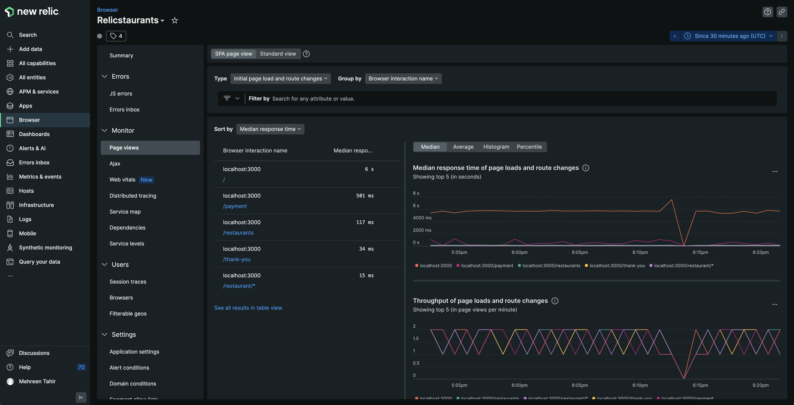

</Step>

<Step>

Sort the pages by **Most time-consuming**.

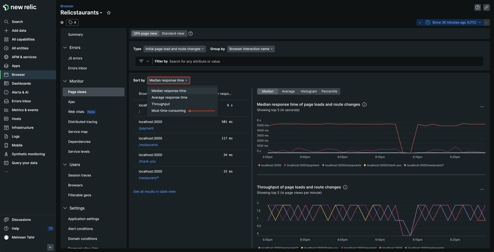

Notice that the initial page is taking almost 90% of time to load. 

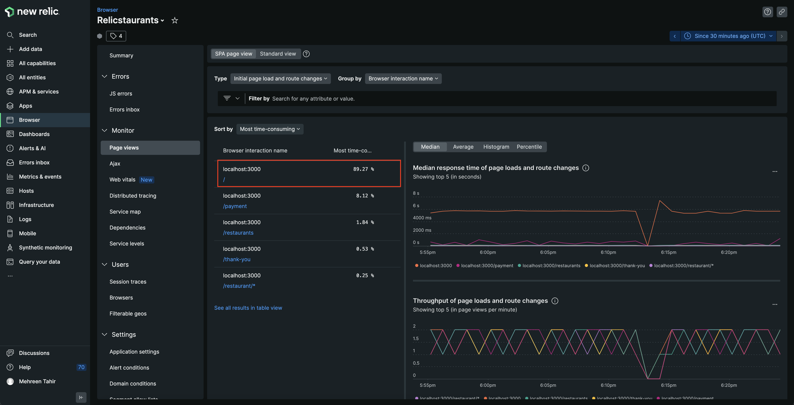

Click on it to view it's details.

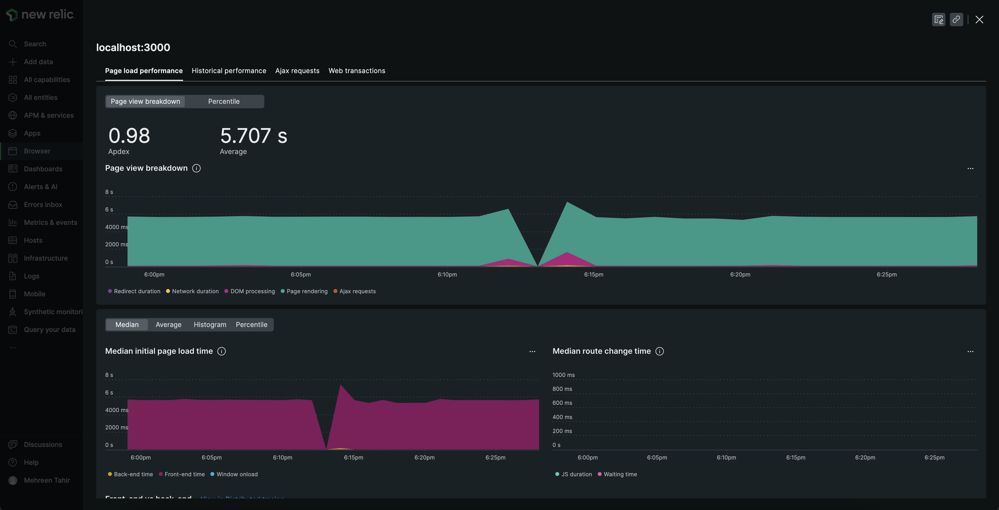

This page shows you **Page view breakdown**, **Median initial page load time**, and other important details. **Page view breakdown** graph is especially important here since it helps you narrow down why and where your page is taking longer.
Upon taking a closer look into this graph, you see that **Page rendering** is taking as long as 5000 miliseconds.

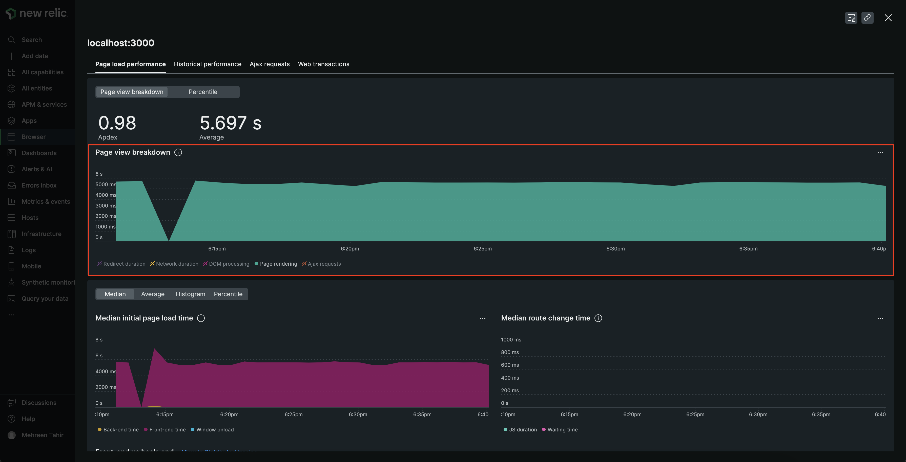

</Step>

You now know that initial page is taking quite long to render making your application slow. Next, we observe the **Session traces** to figure out what is slowing down the rendering process. 

Exit this view by clicking the **X** in the top right hand corner.

<Step>

From left hand navigation, navigate to **Session traces** and sort them in the decending order of **Page load**..

</Step>

<Step>

Here, you see the session traces sorted in the order of **Page load** time.

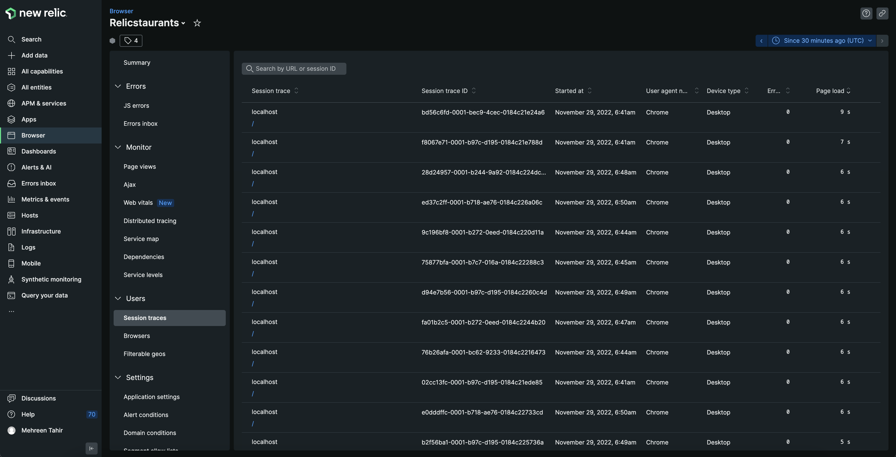

</Step>

<Step>

From the list, click the first one.

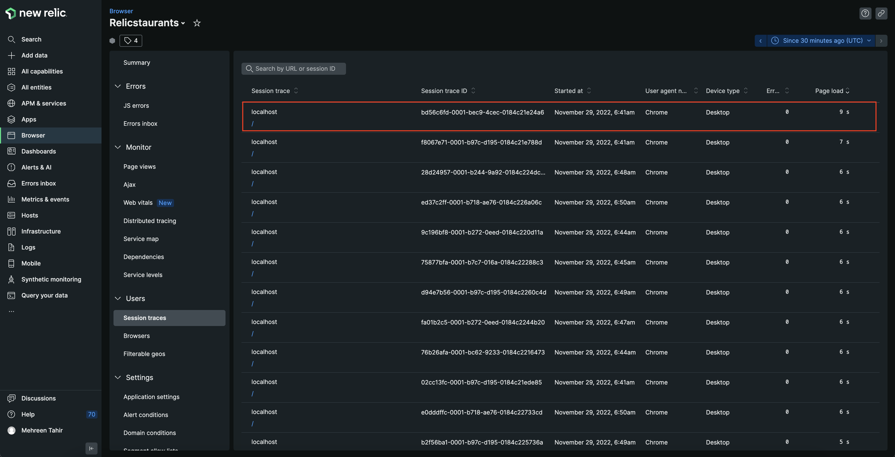

This takes you to **Session traces** detail page.

Here, you see the complete trace for that particular session. This page also shows you **Backend**, **Dom Processing**, **Page Load**, and other trace related information.

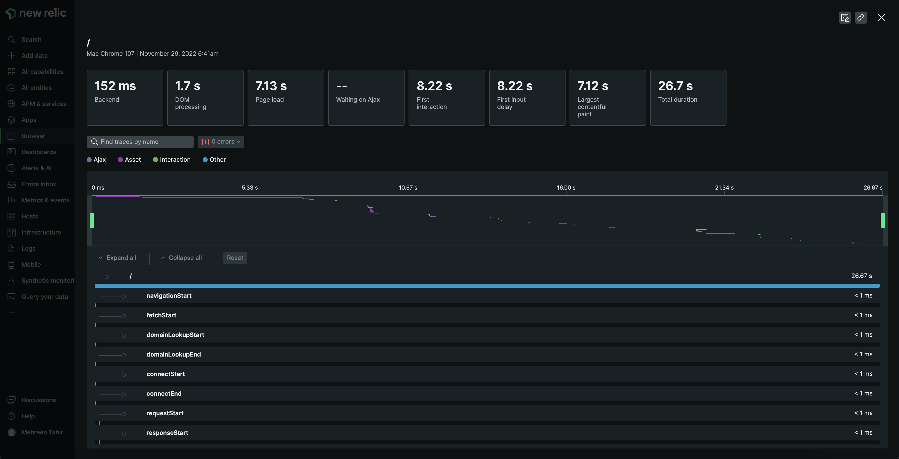

</Step>

<Step>

Note that **Page load** is taking longer than expected. You're need a detailed timeline of the load. Scroll the pointer on the left and right to adjust the timeline. 

</Step>

<Step>

Scroll through the trace to move through the time window and see the details of individual events during this session.

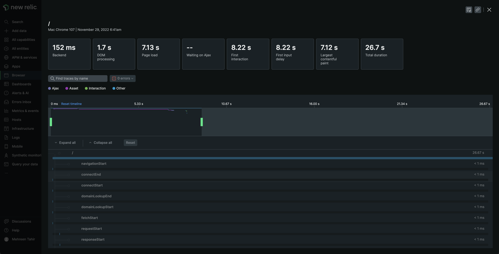

</Step>

<Step>

Notice that a particular event is taking more than 5 seconds.

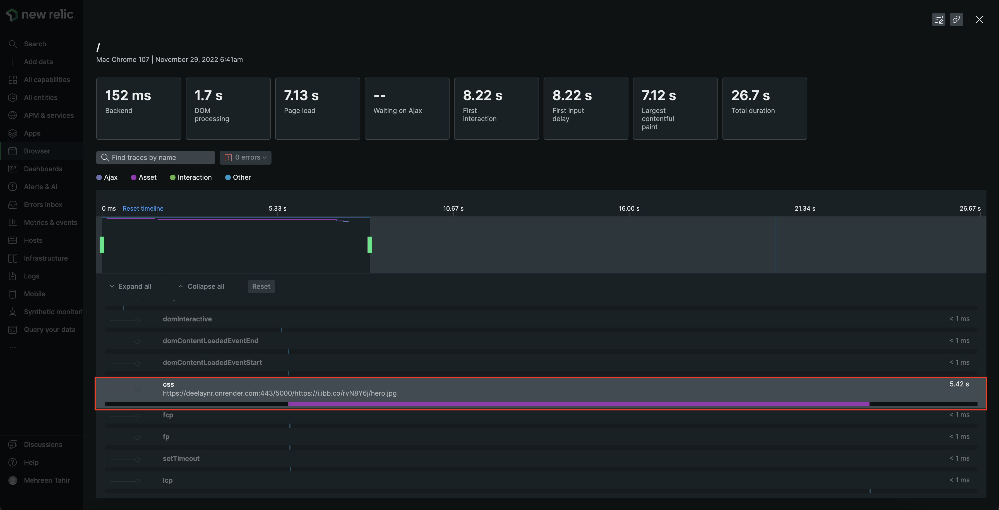

</Step>

<Step>

Click on the event to see its details.

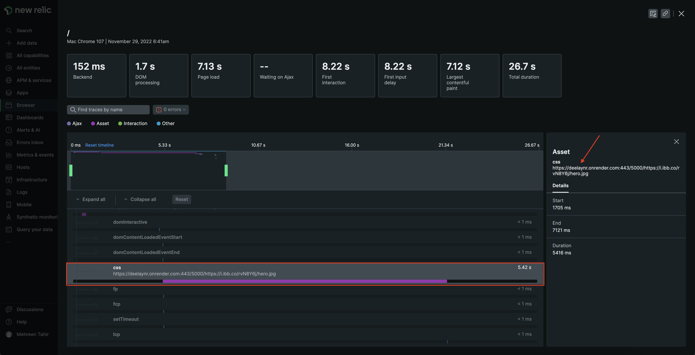

Notice that its an image. Particularly, its the background image of your application which is taking 5 - 6 seconds to load and causing the delay.

</Step>

</Steps>

Based on these findings, you hypothesize that the background image is the culprit here. High-resolution, unoptimized images are the most common reason behind the website slowness.
Good news! now that you know the reason, you can fix the problem.

## Summary

To recap, you observed slowness in your application and used New Relic browser to:

1. Observe Core web vitals of your site
2. Narrow down the sources of slowness

## Homework

Well done! Now that you've gotten a jump start with New Relic browser, here are some docs that will help you take the next steps on your journey.

- [Introduction to browser monitoring](https://docs.newrelic.com/docs/browser/browser-monitoring/getting-started/introduction-browser-monitoring/)
- [Browser Pro agent features](https://docs.newrelic.com/docs/browser/new-relic-browser/browser-pro-features/intro-to-browser-pro-features)
