<Callout variant="course" title="lab">

This procedure is part of a lab that teaches you how to troubleshoot your web app with New Relic browser.

Each procedure in the lab builds upon the last, so make sure you've completed the last procedure, [_Debug errors in your application_](/collect-data/browser/debug-errors), before starting this one.

</Callout>

After fixing bugs in your payment method, you and your team are feeling confident. It's time to push the fixes.

Change to the `scenario-2` branch.

<>

```bash
git switch scenario-2
[output] Switched to branch 'scenario-2'
[output] Your branch is up to date with 'origin/scenario-2'.
```

</>

Navigate to the root directory of your application, install dependencies, and build your application.

<>

```bash
cd foodme-sample-app
npm install
npm run build
```

</>

Now that you've released your new code, it's time to check Twitter for some user feedback.


Oh no! You fixed the errors but forgot to check if your site was loading fine.


<Callout variant='important'>

The provided sample code for this scenario is NOT instrumented. To see your data in New Relic, make sure you [instrument you application](/collect-data/browser/install-browser-agent) before following this procedure. 

</Callout>

## Reproduce the issue

You've been notified by your users that your site is loading slowly. Reproduce the issue for yourself.

From the root directory of the project, build and run your application.

<>

```bash
npm run build
npm run newstart
```

</>

This opens your Reliqstaurants application in your browser.


In another terminal window, navigate to the root directory of your application, and run the load generator.

<>

```bash
cd browser-pro-lab-material/simulator
python simulator.py
```

</>

Your users were right! Your site ia taking long to load. But why? Use New Relic browser to discover the source of delay.

## Debug slowness in your application

<Steps>

<Step>

From the New Relic homepage, go to **Browser**.

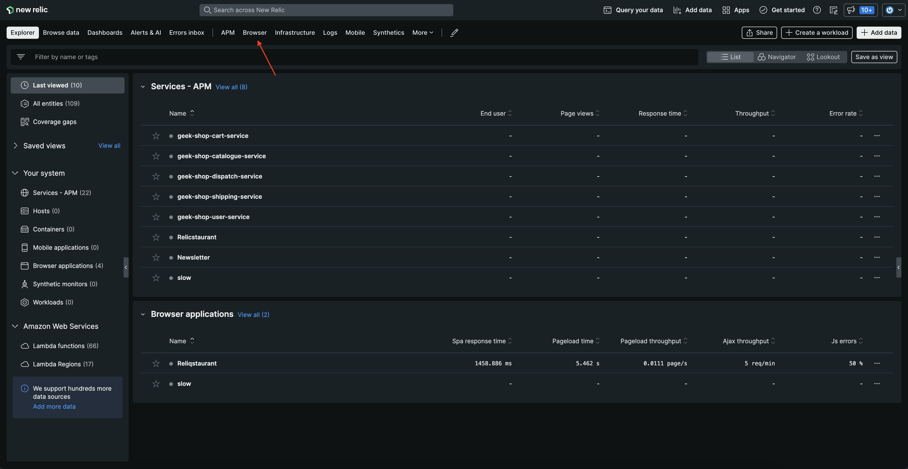

</Step>

<Step>

Choose your **Reliqstaurants** application.

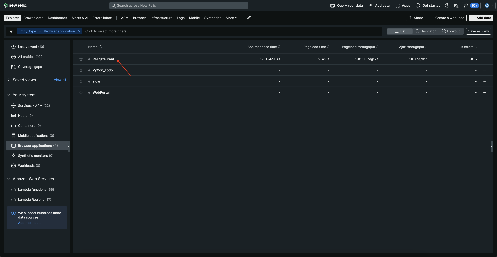

</Step>

<Step>

Here, you see all the data related to your browser application including **Core web vitals**, **Initial page load and route change**, **User-centric page load times** and others.

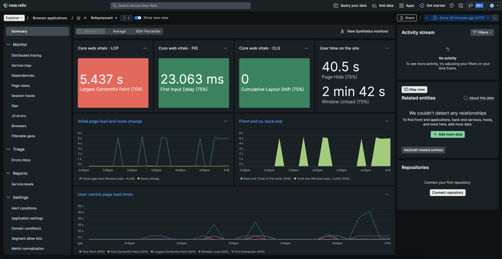

</Step>

Notice the **Core web vitals - LCP**.

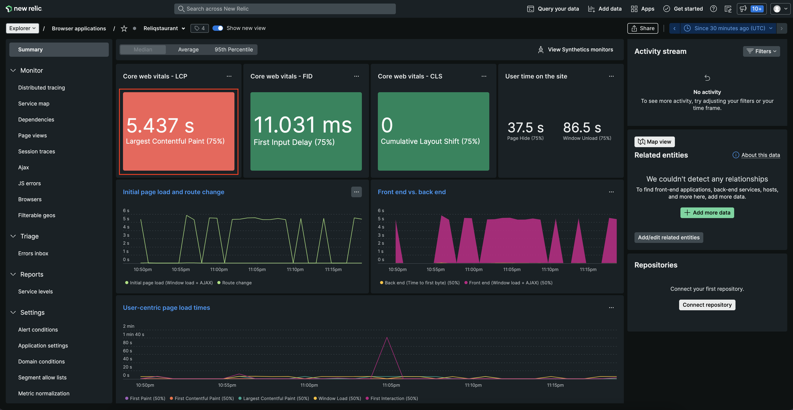

Largest Contentful Paint (LCP) represents how quickly the main content of a web page is loaded. Ideally, the content should not take more than a second or two to load. 
Here, you see that your site is loading in more than 5 seconds. No wonder your users are complaining!  

But what's causing this delay? back end?

<Step>

Notice the **Front end vs. back end** graph.

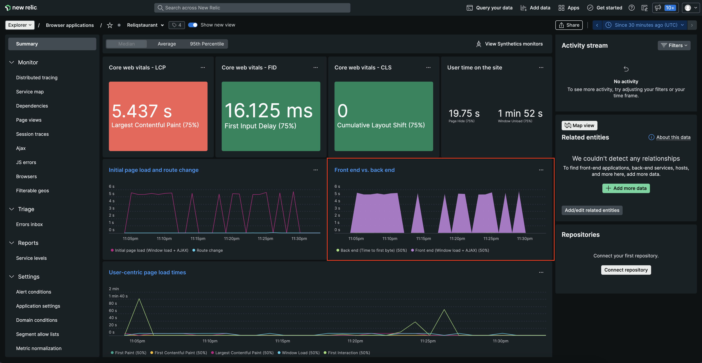

Click on **Back end (time to first byte) (50%)**. 

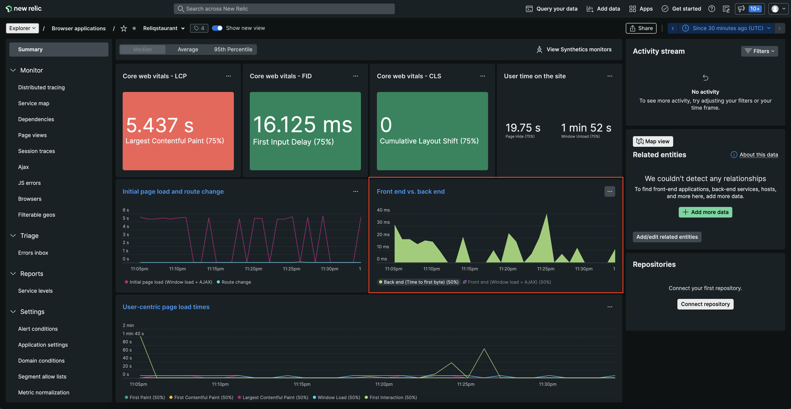

The graph indicate that the back end is taking maximum 40 mili seconds to process the request. Does this mean your front end is causing delay? 

Click on **Front end (Window load + AJAX) (50%)**.

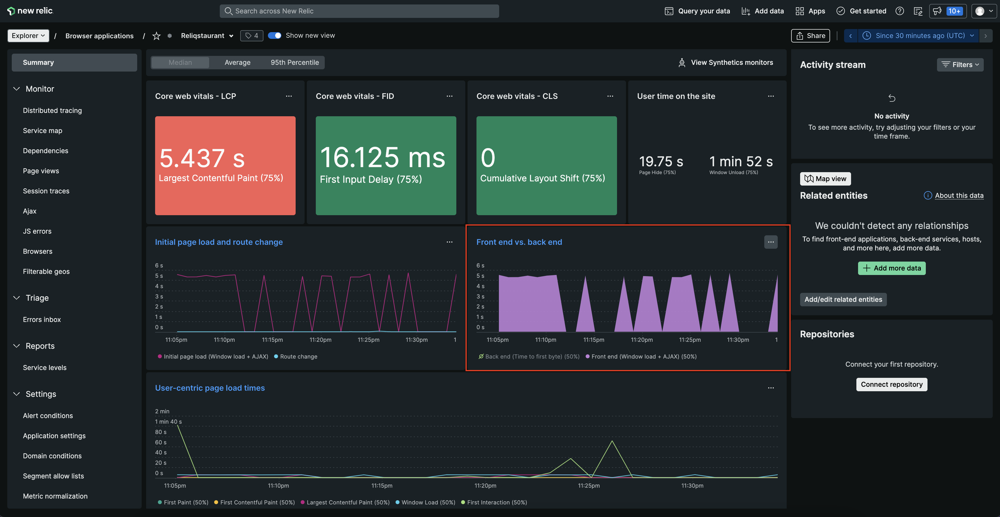

There's the problem! The graph indicates that the delay is happening on front end.

</Step>

<Step>

Take a closer look at **Initial page load and route change** graph.

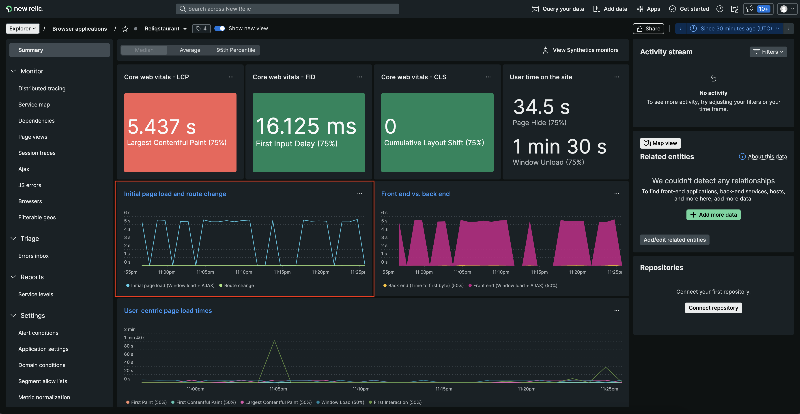

The graph indicates that **Initial page load (Window load + AJAX)** is taking 5-6 seconds. 

</Step>

<Step>

Click **Initial page load and route change** to see more details.


This takes you to **Page views**.

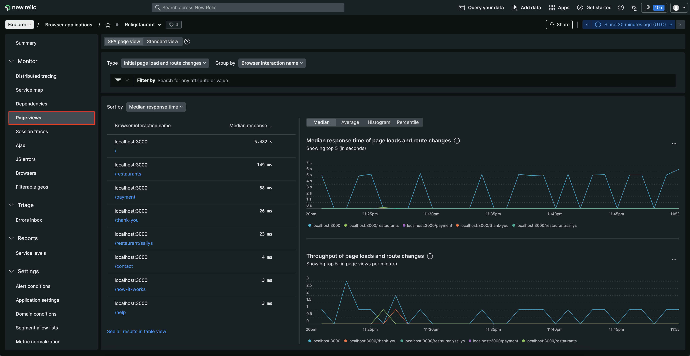

Sort the pages by **Most time-consuming**.

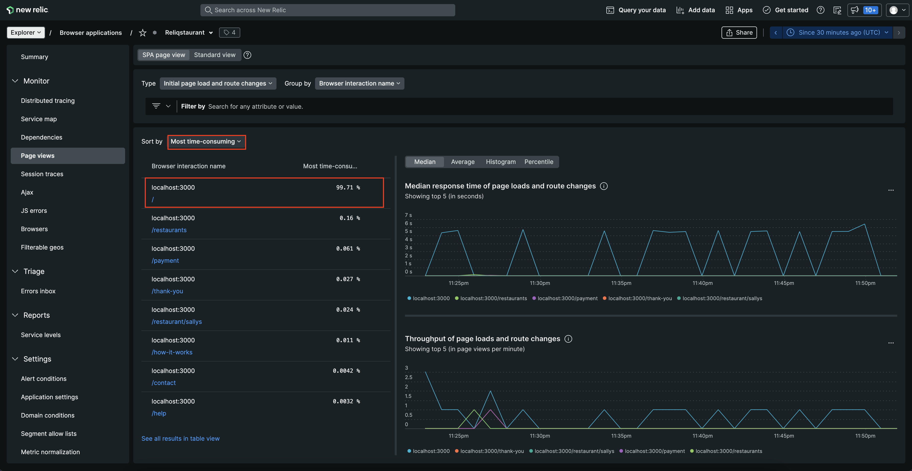

Notice that the initial page is taking almost 100% of time to load. 

</Step>

<Step>

Scroll down to **Session traces**.

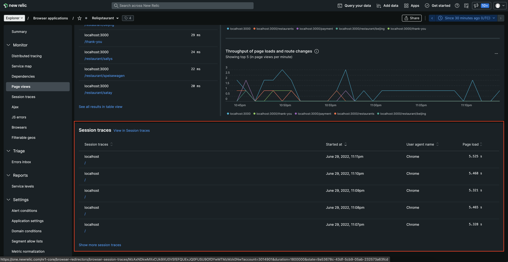

</Step>

<Step>

Sort the **Session traces** in the decending order of **Page load**.

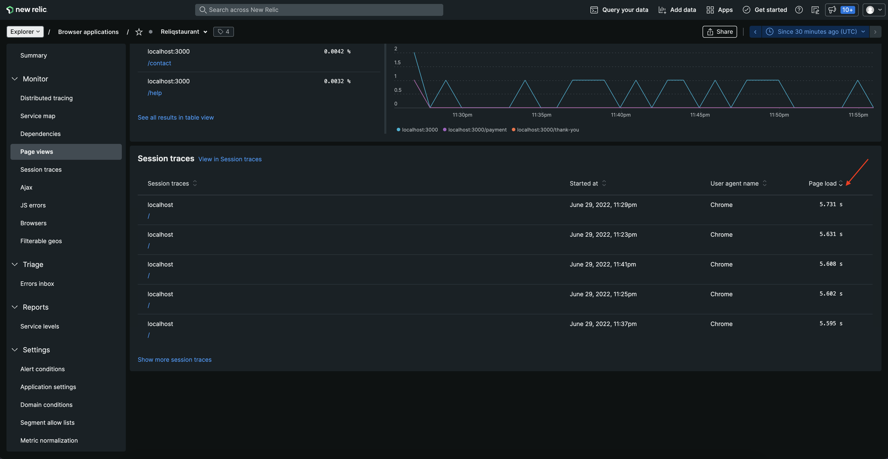

</Step>

<Step>

From the list, click the first one.

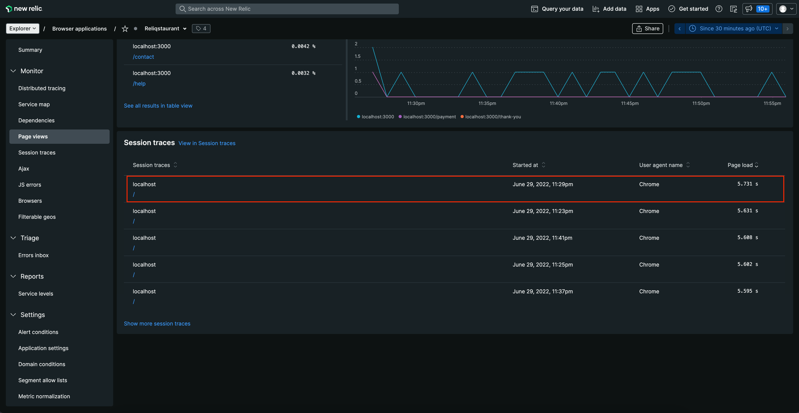

This takes you to **Session traces** detail page.

</Step>

<Step>

Here, you see the complete trace for that particular session. This page also shows you **Backend**, **Dom Processing**, **Page Load**, **Duration** and other trace related information.

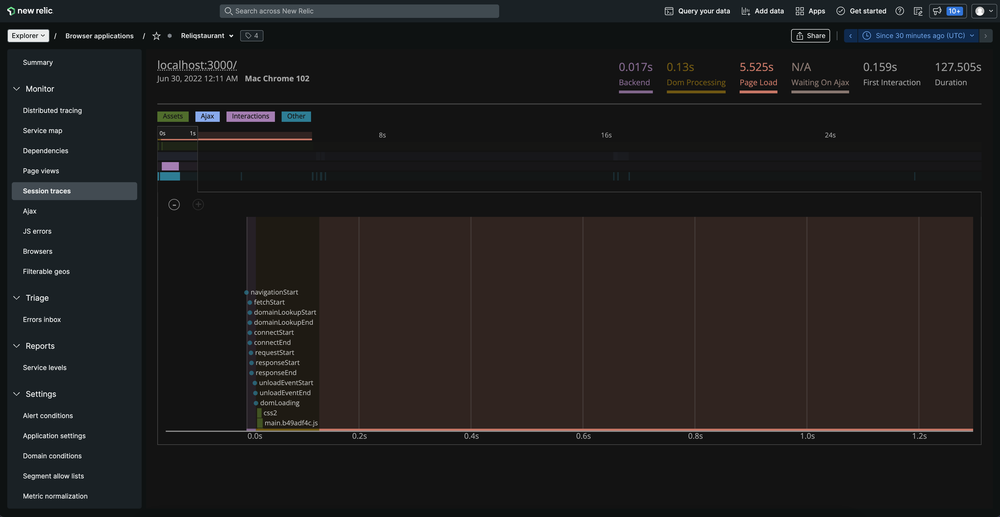

</Step>

<Step>

Scroll down on the trace to move through the time window and see the details. 

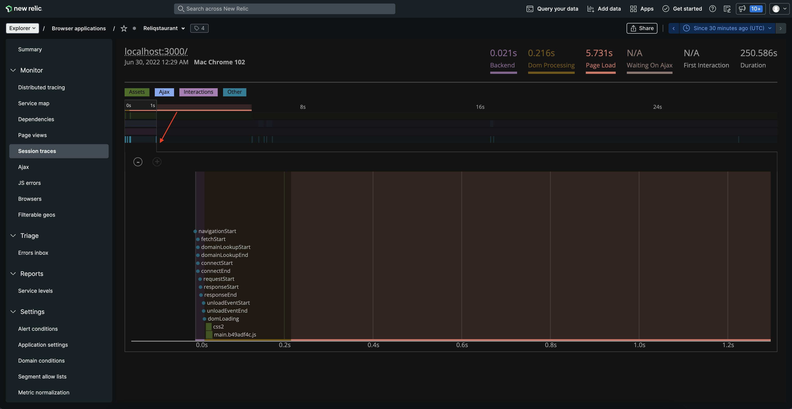

</Step>

<Step>

Notice that the background image is panning through almost the entire trace.

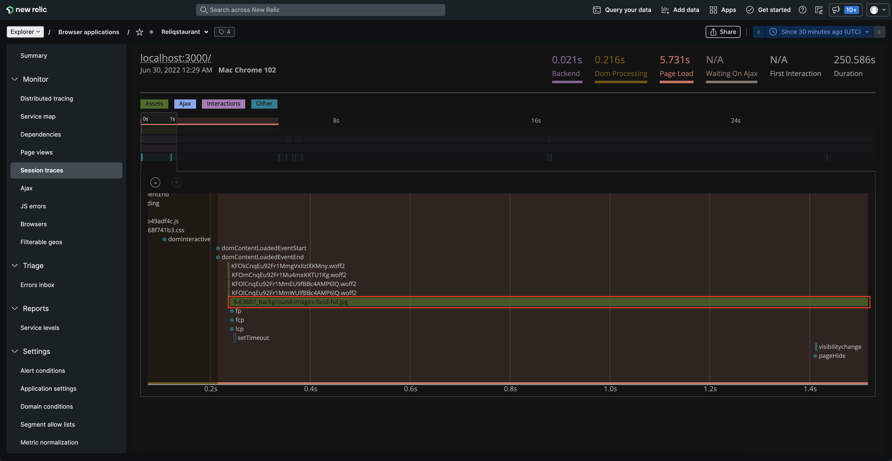

</Step>

<Step>

Hover over the assest.

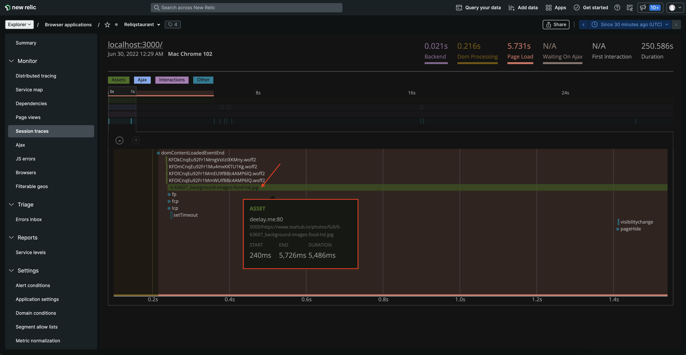

Your suspicion was right. The image is taking 5 - 6 seconds to load and causing the delay.

</Step>

</Steps>

Based on these findings, you hypothesize that the background image is the culprit here. High-resolution, unoptimized images are the most common reason behind the website slowness.
Good news! now that you know the reason, you can fix the problem.

## Summary

To recap, you observed slowness in your application and used New Relic browser to:

1. Observe Core web vitals of your site
2. Narrow down the sources of slowness

## Homework

Well done! Now that you've gotten a jump start with New Relic browser, here are some docs that will help you take the next steps on your journey.

- [Introduction to browser monitoring](https://docs.newrelic.com/docs/browser/browser-monitoring/getting-started/introduction-browser-monitoring/)
- [Browser Pro agent features](https://docs.newrelic.com/docs/browser/new-relic-browser/browser-pro-features/intro-to-browser-pro-features)
