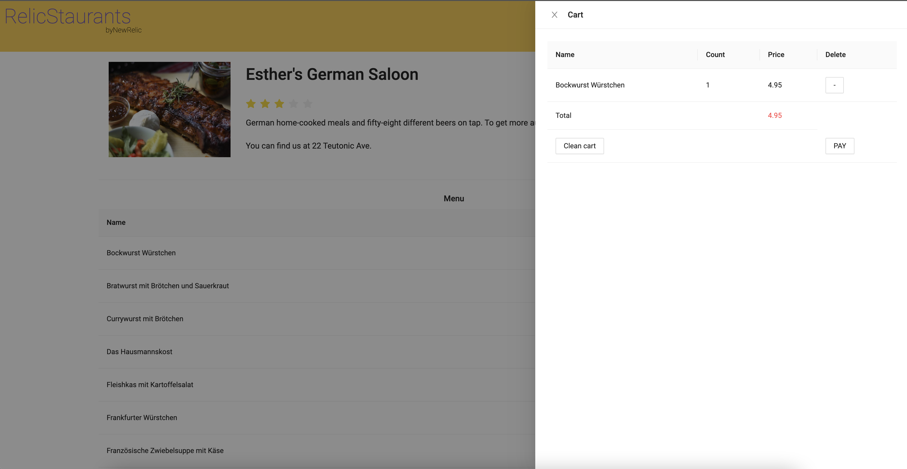
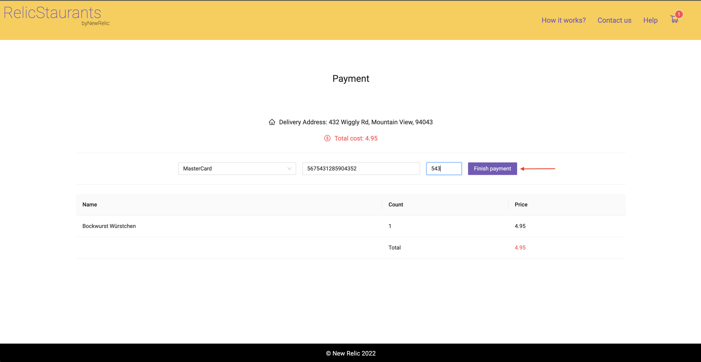
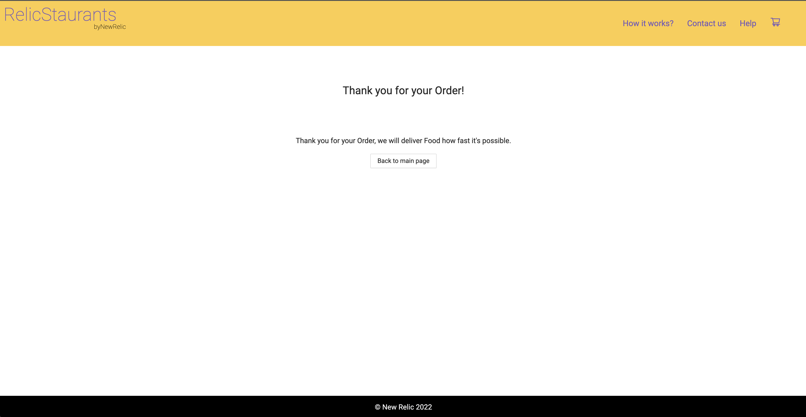

<Callout variant="course" title="lab">

This procedure is part of a lab that teaches you how to troubleshoot your web app with New Relic browser. If you haven't already, check out the [lab introduction](/collect-data/browser).

</Callout>

Before you can walk through the lab proper, you need to spin up your React application.

<Steps>

<Step>

Clone the lab repository.

<>

```bash
git clone https://github.com/mehreentahir16/browser-pro-lab-material.git
```

</>

</Step>

<Step>

Navigate to the root directory of your application, install dependencies, and run the application.

<>

```bash
cd browser-pro-lab-material
npm install
npm run build
npm run newstart
```

</>

This opens your Reliqstaurants application in your browser.


Enter your delivery address, and search for restaurants to get started.


Here, you see a list of restaurants where you can order food.

</Step>

<Step>

Choose a restaurant.


</Step>

<Step>

Select an item or two and click on cart.


</Step>

<Step>

Click **PAY**.



</Step>

<Step>

Enter the following fake card information and click **Finish payment** to place your order.



Your order is successfully placed.



Next, you use a simulator to generate more traffic to your application.

</Step>

<Step>

In another terminal window, navigate to the root directory of your application, and run the load generator.

<>

```bash
# Navigate to the root directiory of your application
cd browser-pro-lab-material/simulator
[output]
# Install the simulator's dependencies
pip install -r requirements.txt
[output]
# Run the simulator
python simulator.py
[output] ====== WebDriver manager ======
[output] Current google-chrome version is 99.0.4844
[output] Get LATEST chromedriver version for 99.0.4844 google-chrome
```

</>

<Callout variant='important'>

This load generator assumes you have Google Chrome installed on your computer. If you're using a different browser, either skip this step and generate traffic manually, or [install Google Chrome](https://www.google.com/chrome/downloads/).

</Callout>

</Step>

</Steps>

Now, that you know how to run your application, it's time to instrument it. In the terminal windows that are running your application and simulator, press `<CTRL-C>` to shut them down. With your app shut down, you'll be able to update your code to introduce monitoring tools.

<Callout variant="course" title="lab">

This procedure is part of a lab that teaches you how to troubleshoot your web app with New Relic browser. Now that you've set up your environment, [instrument your application with browser agent](/collect-data/browser/install-browser-agent).

</Callout>