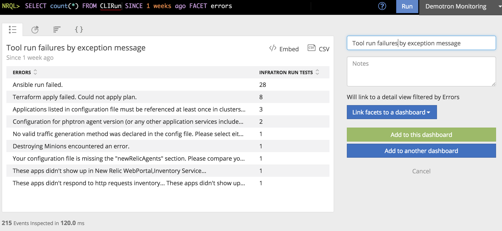

## Measure what you need by creating your own event types.

Whereas adding [custom attributes](/collect-data/custom-attributes) adds metadata to an existing event, a custom event creates an entirely new event type. Create custom events to define, visualize, and get alerts on additional data, just as you would with any data we provide from our core agents.  

Custom events can be inserted through the agent APIs or directly via the Event API. The following example shows how to send a custom event named CLIRun that tracks when a command line tool written in Ruby has its process exit due to an exception.

```ruby
# Hook into the runtime 'at_exit' event
at_exit do
  # Name the custom event
  payload = { 'eventType' => 'CLIRun' }

  # Check to see if the process is exiting due to an error
  if $!.nil? || $!.is_a?(SystemExit) && $!.success?
    payload[:status] = 0
  else
    # Gather any known errors
    errors = ""
    (Thread.current[:errors] ||= []).each do |err|
      errors += "#{err}\n"
    end
    payload[:errors] = errors
  end

  # Send the errors to New Relic as a custom event
  insights_url = URI.parse("https://insights-collector.newrelic.com/v1/accounts/YOUR_ACCOUNT_ID/events")
  headers = { "Api-Key" => "YOUR_LICENSE_KEY", "content-type" => "application/json" }

  http = Net::HTTP.new(insights_url.host, insights_url.port)
  http.use_ssl = true
  request = Net::HTTP::Post.new(insights_url.request_uri, headers)
  request.body = payload.to_json

  puts "Sending run summary to New Relic: #{payload.to_json}"
  begin
    response = http.request(request)
    puts "Response from New Relic: #{response.body}"
  rescue Exception => e
    puts "There was an error posting to New Relic. Error: #{e.inspect}"
  end
end
```
<br/>

Here, a NRQL query retrieves information about the custom event, and the result can be added to a dashboard.



```sql
SELECT count(*) FROM CLIRun FACET errors SINCE 1 week ago
```

[Learn more about custom events.](https://docs.newrelic.com/docs/insights/insights-data-sources/custom-data/introduction-event-api)
