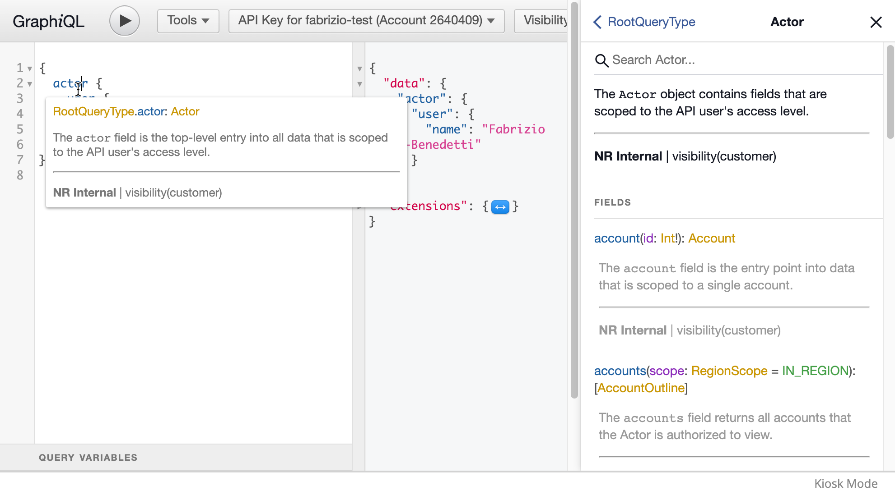
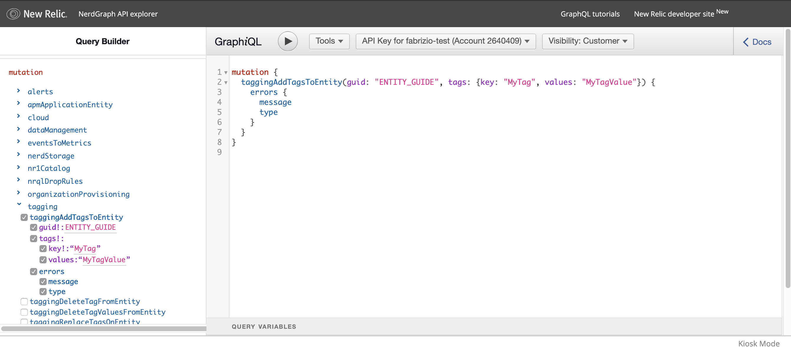

<Intro>

NerdGraph is New Relic's [GraphQL](https://graphql.org/) API. It allows you to get all the information you need in a single request.

With NerdGraph API Explorer you don't need to know the query format: using the Query Builder you can browse our entire graph and compose queries just by selecting the items you want and filling out their required values.

<Video id="oo1lbw991a" type="wistia" />

</Intro>

## Before you begin

Go to [api.newrelic.com/graphiql](https://api.newrelic.com/graphiql) and log in using your New Relic user ID and password: the NerdGraph API Explorer loads up.

Make sure you have a valid [New Relic user key](https://docs.newrelic.com/docs/apis/get-started/intro-apis/types-new-relic-api-keys#user-api-key). You can create one from the NerdGraph API Explorer or view and create them in the [API keys UI](https://one.newrelic.com/launcher/api-keys-ui.api-keys-launcher).


<Steps>
<Step>

## Build a query to retrieve your name

Time for your first NerdGraph query. Search for your name in the New Relic database:

1. Erase everything in the query editor.
2. Select the following fields in the query explorer in this order: `actor`, `user`, `name`.

This GraphQL snippet appears in the editor.

```graphql
{
  actor {
    user {
      name
    }
  }
}
```

</Step>
<Step>

## Click the play button to see the result

With this query, you're telling NerdGraph to retrieve your name. You're asking for the `name` field, which is nested within the `user` field. This refers to the user who owns the [API key](https://docs.newrelic.com/docs/apis/get-started/intro-apis/types-new-relic-api-keys#user-api-key), which in turn is nested within `actor`.

Click the **play** button to see the result: It has almost the same shape as the request. All the fields in the Query Builder make up what's called the GraphQL schema, which describes all the available data types and their attributes. To learn more about each field, click the **Docs** button, or hover over a field in the editor.



</Step><Step>

## Add more fields to your query

Now you can try adding more fields to your query. The simplest way is clicking the fields in the Query Builder: The API Explorer knows where the attributes should go in the query. In the example, you add the account `id` and `email` fields.

Once again, running the GraphQL query results in just the data you need, without over or under-fetching data. Notice that the `id` field has an argument: passing arguments is a powerful way of customizing your NerdGraph queries. Every field and object can contain arguments, so instead of running multiple queries, you just compose the one that you need.

```graphql
{
  actor {
    user {
      name
      email
    }
    account(id: 12345678)
  }
}
```

</Step><Step>

## Experiment with mutations

In GraphQL, [mutations](https://graphql.org/learn/queries/#mutations) are a way to execute queries with side effects that can alter the data by creating, updating, or deleting objects (Commonly referred to as CRUD operations in REST APIs).

Ready for your first mutation?

1. Erase what's in the editor.
2. Scroll down the Query Builder and expand `mutation`.
3. Select the fields in the following screenshot:



In this case, you're trying to add a custom tag to an entity. Notice that the editor complains if you don't select `errors`: mutations must have a way of telling you how the operation performed in the backend (failed requests result in null responses).

<Callout variant="tip">

Unlike REST, GraphQL APIs like NerdGraph can return partial responses. For example, if you try adding tags to multiple entities, some mutations can fail and others succeed; all is logged in the GraphQL response you get.

</Callout>

</Step><Step>

## Try your NerdGraph query in the terminal

Let's say that you've built a NerdGraph query you're happy with and you want to test it elsewhere. To capture code-ready queries and mutations:

1. Select the **Tools** menu.
2. Copy the query as a curl call or as a [New Relic CLI](/explore-docs/newrelic-cli) command.


```bash
# curl version
curl https://api.newrelic.com/graphql \
  -H 'Content-Type: application/json' \
  -H 'API-Key: API_KEY_REDACTED' \
  --data-binary '{"query":"{\n  actor {\n    user {\n      name\n      email\n    }\n    account(id: 12345678)\n  }\n}\n", "variables":""}'

# New Relic CLI version
newrelic nerdgraph query '{
  actor {
    user {
      name
      email
    }
    account(id: 12345678)
  }
}
'
```

</Step>
</Steps>

## Next steps

Now you know the basics of composing and testing NerdGraph queries, but how do you turn them into client or server code? Solutions such as [GraphQL Code Generator](https://graphql-code-generator.com/) can help you turn the NerdGraph queries into code for your implementation.

Try creating more complex queries by clicking fields and expanding objects in the Query Builder (be careful with mutations though, since they could write data to your account).

For more information on NerdGraph and explore other projects from the developer community, check out the [threads on the Explorer’s Hub](https://discuss.newrelic.com/search?q=nerdgraph).
