<Callout variant="course" title="lab">

This procedure is part of a lab that teaches you how to get started with New Relic to monitor your application.

Each procedure in the lab builds upon the last, so make sure you've completed the last procedure, [_Query custom Business Data_](/collect-data/monitor-your-application/query-custom-data), before starting this one.

</Callout>

With your app reporting server and browser-side performance data, you now have full visibility in your application. Happy with your current experinece, you came to know about New Relic alerts, and you've decided to add them.

With alerts, you monitor your services and receive notifications about problems that you're interested in, so that you can react fast to troubleshoot and resolve them.

## Create an alert policy

Before you set alert conditions, you must create a policy.

<Steps>

<Step>

If you're not already logged in, navigate to [New Relic](https://one.newrelic.com/), and sign in with your account.

</Step>

<Step>

From **Alerts & AI**, go to **Alert conditions (Policies)** from the left-hand navigation. Here, you see different options to create a new alert policy or browse pre-built ones.

Click **Browse pre-built alerts**.

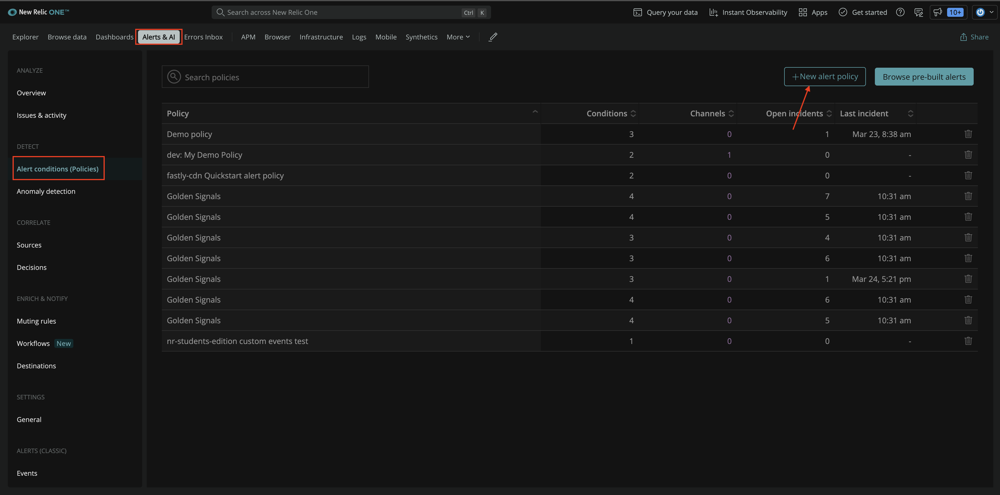

</Step>

<Step>

Under **Application monitoring**, choose **Node.js alert policy**. 

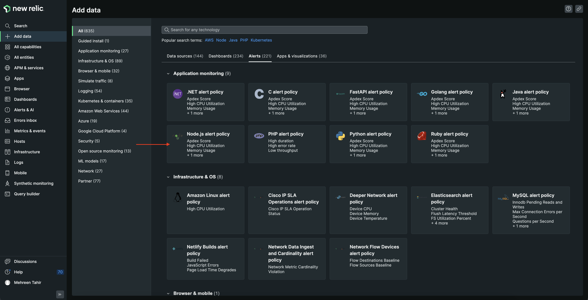

This alert policy help you monitor your Node.js applications and provide you folloiwng pre-configured alert conditions:

- High CPU Utilization
- Memory Usage
- Transaction Errors
- Apdex score 

</Step>

<Step>

On the next page, select your account from the dropdown and click **Done** since your Node.js application is already running. 


This will create your alert policy. Click **View alert policy**. 

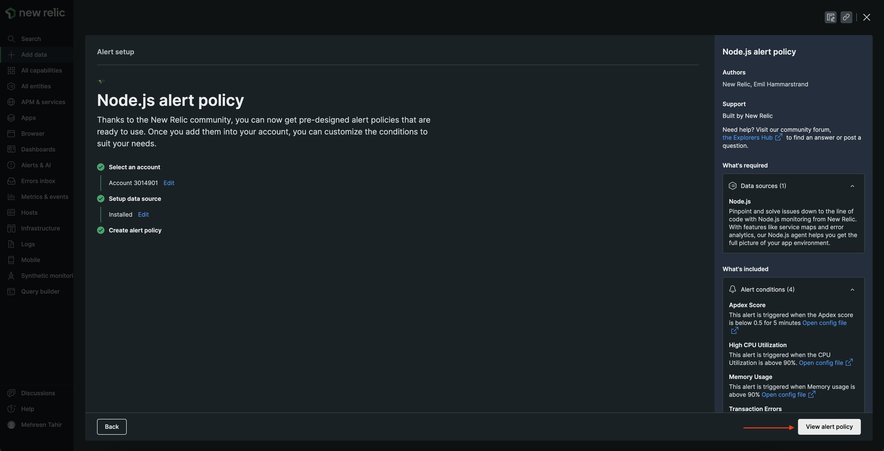

<Step>

Rename your alert policy to "Relicstaurants alert policy".

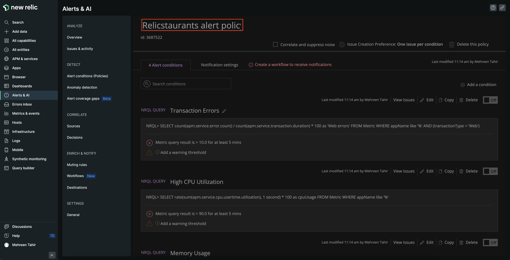

</Step>

</Step>

</Steps>

Your Relicstaurants alert policy is now setup. Next you add a custom alert condition to this policy.

## Create alert conditions

You're going to add a "High page load time" alert condition to your newly created policy. 

### Create a high page load time condition

<Steps>

<Step>

From **Alert conditions (Policies)**, click **New alert condition**.

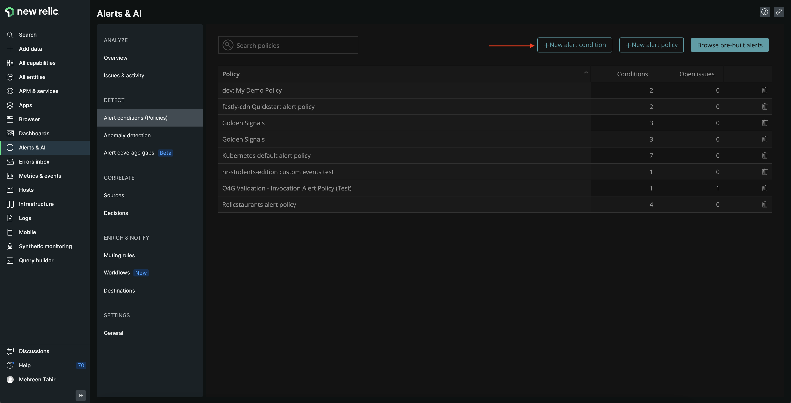

This takes you to **Create an alert condition** page where you use NRQL to define your alert condition.

<Callout variant='tip'>

NRQL is New Relic's SQL-like query language. Read our [documentation](https://docs.newrelic.com/docs/query-your-data/nrql-new-relic-query-language/get-started/introduction-nrql-new-relics-query-language/) to know more about what it is and when to use it.

</Callout>

</Step>

<Step>

Name your condition **High page load time**.

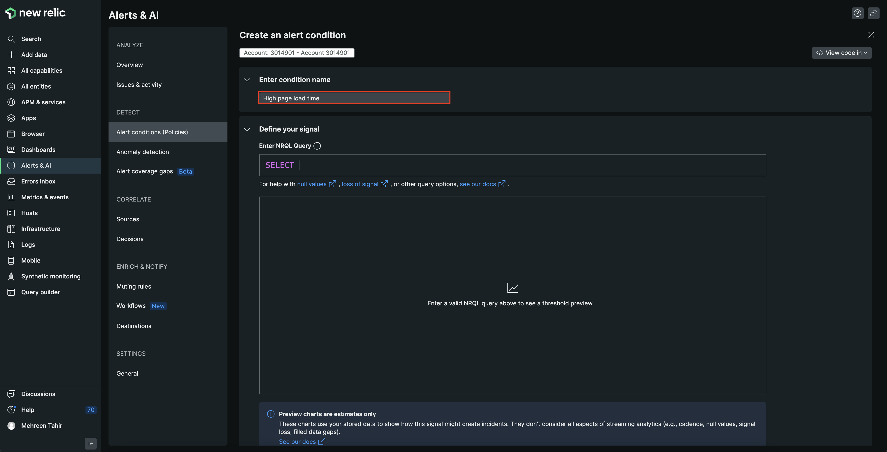

</Step>

Use the following NRQL to set up alert for high load load time. 

<>

```sql
SELECT average(duration) FROM BrowserInteraction WHERE appName='Relicstraunts'
```

</>


<Step>

You want New Relic to alert you when your page takes longer than 1.5 seconds to load at least once in 2 minutes. Scroll down to **Set your condition thresholds** to adjust thresholds.

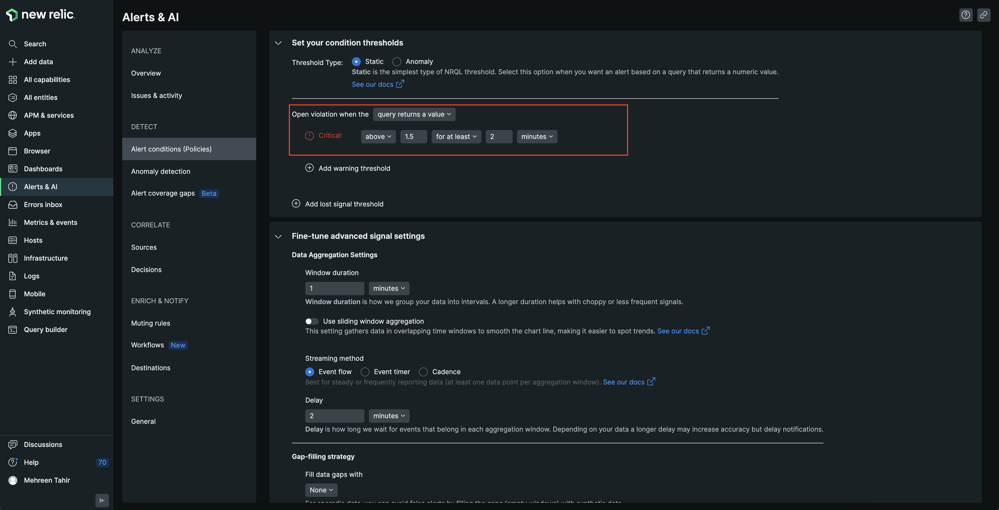

</Step>

<Step>

Under **Connect your condition to a policy**, choose "Relicstaurants alert policy" from the dropdown and click **Save condition**. 

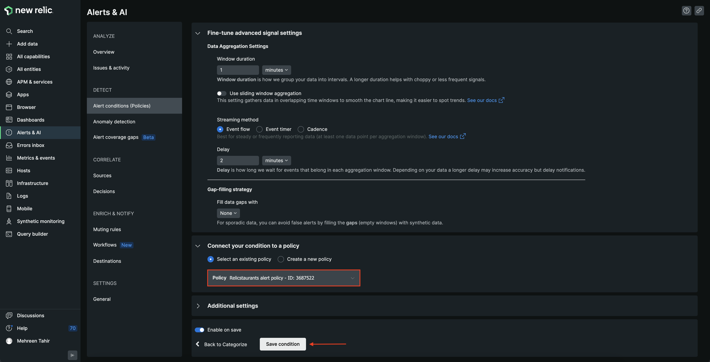

</Step>

Your "High page load time" condition is not added to existing **Relicstaurants alert policy**.

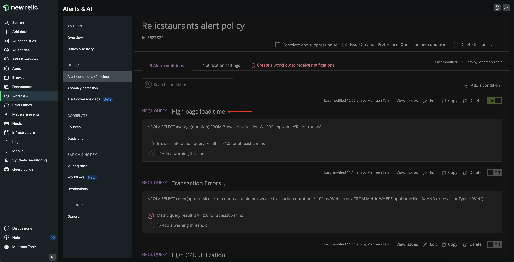

</Steps>

## Add a notification workflow

To receive notifications for any opened violations, you also need to create a notification workflow.

<Steps>

<Step>

First, move to the **Notification settings** tab, and click **Create workflow**.

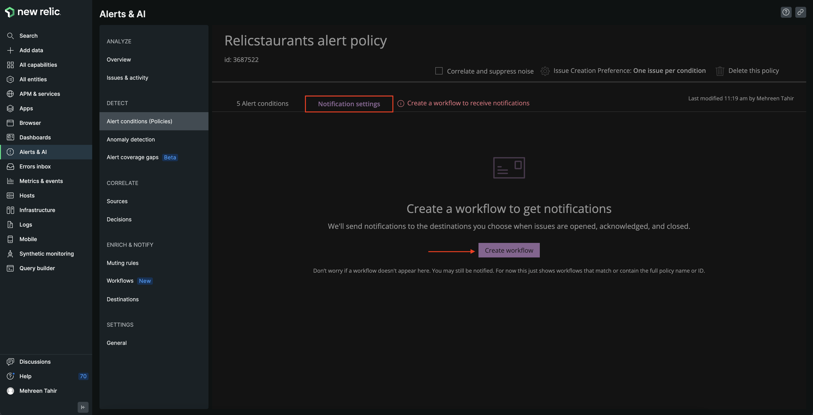

</Step>

<Step>

This takes you to **Create a new workflow to get notified** page. From the list of channel options, click Email.

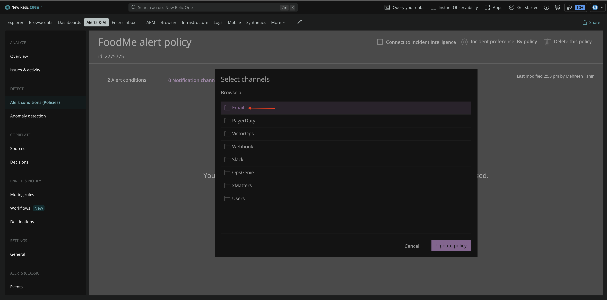

</Step>

<Step>

Enter the email you want to receive your notifications on, update the **Email subject** and click **Save**.

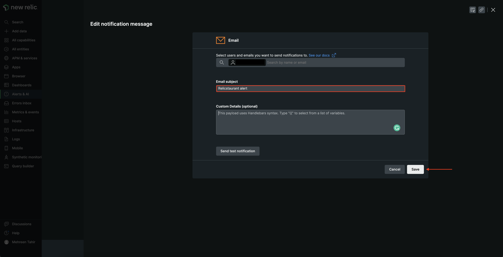

</Step>

<Step>

This takes you back to **Create a new workflow to get notified** page where you see the notification channel is now added. Next, click **Activate workflow**.

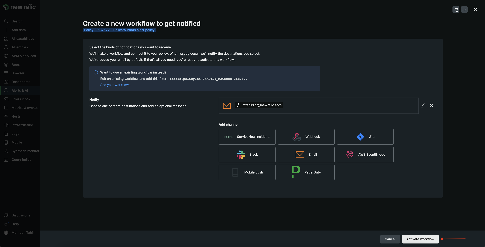

</Step>

You see the workflow under **Notification settings** now.

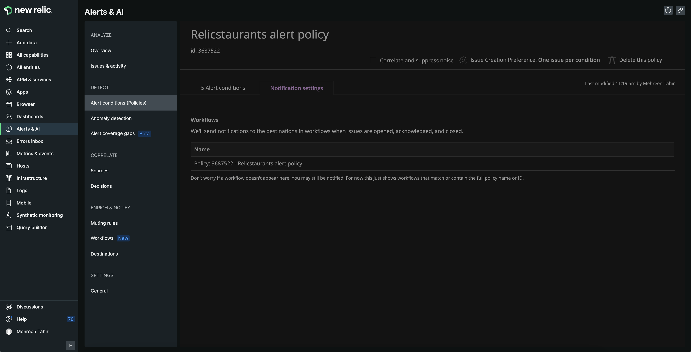

</Steps>

During this procedure, you created an alert policy and added a "high page load time" conditions to it. You also added a notification channel to receive notifications about any opened violations.

<Callout variant="course" title="lab">

This procedure is part of a lab that teaches you how to get started with New Relic to monitor your application. Now that you've set up alerts, [see your data in action](/collect-data/monitor-your-application/data-in-action).

</Callout>

