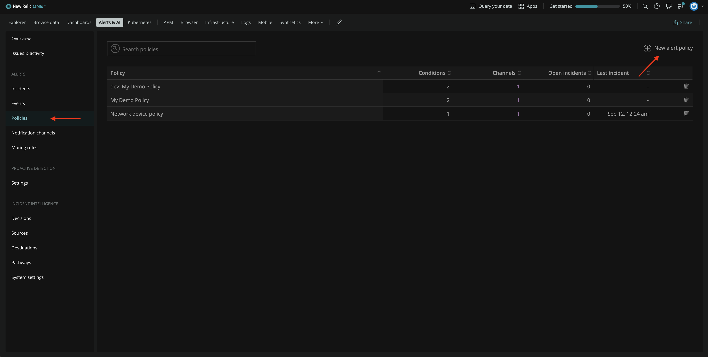
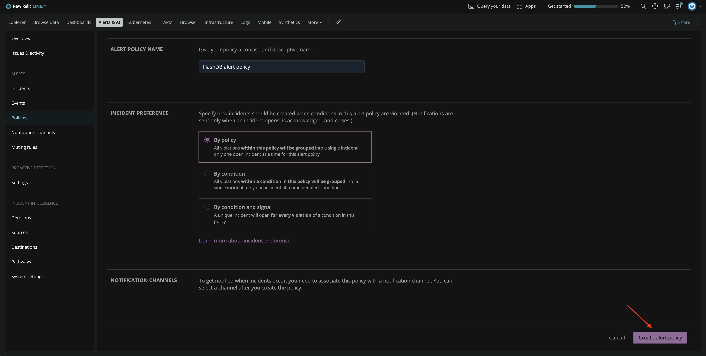

<Callout variant="course" title="lab">

This procedure is part of a lab that teaches you how to monitor your application with New Relic.

Each procedure in the lab builds upon the last, so make sure you've completed the last procedure, [_Query custom Business Data_](/collect-data/monitor-your-application/query-custom-data), before starting this one.

</Callout>

With your app reporting performance and custom business data, you now have full visibility in your application. Happy with your current experinece, you came to know about about New Relic alerts and you decided to add them. 

With New Relic alerts, you monitor your services and receive notifications about problems that you're interested in, so you can react fast to troubleshoot and resolve them.

## Create an alert policy

Before you set alert conditions, you must create a policy. 

From **Alert & AI**, go to the **Alerts** section and click **Policies** from left-hand navigation. Then, click **New alert policy**.

Name your policy FlashDB alert policy. Use the default values for the rest of the fields and click **Create alert policy**.

The next step is to add conditions to the alert policy. 

## Create alert conditions

You're going to add the following alert conditions:
- slow read responses
- low cache hit ratio

### Create a high response time alert condition

Under **FlashDB alert policy**, click **Create a condition**.