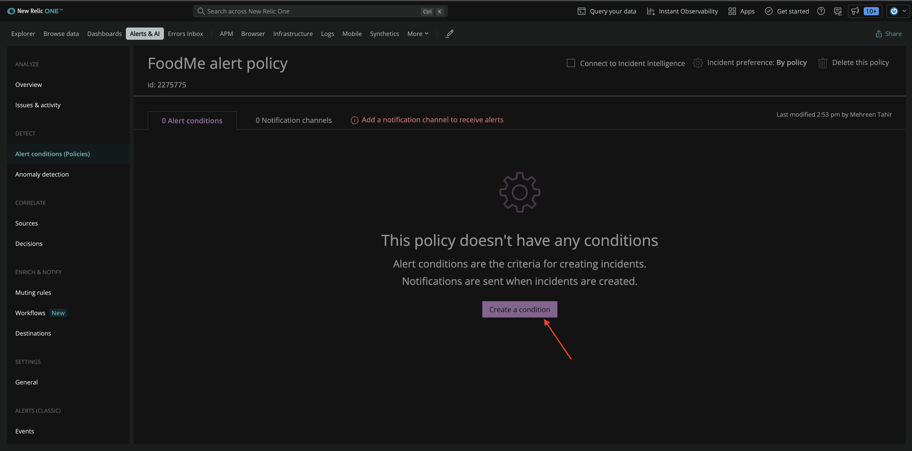
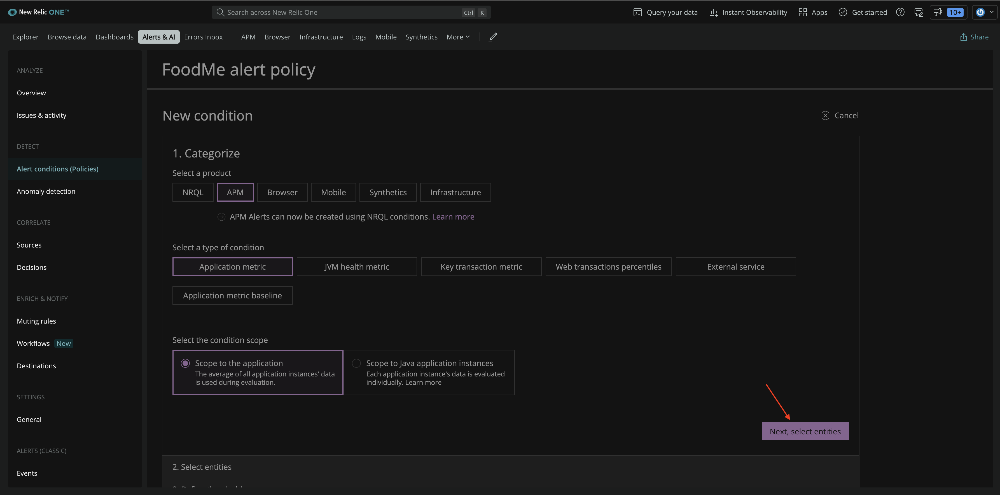
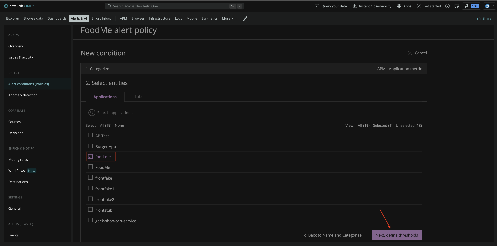
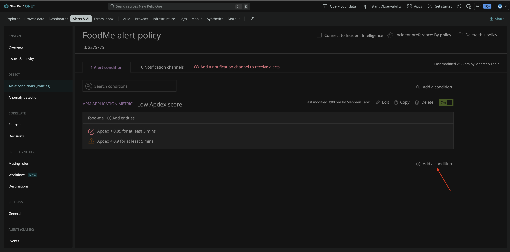
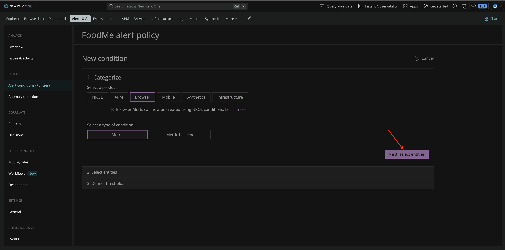
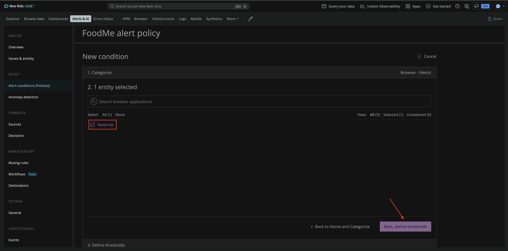
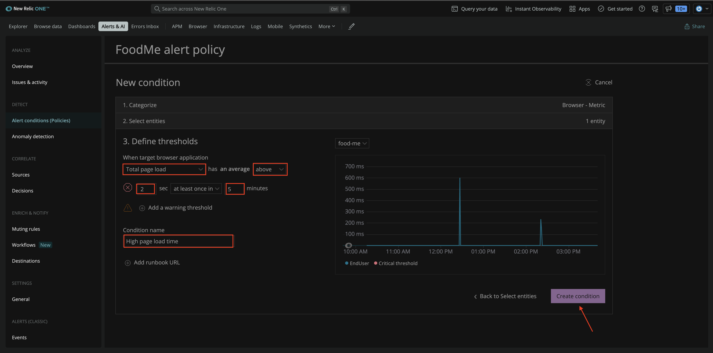
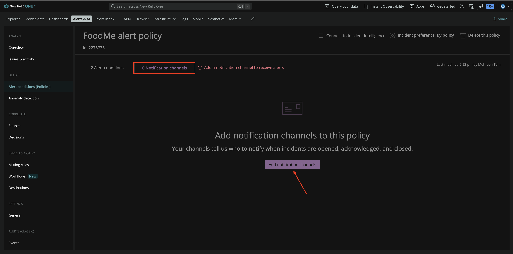
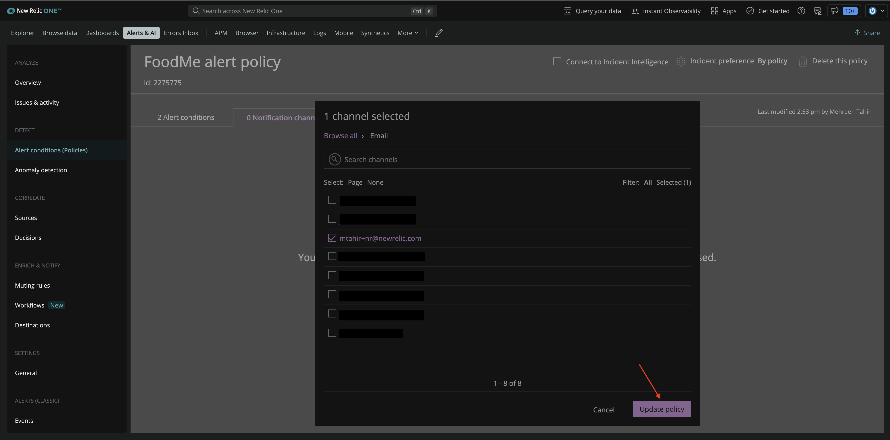

<Callout variant="course" title="lab">

This procedure is part of a lab that teaches you how to monitor your application with New Relic.

Each procedure in the lab builds upon the last, so make sure you've completed the last procedure, [_Query custom Business Data_](/collect-data/monitor-your-application/query-custom-data), before starting this one.

</Callout>

With your app reporting performance and custom business data, you now have full visibility in your application. Happy with your current experinece, you came to know about New Relic alerts and you decided to add them. 

With New Relic alerts, you monitor your services and receive notifications about problems that you're interested in, so you can react fast to troubleshoot and resolve them.

## Create an alert policy

Before you set alert conditions, you must create a policy. 

From **Alert & AI**, go to the **Alert conditions (Policies)** from left-hand navigation. Then, click **New alert policy**.

Name your policy "FoodME alert policy" alert policy. Use the default values for the rest of the fields and click **Create alert policy** at the end of the page.

The next step is to add conditions to the alert policy. 

## Create alert conditions

You're going to add the following alert conditions:
- low Apdex score
- high page load time

### Create a low Apdex score alert condition

Under **FoodMe alert policy**, click **Create a condition**.

Here, select **APM** > **Application metric** and **Scope to the application**. Then, click **Next, select entities**.

Under **Select entities**, select **food-me** application and click **Next, define thresholds**.

You want to be notified when your application's Apdex score is below 0.85 for 5 minutes. Adjust threshold and name your condition **Low Apdex score**.

You also add a warning threshold of 0.9 and click **Create condition**. 

You now find this alert condition under FoodMe alert policy. 

### Create a high page load time condition 

Add another condition under the same policy by clicking **Add a condition**.

Here, select **Browser** > **Metric** and click **Next, select entities**.

Under **Select entities**, select **food-me** application and click **Next, define thresholds**.

You want New Relic to alert you when your page load takes longer than 2 sec at least once in 5 minutes. 
Adjust threshold and name your condition **High page load time**. Then, click **Create conditions**.

## Add a notification channel

To receive notifications for any opened violations, you also need to add a notification channel. 

First, move to the **Notification channels** tab and click **Add notification channels**.

From the list of channel options, click Email.

Select the email you want to receive your notifications on, and click **Update policy**.

Notification channel is now added.

## Summary

During this procedure, you created FoodMe alert policy and added "low Apdex score" and "high page load time" conditions to it. You also added a notification channel to receive notifications about any opened violations.

## Homework

Well done! Now that you've gotten a jump start with New Relic to monitor your application, here are some docs that will help you along your journey.
- [Introduction to APM](https://docs.newrelic.com/docs/apm/new-relic-apm/getting-started/introduction-apm)
- [Introduction to browser monitoring](https://docs.newrelic.com/docs/browser/browser-monitoring/getting-started/introduction-browser-monitoring)
- [Introduction to alerts and applied intelligence](https://docs.newrelic.com/docs/alerts-applied-intelligence/overview)