<Callout variant="course" title="lab">

This procedure is part of a lab that teaches you how to get started with New Relic to monitor your application.

Each procedure in the lab builds upon the last, so make sure you've completed the last procedure, [_add alerts_](/collect-data/monitor-your-application/add-alerts), before starting this one.

</Callout>

With your app reporting data to New Relic, you want to get insights into your app. 

In this procesure, you learn how New Relic helps you triage any performance degradation in your application. Specifically you:

- Triage errors across your stack with errors inbox 
- Track performance fluctuation with New Relic alerts

## Triage errors across your stack with errors inbox 

Errors inbox is a single place to proactively detect and triage errors from across your stack. This helps you resolve errors faster before they impact your customers. 

After [instrumenting your application with APM](/collect-data/monitor-your-application/install-apm), you noticed that your application is reporting errors.

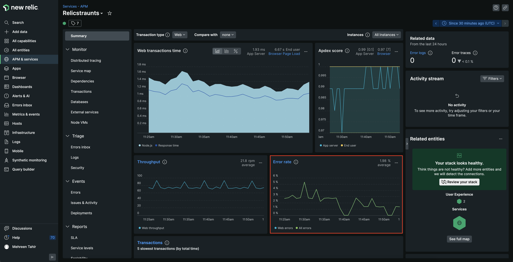

In this procedure, you use errors inbox to triage these errors.

<Steps>

<Step>

Navigate to [New Relic](https://one.newrelic.com/), Select **APM & services** and choose **Relicstaurants**. Here, notice that you're still getting errors.

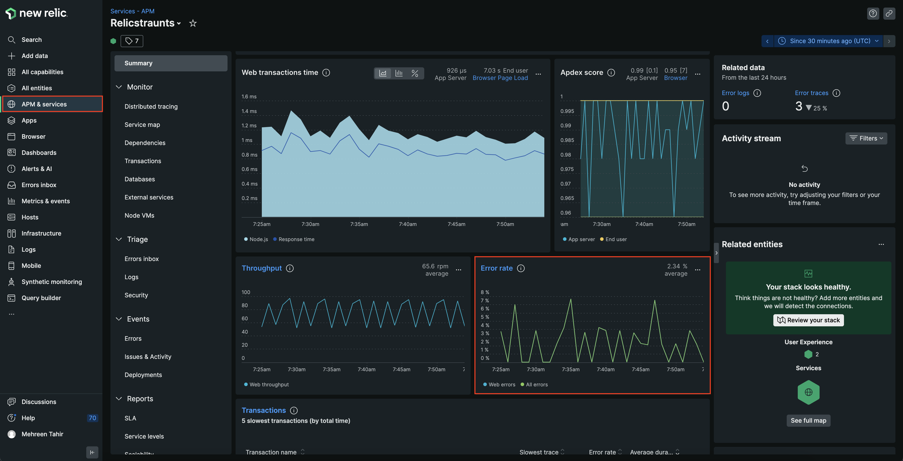

</Step>

<Step>

To take a more closer look on the errors and triage them, select **Errors inbox**.

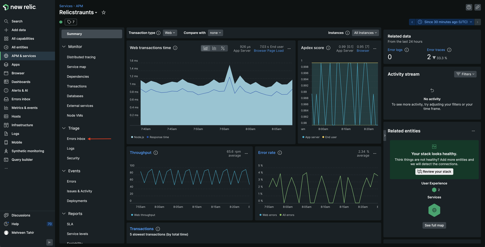

</Step>

<Step>

Here, you see all the errors being reported from your application. 

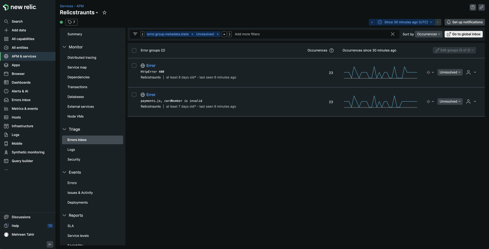

</Step>

<Step>

Click on **payments.js, cardNumber is invalid** error.

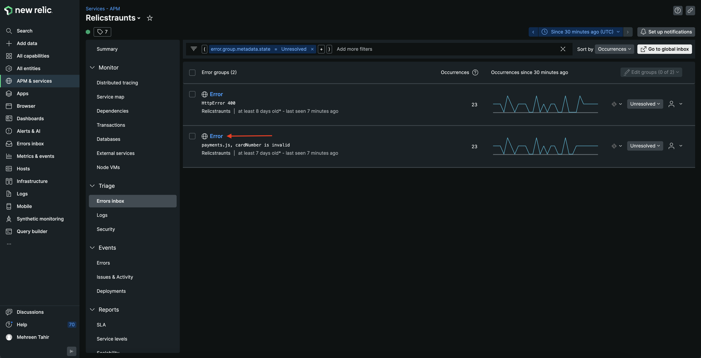

This takes you to its details page.

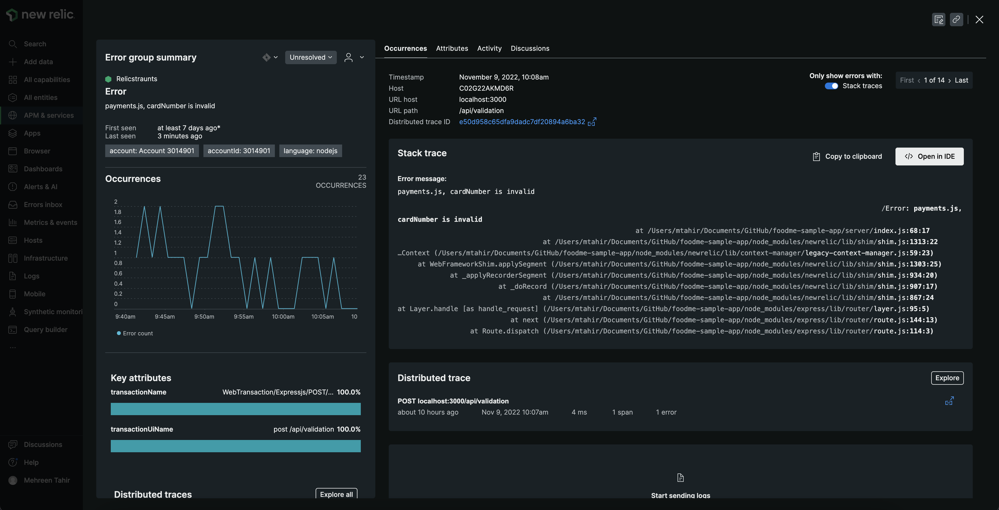

Here, you see the error's full context, including its stack trace, distributed trace and the number of times it occurred. The stack trace and distributed trace is especially important since it helps you narrow down the cause of the problem.

</Step>

<Step>

Observe the stack trace. It tells you that something is wrong in your payment service.

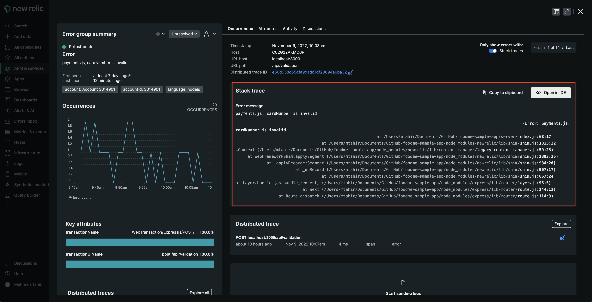

Specifically, you're getting **cardNumber is invalid** error.

</Step>

<Step>

In the top right corner of **Distributed trace**, click **Explore**.

This takes you to its details page.

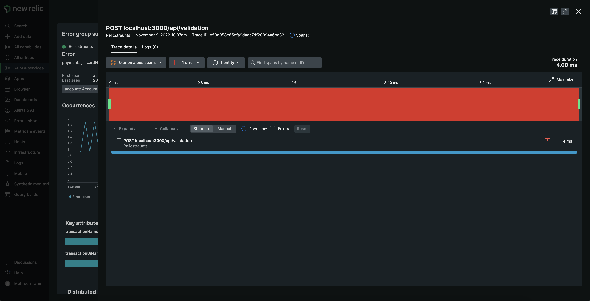

To see the distributed trace of error, check the **Focus on errors**. 

This shows that you're getting a 400 when validating the card which translates into invalid cardNumber error.

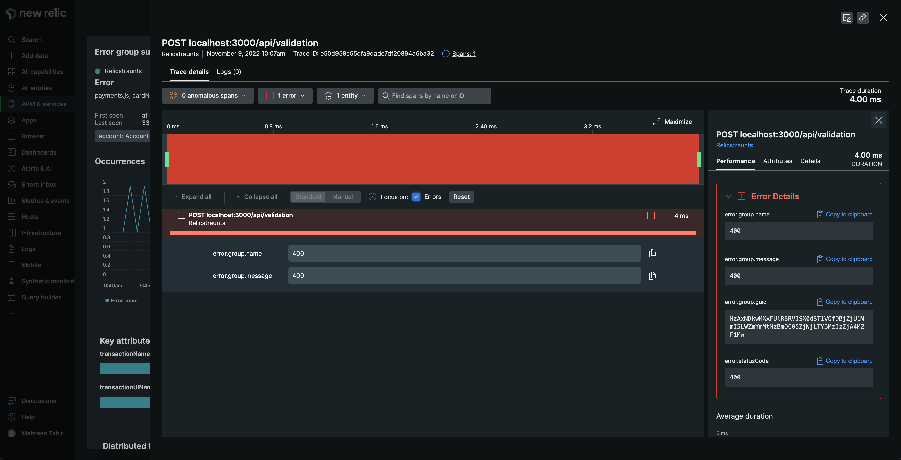

If this were a real-world application, you could use details from this view and stack trace to fix the issue. However, in this procedure you're focused on using Errors Inbox, so you can assign this error to yourself to resolve it later.

</Step>

<Step>

Navigate to the **Errors inbox** page. On the far right side of the error group, click the user icon.

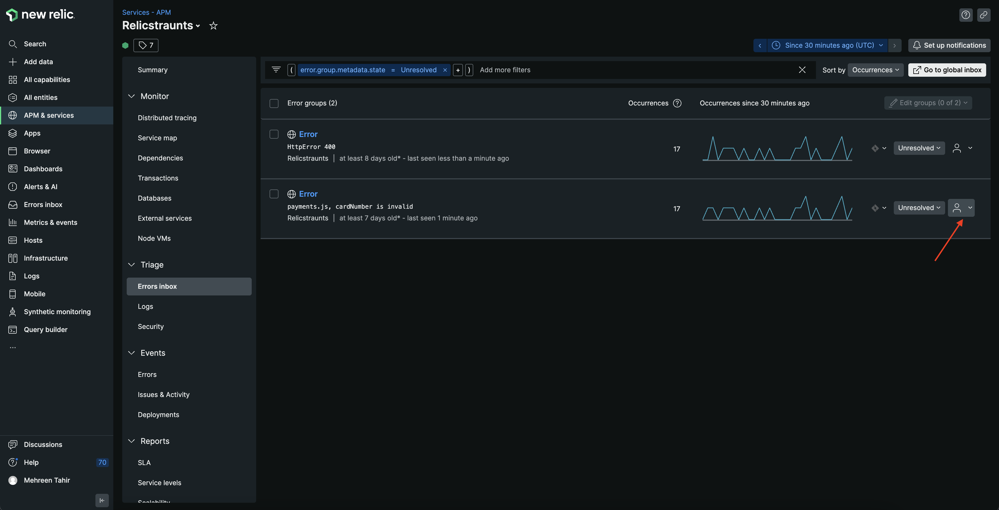

</Step>

<Step>

Enter and submit your email address.

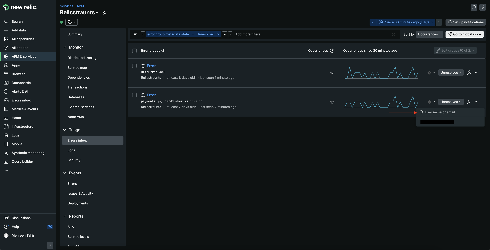

This tells your team that you're responsible for resolving the error.

</Step>

</Steps>

You've triaged the **payment.js cardNumber is invalid** error. You can do the same for a few others as well. After ignoring, resolving, and assigning errors, your inbox is looking a lot cleaner than when you first saw it. Next, you filter your inbox and integrate it with other services so you can find, prioritize, and fix the errors that need fixing before you release your app to the world.

## Track performance fluctuation with New Relic alerts

While triaging the error in errors inbox, you received a notification from New Relic alerting you about the performance fluctuation in your app. Specially, it triggered the **High page load time** alert.
Now you want to investigate what caused the alert to trigger.

<Steps>

<Step>

Navigate to [New Relic](https://one.newrelic.com/), Select **Browser** and choose **Relicstaurants**. Here, notice the **Activity stream**. 

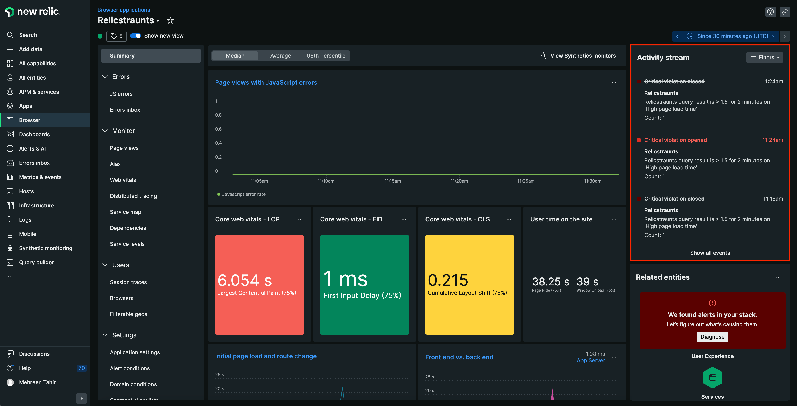

</Step>

<Step>

Click the opened violation to see it's details.

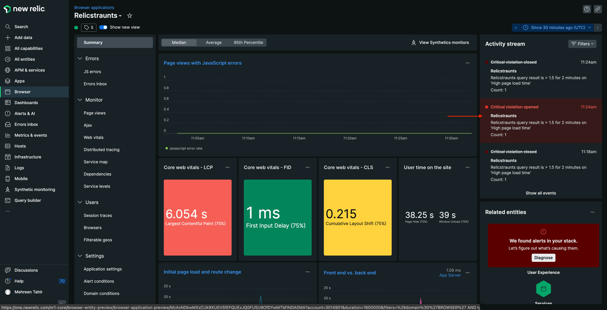

This takes you to the detail page of critical violation.

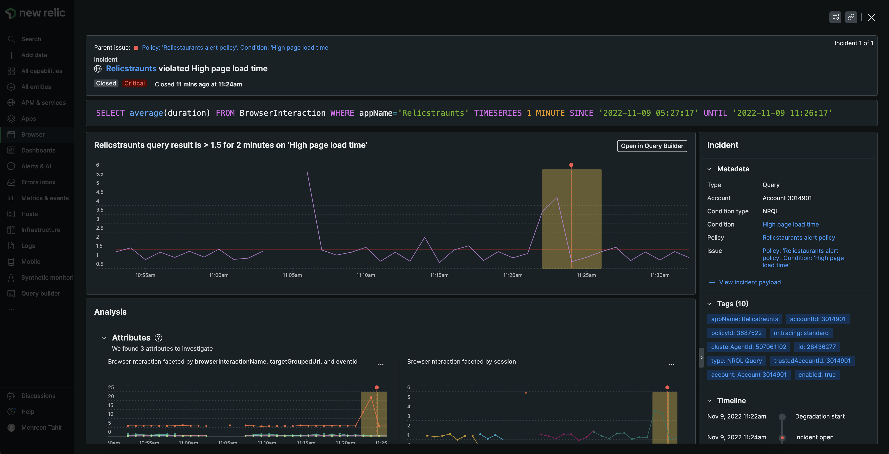

Here, you see details of the opened critical violation including the time period during which it was active. 

</Step>

<Step>

To diagnose what caused the alrt, navigate back to Relicstaurants browser application page. Here, click **Diagnose**.

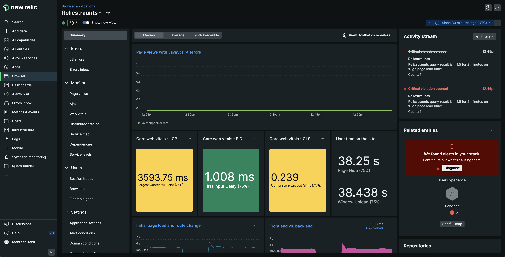

This shows you a unique view that help you diagnose what caused the alert.

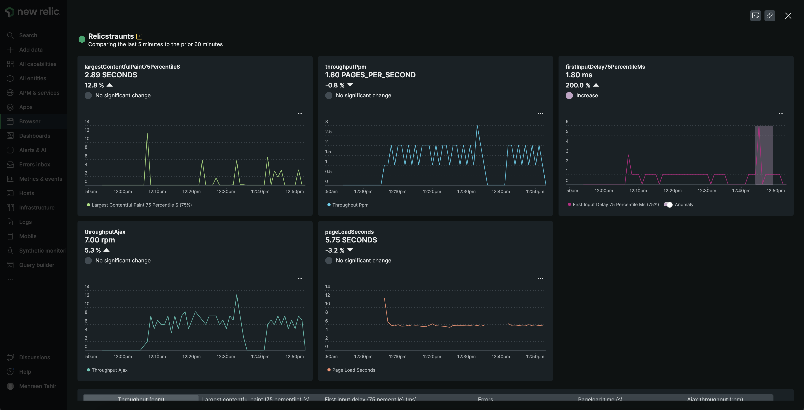

Here, you see that **firstInputDelay75PercentileMs** shows the anomaly. It means that your root page is taking quite long to load causing a delay for user's first interaction with your site. 

</Step>

If this were a real-world application, you could use the above diagnostics to fix the issue. However, in this procedure you're focused on alert, so you can skip this step.

</Steps>

In this procedure, you used New Relic to track your application's performance. Specifically, you used errors inbox and New Relic alerts to diagnose the problems with your application. 

## Optional

Next, you use New Relic to explore your data.

<Callout variant="course" title="lab">

This procedure is part of a lab that teaches you how to get started with New Relic to monitor your application. At this point, you're already tracking the performance of your application. Next, [explore your data in New Relic](/collect-data/monitor-your-application/explore-your-data).

</Callout>