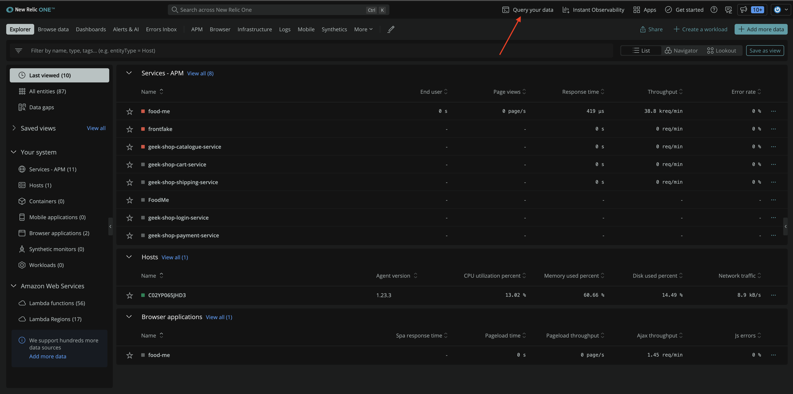
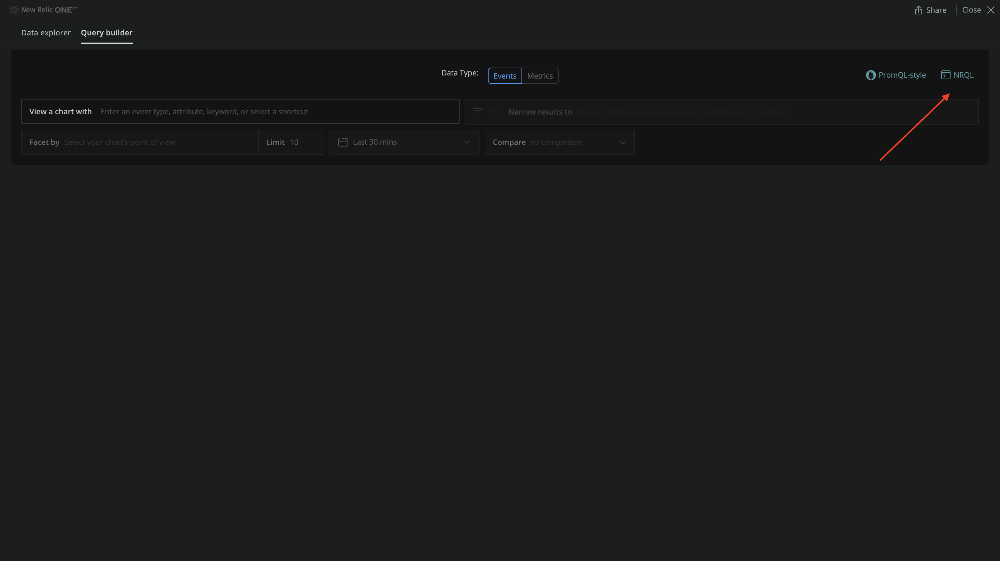
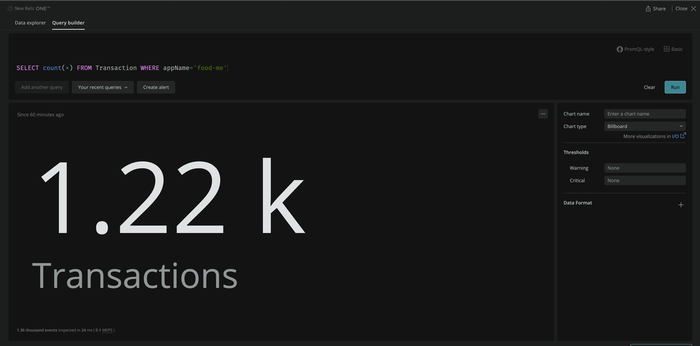
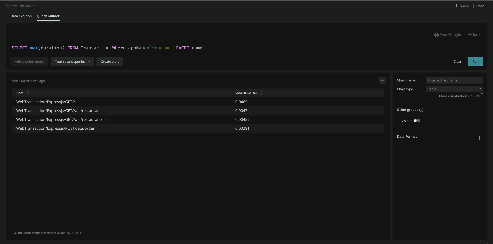
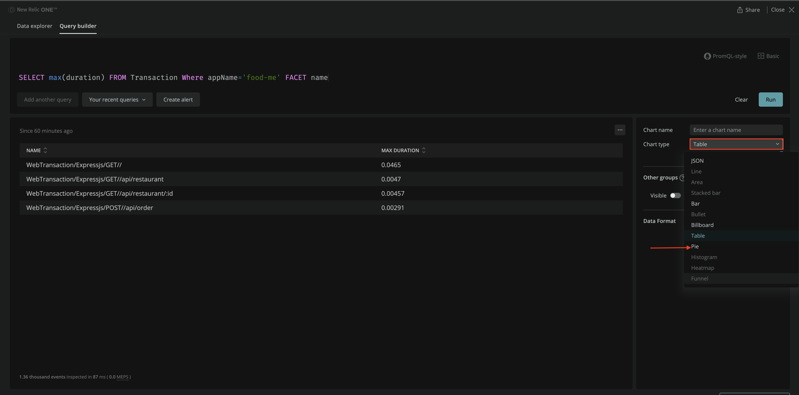
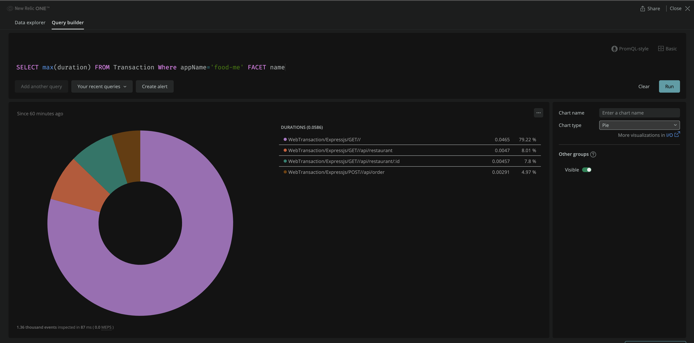
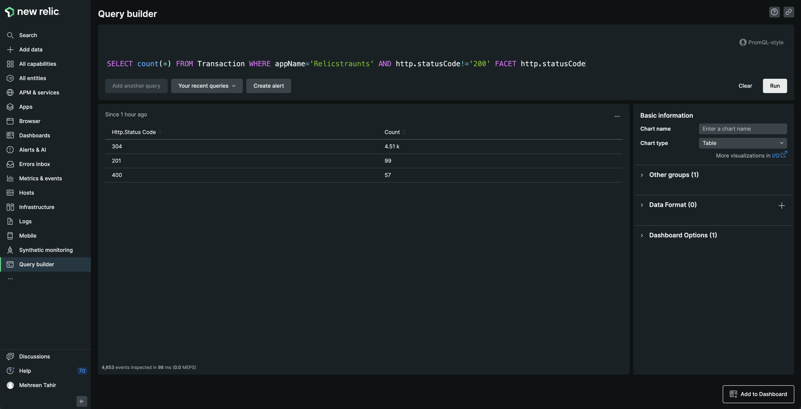

<Callout variant="course" title="lab">

This procedure is part of a lab that teaches you how to monitor your application with New Relic.

Each procedure in the lab builds upon the last, so make sure you've completed the last procedure, [_instrument your application with our browser agent_](/collect-data/monitor-your-application/install-browser-agent), before starting this one.

</Callout>

With your app reporting data to New Relic, you want to understand the collected data and get insights into your app. For example, you want to know how many users are active on your site. For that, you explore your data using [NRQL](https://docs.newrelic.com/docs/query-your-data/nrql-new-relic-query-language/get-started/introduction-nrql-new-relics-query-language/), New Relic's query language; gather it; and visualize it in interactive charts.

In this procedure, you explore your data in New Relic. Specifically, you:

- View your page views
- Count active sessions
- View your transactions
- Count total transactions
- View your slowest transactions
- Count your transactions with different response codes

## Query your data

Use NRQL to explore and retrieve detailed New Relic data and get insights into your application.

<Callout variant='tip'>

NRQL is New Relic's SQL-like query language. Read our [documentation](https://docs.newrelic.com/docs/query-your-data/nrql-new-relic-query-language/get-started/introduction-nrql-new-relics-query-language/) to know more about what it is and when to use it.

</Callout>

### View your pageviews

<Steps>

<Step>

Navigate to [New Relic](https://one.newrelic.com/) and sign in with your account. On the top navigation bar, click **Query your data**.



This opens an interactive **Query builder** to explore your data.

</Step>

<Step>

Click **NRQL** to use a custom query.



</Step>

<Step>

Execute the following query to view `PageView` records for your app.

<>

```sql
SELECT * FROM PageView WHERE appName='food-me'
```

</>

Click **Run** to see results.


Here, you observe all the pageviews for your app.

### Count active sessions

Use the following query to count your active sessions.

<>

```sql
FROM PageView SELECT count(session) WHERE appName='food-me'
```

</>

Here, you see the number of active sessions.


### View your transactions

Use the following query to view all your transactions.

<>

```sql
SELECT * FROM Transaction WHERE appName='food-me'
```

</>

Here, you see all your transactions for food-me app.


### Count total transactions

Use the following query to count your total transactions.

<>

```sql
SELECT count(*) FROM Transaction WHERE appName='food-me'
```

</>

Here, you see the total number of transactions for your food-me app.



### View slowest transactions

Execute the following query to view your slowest transactions.

<>

```sql
SELECT max(duration) FROM Transaction Where appName='food-me' FACET name
```

</>

Here, you see your slowest transactions.



The chart is hard to see in this format. You can choose to present your results in different formats such as table, billboard, or pie chart.

Change the chart type to **Pie**.



Now, you see your slowest transaction in the form of a pie chart.



### Count your transactions with different response codes

Use the following query to view all your transactions with different response codes.

<>

```sql
SELECT count(*) FROM Transaction WHERE http.statusCode!='200' FACET http.statusCode
```

</>



</Step>

</Steps>

You've now seen your application's performance data. Next, you collect custom business data from your application.

<Callout variant="course" title="lab">

This procedure is part of a lab that teaches you how to monitor your application with New Relic. Now that you've explored your application's performance related data, [collect custom business data from your application](/collect-data/monitor-your-application/collect-custom-data).

</Callout>
