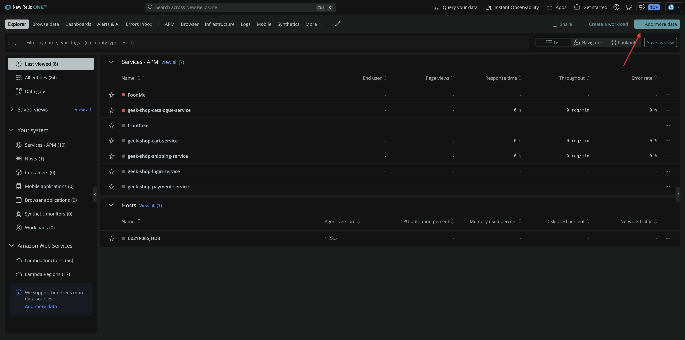
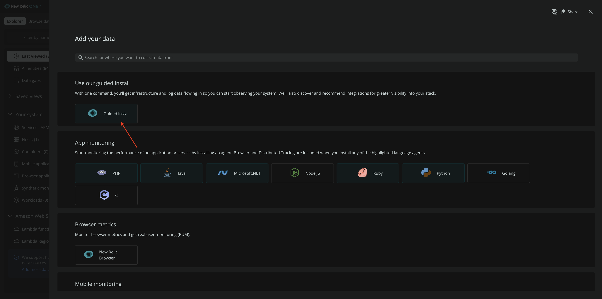
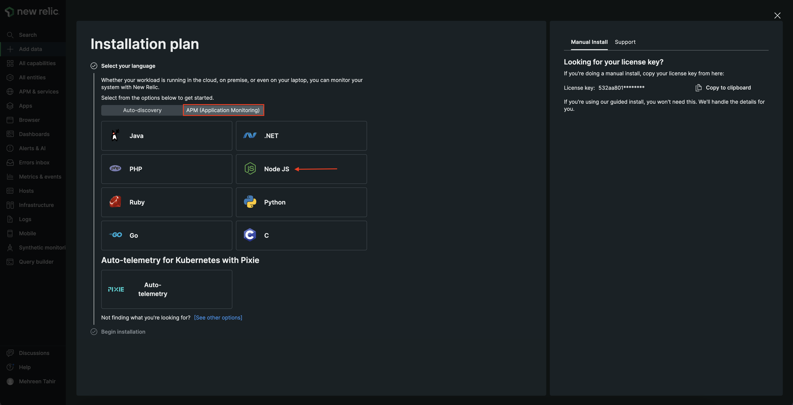
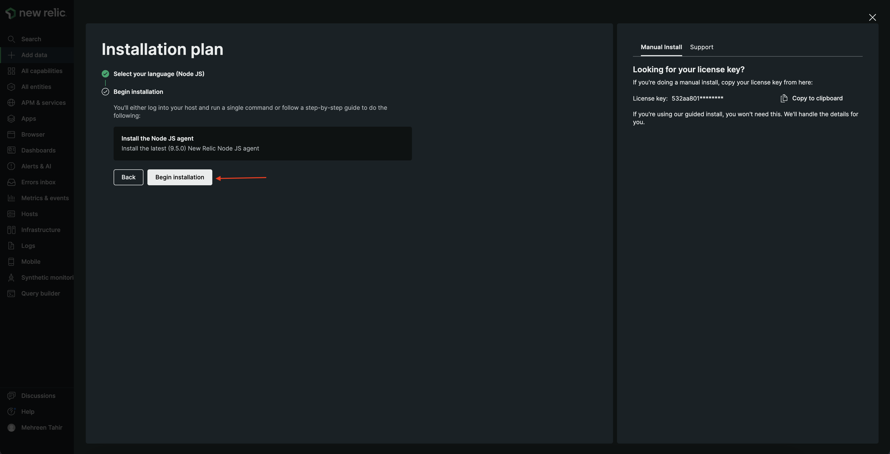
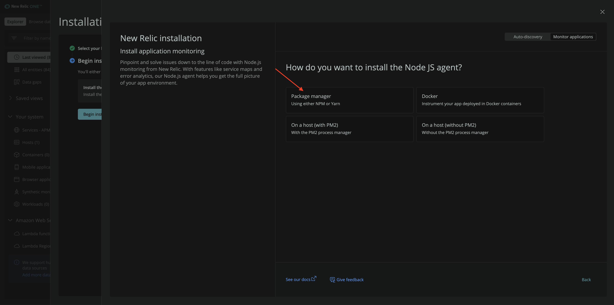
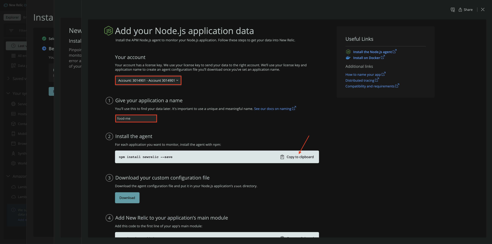
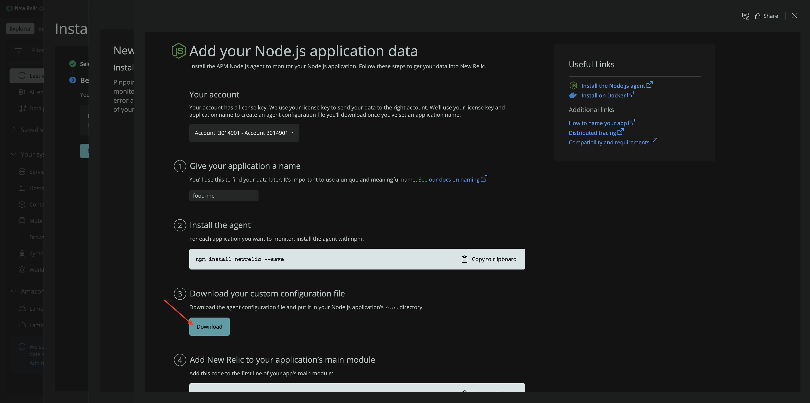
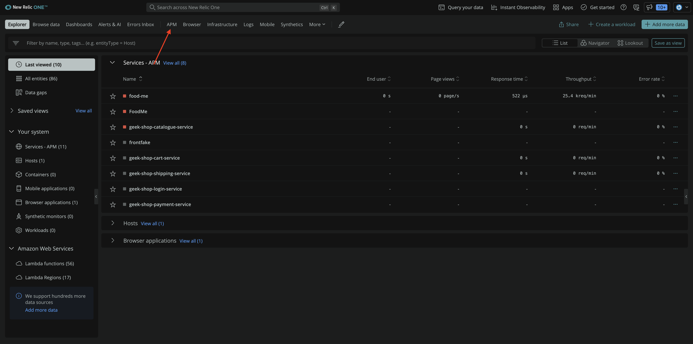
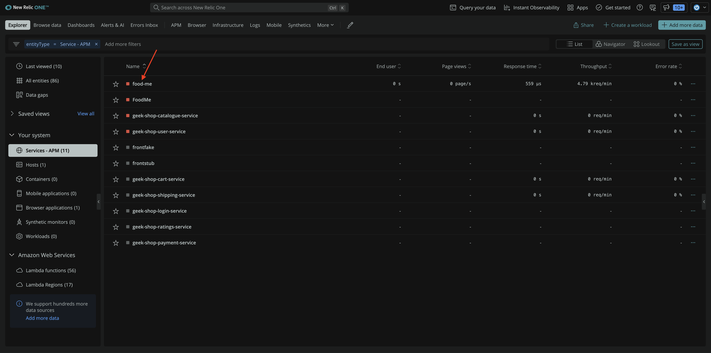
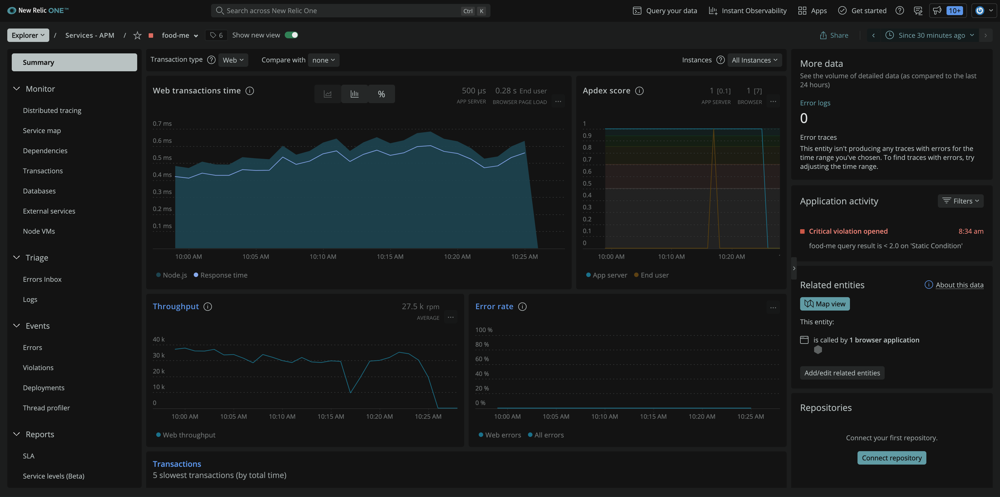

<Callout variant="course" title="lab">

This procedure is part of a lab that teaches you how to monitor your application with New Relic.

Each procedure in the lab builds upon the last, so make sure you've completed the last procedure, [_Set up your lab environment_](/collect-data/monitor-your-application/set-up-env), before starting this one.

</Callout>

In this procedure, you instrument your app with New Relic to start monitoring its behaviors and performance.

Specifically, you use our guided install to collect [application performance monitoring (APM)](https://docs.newrelic.com/docs/apm/new-relic-apm/getting-started/introduction-apm/) data and send it to New Relic so you can analyze it later.

## Install Javascript APM agent

<Steps>

<Step>

Navigate to [New Relic](https://one.newrelic.com/), and sign in with your account.

</Step>

<Step>

On the right side of the upper navigation bar, click **Add more data**.



</Step>

<Step>

Click **Guided install**.



This walks you through the installation process.

</Step>

<Step>

Select **APM (Application Monitoring)**, and click **Node JS**.



</Step>

<Step>

Click **Begin installation**.



</Step>

<Step>

Select **Package manager**.



This guides you through instrumenting your application with our Node JS agent using [npm](https://www.npmjs.com/).

</Step>

<Step>

Select your account, name your application "food-me", and copy the **Install the agent** command to your clipboard.



</Step>

<Step>

Open a terminal window and execute the **Install the agent** command in the root directory of your application.

<>

```bash
npm install newrelic --save
[output] added 58 packages, and audited 124 packages in 7s
[output] 6 packages are looking for funding
[output]     run `npm fund` for details
[output] found {green}0{plain} vulnerabilities
```

</>

</Step>

<Step>

Download your custom config file from New Relic.



This downloads the agent configuration file for your application. Put this file in the root directory of your app.

</Step>

<Step>

In your app code, update _server/index.js_ to add New Relic to your application.

<>

``` node lineHighlight=1 fileName=server/index.js
require('newrelic');
var express = require('express');
var fs = require('fs');
var open = require('open');

var RestaurantRecord = require('./model').Restaurant;
var MemoryStorage = require('./storage').Memory;

var API_URL = '/api/restaurant';
var API_URL_ID = API_URL + '/:id';
var API_URL_ORDER = '/api/order';

var removeMenuItems = function(restaurant) {
  var clone = {};

  Object.getOwnPropertyNames(restaurant).forEach(function(key) {
    if (key !== 'menuItems') {
      clone[key] = restaurant[key];
    }
  });

  return clone;
};


exports.start = function(PORT, STATIC_DIR, DATA_FILE, TEST_DIR) {
  var app = express();
  var storage = new MemoryStorage();

  // serve static files for demo client
  app.use(express.static(STATIC_DIR));


  // API
  app.get(API_URL, function(req, res, next) {
    res.status(200).send(storage.getAll().map(removeMenuItems))
  });


  app.post(API_URL, function(req, res, next) {
    var restaurant = new RestaurantRecord(req.body);
    var errors = [];

    if (restaurant.validate(errors)) {
      storage.add(restaurant);
      return res.status(201).send(restaurant);
    }

    return res.status(400).send({error: errors});
  });

  app.post(API_URL_ORDER, function(req, res, next) {
    console.log(req.body)
    return res.status(201).send({ orderId: Date.now()});
  });


  app.get(API_URL_ID, function(req, res, next) {
    var restaurant = storage.getById(req.params.id);

    if (restaurant) {
      return res.status(200).send(restaurant);
    }

    return res.status(400).send({error: 'No restaurant with id "' + req.params.id + '"!'});
  });


  app.put(API_URL_ID, function(req, res, next) {
    var restaurant = storage.getById(req.params.id);
    var errors = [];

    if (restaurant) {
      restaurant.update(req.body);
      return res.status(200).send(restaurant);
    }

    restaurant = new RestaurantRecord(req.body);
    if (restaurant.validate(errors)) {
      storage.add(restaurant);
      return res.status(201).send(restaurant);
    }

    return res.status(400).send({error: errors});
  });


  app.delete(API_URL_ID, function(req, res, next) {
    if (storage.deleteById(req.params.id)) {
      return res.status(204).send(null);
    }

    return res.status(400).send({error: 'No restaurant with id "' + req.params.id + '"!'});
  });


  // only for running e2e tests
  app.use('/test/', express.static(TEST_DIR));


  // start the server
  // read the data from json and start the server
  fs.readFile(DATA_FILE, function(err, data) {
    JSON.parse(data).forEach(function(restaurant) {
      storage.add(new RestaurantRecord(restaurant));
    });

    app.listen(PORT, function() {
      open('http://localhost:' + PORT + '/');
      // console.log('Go to http://localhost:' + PORT + '/');
    });
  });


  // Windows and Node.js before 0.8.9 would crash
  // https://github.com/joyent/node/issues/1553
  try {
    process.on('SIGINT', function() {
      // save the storage back to the json file
      fs.writeFile(DATA_FILE, JSON.stringify(storage.getAll()), function() {
        process.exit(0);
      });
    });
  } catch (e) {}

};


```

</>

That's it! Your application is now instrumented with our APM agent.

</Step>

</Steps>

## Restart your application

Now that you've instrumented your application, it's time to restart your local server.

<>

```bash
node ./server/start.js
[output] Go to http://localhost:3000/
```

</>

Place a few orders to generate traffic.

## View your data

Your app is now sending data to New Relic. Check it out!

<Steps>

<Step>

Navigate to [New Relic](https://one.newrelic.com/), and select **APM** from top navigation.



</Step>

<Step>

Select **food-me**.



Here, you see your **Web transaction time**, **Apdex score**, **Throughput**, and other performance data from your app.



</Step>

</Steps>

You've instrumented your application to send APM data to New Relic using our Node JS agent. You also saw your data in the platform. Now, it's time to instrument your application with our [browser agent](https://docs.newrelic.com/docs/browser/browser-monitoring/getting-started/introduction-browser-monitoring/).

In the terminal window that's running your application, press `<CTRL-C>` to shut down your application. With your app shut down, you'll be able to update your code to introduce monitoring tools.

<Callout variant="course" title="lab">

This procedure is part of a lab that teaches you how to monitor your application with New Relic. Now that you've instrumented your application with our APM agent, [instrument your application with our browser agent](/collect-data/monitor-your-application/install-browser-agent).

</Callout>