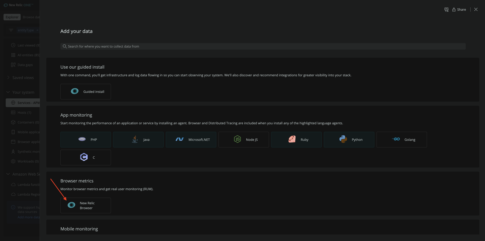
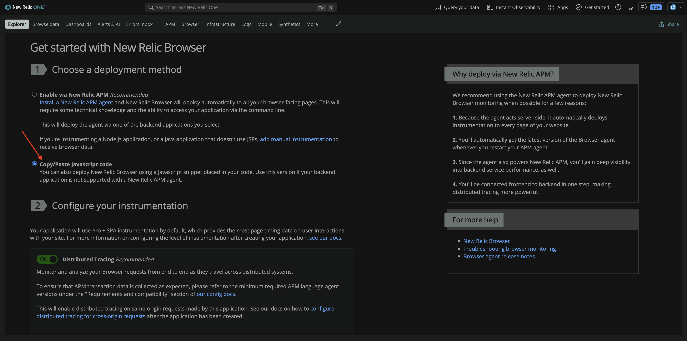
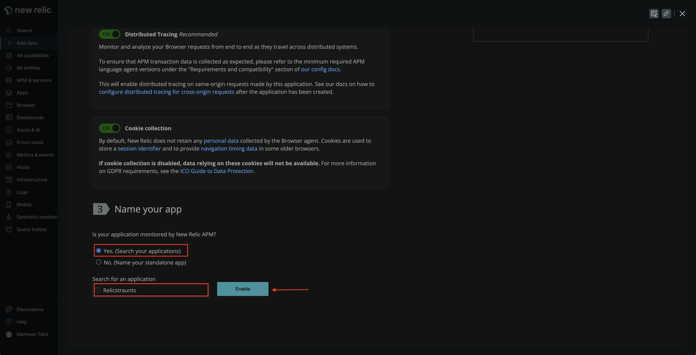
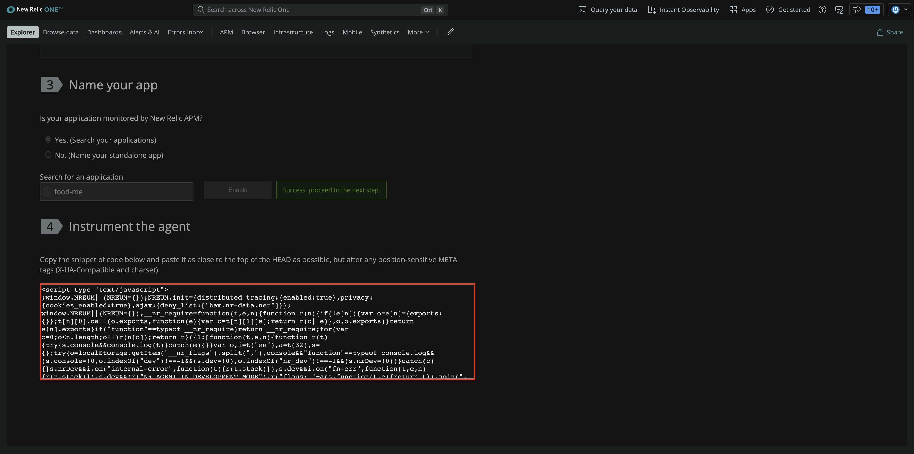
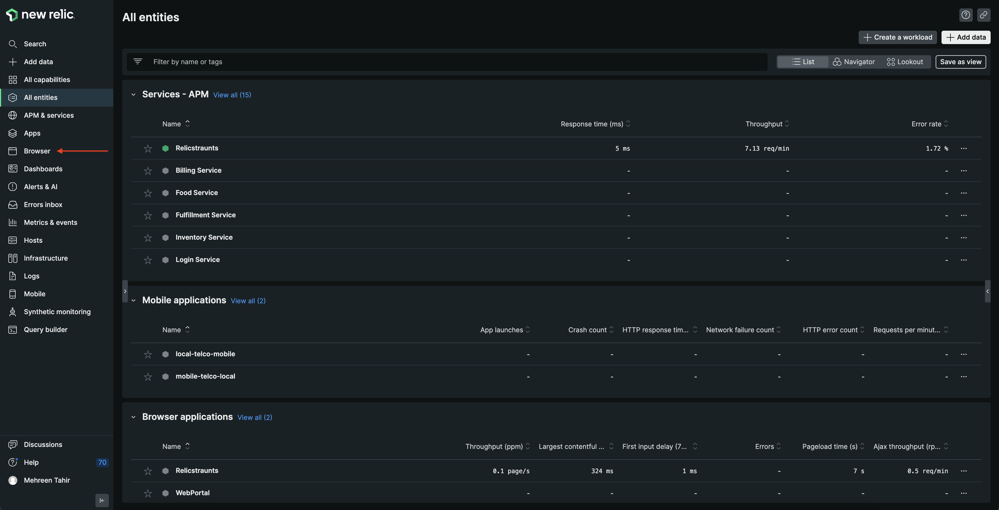
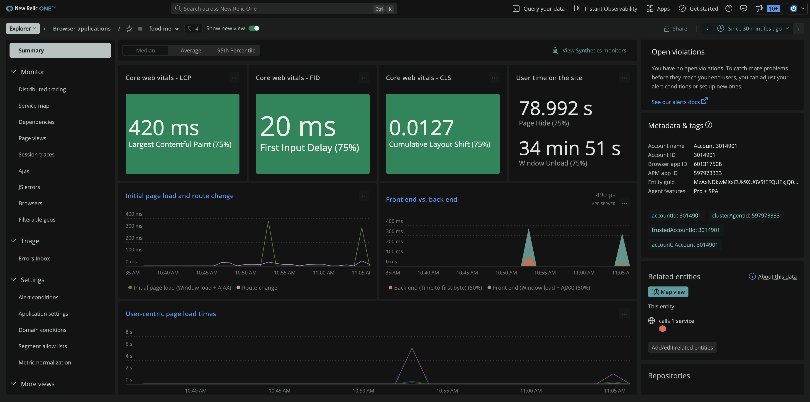

<Callout variant="course" title="lab">

This procedure is part of a lab that teaches you how to monitor your application with New Relic.

Each procedure in the lab builds upon the last, so make sure you've completed the last procedure, [_instrument your application with APM agent_](/collect-data/monitor-your-application/install-apm), before starting this one.

</Callout>

You've installed Node JS APM agent and it gives you visibility of your server side. However, your Angular app is running in browser. You also want visilibity from user's perspective and want to measure page load time and other metrics in user's browsers.

To achieve this goal, you decide to install browser agent.

## Install browser agent

<Steps>

<Step>

In the terminal window that's running your application, press `<CTRL-C>`.

You should see your server shut down. Now you can instrument your application.

</Step>

<Step>

Navigate to [New Relic](https://one.newrelic.com/) and sign in with your account. On the right side of the upper navigation bar, click **Add more data**.


</Step>

<Step>

Click **New Relic Browser**.



This opens **Get Started with New Relic Browser** page that guide you through installing New Relic Browser.

</Step>

<Step>

From **Get Started with New Relic Browser** page, select **Copy/Paste Javascript code** for deployment method.



Scroll down to **Name your app**, select **Yes. (Search your applications)**, search food-me app and click **Enable**.



This gives you a javascript code snippet to enable New Relic Browser. Copy it to your clipboard.



</Step>

<Step>

In _app/index.html_ file of your app, paste the copied javascript snippet inside the _head_.

<>

```html lineHighlight=8 fileName=app/index.html
<!doctype html>
<html lang="en" ng-app="foodMeApp">
<head>
  <meta charset="utf-8">
  <title>FoodMe</title>
  <link rel="stylesheet" href="css/app.css">
  <link rel="stylesheet" href="css/bootstrap-united.css">
  <!-- Replace it with your javascript code snippet -->
</head>
<body>

<div class="container">

  <div class="navbar" ng-controller="NavbarController">
    <div class="navbar-inner">
      <a class="brand" href="#/">FoodMe</a>
      <ul class="nav">
        <li ng-class="{active: routeIs('/')}"><a href="#/">Home</a></li>
        <li ng-class="{active: routeIs('/how-it-works')}"><a href="#/how-it-works">How it works</a></li>
        <li ng-class="{active: routeIs('/who-we-are')}"><a href="#/who-we-are">Who we are</a></li>
      </ul>

      <ul class="nav pull-right">
        <li ng-class="{active: routeIs('/help')}"><a href="#/help">Help</a></li>
      </ul>
    </div>
  </div>


  <ng-view></ng-view>

</div>

<!-- In production use:
<script src="//ajax.googleapis.com/ajax/libs/angularjs/1.0.2/angular.min.js"></script>
<script src="//ajax.googleapis.com/ajax/libs/angularjs/1.0.2/angular-resource.min.js"></script>
-->
<script src="lib/angular/angular.js"></script>
<script src="lib/angular/angular-resource.js"></script>
<script src="js/app.js"></script>
<script src="js/controllers/CheckoutController.js"></script>
<script src="js/controllers/CustomerController.js"></script>
<script src="js/controllers/MenuController.js"></script>
<script src="js/controllers/NavbarController.js"></script>
<script src="js/controllers/RestaurantsController.js"></script>
<script src="js/controllers/ThankYouController.js"></script>
<script src="js/directives/fmDeliverTo.js"></script>
<script src="js/directives/fmCheckboxList.js"></script>
<script src="js/directives/fmRating.js"></script>
<script src="js/services/alert.js"></script>
<script src="js/services/customer.js"></script>
<script src="js/services/localStorage.js"></script>
<script src="js/services/cart.js"></script>
<script src="js/services/Restaurant.js"></script>

</body>
</html>

```

</>

Your application is now instrumented with New Relic Browser agent.

</Step>

</Steps>

## Restart your application

Now that you've instrumented your application, its time to restart your local server. 

<>

```bash
node ./server/start.js
[output] Go to http://localhost:3000/
```

</>

Place a few orders to generate traffic. 

## View your data

Your app is now sending browser data to New Relic. You view this data in New Relic, under **Browser**.

<Steps>

<Step>

Navigate to [New Relic](https://one.newrelic.com/) and select **Browser** from top navigation.



</Step>

<Step>

Select **food-me**.


Here, you see **Core web vitals**, **User time on the site**, **Initial page load and route change** and other critical data related to your browser app.



</Step>

</Steps>

You've instrumented your application to send browser data to New Relic using our Browser agent. You also saw your app related data in New Relic. Now, it's time to get insights from your data.

<Callout variant="course" title="lab">

This procedure is part of a lab that teaches you how to monitor your application with New Relic. Now that you've instrumented your application with Browser agent, [explore your data](/collect-data/monitor-your-application/explore-your-data).

</Callout>