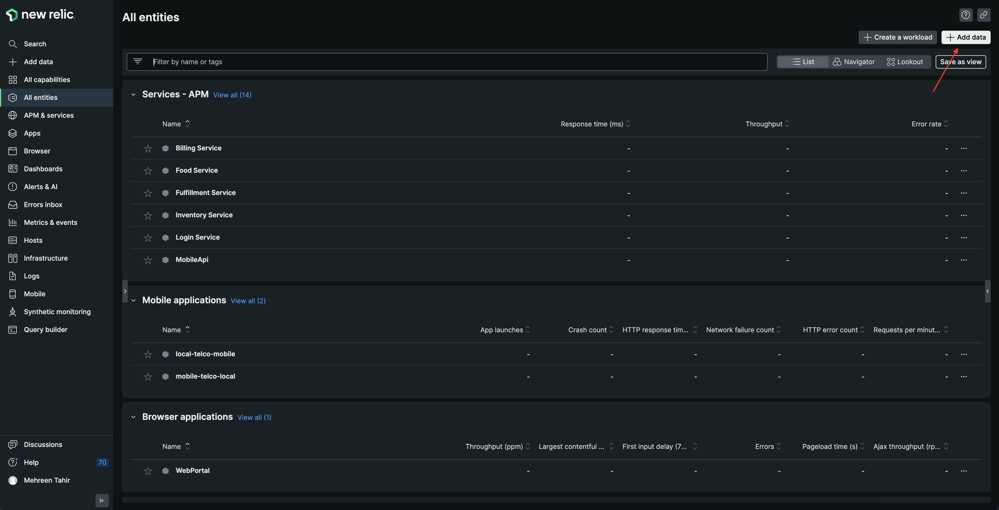
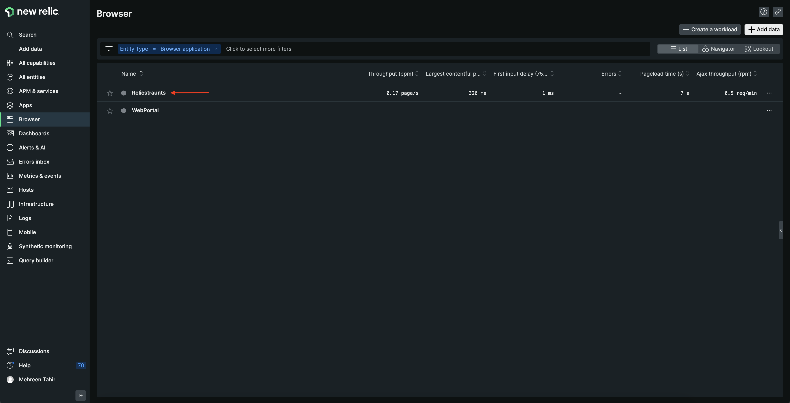
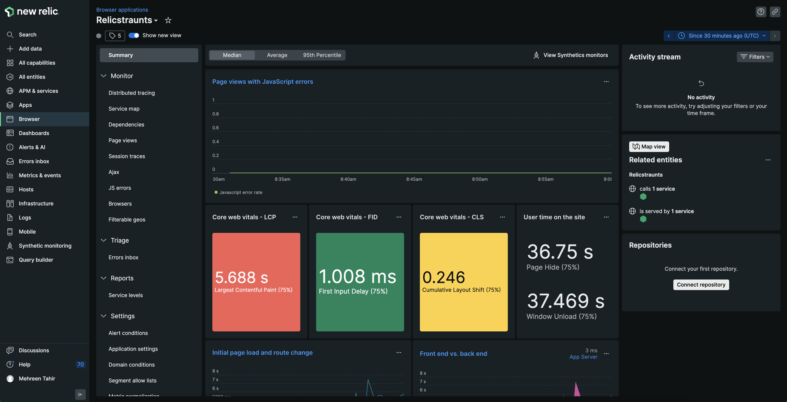

<Callout variant="course" title="lab">

This procedure is part of a lab that teaches you how to get started with New Relic to monitor your application.

Each procedure in the lab builds upon the last, so make sure you've completed the last procedure, [_Instrument your application with our APM agent_](/collect-data/monitor-your-application/install-apm), before starting this one.

</Callout>

You've installed our Node JS APM agent, and this provides server-side performance data. Because your React app is running in the browser, you also want to insight into your users' experiences, such as their page load times.

To achieve this goal, you need to install our browser agent.

## Install browser agent

<Steps>

<Step>

Navigate to [New Relic](https://one.newrelic.com/), and sign in with your account.

</Step>

<Step>

On the right side of the upper navigation bar, click **Add data**.



</Step>

<Step>

Scroll down the page to **Browser & mobile** and click **Browser monitoring**.


This opens **Get Started with New Relic Browser**, which guides you through installing our browser agent.

</Step>

<Step>

From **Get Started with New Relic Browser**, select **Copy/Paste Javascript code** for your deployment method.


Scroll down to **Name your app**, select **Yes. (Search your applications)**, search Relicstraunts app, and click **Enable**.


This gives you a JavaScript code snippet to enable browser monitoring. Copy it to your clipboard.


</Step>

<Step>

In _public/index.html_ file of your app, paste the copied javascript snippet inside the `<head>`.

<>

```html lineHighlight=22-23 fileName=app/index.html
<!DOCTYPE html>
<html lang="en">

<head>
  <meta charset="utf-8" />
  <link rel="icon" href="%PUBLIC_URL%/favicon.ico" />
  <meta name="viewport" content="width=device-width, initial-scale=1" />
  <meta name="theme-color" content="#000000" />
  <meta name="description" content="Web site created using create-react-app" />
  <link rel="preconnect" href="https://fonts.googleapis.com">
  <link rel="preconnect" href="https://fonts.gstatic.com" crossorigin>
  <link
    href="https://fonts.googleapis.com/css2?family=Roboto:ital,wght@0,100;0,300;0,400;0,500;0,700;1,100;1,300;1,400;1,500&display=swap"
    rel="stylesheet">
  <link rel="apple-touch-icon" href="%PUBLIC_URL%/logo192.png" />
  <link rel="manifest" href="%PUBLIC_URL%/manifest.json" />

  <title>Relicstaurants</title>
    <!--Replace these lines with your 
      browser monitoring code snippet -->
</head>

<body>
  <noscript>You need to enable JavaScript to run this app.</noscript>
  <div id="root"></div>
</body>

</html>

```

</>

Your application is now instrumented with our browser agent.

</Step>

</Steps>

## Restart your application

Now that you've instrumented your application, it's time to restart your local server.

<>

```bash
npm run build
npm run newstart
```

</>

Restart your load generator, as well.

<>

```bash
python simulator.py
```

</>

<Callout variant="important">

Make sure you're running these commands in the correct terminal windows. If you no longer have those windows, follow the steps in the [setup procedure](/collect-data/monitor-your-application/set-up-env).

</Callout>

## View your data

Your app is now sending browser data to New Relic. View this data in New Relic, under **Browser**.

<Steps>

<Step>

Navigate to [New Relic](https://one.newrelic.com/), and select **Browser** from the side navigation.


</Step>

<Step>

Select **Relicstaurants**.



Here, you see **Core web vitals**, **User time on the site**, **Initial page load and route change**, and other performance data from your app.



</Step>

</Steps>

You've instrumented your application to send browser data to New Relic using our browser agent. You also see your performance data in New Relic. Now, it's time to set up alerts for your application.

<Callout variant="course" title="lab">

This procedure is part of a lab that teaches you how to get started with New Relic to monitor your application. Now that you've instrumented your application with our browser agent, [add alerts](/collect-data/monitor-your-application/add-alerts).

</Callout>