<Callout variant="course" title="lab">

This procedure is part of a lab that teaches you how to get started with New Relic to monitor your application.

Each procedure in the lab builds upon the last, so make sure you've completed the last procedure, [_Collect custom business data_](/collect-data/monitor-your-application/collect-custom-data), before starting this one.

</Callout>

With your app recording custom business data, you're now ready to get insights from your data. Particularly, you look up:

- Orders from the past 24 hours
- Most popular restaurants
- Average order amount
- Most popular items

In this procedure, you create a dashboard, query your custom data, gather it in charts, and add those charts to your dashboard to have quick view into these data points.

## Create a dashboard

With New Relic dashboards, you observe and interpret the data you collect from your application. You gather the data you want to see into charts to customize the way you see it.

<Steps>

<Step>

Navigate to [New Relic](https://one.newrelic.com/) and sign in with your account.

</Step>

<Step>

Under **Dashboards**, click **Create a dashboard** in the top right corner.

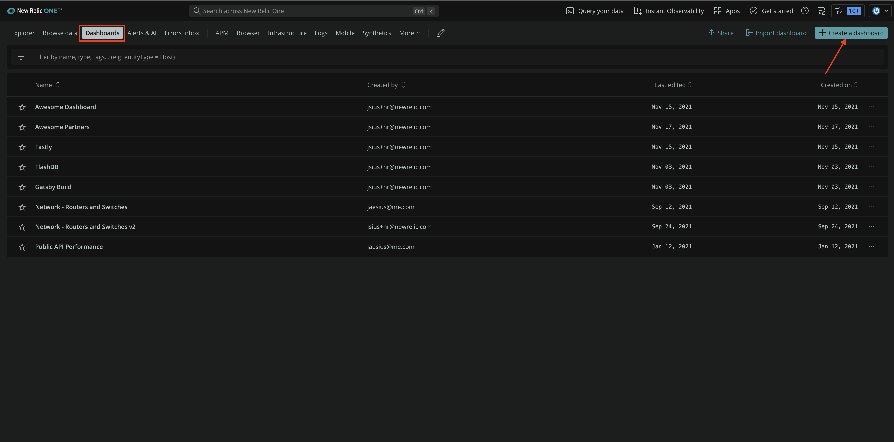

</Step>

<Step>

Select **Create a new dashboard**.

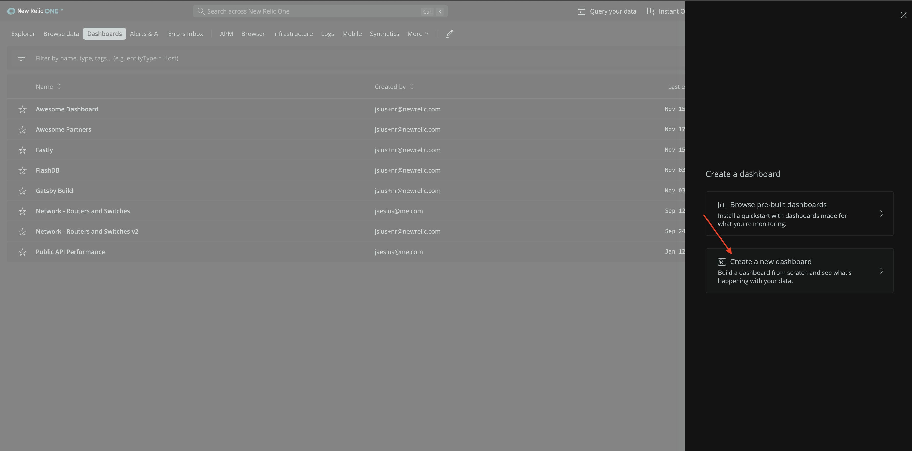

</Step>

<Step>

Name your dashboard "Relicstaurants", and click **Create**.

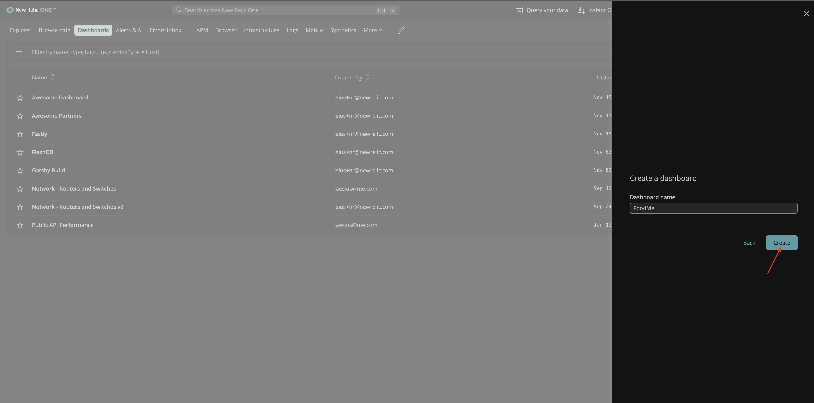

</Step>

</Steps>

## Add charts to your dashboard

Once the dashboard is in place, you can start creating charts to answer your business related questions.

### Orders in past 24 hours

Hover over the dashboard, and click **Add a new chart**.

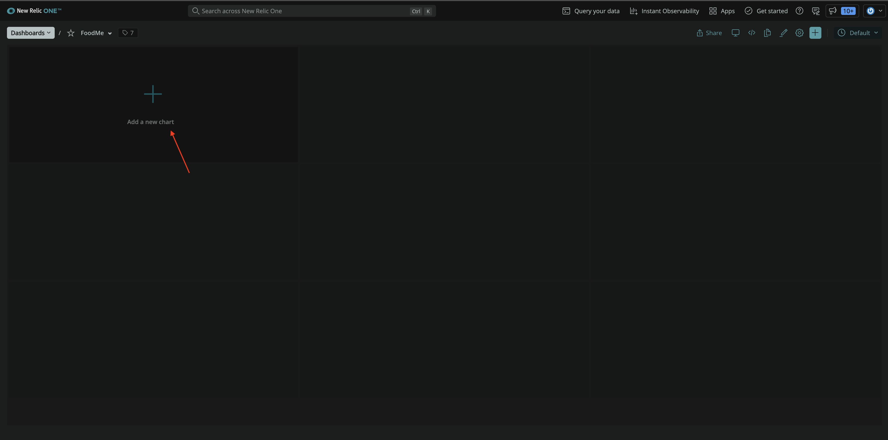

From this screen, you add charts using our query builder, or you choose to add text, images, or links using Markdown.

<Steps>

<Step>

Click **Add a chart**.

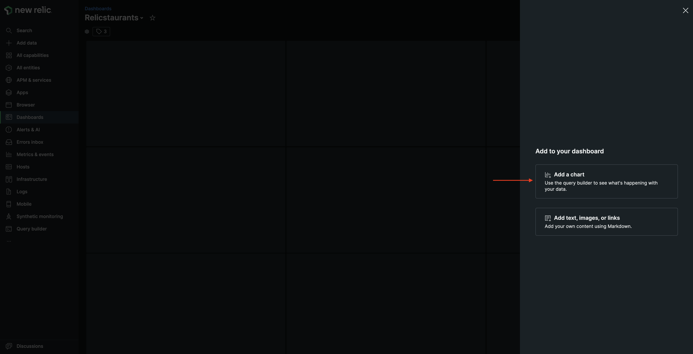

This opens a query builder.

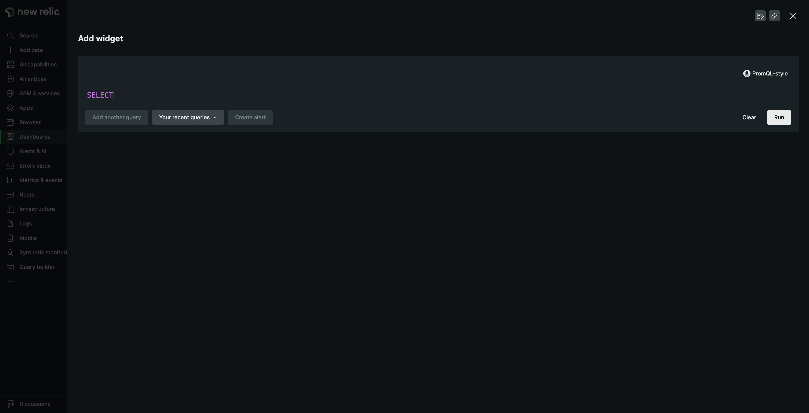

</Step>

<Step>

Edit the query as follows.

<>

```sql
SELECT count(*) AS 'Orders' FROM Transaction WHERE appName='Relicstraunts' AND name LIKE '%/api/order' SINCE 1 day ago
```

</>

Click **Run** to see the results.

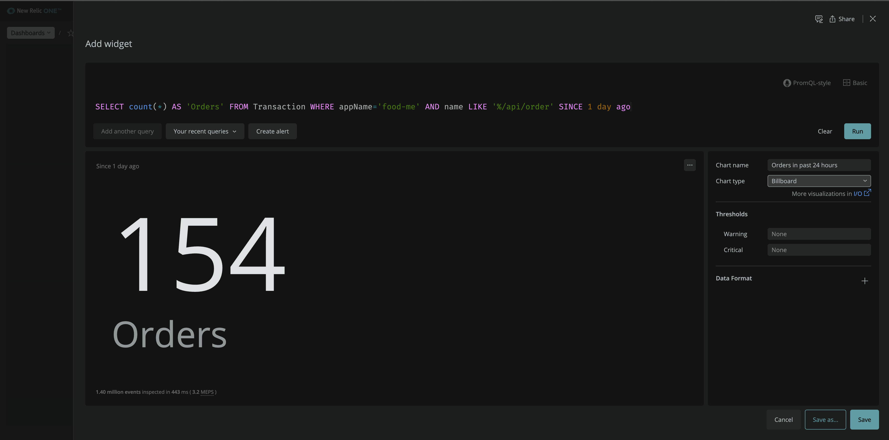

Here, you see the number of orders for the past 24 hours.

</Step>

<Step>

Name your chart "Orders in past 24 hours", and click **save**.

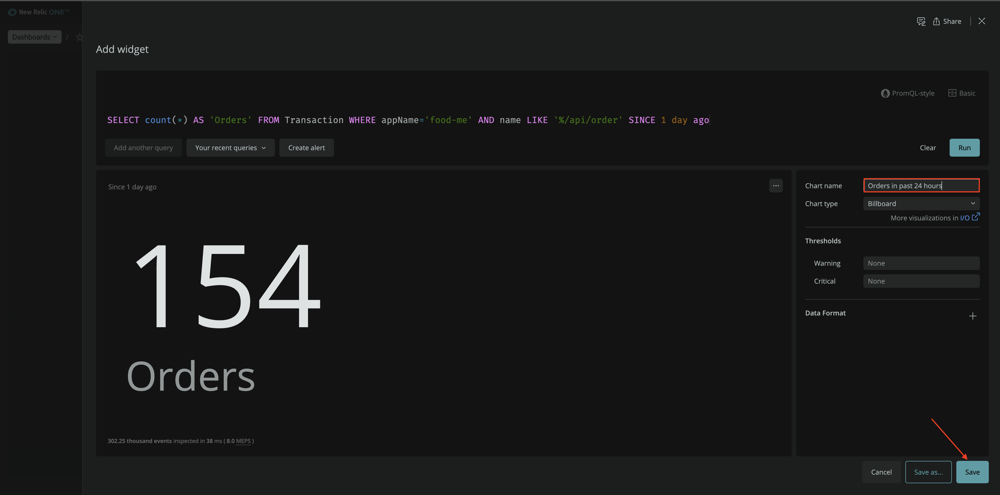

The chart is now visible on your dashboard.

</Step>

</Steps>

You can add more charts to your dashboard following the same pattern. To do so, click **+** in upper right-hand corner.

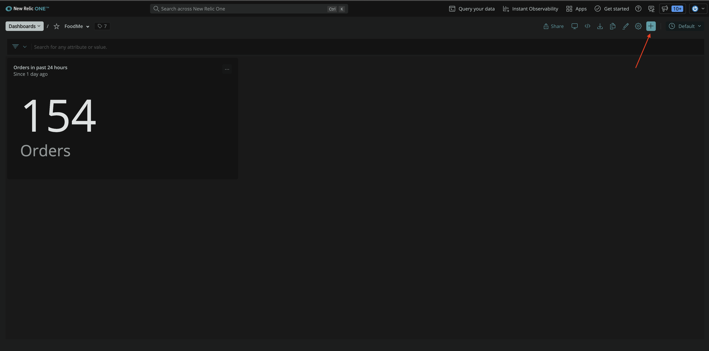

This takes you to the same **Add to your dashboard page**.

Add another chart to your dashboard.


### Most popular restaurants

Run the following query to view the most popular restaurants for your Relicstaurants app.

```sql
SELECT count(*) FROM Transaction WHERE appName='Relicstraunts' AND name LIKE '%/api/order' AND restaurant IS NOT NULL FACET restaurant SINCE 1 day ago
```

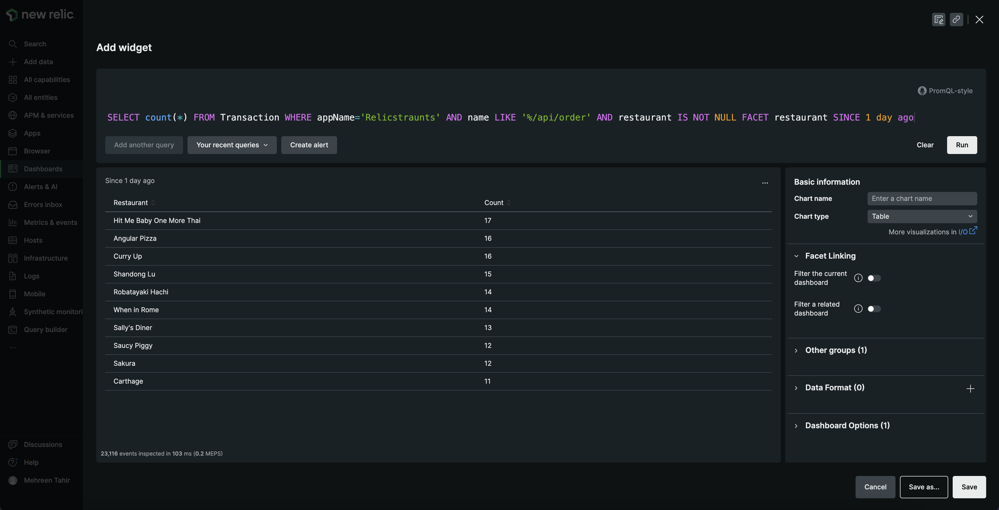

This chart shows you the most popular restaurants. Change the chart type to **Pie**, name it "Most popular restaurants", and click **save** to add it to your dashboard.

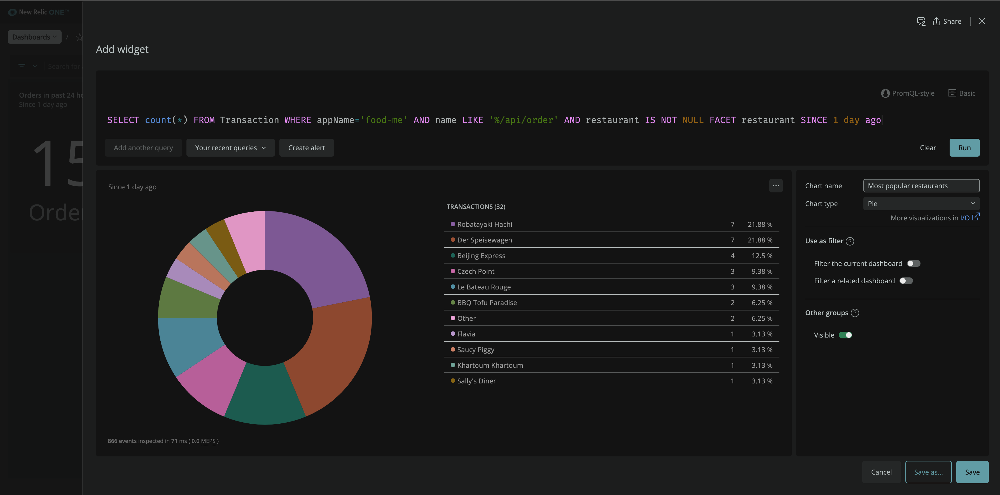

### Average order amount

Use the following query to calculate the average order amount.

```sql
SELECT average(orderTotal) FROM Transaction WHERE appName='Relicstraunts' AND name LIKE '%/api/order'
```

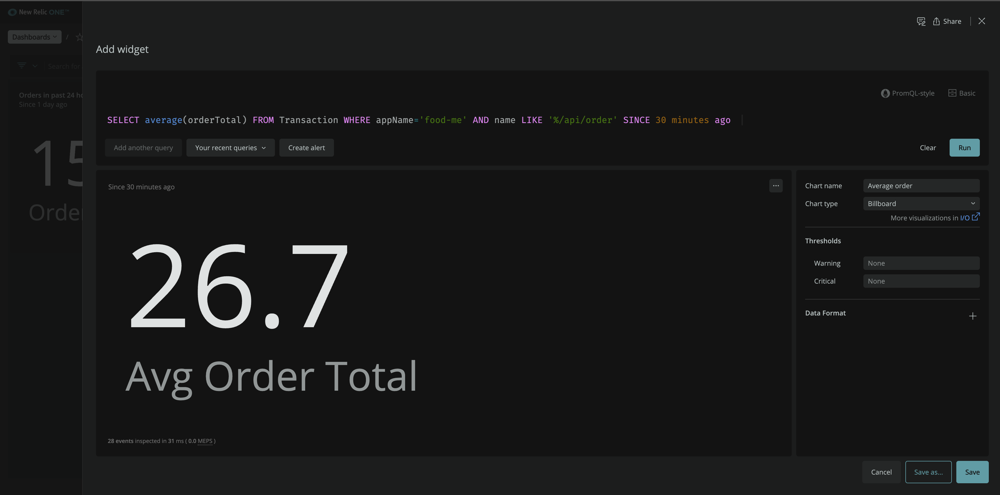

Here, you see observe the average order amount.

### Most popular items

Use the following query to view the most popular items.

```sql
SELECT sum(itemCount) FROM Transaction WHERE appName='Relicstraunts' AND name LIKE '%/api/order' FACET itemName
```

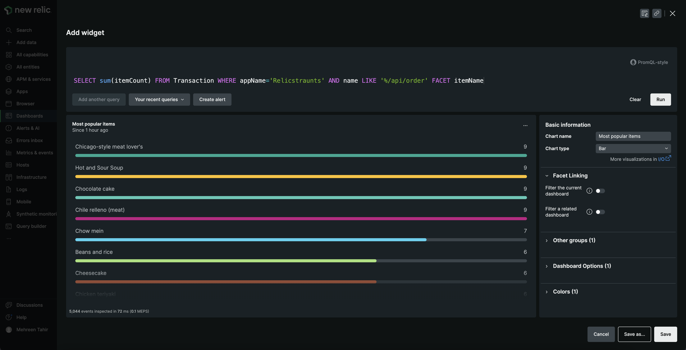

Here, you observe the most popular items for your app.

Your final dashboard looks something like this:

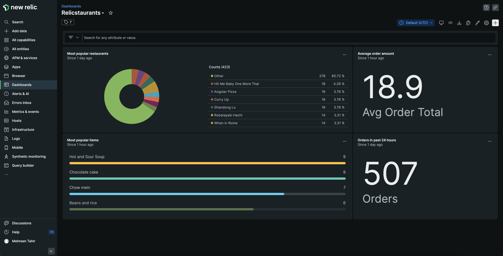

## Filter your dashboard

You now know how well your business is performing. You can filter your dashboard by restaurant, and get a closer look.

<Steps>

<Step>

Click **...** in front of your "Most popular restaurants" chart, and select **Edit**.

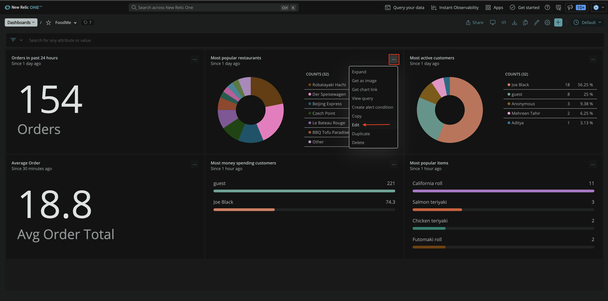

</Step>

<Step>

Toggle **Filter the current dashboard** to enable the filter and save.

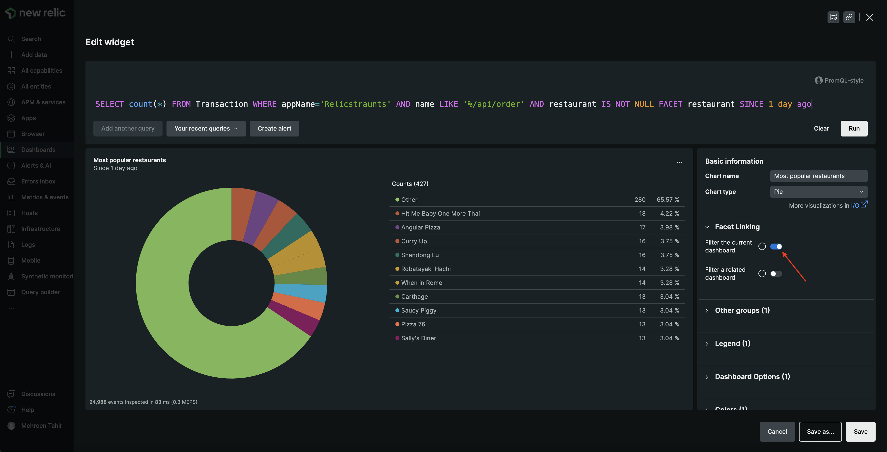

Now, you see the option to filter dashboard by most popular restaurant.

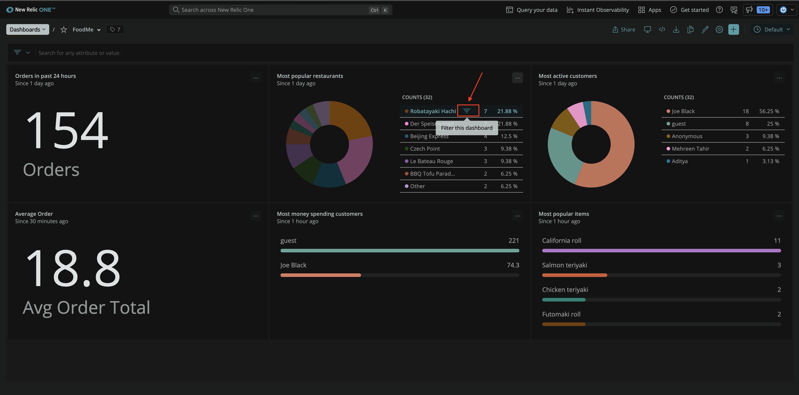

The dashboard now shows you business data related to that restaurant.

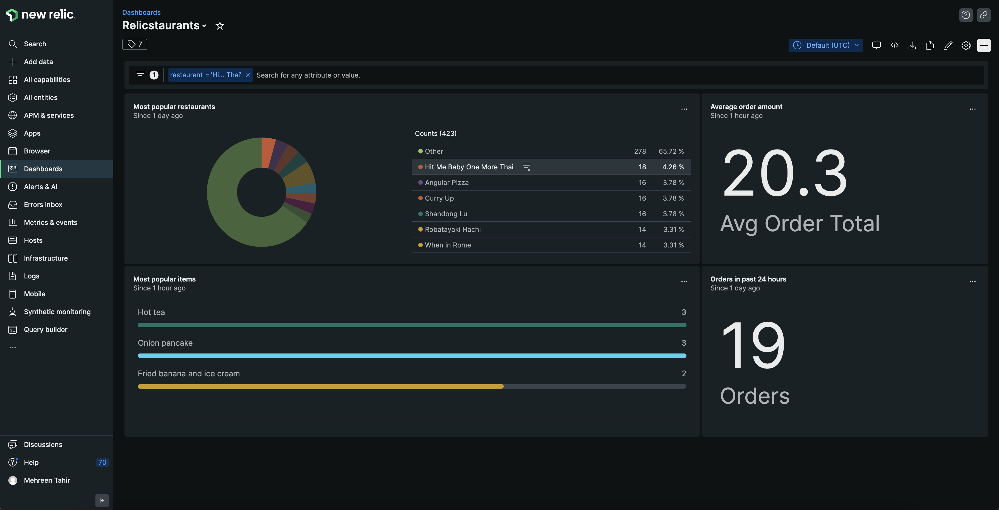

</Step>

</Steps>

## Summary

In this procedure, you created a dashboard and added multiple charts to it to get business insights. With New Relic, you now have full performance and business insights into your application.

## Homework

Well done! Now that you've gotten a jump start with New Relic to monitor your application, here are some docs that will help you take the next steps on your journey.

- [Introduction to APM](https://docs.newrelic.com/docs/apm/new-relic-apm/getting-started/introduction-apm)
- [Introduction to browser monitoring](https://docs.newrelic.com/docs/browser/browser-monitoring/getting-started/introduction-browser-monitoring)
- [Introduction to alerts and applied intelligence](https://docs.newrelic.com/docs/alerts-applied-intelligence/overview)

