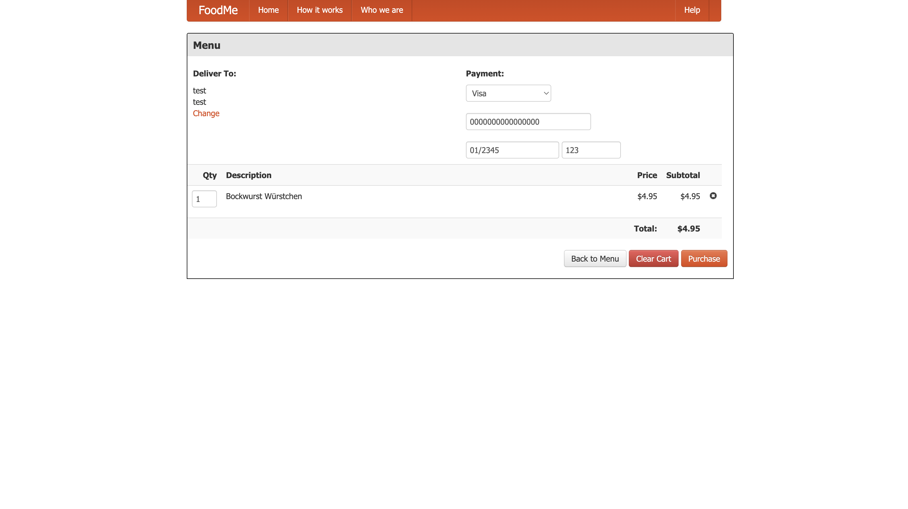

<Callout variant="course" title="lab">

This procedure is part of a lab that teaches you how to monitor your application with New Relic. If you haven't already, check out the [lab introduction](/collect-data/monitor-your-application).

</Callout>

Before you can walk through the lab proper, you need to spin up your Angular application.

<Steps>

<Step>

Clone the lab repository:

<>

```bash
git clone https://github.com/newrelic-experimental/NewRelic-basics-lab-material.git
```

</>

</Step>

<Step>

Navigate to the root directory of your application, install dependencies, and run the application:

<>

```bash
cd NewRelic-basics-lab-material/FoodMe
npm install
node ./server/start.js
[output] Go to http://localhost:3000/
```

</>

This opens your FoodMe application in your browser.


Enter your name and delivery address, and click **Find Restaurants** to get started.


Here, you see a list of restaurants where you can order food.

</Step>

<Step>

Choose a restaurant.


</Step>

<Step>

Select an item or two.


</Step>

<Step>

Click **Checkout**.


</Step>

<Step>

Enter the following fake card information.



Click **Purchase** to place the order:


You use this flow later to generate more traffic to your application.

</Step>

</Steps>

Now, that you know how to run your application, it's time to instrument it. In the terminal window that's running your application, press `<CTRL-C>` to shut down your application. With your app shut down, you'll be able to update your code to introduce monitoring tools.

<Callout variant="course" title="lab">

This procedure is part of a lab that teaches you how to monitor your application with New Relic. Now that you've set up your environment, [instrument your application with APM agent](/collect-data/monitor-your-application/install-apm).

</Callout>