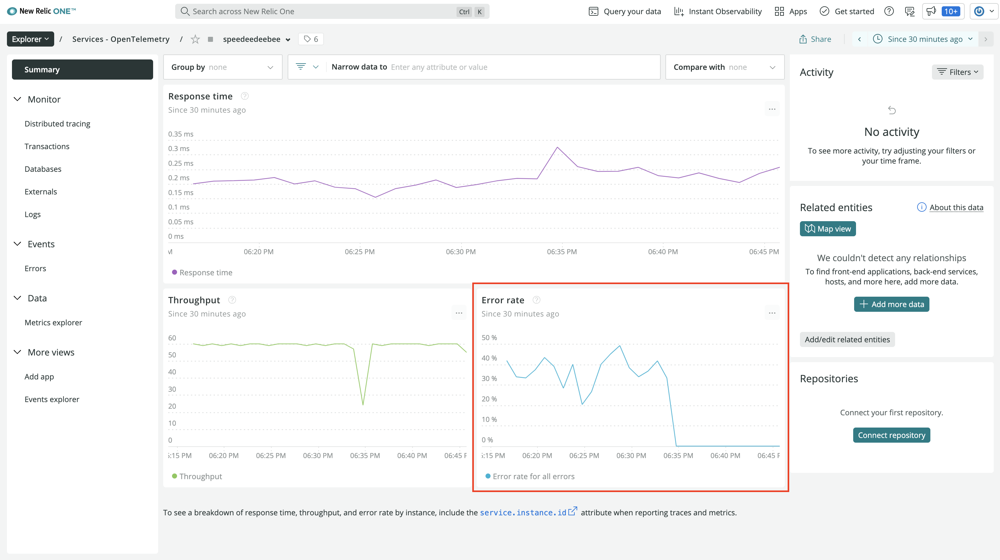
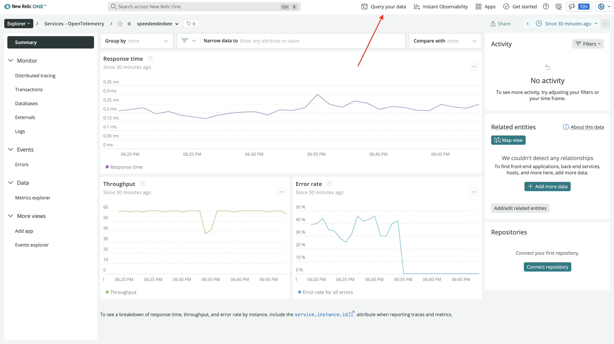
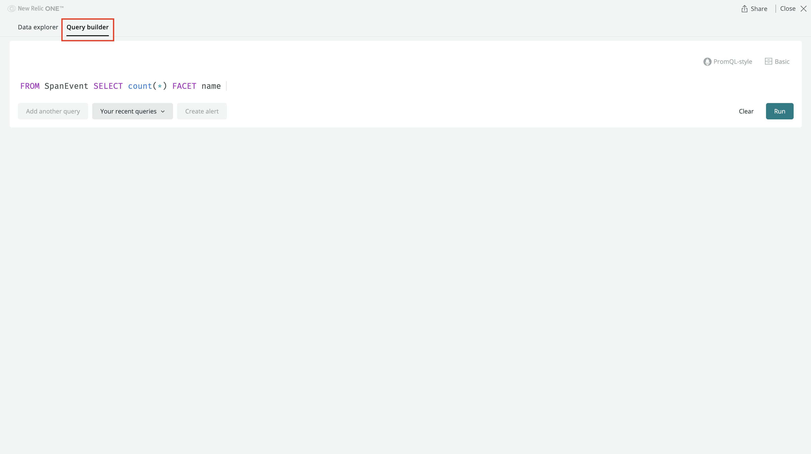
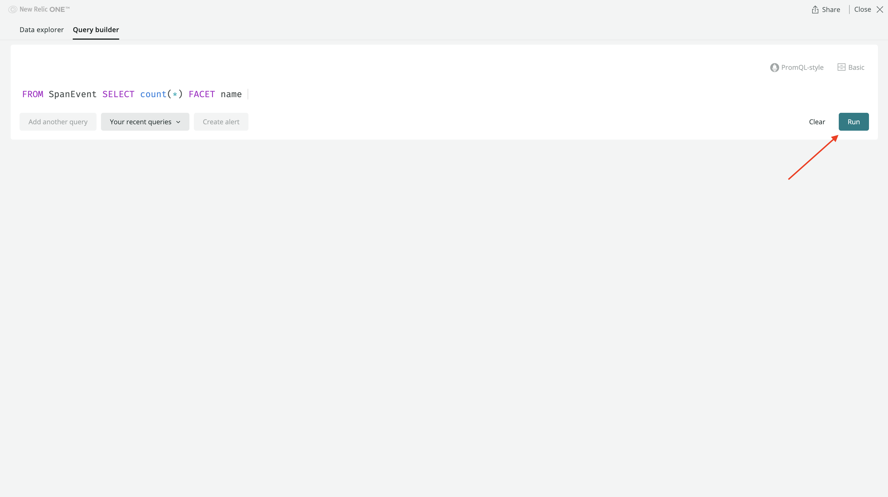
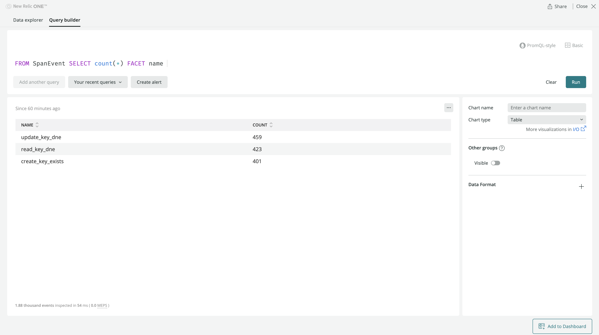
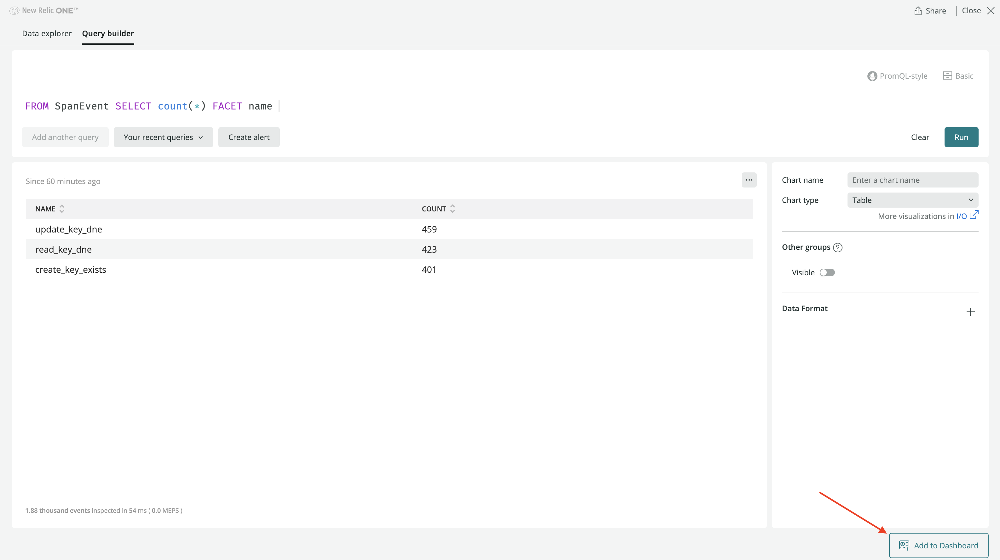

<Callout variant="course" title="lab">

This procedure is part of a lab that teaches you how to instrument your application with OpenTelemetry.

Each procedure in the lab builds upon the last, so make sure you've completed the last procedure, [_View your OpenTelemetry data in New Relic_](/collect-data/opentelemetry-manual/view), before starting this one.

</Callout>

You've decided you don't want the Python OpenTelemetry SDK to automatically record exceptions as exception span events, because they're not really errors in the database application. These are expected exceptions based on user behavior. Here, you modify your code to record a custom span event, rather than automatically collecting an exception span event.

<Tutorial>

<Project>

```py fileName=db.py
import logging
from grpc import Compression
from opentelemetry import trace
from opentelemetry.exporter.otlp.proto.grpc.trace_exporter import OTLPSpanExporter
from opentelemetry.sdk.resources import Resource
from opentelemetry.sdk.trace import TracerProvider
from opentelemetry.sdk.trace.export import BatchSpanProcessor

provider = TracerProvider(
    resource=Resource.create({"service.name": "speedeedeebee"})
)
provider.add_span_processor(
    BatchSpanProcessor(
        OTLPSpanExporter(compression=Compression.Gzip)
    )
)
trace.set_tracer_provider(provider)

tracer = trace.get_tracer(__name__)

class DuplicateKeyError(Exception):
    pass

class KeyDoesNotExistError(Exception):
    pass

db = {}

def read(key):
    """Read key from the database."""
    global db

    with tracer.start_as_current_span("read", kind=trace.SpanKind.SERVER) as span:
        try:
            value = db[key]
            logging.debug("Successful read")
            span.set_attribute("key", key)
            return value
        except KeyError as ke:
            msg = f"Key `{key}` doesn't exist"
            logging.debug(msg)
            raise KeyDoesNotExistError(msg)

def create(key, value):
    """Write key:value to the database."""
    global db

    with tracer.start_as_current_span("create", kind=trace.SpanKind.SERVER) as span:
        if key in db:
            msg = f"Key `{key}` already exists"
            logging.debug(msg)
            raise DuplicateKeyError(msg)

        db[key] = value
        logging.debug("Successful create")
        span.set_attribute("key", key)
        return value

def update(key, value):
    """Update key in the database."""
    global db

    with tracer.start_as_current_span("update", kind=trace.SpanKind.SERVER) as span:
        if key in db:
            db[key] = value
            logging.debug("Successful update")
            span.set_attribute("key", key)
            return value

        msg = f"Key `{key}` doesn't exist"
        logging.debug(msg)
        raise KeyDoesNotExistError(msg)

def delete(key):
    """Delete key from the database."""
    global db

    with tracer.start_as_current_span("delete", kind=trace.SpanKind.SERVER) as span:
        if key in db:
            del db[key]
            logging.debug("Successful delete")
            span.set_attribute("key", key)
            return True

        return False
```

</Project>

## Modify your instrumentation

<Steps>

<Step>

In the terminal window that's running your simulator, press `<CTRL-C>`.

You should see your simulator shut down. Now you can update your app logic to add custom span events.

</Step>

<Step>

In _db.py_, modify your span context managers to not record exceptions as span events:

<>

```py fileName=db.py
import logging
from grpc import Compression
from opentelemetry import trace
from opentelemetry.exporter.otlp.proto.grpc.trace_exporter import OTLPSpanExporter
from opentelemetry.sdk.resources import Resource
from opentelemetry.sdk.trace import TracerProvider
from opentelemetry.sdk.trace.export import BatchSpanProcessor

provider = TracerProvider(
    resource=Resource.create({"service.name": "speedeedeebee"})
)
provider.add_span_processor(
    BatchSpanProcessor(
        OTLPSpanExporter(compression=Compression.Gzip)
    )
)
trace.set_tracer_provider(provider)

tracer = trace.get_tracer(__name__)

class DuplicateKeyError(Exception):
    pass

class KeyDoesNotExistError(Exception):
    pass

db = {}

def read(key):
    """Read key from the database."""
    global db

    with tracer.start_as_current_span("read", kind=trace.SpanKind.SERVER, record_exception=False, set_status_on_exception=False) as span:
        try:
            value = db[key]
            logging.debug("Successful read")
            span.set_attribute("key", key)
            return value
        except KeyError as ke:
            msg = f"Key `{key}` doesn't exist"
            logging.debug(msg)
            raise KeyDoesNotExistError(msg)

def create(key, value):
    """Write key:value to the database."""
    global db

    with tracer.start_as_current_span("create", kind=trace.SpanKind.SERVER, record_exception=False, set_status_on_exception=False) as span:
        if key in db:
            msg = f"Key `{key}` already exists"
            logging.debug(msg)
            raise DuplicateKeyError(msg)

        db[key] = value
        logging.debug("Successful create")
        span.set_attribute("key", key)
        return value

def update(key, value):
    """Update key in the database."""
    global db

    with tracer.start_as_current_span("update", kind=trace.SpanKind.SERVER, record_exception=False, set_status_on_exception=False) as span:
        if key in db:
            db[key] = value
            logging.debug("Successful update")
            span.set_attribute("key", key)
            return value

        msg = f"Key `{key}` doesn't exist"
        logging.debug(msg)
        raise KeyDoesNotExistError(msg)

def delete(key):
    """Delete key from the database."""
    global db

    with tracer.start_as_current_span("delete", kind=trace.SpanKind.SERVER) as span:
        if key in db:
            del db[key]
            logging.debug("Successful delete")
            span.set_attribute("key", key)
            return True

        return False
```

</>

<br />

Your code will no longer save an exception span event on your spans. However, you still want to know how many times your users attempt to perform these actions against your database. To do this, record your own custom span events.

<Callout variant="tip">

Notice that you didn't update the context manager for `delete()`. This is because the logic in this function doesn't use an exception to indicate the state of the database. Any exception that is raised in the underlying code here, will be a real error. It still makes sense to let the SDK manage real errors.

</Callout>

</Step>

<Step>

Record a span event for `read()`:

<>

```python fileName=db.py
import logging
from grpc import Compression
from opentelemetry import trace
from opentelemetry.exporter.otlp.proto.grpc.trace_exporter import OTLPSpanExporter
from opentelemetry.sdk.resources import Resource
from opentelemetry.sdk.trace import TracerProvider
from opentelemetry.sdk.trace.export import BatchSpanProcessor

provider = TracerProvider(
    resource=Resource.create({"service.name": "speedeedeebee"})
)
provider.add_span_processor(
    BatchSpanProcessor(
        OTLPSpanExporter(compression=Compression.Gzip)
    )
)
trace.set_tracer_provider(provider)

tracer = trace.get_tracer(__name__)

class DuplicateKeyError(Exception):
    pass

class KeyDoesNotExistError(Exception):
    pass

db = {}

def read(key):
    """Read key from the database."""
    global db

    with tracer.start_as_current_span("read", kind=trace.SpanKind.SERVER, record_exception=False, set_status_on_exception=False) as span:
        try:
            value = db[key]
            logging.debug("Successful read")
            span.set_attribute("key", key)
            return value
        except KeyError as ke:
            msg = f"Key `{key}` doesn't exist"
            logging.debug(msg)
            span.add_event("read_key_dne", {"key": key})
            raise KeyDoesNotExistError(msg)

def create(key, value):
    """Write key:value to the database."""
    global db

    with tracer.start_as_current_span("create", kind=trace.SpanKind.SERVER, record_exception=False, set_status_on_exception=False) as span:
        if key in db:
            msg = f"Key `{key}` already exists"
            logging.debug(msg)
            raise DuplicateKeyError(msg)

        db[key] = value
        logging.debug("Successful create")
        span.set_attribute("key", key)
        return value

def update(key, value):
    """Update key in the database."""
    global db

    with tracer.start_as_current_span("update", kind=trace.SpanKind.SERVER, record_exception=False, set_status_on_exception=False) as span:
        if key in db:
            db[key] = value
            logging.debug("Successful update")
            span.set_attribute("key", key)
            return value

        msg = f"Key `{key}` doesn't exist"
        logging.debug(msg)
        raise KeyDoesNotExistError(msg)

def delete(key):
    """Delete key from the database."""
    global db

    with tracer.start_as_current_span("delete", kind=trace.SpanKind.SERVER) as span:
        if key in db:
            del db[key]
            logging.debug("Successful delete")
            span.set_attribute("key", key)
            return True

        return False
```

</>

<br />

If you try to read a key that does not exist, your application adds a span event on the span.

</Step>

<Step>

<>

Record a span event for `create()`:

```python fileName=db.py
import logging
from grpc import Compression
from opentelemetry import trace
from opentelemetry.exporter.otlp.proto.grpc.trace_exporter import OTLPSpanExporter
from opentelemetry.sdk.resources import Resource
from opentelemetry.sdk.trace import TracerProvider
from opentelemetry.sdk.trace.export import BatchSpanProcessor

provider = TracerProvider(
    resource=Resource.create({"service.name": "speedeedeebee"})
)
provider.add_span_processor(
    BatchSpanProcessor(
        OTLPSpanExporter(compression=Compression.Gzip)
    )
)
trace.set_tracer_provider(provider)

tracer = trace.get_tracer(__name__)

class DuplicateKeyError(Exception):
    pass

class KeyDoesNotExistError(Exception):
    pass

db = {}

def read(key):
    """Read key from the database."""
    global db

    with tracer.start_as_current_span("read", kind=trace.SpanKind.SERVER, record_exception=False, set_status_on_exception=False) as span:
        try:
            value = db[key]
            logging.debug("Successful read")
            span.set_attribute("key", key)
            return value
        except KeyError as ke:
            msg = f"Key `{key}` doesn't exist"
            logging.debug(msg)
            span.add_event("read_key_dne", {"key": key})
            raise KeyDoesNotExistError(msg)

def create(key, value):
    """Write key:value to the database."""
    global db

    with tracer.start_as_current_span("create", kind=trace.SpanKind.SERVER, record_exception=False, set_status_on_exception=False) as span:
        if key in db:
            msg = f"Key `{key}` already exists"
            logging.debug(msg)
            span.add_event("create_key_exists", {"key": key})
            raise DuplicateKeyError(msg)

        db[key] = value
        logging.debug("Successful create")
        span.set_attribute("key", key)
        return value

def update(key, value):
    """Update key in the database."""
    global db

    with tracer.start_as_current_span("update", kind=trace.SpanKind.SERVER, record_exception=False, set_status_on_exception=False) as span:
        if key in db:
            db[key] = value
            logging.debug("Successful update")
            span.set_attribute("key", key)
            return value

        msg = f"Key `{key}` doesn't exist"
        logging.debug(msg)
        raise KeyDoesNotExistError(msg)

def delete(key):
    """Delete key from the database."""
    global db

    with tracer.start_as_current_span("delete", kind=trace.SpanKind.SERVER) as span:
        if key in db:
            del db[key]
            logging.debug("Successful delete")
            span.set_attribute("key", key)
            return True

        return False
```

</>

<br />

If you try to create a key that already exists, your application adds a span event on the span.

</Step>

<Step>

Record a span event for `update()`:

<>

```python fileName=db.py
import logging
from grpc import Compression
from opentelemetry import trace
from opentelemetry.exporter.otlp.proto.grpc.trace_exporter import OTLPSpanExporter
from opentelemetry.sdk.resources import Resource
from opentelemetry.sdk.trace import TracerProvider
from opentelemetry.sdk.trace.export import BatchSpanProcessor

provider = TracerProvider(
    resource=Resource.create({"service.name": "speedeedeebee"})
)
provider.add_span_processor(
    BatchSpanProcessor(
        OTLPSpanExporter(compression=Compression.Gzip)
    )
)
trace.set_tracer_provider(provider)

tracer = trace.get_tracer(__name__)

class DuplicateKeyError(Exception):
    pass

class KeyDoesNotExistError(Exception):
    pass

db = {}

def read(key):
    """Read key from the database."""
    global db

    with tracer.start_as_current_span("read", kind=trace.SpanKind.SERVER, record_exception=False, set_status_on_exception=False) as span:
        try:
            value = db[key]
            logging.debug("Successful read")
            span.set_attribute("key", key)
            return value
        except KeyError as ke:
            msg = f"Key `{key}` doesn't exist"
            logging.debug(msg)
            span.add_event("read_key_dne", {"key": key})
            raise KeyDoesNotExistError(msg)

def create(key, value):
    """Write key:value to the database."""
    global db

    with tracer.start_as_current_span("create", kind=trace.SpanKind.SERVER, record_exception=False, set_status_on_exception=False) as span:
        if key in db:
            msg = f"Key `{key}` already exists"
            logging.debug(msg)
            span.add_event("create_key_exists", {"key": key})
            raise DuplicateKeyError(msg)

        db[key] = value
        logging.debug("Successful create")
        span.set_attribute("key", key)
        return value

def update(key, value):
    """Update key in the database."""
    global db

    with tracer.start_as_current_span("update", kind=trace.SpanKind.SERVER, record_exception=False, set_status_on_exception=False) as span:
        if key in db:
            db[key] = value
            logging.debug("Successful update")
            span.set_attribute("key", key)
            return value

        msg = f"Key `{key}` doesn't exist"
        logging.debug(msg)
        span.add_event("update_key_dne", {"key": key})
        raise KeyDoesNotExistError(msg)

def delete(key):
    """Delete key from the database."""
    global db

    with tracer.start_as_current_span("delete", kind=trace.SpanKind.SERVER) as span:
        if key in db:
            del db[key]
            logging.debug("Successful delete")
            span.set_attribute("key", key)
            return True

        return False
```

</>

<br />

If you try to update a key that does not exist, your application adds a span event on the span.

</Step>

</Steps>

</Tutorial>

## Restart your simulator

Now that you've changed the application logic, you need to restart your simulator. Make sure you do this in the same terminal window where you set your environment variables.

Restart your simulator:

<>

```bash
python simulator.py
```

</>

<br />

Now, your simulator is running again.

You've instrumented your application to send custom events with your spans. You've also restarted your simulator. Now, it's time to view your new data.

## View your new data in New Relic

<Steps>

<Step>

Log into [New Relic](https://one.newrelic.com).

</Step>

<Step>

Go back to your OpenTelemetry service:


Notice that your errors have dropped to zero:



You won't be able to use error counts to know how many times your users try to read keys that aren't there or create keys that already are, so use the query builder to figure it out.

<Callout variant="tip">

If you don't see a change in your data, compare your code to [ours](https://github.com/newrelic-experimental/otel-manual-instrumentation-lab-materials/blob/instrumented-custom-events/db.py).

</Callout>

</Step>

<Step>

Click **Query your data**:



With our query builder, you can write arbitrary queries against our database.

</Step>

<Step>

Click **Query builder** and enter the following query:

<>

```sql
FROM SpanEvent SELECT count(*) FACET name
```

</>



This query counts all the span events from your account and groups them by their name.

</Step>

<Step>

Click **Run** to see your data:



</Step>

<Step>

Change your chart type to **Table** for better readability:



Here, you see the number of times your application has seen each span event, organized into a nice table.

<Callout variant="tip">

You can even add this table to a dashboard if you want to:



</Callout>

You've updated your app to stop reporting normal user actions as errors. At the same time, you've maintained the ability to query the number of occurences of these actions.

</Step>

</Steps>

## Summary

As the developer of speedeedeebee, you've now instrumented your application with OpenTelemetry to send manually-collected traces to New Relic. And because you've instrumented your app with OpenTelemetry instead of our Python agent, you have more flexibility in how you can use your data. For example, if you want to add additional backend data sources besides New Relic, you can easily change that without having to add another vendor-specific agent.

## Homework

Now that you know how to instrument a Python application with OpenTelemetry and send that data to New Relic, here are some things you can do next to familiarize yourself even more with New Relic and OpenTelemetry:

- Check out our [repository of OpenTelemetry examples](https://github.com/newrelic/newrelic-opentelemetry-examples)
- Learn more about [OpenTelemetry's Python implementation](https://github.com/open-telemetry/opentelemetry-python)
- Read our [documentation on New Relic + OpenTelemetry](https://docs.newrelic.com/docs/more-integrations/open-source-telemetry-integrations/opentelemetry/introduction-opentelemetry-new-relic/)

