<Callout variant="course" title="lab">

This procedure is part of a lab that teaches you how to instrument your application with OpenTelemetry.

Each procedure in the lab builds upon the last, so make sure you've completed the last procedure, [_Instrument your application with OpenTelemetry_](/collect-data/opentelemetry-manual/instrument), before starting this one.

</Callout>

You've instrumented your database application with OpenTelemetry and you're sending trace data to New Relic.

Here, you move to New Relic to see the kinds of detailed telemetry data that you generated with just a few lines of OpenTelemetry code.

## View your data

<Steps>

<Step>

Log into [New Relic](https://one.newrelic.com).

</Step>

<Step>

In the entity explorer, click the **speedeedeebee** OpenTelemetry service:

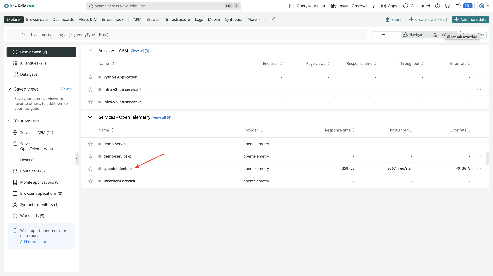

This brings you to a service view that shows trace data from your application, including:

- Response time
- Throughput
- Error rate

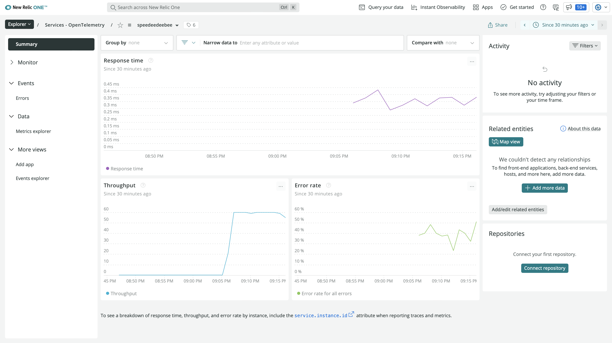

<Callout variant="tip">

It can take some time for your OpenTelemetry data to get to New Relic. If you don't see your service yet, wait a few more minutes. You can also try another path to find your service.

In the left-hand navigation, click **Services - OpenTelemetry**:

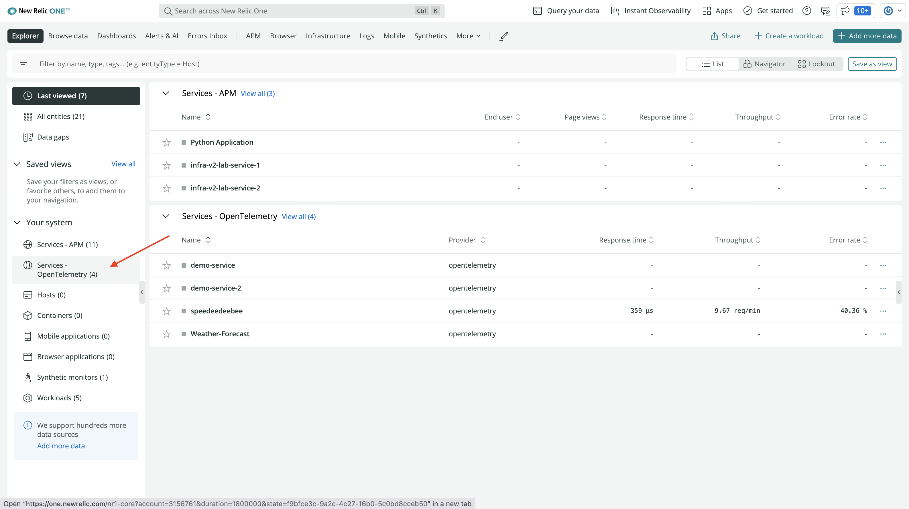

Then, click your service:

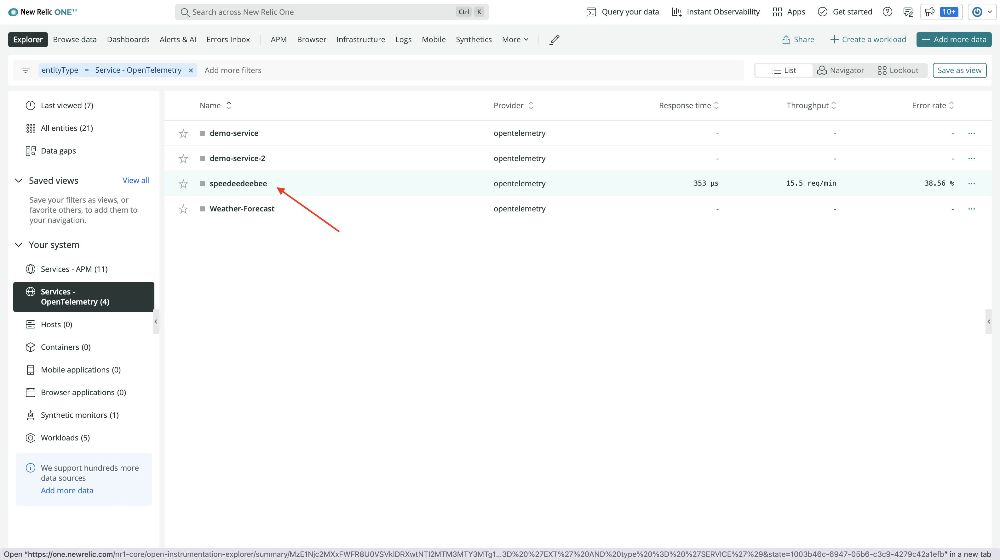

If you still don't see data, compare your code to [ours](https://github.com/newrelic-experimental/otel-manual-instrumentation-lab-materials/blob/instrumented/db.py).

</Callout>

</Step>

<Step>

In the left-hand navigation, click **Distributed tracing**:

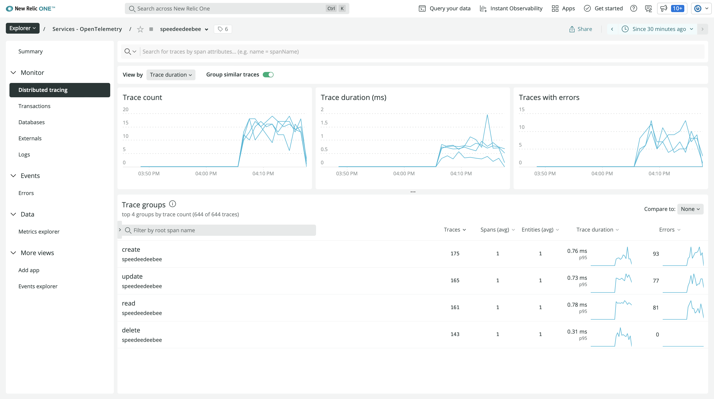

This shows data about the traces that you generated in your service, such as:

- Trace count
- Trace duration
- Trace groups

</Step>

<Step>

Under **Trace groups** click the **create** group:

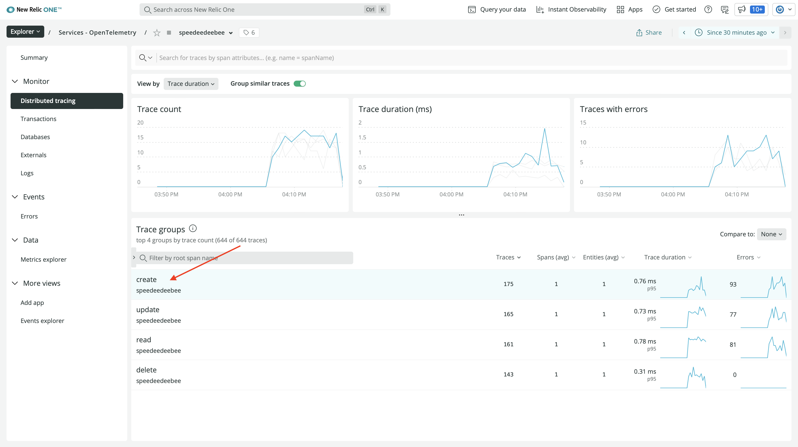

This group shows traces grouped by the name of the root span. Because all of your spans are root spans, there are four trace groups, one for each database function.

</Step>

<Step>

Order the traces by number of errors ascending, and click one of the traces with no errors:

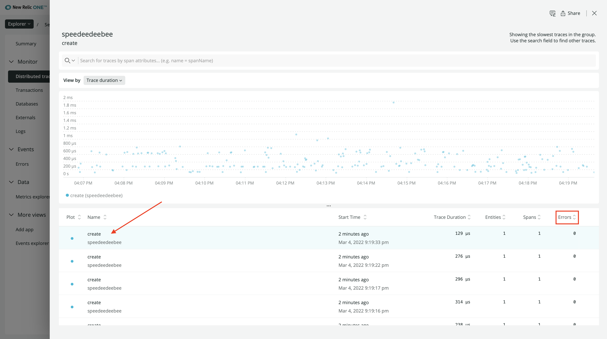

</Step>

<Step>

Click on the span:

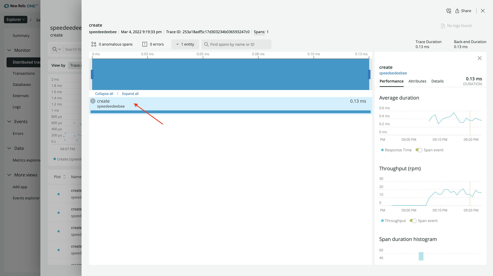

Here, you see performance data about the span, such as average duration and throughput.

</Step>

<Step>

Click **Attributes**:

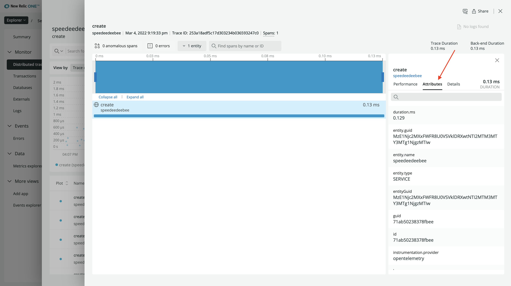

You configured a few of the attributes you see here in your SDK code. For example, the key that the simulator created:

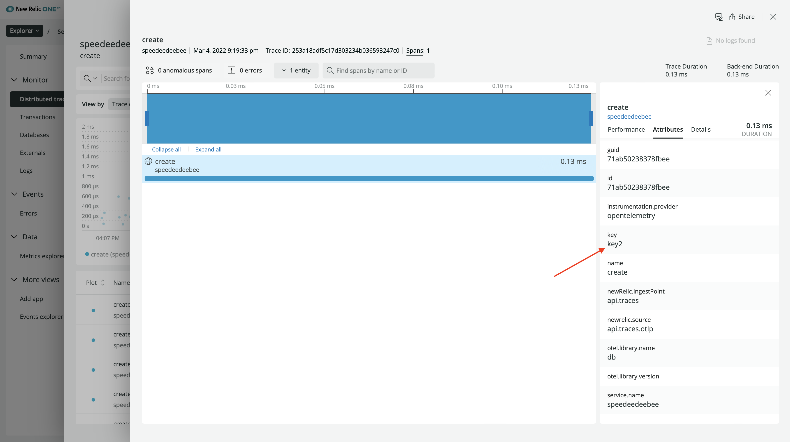

Now that you've seen the details that you captured in successful operations within your app, take a look at some of those errors.

</Step>

<Step>

Back out of this view and click on **Events > Errors**:

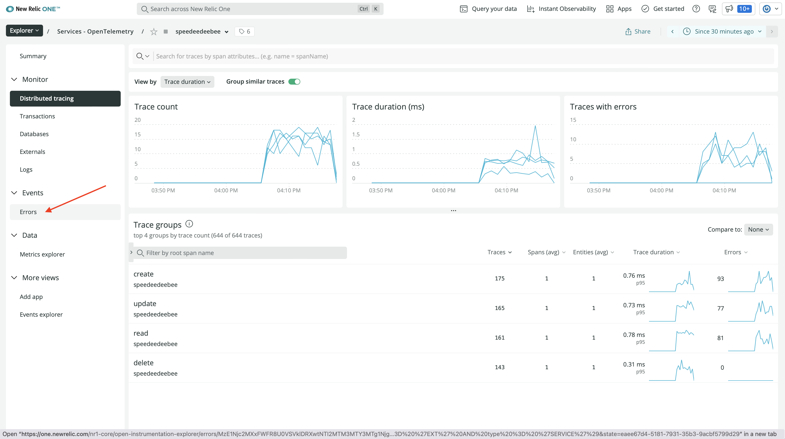

Here, you see information about those span events:

</Step>

<Step>

Click a `create` error:

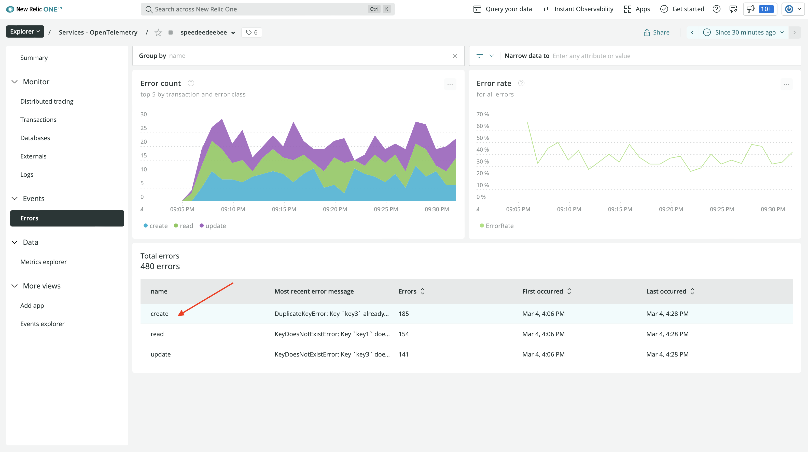

</Step>

<Step>

Click a trace:

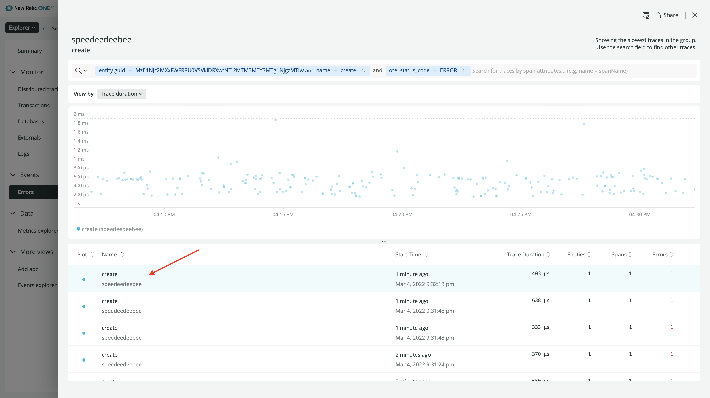

</Step>

<Step>

Click the span:

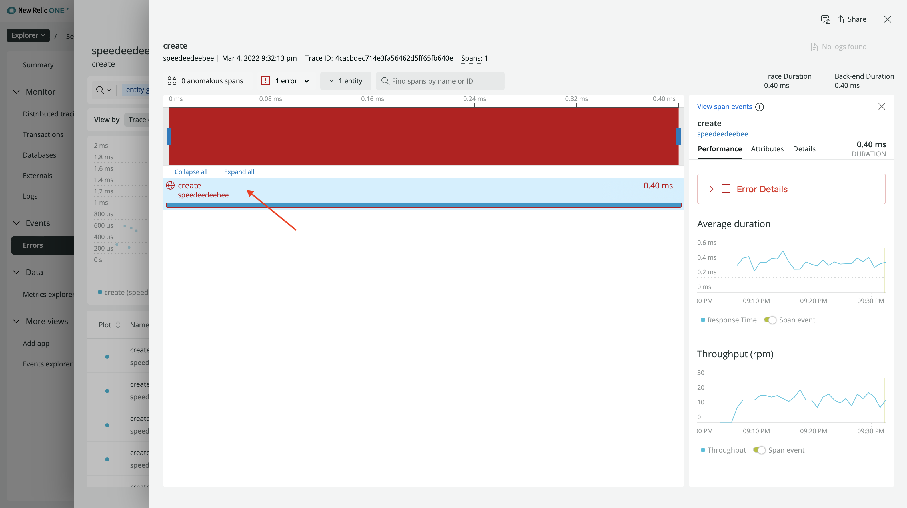

Here, you see a lot of the same information you saw in the span details, but there's also a new **Error Details** button.

</Step>

<Step>

Click **Error Details**:

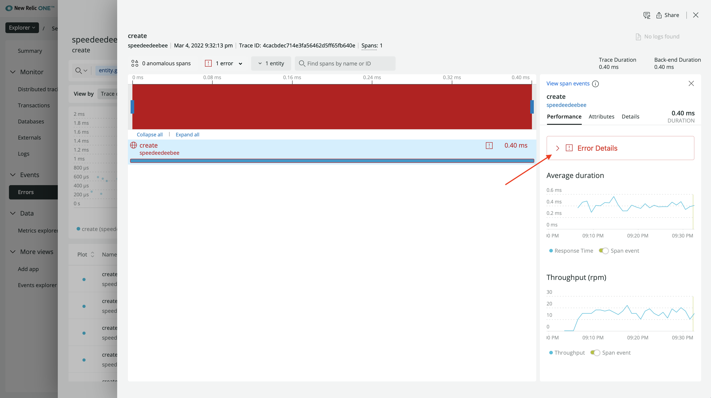

Here, you see the details of the exception span event:

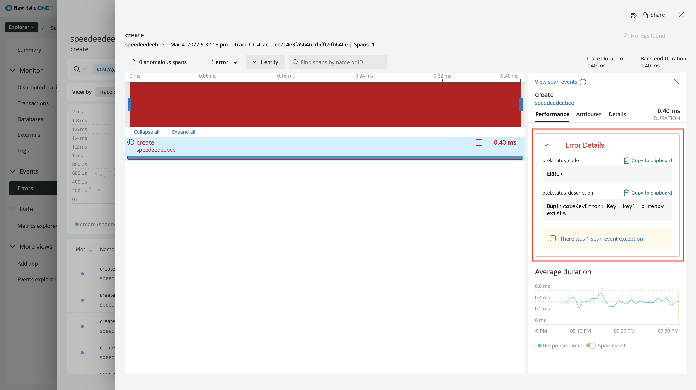

These details include the exception's status code and status description. With this, you know that your users are frequently making `create()` calls for keys that already exist in the database.

This is great information, but you can see more, including the stack trace of the exception, to further assess the errors.

</Step>

<Step>

Click **There was 1 span event exception** to see further details about your exception:

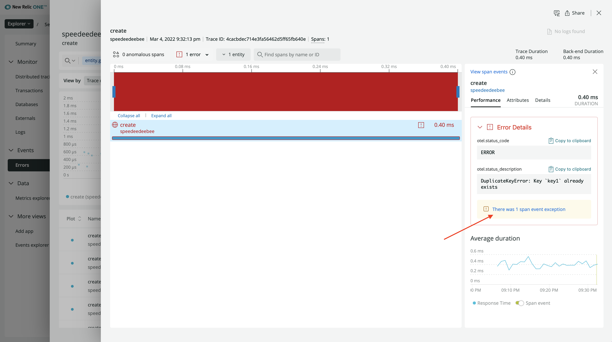

Here, you see more details about your exception, including its stack trace, type, and timestamp:

After reviewing this information, you decide that this isn't an error at all, it's a feature. You designed your database to only allow creates on new keys, which is logical. This shouldn't be captured as an error in your code. Doing so could make real errors harder to see.

</Step>

</Steps>

The reason this is captured as an exception span event in your application is because the context manager that you used automatically records data about uncaught exceptions as span events. To prevent this from happening, while still providing yourself the option of seeing these events, you need to update your code to store a custom span event.

<Callout variant="course" title="lab">

This procedure is part of a lab that teaches you how to instrument your application with OpenTelemetry. Now that you've viewd your data in New Relic, [adjust your instrumentation to record a custom span event](/collect-data/opentelemetry-manual/custom-span-event).

</Callout>
