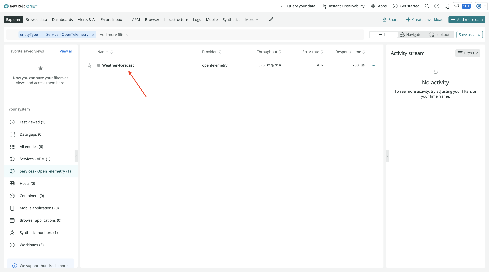
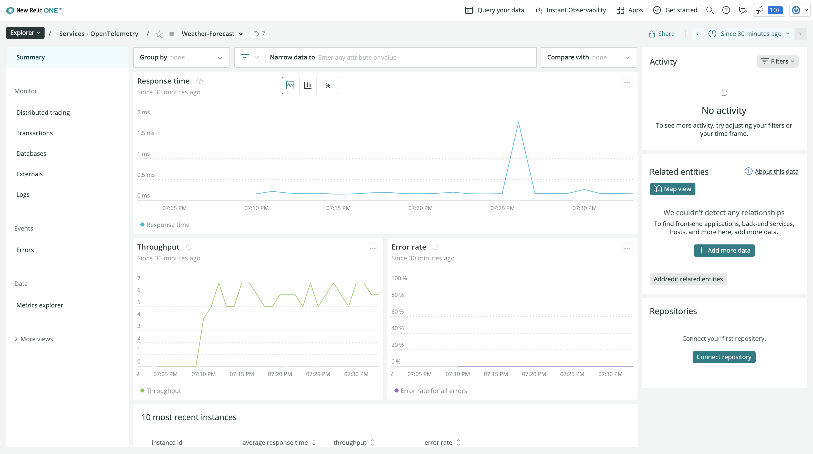
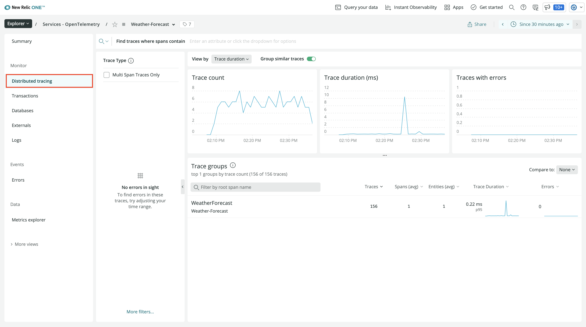
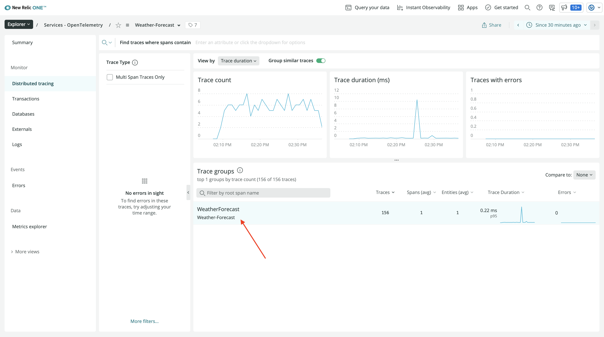
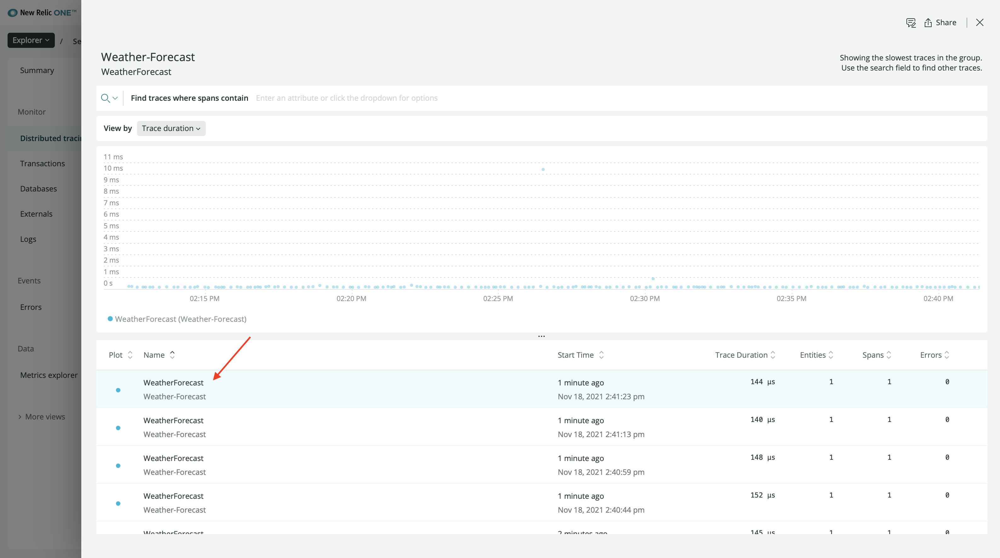
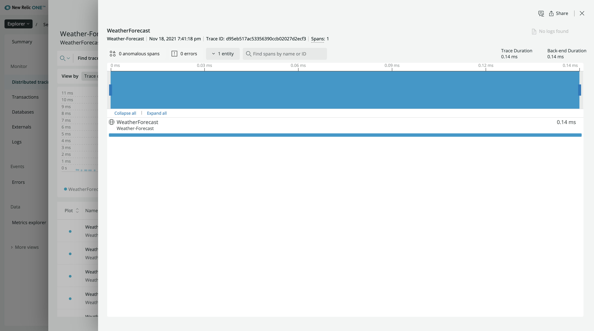
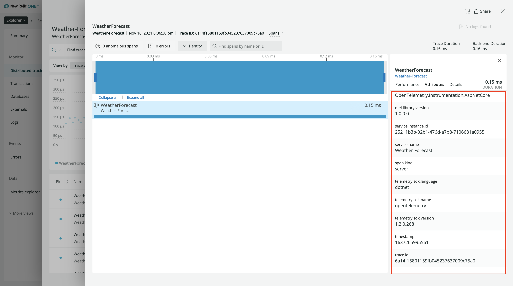
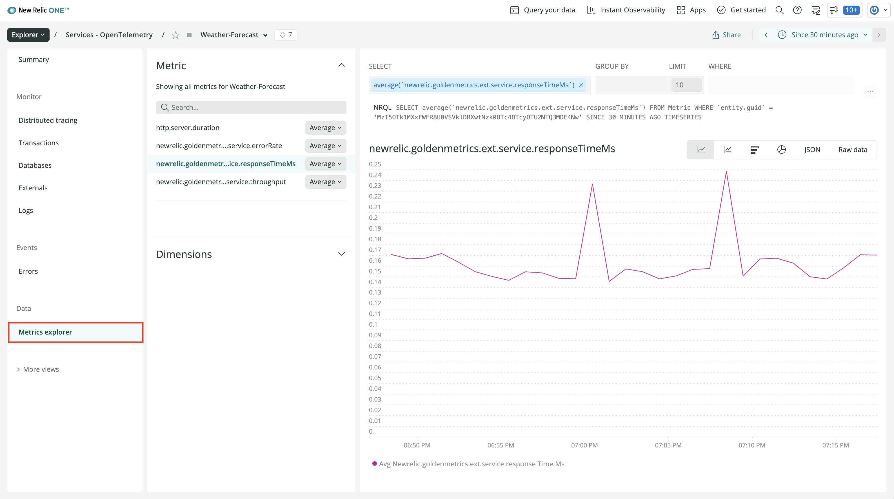

<Callout variant="course" title="lab">

This procedure is part of a lab that teaches you how to instrument your application with OpenTelemetry.

Each procedure in the lab builds upon the last, so make sure you've completed the last procedure, [_Instrument your application with OpenTelemetry_](/collect-data/opentelemetry/instrument), before starting this one.

</Callout>

You've instrumented your weather forecast application with OpenTelemetry and you're sending metric and trace data to New Relic.

Here, you move to New Relic to see the kinds of detailed telemetry data that OpenTelemetry was able to collect automatically with just a few lines of SDK code.

## View your data

<Steps>

<Step>

Log into [New Relic](https://one.newrelic.com).

</Step>

<Step>

In the entity explorer, click the **Weather-Forecast** OpenTelemetry service:

This brings you to a service view that shows trace data from your application, including:

- Response time
- Throughput
- Error rate

</Step>

<Step>

In the left-hand navigation, click **Distributed tracing**:

This shows trace data that the OpenTelemetry SDK automatically captured in your service, such as:

- Trace count
- Trace duration
- Trace groups

</Step>

<Step>

Under **Trace groups** click the **WeatherForecast** group:

This group shows similar traces. Since your application has only one endpoint, all traces are grouped together.

</Step>

<Step>

Click one of the traces:

Because your weather application is simple, there is only one span in the trace.

</Step>

<Step>

Click on the span:

Here, you see information about the particular span, including not only performance metrics, but also attributes that OpenTelemetry sent.

</Step>

<Step>

Click **Attributes**:

You configured many of the attributes you see here in your SDK code.

</Step>

<Step>

While New Relic doesn't yet have a curated experience for .NET OpenTelemetry metrics data, you can see the metrics in the metrics explorer:

</Step>

</Steps>

## Summary

As the developer of WeatherForecast, you've now instrumented your application with OpenTelemetry to send automatically collected metrics and traces to New Relic. And because you instrumented your app with OpenTelemetry instead of a .NET agent, you are more flexible in how you can use your data. For example, if you want to add additional backend data sources besides New Relic, you can easily change that without having to add another vendor-specific agent.

## Homework

Now that you know how to instrument a .NET application with OpenTelemetry and send that data to New Relic, here are some things you can do next to familiarize yourself even more with New Relic and OpenTelemetry:

- Check out our [repository of OpenTelemetry examples](https://github.com/newrelic/newrelic-opentelemetry-examples)
- Learn more about [OpenTelemetry's .NET SDK](https://github.com/open-telemetry/opentelemetry-dotnet)
- Read our [documentation on New Relic + OpenTelemetry](https://docs.newrelic.com/docs/more-integrations/open-source-telemetry-integrations/opentelemetry/introduction-opentelemetry-new-relic/)
