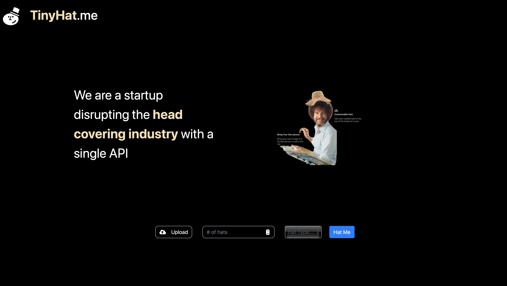
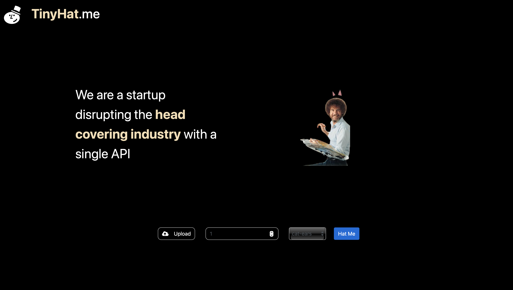

<Callout variant="course" title="lab">

This procedure is part of a lab that teaches you how to monitor your Kubernetes cluster with Pixie.

Each procedure in the lab builds upon the last, so make sure you've completed the last procedure, [_Set up your TinyHat environment_](/collect-data/pixie/set-up-env), before starting this one.

</Callout>

Your website, TinyHat.me, runs in Kubernetes. While Pixie helps you monitor your cluster and find the source of problems that arise within it, it's helpful to know about your cluster's structure and the components that make it up before learning how to use Pixie.

<Steps>

<Step>

View your pods:

<>

```bash
kubectl get pods
[output] NAME                                    READY   STATUS    RESTARTS   AGE
[output] add-service-5487c78c86-rsx2n            1/1     Running   0          10m
[output] admin-service-7cdcb754c9-blwpf          1/1     Running   0          10m
[output] fetch-service-68d9876b8b-2tb45          1/1     Running   5          10m
[output] frontend-service-649f75984b-xdgtg       1/1     Running   0          10m
[output] gateway-service-6bcb8bc8d5-hwxcl        1/1     Running   0          10m
[output] manipulation-service-75c4454b5d-687tf   1/1     Running   0          10m
[output] moderate-service-55985878d-td2tl        1/1     Running   0          10m
[output] mysql-576f9d87d9-45cc4                  1/1     Running   0          10m
[output] simulator-554c8577-5nn52                1/1     Running   0          10m
[output] upload-service-7f68c55ddc-d5kd5         1/1     Running   0          10m
```

</>

<Callout variant="tip">

Every pod should be running by now, but if one isn't, give it few more minutes.

</Callout>

Here, you see nine containerized services and one simulator, each with their own pod. Instead of going into detail about the services now, you'll learn about them in context as you walk through this lab's scenarios. The simulator generates load to your website so you don't have to.

</Step>

<Step>

View your services next:

<>

```bash
[output] NAME                   TYPE           CLUSTER-IP       EXTERNAL-IP      PORT(S)        AGE
[output] add-service            ClusterIP      10.108.136.0     <none>           80/TCP         13m
[output] admin-service          ClusterIP      10.108.79.227    <none>           80/TCP         13m
[output] fetch-service          ClusterIP      10.97.60.129     <none>           80/TCP         13m
[output] frontend-service       LoadBalancer   10.106.184.90    10.106.184.90    80:32327/TCP   13m
[output] gateway-service        LoadBalancer   10.108.122.133   10.108.122.133   80:30691/TCP   13m
[output] kubernetes             ClusterIP      10.96.0.1        <none>           443/TCP        15m
[output] manipulation-service   ClusterIP      10.102.93.91     <none>           80/TCP         13m
[output] moderate-service       ClusterIP      10.107.191.29    <none>           80/TCP         13m
[output] mysql                  ClusterIP      10.96.37.225     <none>           3306/TCP       13m
[output] upload-service         ClusterIP      10.96.216.177    <none>           80/TCP         13m
```

</>

Here, you see your Kubernetes services. Notice that most of your app services have a corresponding Kubernetes service. One of these services is particularly important: `frontend-service`. This is a `LoadBalancer` that you connect to when you view your site.

</Step>

<Step>

Speaking of viewing your site, do that now by opening the `EXTERNAL-IP` that you see for `frontend-service` in your browser:



<Callout variant="important">

If the frontend service's `External-IP` is pending, you probably forgot to `minikube tunnel` in another window.

</Callout>

</Step>

<Step>

Select a number of hats to display and a hat type. Then, select **Hat Me**:



Now Bob Ross is wearing the hat(s) that you selected. Cool, right?

</Step>

</Steps>

With a better understanding of your cluster's resources and your website, you're better prepared to install Pixie and use it to monitor and debug your application when problems arise.

<Callout variant="course" title="lab">

This procedure is part of a course that teaches you how to monitor your Kubernetes cluster with Pixie. Now that you've explored your cluster, [instrument it with Pixie](/collect-data/pixie/instrument-cluster).

</Callout>
