<Callout variant="course" title="lab">

This procedure is part of a lab that teaches you how to monitor your Kubernetes cluster with Pixie.

Each procedure in the lab builds upon the last, so make sure you've completed the last procedure, [_Explore your cluster_](/collect-data/pixie/explore-cluster), before starting this one.

</Callout>

As the developer of TinyHat.me, you need to have visibility into your cluster. You need to know how healthy your application is. You need to know when things go wrong. But you've put it off for so long because instrumenting Kubernetes is hard and time-consuming. This is one of the things that makes Pixie so valuable.

Pixie is a [CNCF open source](https://www.cncf.io/projects/pixie/) Kubernetes monitoring solution that provides:

- Automatic and instant baseline observability of your cluster
- Actionable, code-level insights of your applications

With Pixie's auto-telemetry, you'll [instrument your cluster](https://docs.newrelic.com/docs/auto-telemetry-pixie/install-auto-telemetry-pixie/) in minutes to get dynamic data such as protocol traces, resource metrics, and app metrics from your cluster—[all without an agent](https://docs.pixielabs.ai/about-pixie/pixie-ebpf/)!

<Callout variant="tip">

If you haven't signed into [New Relic](one.newrelic.com), do that now so you're ready to install Pixie into your cluster.

</Callout>

<Steps>

<Step>

Open [New Relic](https://one.newrelic.com). On the right side of the upper navigation bar, click **Add more data**:

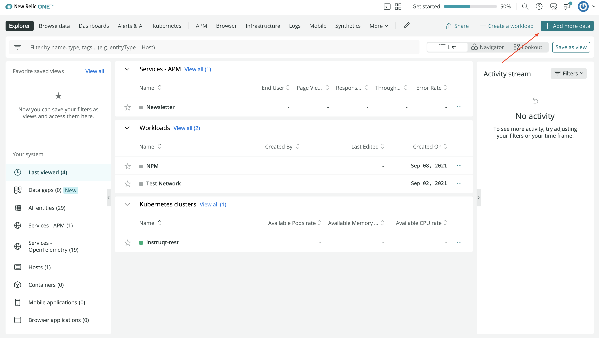

</Step>

<Step>

Click **Guided install**:

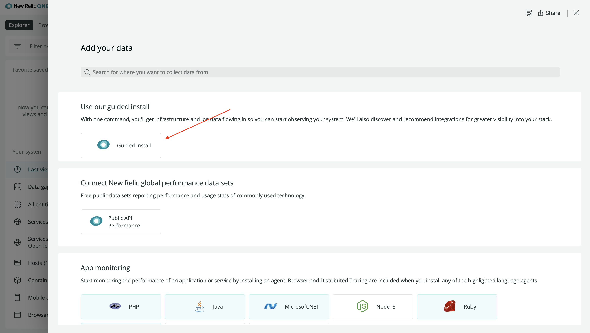

This walks you through the installation process.

</Step>

<Step>

Click **Kubernetes** to let New Relic guide you through instrumenting your Kubernetes cluster:

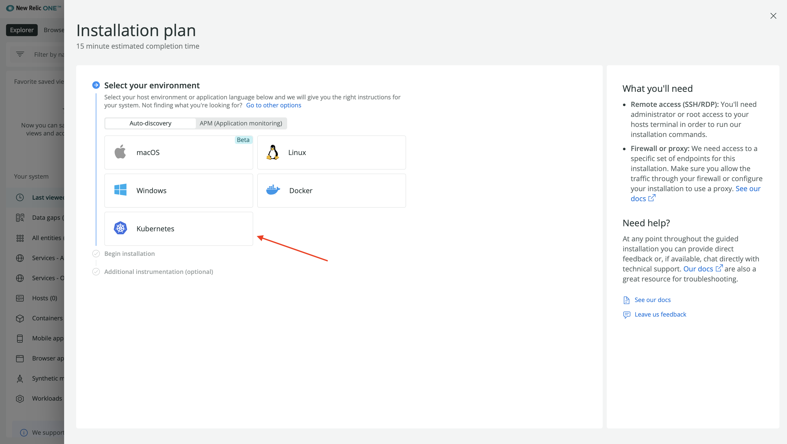

</Step>

<Step>

Click **Begin installation**:

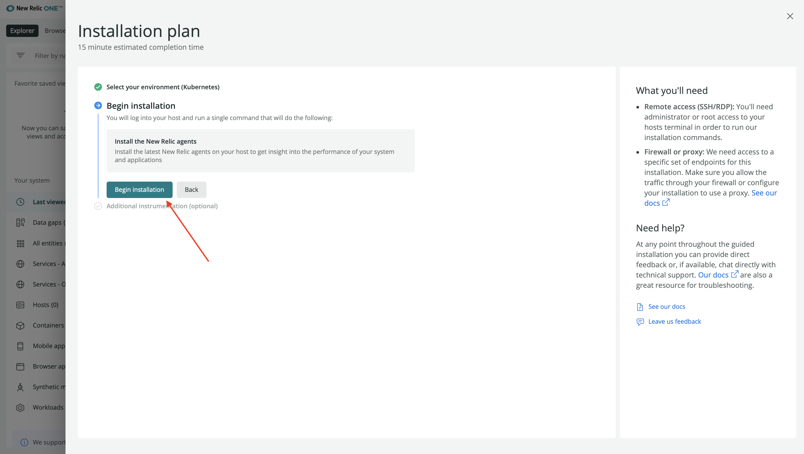

</Step>

<Step>

Select your account, name your cluster "tiny-hat", and click **Continue**:

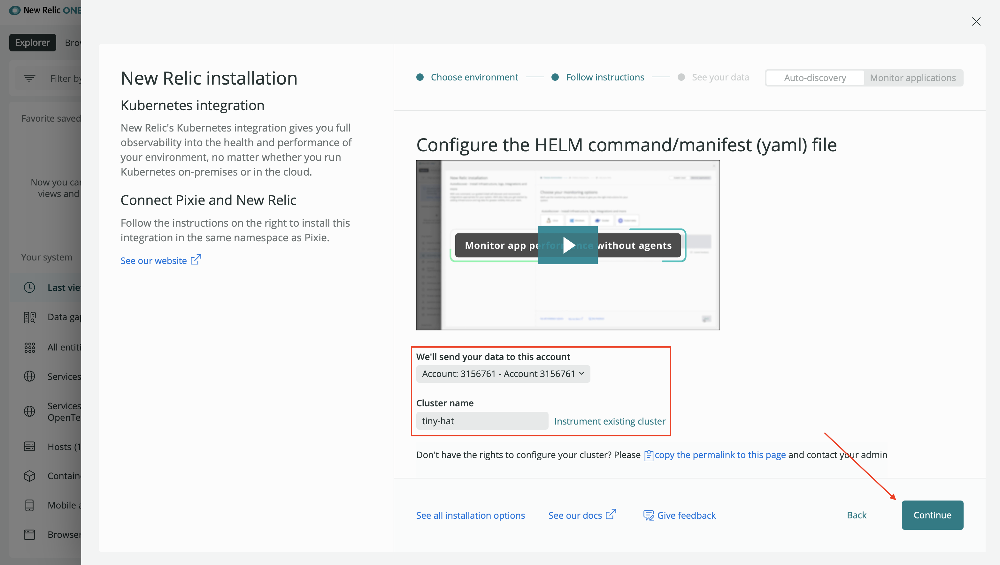

This specifies that TinyHat.me, and all its services, should live in a New Relic cluster called "tiny-hat" in the account you selected.

</Step>

<Step>

Leave the default choices on the next screen. These provide a [range of observability features](https://docs.newrelic.com/docs/kubernetes-pixie/kubernetes-integration/installation/kubernetes-integration-install-configure/) for your cluster, including our infrastructure agent which gives you a high level overview of the health of your cluster. Notably, the default options include "Instant service-level insights, full-body requests, and application profiles through Pixie" which you focus on in this lab.

Click **Continue**:

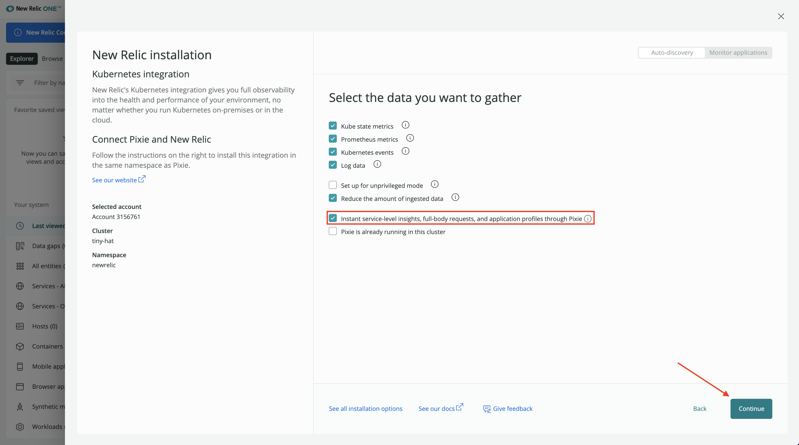

In the next screen, you see a command for installing our Kubernetes integration into your cluster.

</Step>

<Step>

Click **Copy command**:

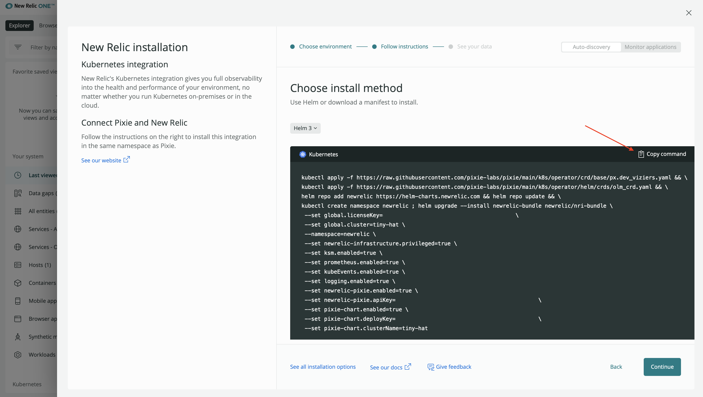

Now you're ready to install Pixie into your cluster.

</Step>

<Step>

Switch back to your terminal and paste the Helm command.

</Step>

<Step>

While you're installing Pixie, switch back to New Relic and click **Continue** to progress your guided installation to the final step. Here, you see a message that says "Listening for data":

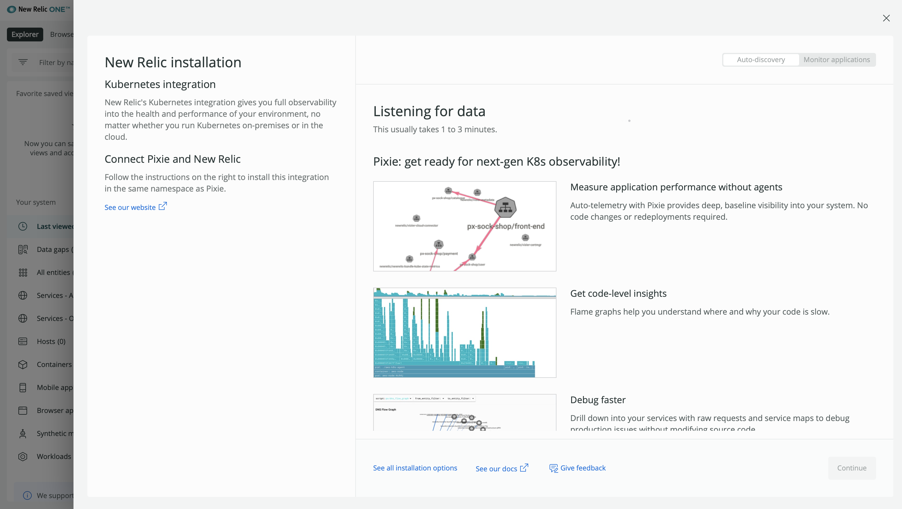

In a few minutes, Helm will have fully installed the necessary charts. You should see a message with the name, deployed date, namespace, and more:

<>

```bash copyable=false
[output] NAME: newrelic-bundle
[output] LAST DEPLOYED: Thu Sep 23 13:50:24 2021
[output] NAMESPACE: newrelic
[output] STATUS: deployed
[output] REVISION: 1
[output] TEST SUITE: None
```

</>

Soon after that, the New Relic page updates to tell you that we're receiving data from your cluster:

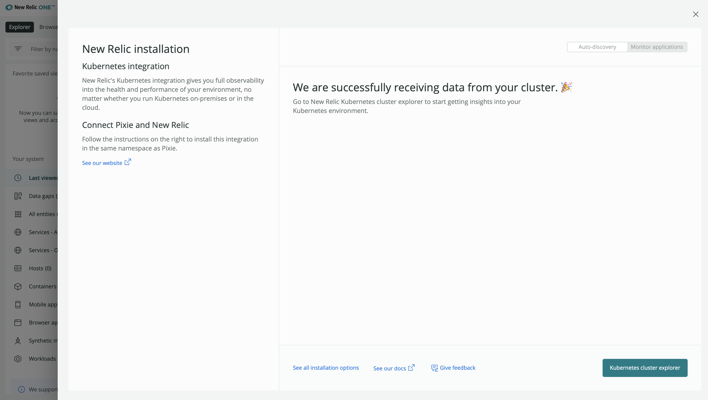

</Step>

<Step>

Click **Kubernetes cluster explorer** to see your nodes, pods, deployments and a host of other data about your cluster, all in one view:

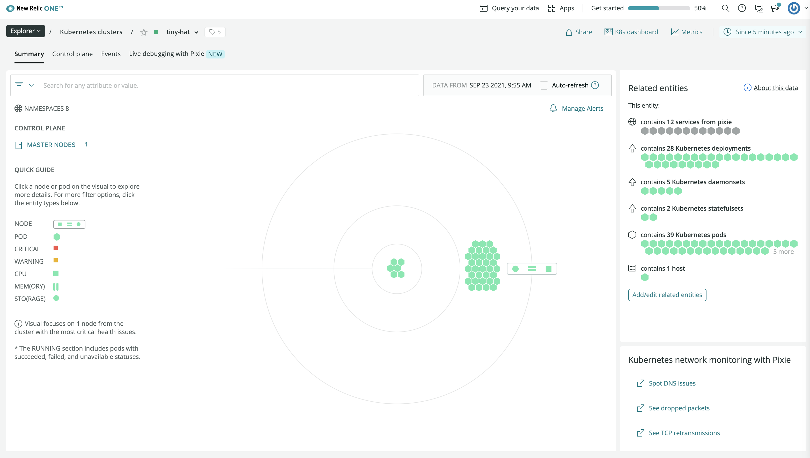

<Callout variant="important">

You may see an error message, "We're receiving incomplete data for this cluster." Please wait a few more minutes and refresh the page to see your cluster.

</Callout>

In minutes, you were able to instrument your entire cluster without having to install language-specific agents or specify detailed cluster information!

On top of all the data you see in the cluster explorer, click a pod or a node to dig deeper and see the granular data that the infrastructure agent was able to access near-instantly:

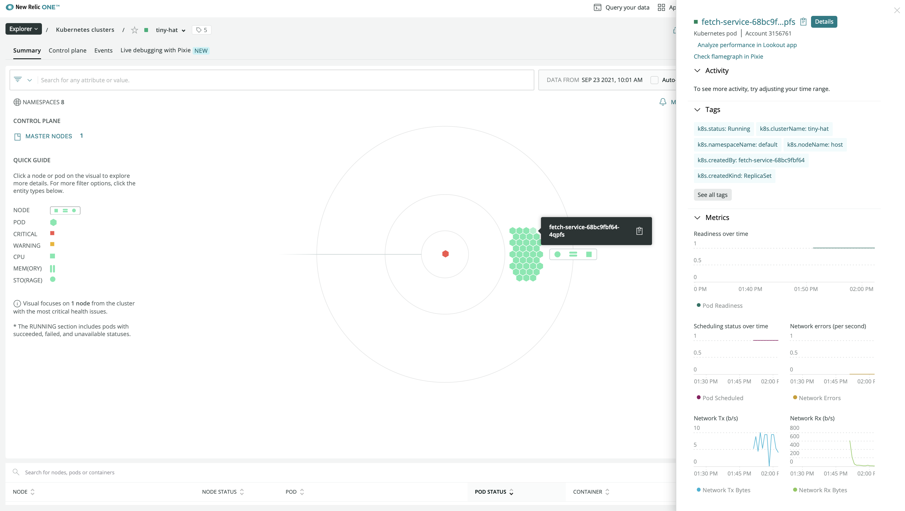

</Step>

</Steps>

<Callout variant="course" title="lab">

This procedure is part of a lab that teaches you how to monitor your Kubernetes cluster with Pixie. Now that you've instrumented your cluster, [use Pixie to debug your application](/collect-data/pixie/scenario-1).

</Callout>
