test

<Callout variant="course" title="lab">

This procedure is part of a lab that teaches you how to monitor your Kubernetes cluster with Pixie.

Each procedure in the lab builds upon the last, so make sure you've completed the last procedure, [_Instrument your cluster_](/collect-data/pixie/instrument-cluster), before starting this one.

</Callout>

Until now, you've been working with application services that don't have bugs (we hope). You've been able to access TinyHat.me and render Bob Ross with one or more silly hats without a hitch. But it's time to deploy some new code to your cluster.

Change to the `scenario-1` branch and set up your environment:

<>

```bash
git checkout scenario-1
./setup.sh
[output] Switched to branch 'scenario-1'
[output] Please wait while we update your lab environment.
[output] deployment.apps/fetch-service configured
[output] Done!
```

</>

Uh oh! You look on social media and see some confused customers:

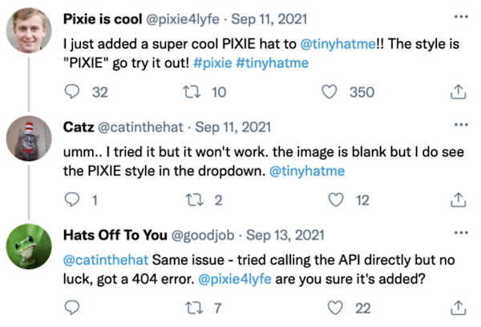

What's wrong with TinyHat.me? Use Pixie to find out.

## Reproduce the issue

You've been notified by your users that they can't see a particular hat on TinyHat.me. Before you start debugging your code, reproduce the issue for yourself.

<Steps>

<Step>

Look up your frontend's external IP address:

<>

```bash
kubectl get services
[output] NAME                   TYPE           CLUSTER-IP       EXTERNAL-IP      PORT(S)        AGE
[output] add-service            ClusterIP      10.109.114.34    <none>           80/TCP         20m
[output] admin-service          ClusterIP      10.110.29.145    <none>           80/TCP         20m
[output] fetch-service          ClusterIP      10.104.224.242   <none>           80/TCP         20m
[output] frontend-service       LoadBalancer   10.102.82.89     {green}10.102.82.89     {normal}80:32161/TCP   20m
[output] gateway-service        LoadBalancer   10.101.237.225   10.101.237.225   80:32469/TCP   20m
[output] kubernetes             ClusterIP      10.96.0.1        <none>           443/TCP        20m
[output] manipulation-service   ClusterIP      10.107.23.237    <none>           80/TCP         20m
[output] moderate-service       ClusterIP      10.105.207.153   <none>           80/TCP         20m
[output] mysql                  ClusterIP      10.97.194.23     <none>           3306/TCP       20m
[output] upload-service         ClusterIP      10.108.113.235   <none>           80/TCP         20m
```

</>

</Step>

<Step>

Paste the IP in your browser:


This looks the same as it did before, except that there's a new hat style, called PIXIE.

</Step>

<Step>

Select a number of hats, the PIXIE style, and **Hat me**:

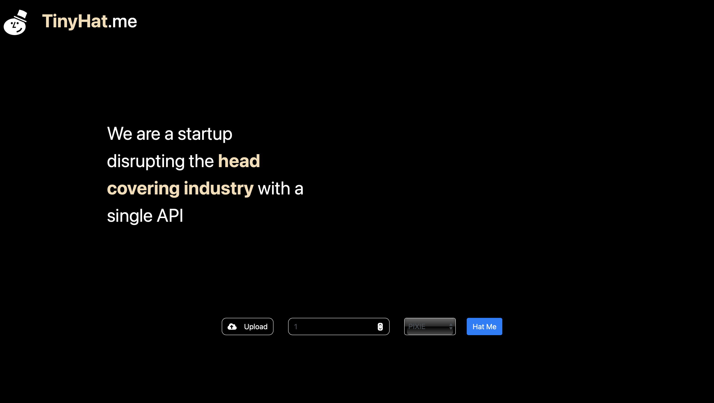

Oops! Where did Bob go? Instead of rendering Bob Ross with your hat selection, the frontend served no image at all.

<Callout variant="tip">

The number of hats you choose to display has no effect on the result.

</Callout>

</Step>

<Step>

Observe a network request in your browser's developer tools:

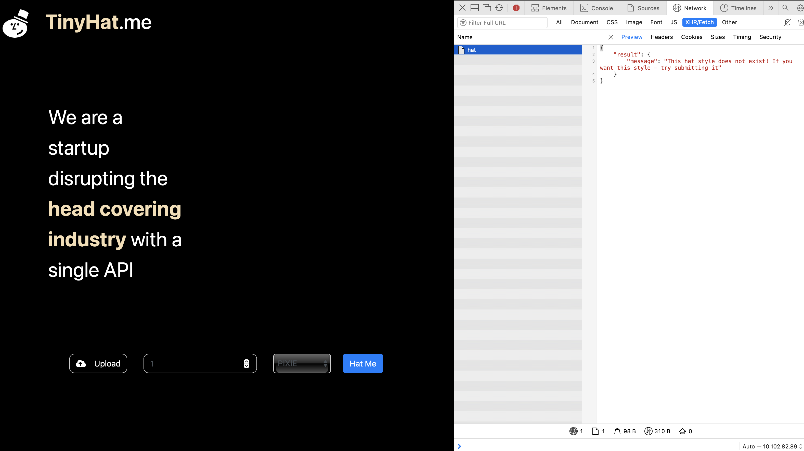

Here, the response from the image request says, "This hat style does not exist! If you want this style - try submitting it."

You know that the PIXIE hat style most certainly does exist because you chose it from the selector. But for some reason, the application can't render the image.

</Step>

<Step>

For good measure, try to render a different hat style:


It worked! Your users were right. There's something wrong with your application.

</Step>

</Steps>

## Solve the mystery with Pixie

The bad news is that you've confirmed there's an error in your application. The good news is that you recently instrumented your cluster with Pixie! Go to New Relic and sign into your account, if you haven't already.

<Steps>

<Step>

From the New Relic homepage, go to **Kubernetes**:


</Step>

<Step>

Choose your **tiny-hat** cluster:


</Step>

<Step>

Then click **Live Debugging with Pixie**:


This is Pixie's live, code-level debugger:

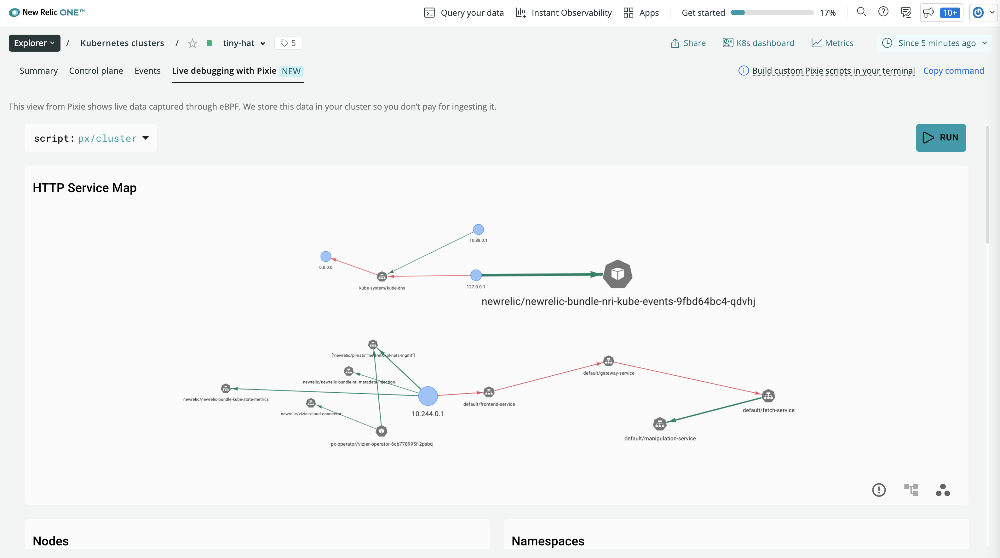

You use it to drill down and learn more about the services in your cluster.

<Callout variant="important">

When you go to the live debugger, you may see an error saying your cluster is disconnected. This is normal, as it takes a little while for New Relic to start seeing your Pixie data. Wait a few more minutes and refresh the debugger.

</Callout>

</Step>

<Step>

Notice the **script** dropdown menu at the top of the debugger:


Pixie's live debugger renders data based on open source scripts written in PxL, [a proprietary scripting language](https://docs.pixielabs.ai/tutorials/pxl-scripts/write-pxl-scripts). The default script is `px/cluster`, which shows cluster-level information including:

- A service graph
- Nodes
- Namespaces
- Services
- Pods

</Step>

<Step>

Scroll down to see the error rates for your services:

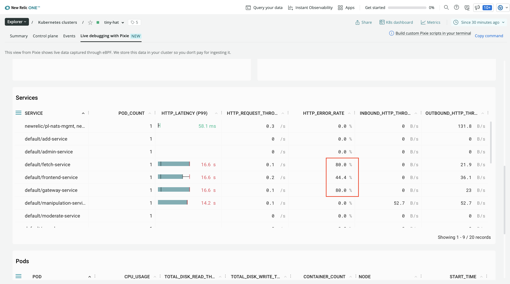

Yikes! You have three services returning a high percentage of errors:

- fetch-service
- frontend-service
- gateway-service

<Callout variant="tip">

If your data doesn't show any requests, switch back to your frontend, and try to render the PIXIE hat again a few times.

</Callout>

You know that the website lives at `frontend-service`. You can reasonably rule this out as the culprit because you know it renders other hats just fine. That leaves two potential problem services:

- `gateway-service`
- `fetch-service`

</Step>

<Step>

To decide which service to look at first, scroll back up to the service graph:

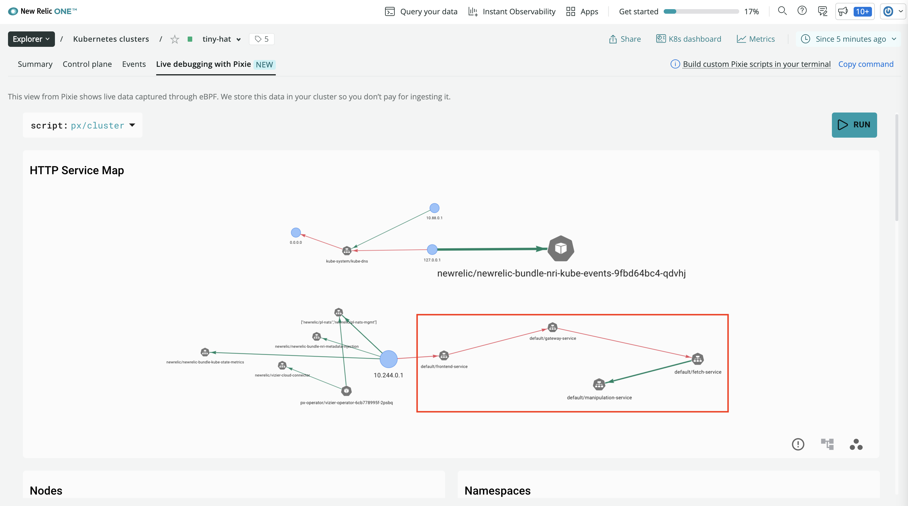

Here, you see that the `frontend-service` requests data from `gateway-service`. In turn, `gateway-service` requests data from `fetch-service`. So, following that order of operations, focus first on the `gateway-service`.

</Step>

<Step>

Double click the **gateway-service** in your service graph to learn more about it:

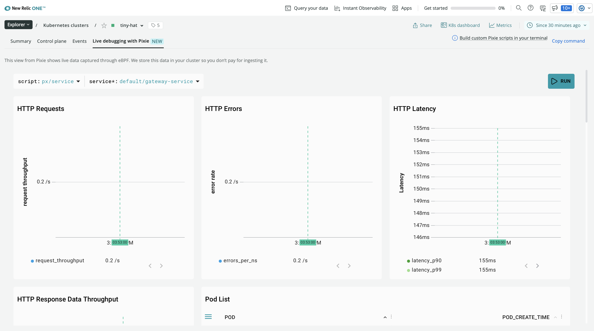

Notice that Pixie's live debugger has seamlessly replaced cluster data with service data by changing the script:

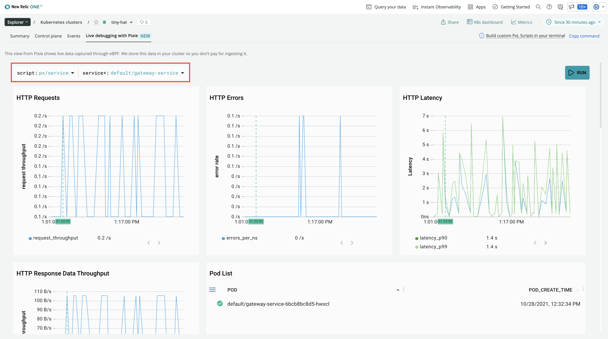

You're now using the `px/service` script filtered down to `default/gateway-service`. In this service, you see a graph with the errors, but not much about where those errors are coming from.

</Step>

<Step>

Click the script selector to switch to the `px/service_stats` script. Filter the **svc** to `default/gateway-service`:

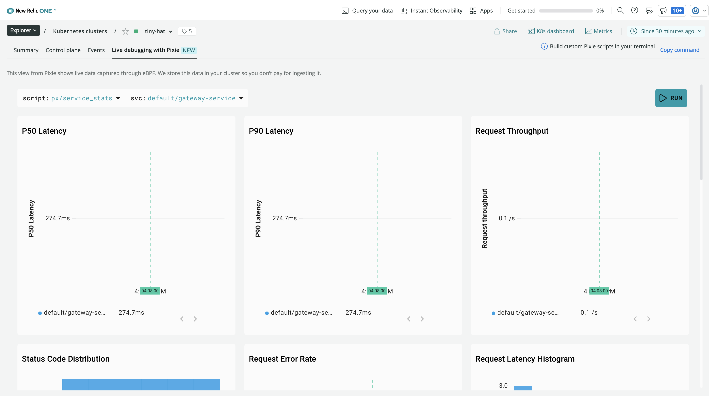

This gives a better picture of the errors in your service.

Scroll down to the **Incoming Traffic** and **Outgoing Traffic** tables:

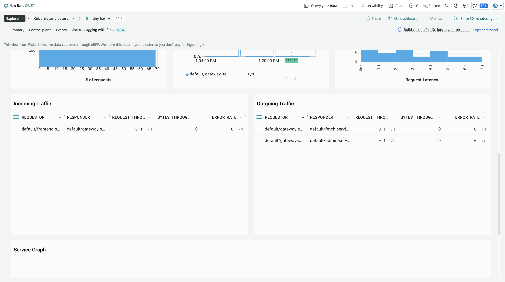

The gateway service is returning the same amount of errors on inbound requests as it's receiving from outbound requests to the fetch service. This is a good indicator that you need to look at what's happening upstream.

Switch to the `px/http_data_filtered` script, targeting `default/fetch-service` and requests with a 400 response status code:

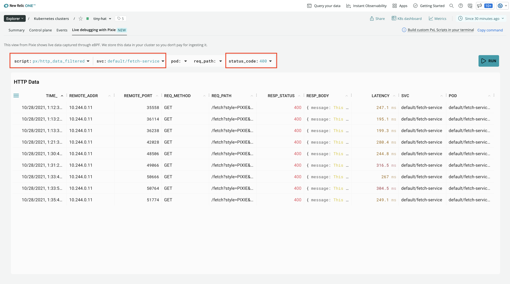

<Callout variant="tip">

If you don't see any rows, switch back to your frontend, and try to render the PIXIE hat again a few times.

</Callout>

Click on the row to learn more about requests to the fetch service that result in errors:

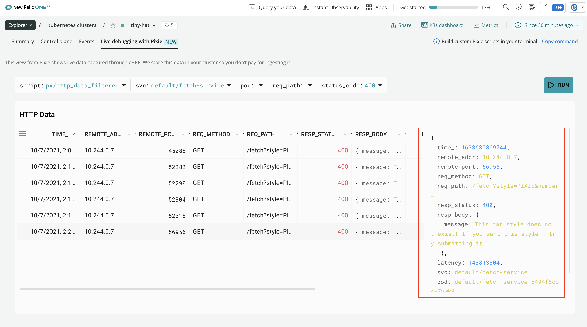

Here, you see that the request path looks like `/fetch?style=PIXIE&number=1`. This looks right, because the hat style you chose is called `PIXIE`. So if the fetch service is still returning 400s, something wrong is happening when it tries to find the hat.

Switch to the `px/mysql_data` script and add a source filter for `default/fetch-service`:

Many of these queries are returning no results. Click on one and look at the `req_body` to see the query:

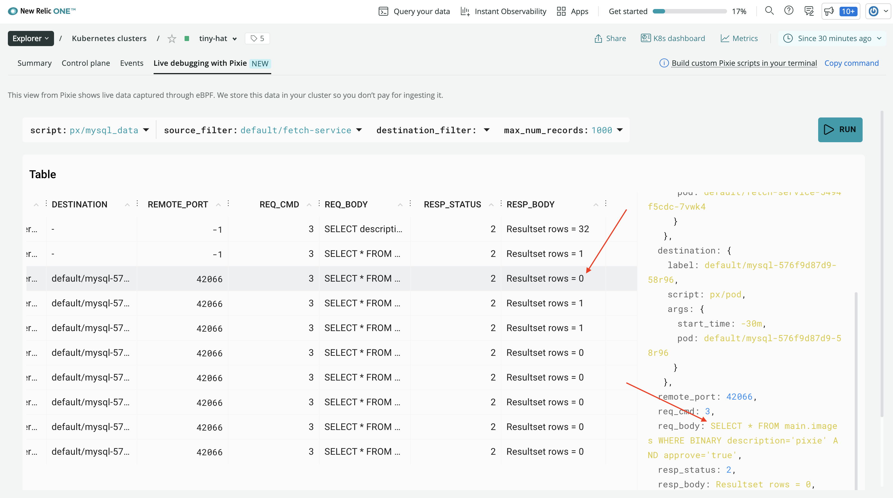

<>

```sql
SELECT * FROM main.images WHERE BINARY description='pixie' AND approve='true'
```

</>

There's the problem! The `BINARY` type cast effectively makes the `WHERE` condition case sensitive. Since the hat's style is called `PIXIE`, this condition fails to find it. Now that you know, you can fix this query in your fetch service.

## Summary

To recap, you observed an error in your application and used Pixie in New Relic to:

1. Understand your services' relationships
2. Review the error percentages for each of your services
3. Look at individual response bodies
4. Find a semantic error in a query within one of those services

And you didn't even need to individually install agents in any of your services. Pixie was able to deliver all the information you needed!

</Step>

</Steps>

<Callout variant="course" title="lab">

This lesson is part of a lab that teaches you how to monitor your Kubernetes cluster with Pixie. Next, try to [figure out why some APIs have high latency](/collect-data/pixie/scenario-2).

</Callout>