<Callout variant="course" title="lab">

This procedure is part of a lab that teaches you how to monitor your Kubernetes cluster with Pixie.

Each procedure in the lab builds upon the last, so make sure you've completed the last procedure, [_Debug missing images in your service_](/collect-data/pixie/scenario-1), before starting this one.

</Callout>

After fixing your last TinyHat.me bug, you and your team are feeling confident. It's time to push your next release to production.

Change to the `scenario-2` directory and set up your environment:

<>

```bash
cd ../scenario-2
./setup.sh
[output] Please wait while we update your lab environment.
[output] deployment.apps/admin-service configured
[output] deployment.apps/fetch-service configured
[output] deployment.apps/frontend-service configured
[output] deployment.apps/simulator configured
[output] Done!
```

</>

Now that you've released your new code, it's time to check Twitter for some user feedback:

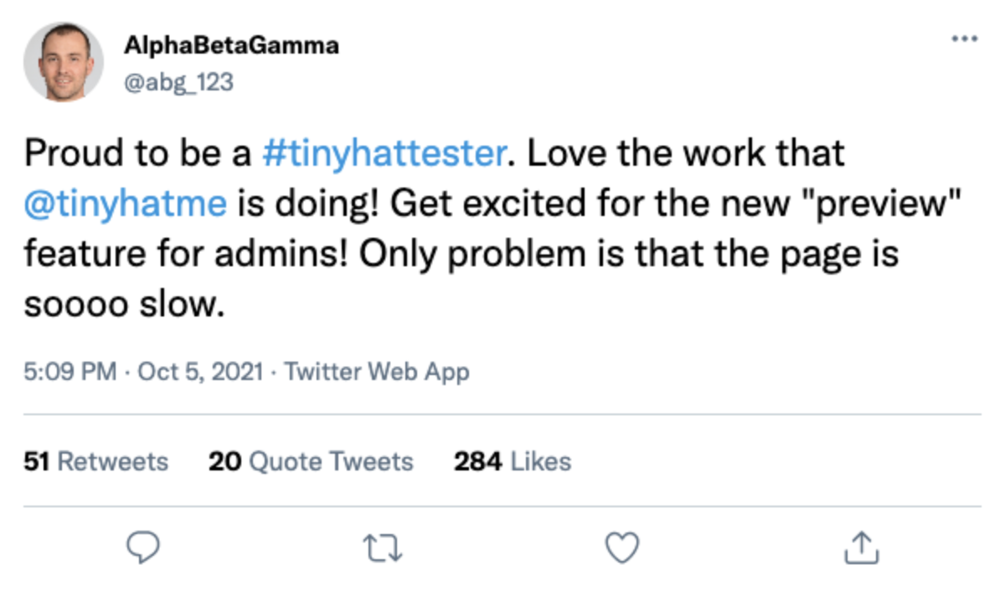

Oh no! The admin page seems to be slow.

## Reproduce the issue

You've been notified by your users that the TinyHat admin page is running slowly. Reproduce the issue for yourself.

<Steps>

<Step>

Look up your frontend's external IP address:

<>

```bash
kubectl get services
[output] NAME                   TYPE           CLUSTER-IP       EXTERNAL-IP      PORT(S)        AGE
[output] add-service            ClusterIP      10.109.114.34    <none>           80/TCP         20m
[output] admin-service          ClusterIP      10.110.29.145    <none>           80/TCP         20m
[output] fetch-service          ClusterIP      10.104.224.242   <none>           80/TCP         20m
[output] frontend-service       LoadBalancer   10.102.82.89     {green}10.102.82.89     {normal}80:32161/TCP   20m
[output] gateway-service        LoadBalancer   10.101.237.225   10.101.237.225   80:32469/TCP   20m
[output] kubernetes             ClusterIP      10.96.0.1        <none>           443/TCP        20m
[output] manipulation-service   ClusterIP      10.107.23.237    <none>           80/TCP         20m
[output] moderate-service       ClusterIP      10.105.207.153   <none>           80/TCP         20m
[output] mysql                  ClusterIP      10.97.194.23     <none>           3306/TCP       20m
[output] upload-service         ClusterIP      10.108.113.235   <none>           80/TCP         20m
```

</>

</Step>

<Step>

Go to the admin page of your site:

<>

```
<EXTERNAL-IP>/admin?password=ilovecats
```

</>

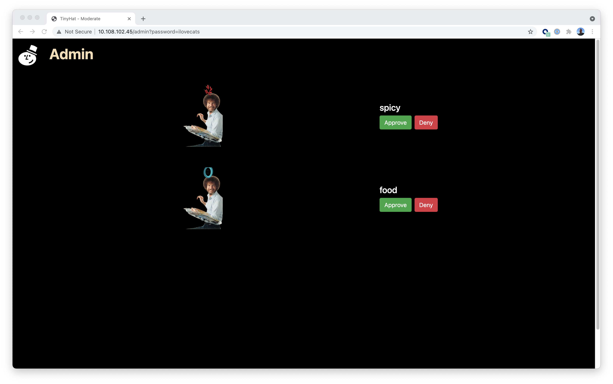

The page should load in between 5 and 10 seconds:

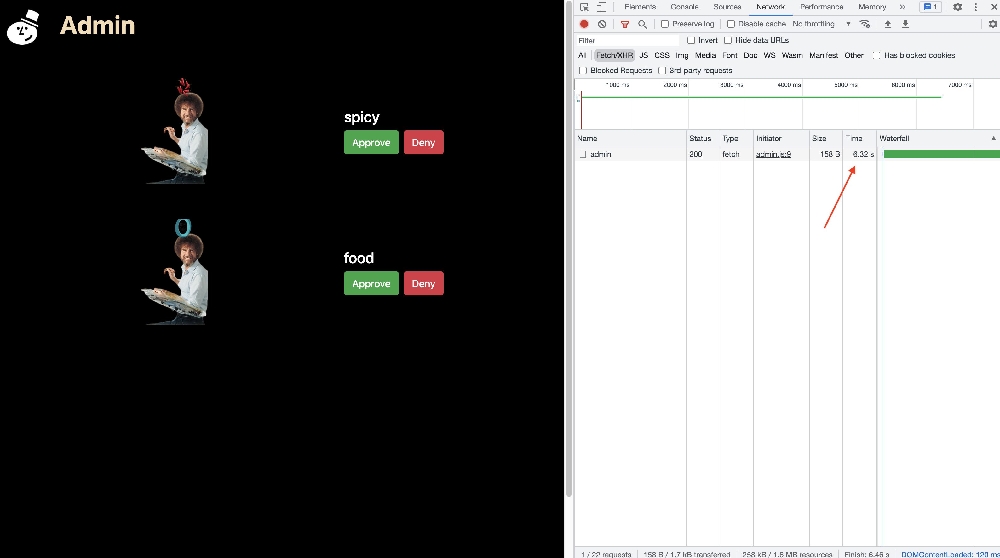

Once again, your users were right. Why is your admin site taking so long to load? Use Pixie to find out!

</Step>

</Steps>

## Hunt for the slowness with Pixie

Five seconds is too long for your admin page to load. You can use Pixie to discover the source of the delay.

<Steps>

<Step>

From the New Relic homepage, go to **Kubernetes**:

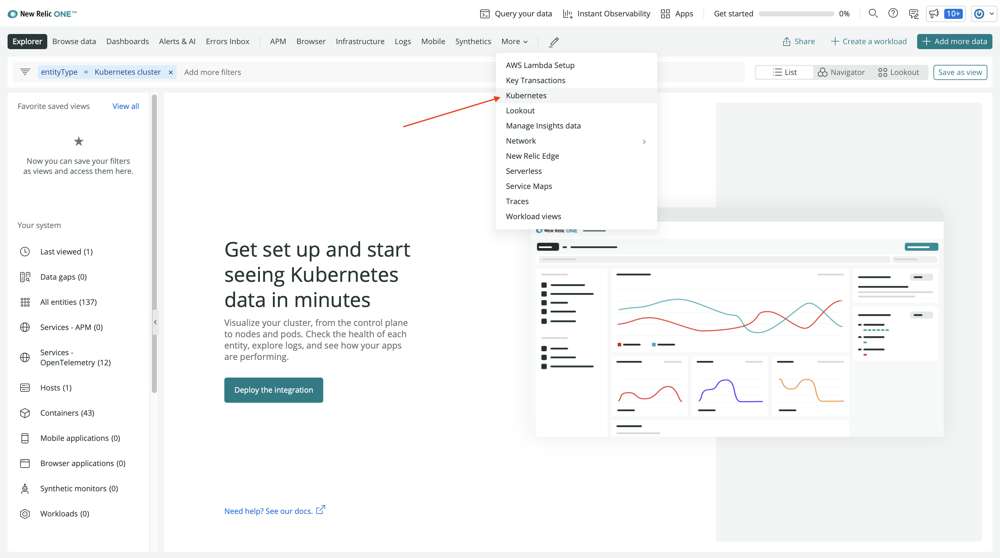

</Step>

<Step>

Choose your **tiny-hat** cluster:

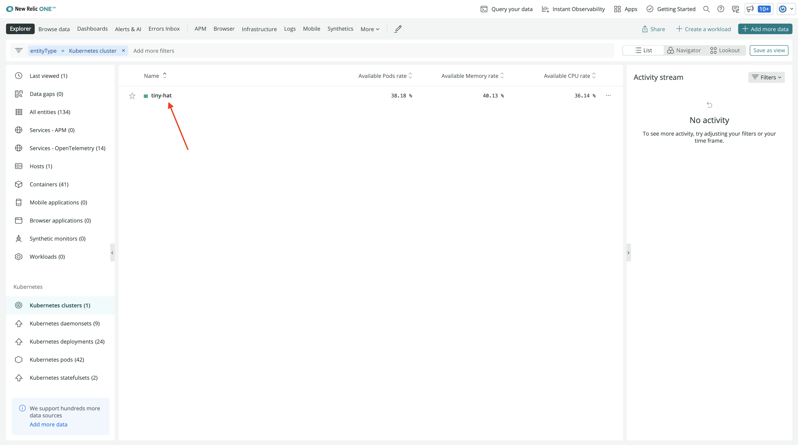

</Step>

<Step>


Then click **Live Debugging with Pixie**:

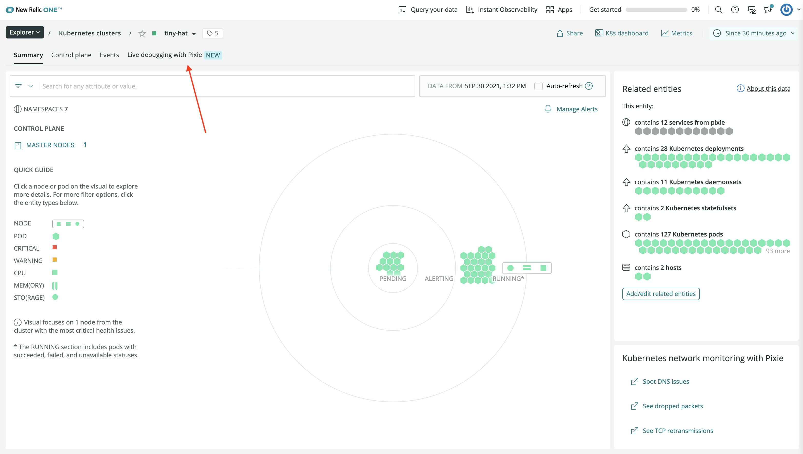

</Step>

<Step>

Once again, the default script is `px/cluster`:


</Step>

<Step>

Scroll down, and filter to the `default` namespace:

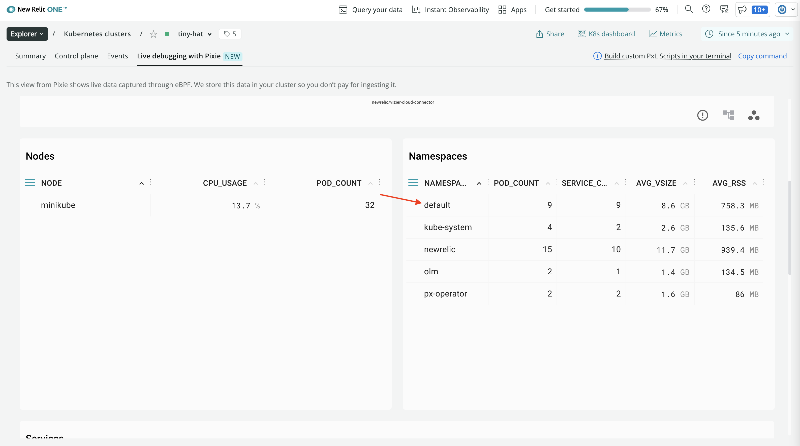

This shows the same information as the cluster script, but only for the `default` namespace.

</Step>

<Step>

Observe the service map for this namespace:

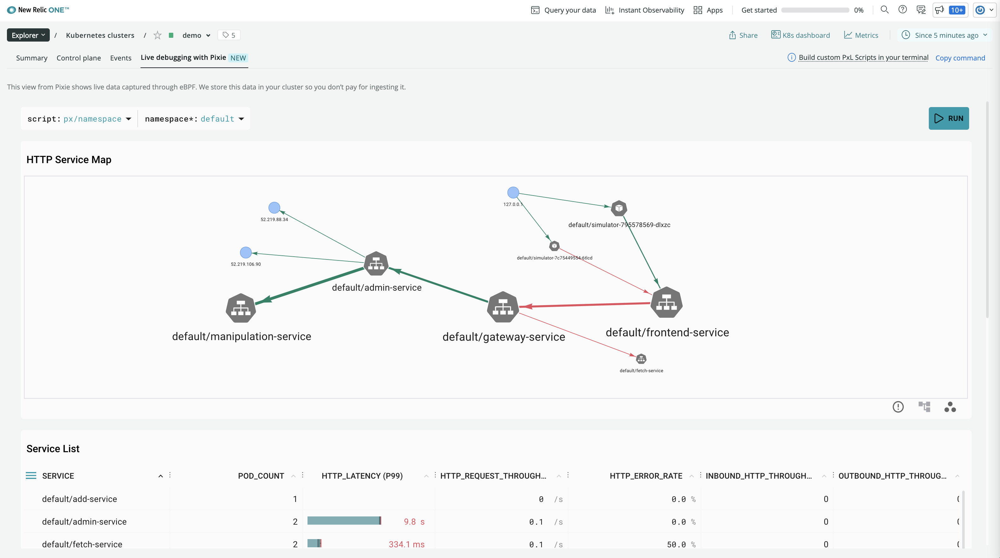

Here, you see the first exernal request comes to the frontend service. The frontend service makes an internal call to the gateway service, which then calls the admin service. Use your knowledge of this traffic flow to debug your high latency issue.

</Step>

<Step>

Scroll down to the **Service List** and notice some of the high latency in your services:

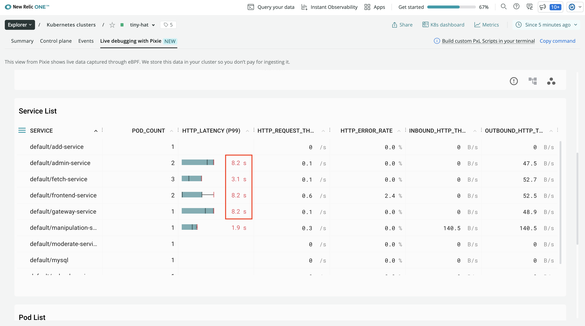

</Step>

<Step>

Because you know the first service to receive requests is the frontend service, click on its name in the table:

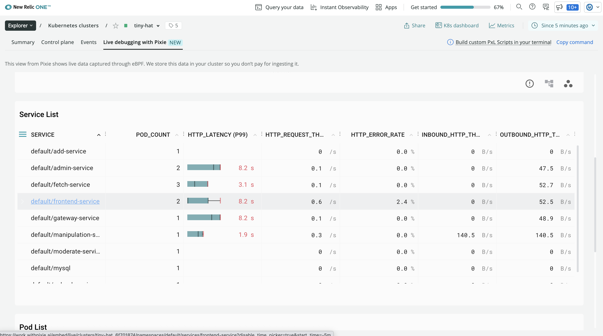

Here, you see spikes in latency over time:

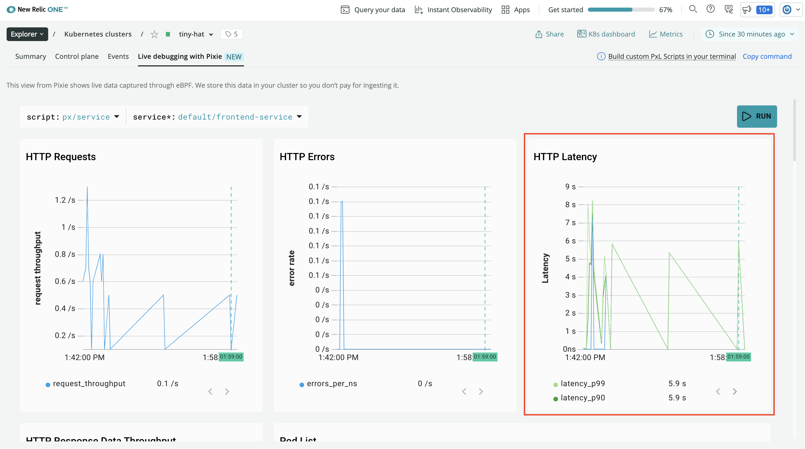

But this only shows you the symptom of an underlying problem. To figure out why your frontend service is slow, you need to dig a little deeper.

</Step>

<Step>

Scroll down to see the **Sample Of Slow Inbound Requests** table:

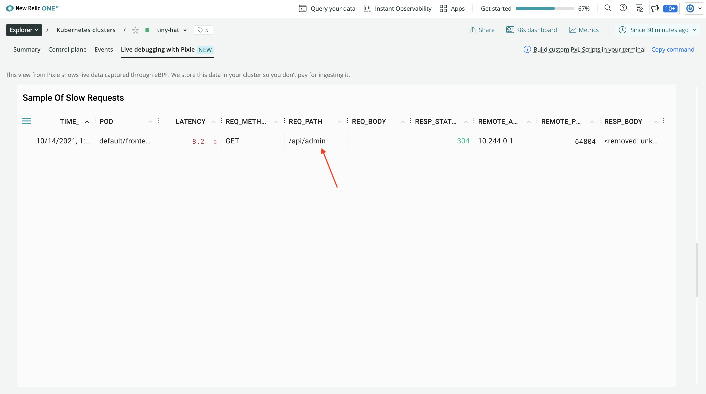

Here, you see that the frontend's requests to `/api/admin` are slow. That's a promising lead!

Now that you know that the admin service is causing your app latency, it's time to investigate that service. One good place to look when you want to know what's causing slowness in your application is a performance flamegraph for that service.

Pixie's performance flamegraph shows the frequency that every function appears in stack traces across your CPUs. Pixie collects this data with a feature called [continuous application profiling](https://docs.pixielabs.ai/tutorials/pixie-101/profiler/) where it samples stack traces, aggregates those samples, and then groups the aggregates in the flamegraph.

</Step>

<Step>

Change to the `px/perf_flamegraph` script to see it in action:

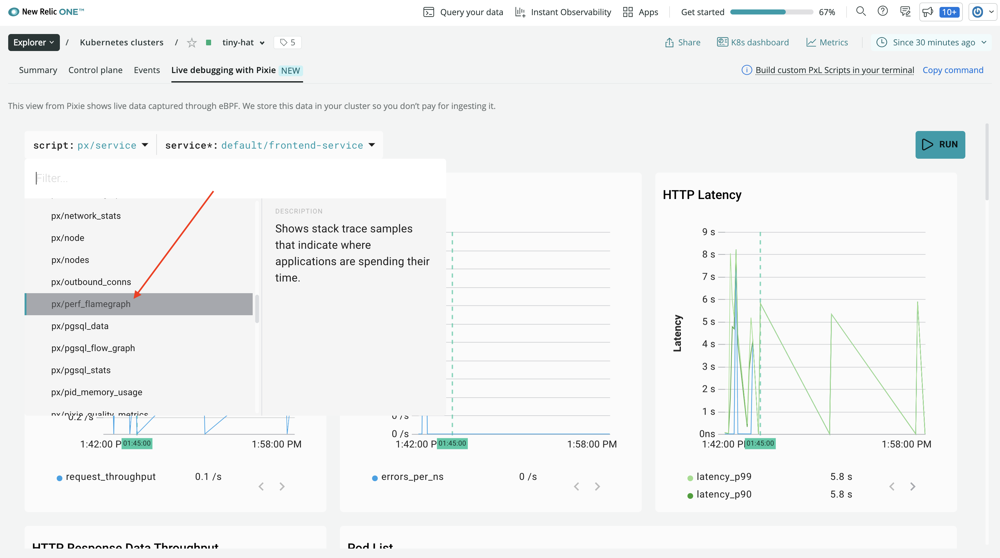

This graph is complex and, by default, shows more information than you need.

</Step>

<Step>

Filter down to the `default` namespace:

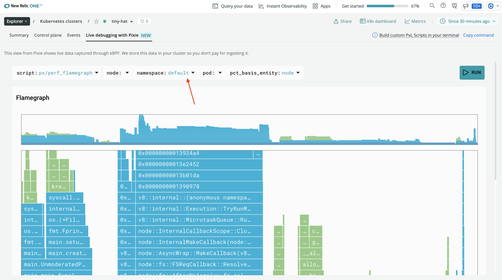

That's better! The graph is now filtered to primarily show two specific services:

- `manipulation-service`
- `admin-service`

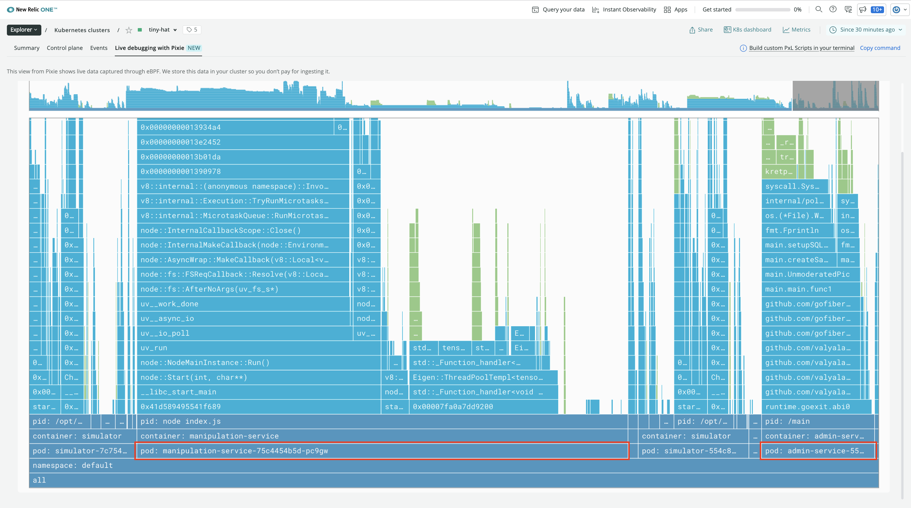

Focus on the admin service because that's what receives requests from the frontend.

</Step>

<Step>

Notice two function cells from your admin service's main module:

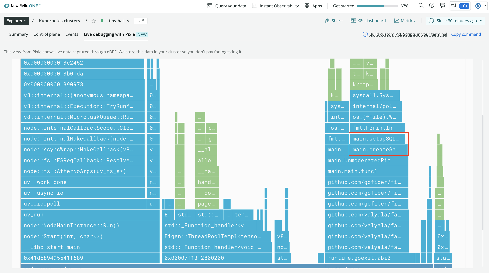

Remember, the width of the cell represents the frequency that the cell's function appears in Pixie's samples. Effectively, this represents how long the application spends in that function.

In this graph, you can see that `main.createSampleImage` is wider than `main.setupSQLQuery`, implying that the admin service spends more time creating sample images than it does setting up its SQL query. You can also infer from the name of the function and the width of the `manipulation-service` in the graph that `main.createSampleImage` makes a call to that service.

Based on your findings, you hypothesize that every time the frontend service calls `/api/admin`, the `main.createSampleImage` function gets executed, which sends a request to the manipulation service.

In a real world situation, you could confirm this hypothesis by looking at your code. You could then solve the problem by caching sample images so that they're not created on every request.

</Step>

</Steps>


## Summary

To recap, you observed latency in your application's administrative backend and used Pixie in New Relic to:

1. Understand your services' relationships
2. Narrow down the sources of high latency
3. Discover the function that's causing long response times

Throughout this lab, you saw just a few ways that Pixie can help you monitor your software and debug issues when they come up.

## Tear down

Now that you're done with this lab, tear down your cluster:

```bash
minikube delete -p minikube-pixie-lab
```

## Homework

Well done! Now that you've gotten your feet wet using Pixie and New Relic to monitor your Kubernetes clusters, here are some things you can do on your own as you prepare to apply these learnings in real life:

- Read [Auto-telemetry with Pixie for instant Kubernetes observability](https://docs.newrelic.com/docs/auto-telemetry-pixie/get-started-auto-telemetry-pixie/) to learn more about auto-telemetry with New Relic + Pixie
- Read [Pixie's documentation](https://docs.pixielabs.ai/) to learn more about the inner workings of Pixie
