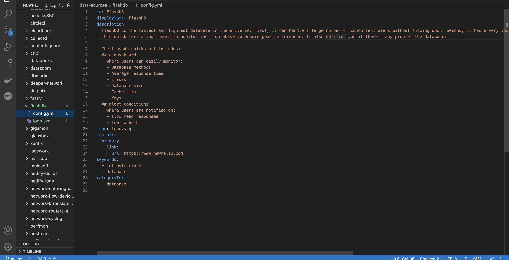

<Callout variant="course">

This procedure is a part of course that teaches you how to build a quickstart. If you haven't already, checkout the [_course introduction_](/contribute-to-quickstarts)

As this procedure builds on top of the last ones in the lab, make sure you create [dashboard](/contribute-to-quickstarts/create-dashboard) & [alerts](/contribute-to-quickstarts/create-alerts) add them to your quickstart before proceeding with this one.

</Callout>

Data sources represent a single type of instrumentation, such as an agent, attributes on a transaction, a cloud provider integration, a third-party integration, etc. 

There are two types of data sources:

- CORE
- COMMUNITY

The CORE data sources are provided by New Relic One and do not exist within this repository, the COMMUNITY data sources are defined within the quickstart repository.

COMMUNITY data sources live in the _data-sources/_ directory. In this procedure, you learn how to add a data source to your quickstart.

<Steps>

<Step>

If you haven't already, fork the [New Relic quickstarts](https://github.com/newrelic/newrelic-quickstarts) repository and clone it to your local machine.

</Step>

<Step>

Open your Project in the IDE of your choice and navigate to _\_template_ directory. 


</Step>

<Step>

Here, copy _data-sources/example-data-source_ directory and it's content to _data-sources_ directory at the root level. Rename the directory as _flashdb_.

This directory contains sample YAML file to create a data source. 

</Step>

<Step>

Navigate to _datasources/flashdb/config.yml_ file and add details of your data source. For your reference, flashdb data source should be similar to following:

<>

```yml

id: flashdb
displayName: FlashDB
description: |
  FlashDB is the fastest and lightest database in the universe. First, it can handle a large number of concurrent users without slowing down. Second, it has a very low latency, so queries are processed quickly. And finally, it scales easily as your data grows.
  This quickstart allows users to monitor their database to ensure peak performance. It also notifies you if there's any problem the database. 
  
  The flashdb quickstart includes: 
  ## a dashboard 
    where users can easily monitor:
    - Database methods
    - Average response time
    - Errors
    - Database size
    - Cache hits
    - Keys
  ## alert conditions
    where users are notified on:
    - slow read responses
    - low cache hit 
icon: logo.svg
install:
  mode: link
  destination: 
    url: https://www.newrelic.com      
keywords:
  - infrastructure
  - database
categoryTerms:
  - database

```

</>

</Step>

<Step>

Add a logo for your data source. It can be either ".svg" or ".png". Your data source directory should look similar to the following.



</Step>

</Steps>

<Callout variant="course" title="Lab">

This procedure is a part of course that teaches you how to build a quickstart. Continue on to next procedure: [contribute your quickstart](/contribute-to-quickstarts/build-a-quickstart/contribute-quickstart).

</Callout>