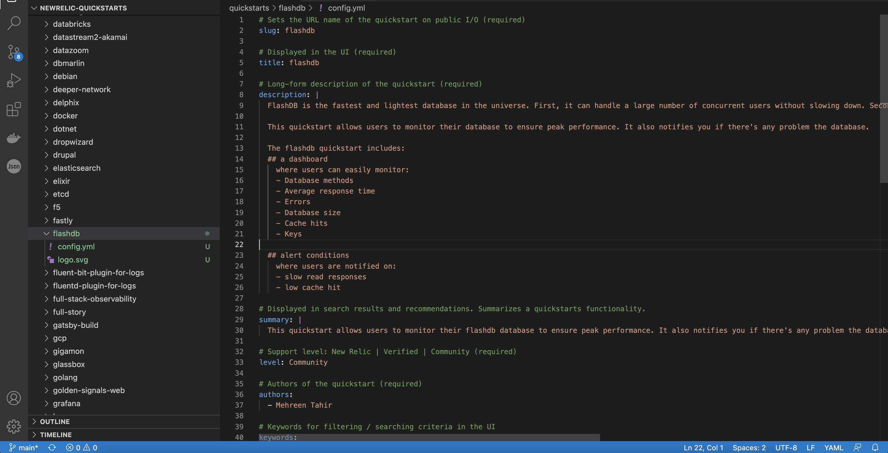
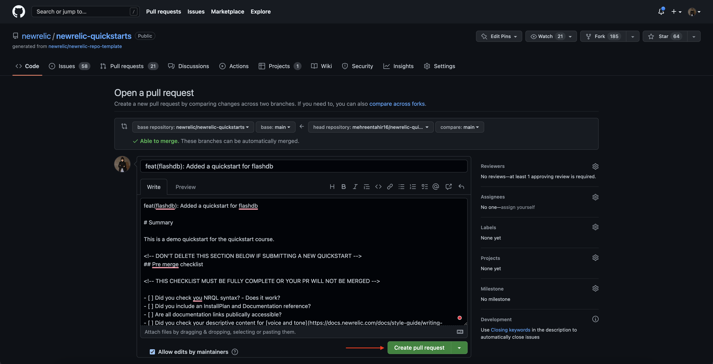
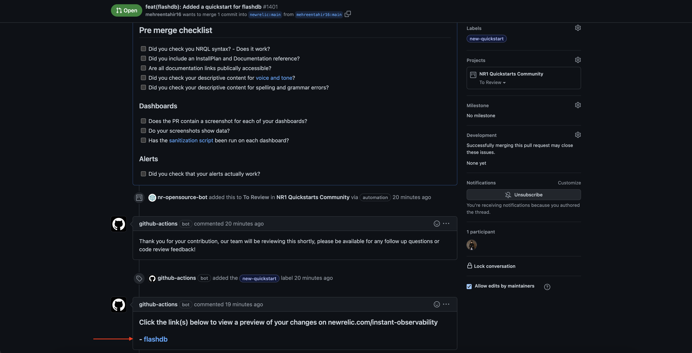
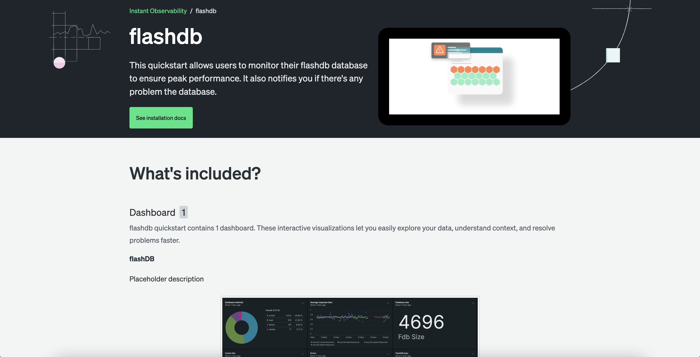

<Callout variant="course">

This procedure is a part of course that teaches you how to build a quickstart. If you haven't already, checkout the [_course introduction_](/contribute-to-quickstarts)

As this procedure builds on top of the last ones in the lab, make sure you create quickstart components and add those [dashboard](/contribute-to-quickstarts/build-a-quickstart/add-dashboard), [alerts](/contribute-to-quickstarts/build-a-quickstart/add-alerts) and [data source](/contribute-to-quickstarts/build-a-quickstart/add-data-source) to your quickstart before proceeding with this one.

</Callout>

In the previous procedures, you created quickstart components and added them to their respective directory in quickstart template. It's time to create the flashdb quickstart and contribute it to GitHub so it is available for everyone to use.

## Contribute quickstart to GitHub

<Steps>

<Step>

If you haven't already, fork the [New Relic quickstarts](https://github.com/newrelic/newrelic-quickstarts) repository and clone it to your local machine.

</Step>

<Step>

Open your Project in the IDE of your choice and navigate to _\_template_ directory. 


</Step>

<Step>

Here, copy _quickstarts/example-quickstart_ directory and it's content to _quickstarts_ directory at the root level. Rename the directory as _flashdb_.

This directory contains sample config.yml file to create a quickstart. 

</Step>

<Step>

Navigate to _datasources/flashdb/config.yml_ file and add details of your data source. For your reference, flashdb data source should be similar to following:

<>

```yml
# Sets the URL name of the quickstart on public I/O (required)
slug: flashdb

# Displayed in the UI (required)
title: FlashDB

# Long-form description of the quickstart (required)
description: |
  FlashDB is the fastest and lightest database in the universe. First, it can handle a large number of concurrent users without slowing down. Second, it has a very low latency, so queries are processed quickly. And finally, it scales easily as your data grows.
  
  This quickstart allows users to monitor their database to ensure peak performance. It also notifies you if there's any problem with the database. 
  
  The flashdb quickstart includes: 
  ## a dashboard 
    where users can easily monitor:
    - Database methods
    - Average response time
    - Errors
    - Database size
    - Cache hits
    - Keys

  ## alert conditions
    where users are notified on:
    - slow read responses
    - low cache hit 

# Displayed in search results and recommendations. Summarizes a quickstarts functionality.
summary: |
  This quickstart allows users to monitor their flashdb database to ensure peak performance. It also notifies you if there's any problem with the database. 

# Support level: New Relic | Verified | Community (required)
level: Community

# Authors of the quickstart (required)
authors:
  - Mehreen Tahir

# Keywords for filtering / searching criteria in the UI
keywords:
  - infrastructure
  - database

alertPolicies:
  - flashdb
dashboards:
  - flashdb
# Documentation references
documentation:
  - name: Quickstart course
    url: https://developer.newrelic.com/contribute-to-quickstarts
    description: This doc guides you through the process of creating a quickstart

# Content / Design
icon: logo.svg
website: https://developer.newrelic.com/contribute-to-quickstarts

```

</>

</Step>

Here, you added slug, title and description for people to recognize and understand the purpose of your quickstart. You also refer to the associated dashboards and alerts to create the quickstart. 

<Step>

Next, add a logo for your quickstart. It can be either ".svg" or ".png". Your quickstart directory should look similar to the following.



</Step>

<Step>

Your quickstart is now ready to be published. You're going to commit your changes back to GitHub where it will be reviewed by New Relic.
Follow the [conventional commit syntax](https://github.com/newrelic/developer-website/blob/main/CONTRIBUTING.md#using-conventional-commits) for New Relic to commit your changes.

<>

```bash
git add -A
git commit -m "feat(flashdb): Added a quickstart for flashdb"
```

</>

</Step>

<Callout variant="important">

We, at New Relic, are always happy to receive contributions from the community. However, we are expecting a number of contributions for flashdb following the same course.
To help us manage your contributions efficiently, we encourage you to label your contribution following this particular course as **quickstart-course** using `git tag` command.

</Callout>

<Step>

Push your changes to GitHub:

<>

```bash
git tag quickstart-course
git push
```
</>

</Step>

</Steps>

### Create a PR to contribute your quickstart

Once you've pushed your changes to GitHub, you can [create a pull request](https://help.github.com/en/github/collaborating-with-issues-and-pull-requests/creating-a-pull-request).

<Steps>

<Step>

Navigate to your quickstart repo, click **Contribute** and then **Open pull request**.


</Step>

<Step>

This takes you to **Open a pull request page**. Here, add a summary for your quickstart and click **Create pull request**.



</Step>

<Callout variant='important'>

When contributing a quickstart, make sure to go thorugh pre-checks.

</Callout>

Submit the PR and wait for the review. Once your quickstart passes all the checks, you can preview your quickstart on New Relic I/O.



This takes you to your quickstart on New Relic I/O.



<Callout variant="important">

At this stage, your quickstart will be automatically validated in GitHub. If this were a real-life submission, it would then be approved and incorporated into New Relic I/O for your users to see. As this is a a demo course, we will not actually review this PR. We appreciate if you raise this PR as 'draft' so it doesn't end up in our reviewers queue.

</Callout>

</Steps>

## Homework

If you haven't already, we encourage you to read through some related docs as:

- [Dashboards](https://docs.newrelic.com/docs/query-your-data/explore-query-data/dashboards/introduction-dashboards/)
- [Alerts](https://docs.newrelic.com/docs/alerts-applied-intelligence/#:~:text=Together%2C%20New%20Relic%20Alerts%20and,metrics%20you%20care%20about%20most.)

The above docs give you a head start on your observability journey with New Relic. We always welcome contributions from community, so feel free to get in touch.
