<Callout variant="course" title="Lab">

This procedure is a part of lab that teaches you how to build quickstart. If you haven't already, checkout the [_lab introduction_](/contribute-to-quickstarts/build-a-quickstart)

As this procedure builds on top of the last ones in the lab, make sure you create a [dashboard](contribute-to-quickstarts/build-a-quickstart/create-a-dashboard) and [alerts](/contribute-to-quickstarts/build-a-quickstart/create-alerts) before proceeding with this one.

</Callout>

With quickstarts, you can quickly and easily observe and monitor your services since they include observability building blocks like dashboards and alerts.
You've already created a useful dashboard and alert policy for your database. Now, you can package them into a quickstart and contribute it to New Relic I/O as a benefit to your users.

To get started, navigate to GitHub repository of [New Relic One quickstarts](https://github.com/newrelic/newrelic-observability-packs) and fork it.

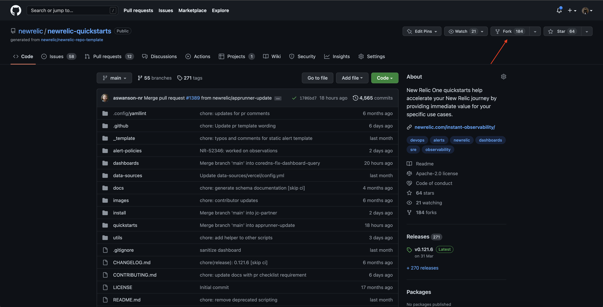

Now, clone your own repository to your local machine using `git clone` and open it in the IDE of your choice.

Notice the directory structure. The \__template_ folder is of special importance since it contains the templates for observability building blocks in the quickstart.

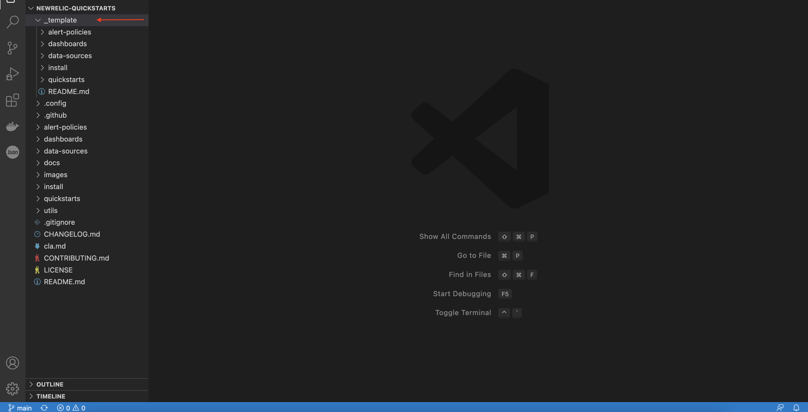

The _\_template_ directory contains the folders for dashboards and alerts. Each of these folders contain templates that you can use to create entities for your quickstart.

Copy the _\_template_ directory and it's content to a new directory within the _quickstarts_ folder. Name the directory as _flashdb_.

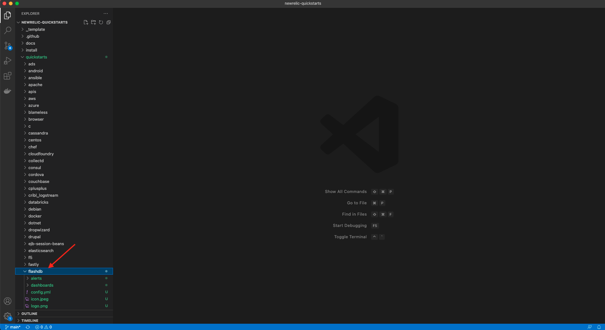

## Add your dashboard to the quickstart

In a previous procedure, you created a dashboard for monitoring FlashDB. Now, you add it to your quickstart so your users can use it too.

First, look up your dashboard in New Relic and copy its JSON. Then, save it as a JSON file in the _dashboards_ directory.

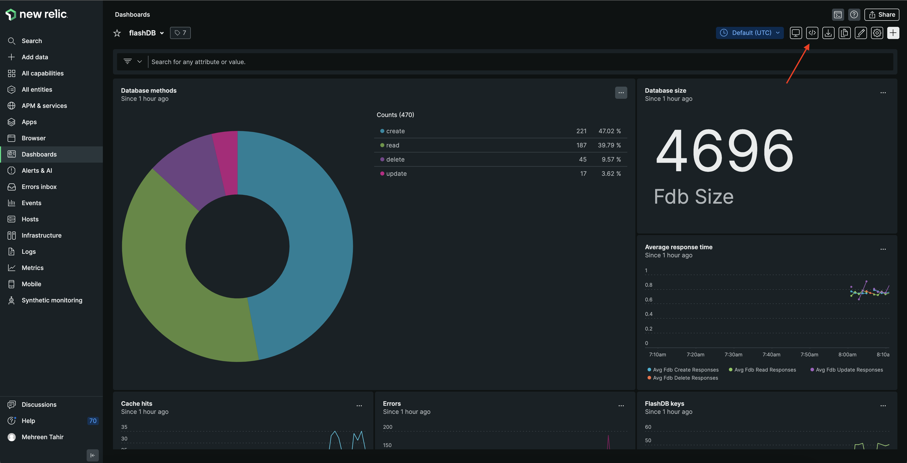

Here, you copied your dashboard's JSON to clipboard. Replace the content of existing JSON file in _dashboards_ directory and rename it as _flashDB.json_. Your _flashDB.json_ file should contain the following content:

```json
{
  "name": "FlashDB",
  "description": null,
  "permissions": "PUBLIC_READ_WRITE",
  "pages": [
    {
      "name": "FlashDB",
      "description": null,
      "widgets": [
        {
          "visualization": {
            "id": "viz.pie"
          },
          "layout": {
            "column": 1,
            "row": 1,
            "height": 6,
            "width": 8
          },
          "title": "Database methods",
          "rawConfiguration": {
            "facet": {
              "showOtherSeries": true
            },
            "nrqlQueries": [
              {
                "accountId": 3248695,
                "query": "SELECT count(*) FROM fdb_method FACET method"
              }
            ]
          },
          "linkedEntityGuids": null
        },
        {
          "visualization": {
            "id": "viz.billboard"
          },
          "layout": {
            "column": 9,
            "row": 1,
            "height": 3,
            "width": 4
          },
          "title": "Database size",
          "rawConfiguration": {
            "dataFormatters": [],
            "nrqlQueries": [
              {
                "accountId": 3248695,
                "query": "SELECT latest(fdb_size) FROM Metric"
              }
            ],
            "thresholds": []
          },
          "linkedEntityGuids": null
        },
        {
          "visualization": {
            "id": "viz.line"
          },
          "layout": {
            "column": 9,
            "row": 4,
            "height": 3,
            "width": 4
          },
          "title": "Average Response Time",
          "rawConfiguration": {
            "legend": {
              "enabled": true
            },
            "nrqlQueries": [
              {
                "accountId": 3248695,
                "query": "SELECT average(fdb_create_responses), average(fdb_read_responses), average(fdb_update_responses), average(fdb_delete_responses) FROM Metric TIMESERIES"
              }
            ],
            "yAxisLeft": {
              "zero": true
            }
          },
          "linkedEntityGuids": null
        },
        {
          "visualization": {
            "id": "viz.line"
          },
          "layout": {
            "column": 1,
            "row": 7,
            "height": 3,
            "width": 4
          },
          "title": "Cache hits",
          "rawConfiguration": {
            "legend": {
              "enabled": true
            },
            "nrqlQueries": [
              {
                "accountId": 3248695,
                "query": "SELECT sum(fdb_cache_hits) FROM Metric TIMESERIES"
              }
            ],
            "yAxisLeft": {
              "zero": true
            }
          },
          "linkedEntityGuids": null
        },
        {
          "visualization": {
            "id": "viz.line"
          },
          "layout": {
            "column": 5,
            "row": 7,
            "height": 3,
            "width": 4
          },
          "title": "Errors",
          "rawConfiguration": {
            "legend": {
              "enabled": true
            },
            "nrqlQueries": [
              {
                "accountId": 3248695,
                "query": "SELECT sum(fdb_create_errors), sum(fdb_read_errors), sum(fdb_update_errors), sum(fdb_delete_errors) FROM Metric TIMESERIES"
              }
            ],
            "yAxisLeft": {
              "zero": true
            }
          },
          "linkedEntityGuids": null
        },
        {
          "visualization": {
            "id": "viz.line"
          },
          "layout": {
            "column": 9,
            "row": 7,
            "height": 3,
            "width": 4
          },
          "title": "FlashDB Keys",
          "rawConfiguration": {
            "legend": {
              "enabled": true
            },
            "nrqlQueries": [
              {
                "accountId": 3248695,
                "query": "SELECT count(fdb_keys) FROM Metric TIMESERIES"
              }
            ],
            "yAxisLeft": {
              "zero": true
            }
          },
          "linkedEntityGuids": null
        }
      ]
    }
  ]
}
```

Then, to remove any unecessary data from your dashboard, run the [dashboard sanitize script](https://github.com/newrelic/newrelic-quickstarts/blob/main/CONTRIBUTING.md#dashboard-json):

```shell
yarn sanitize-dashboard flashDB
```

<Callout variant="tip">

When creating your dashboard:

- Do not include `permissions: PUBLIC_READ_WRITE`
- Set all `linkedEntityGuids` to `null`
- Set your `accountId` to `0`

</Callout>

Next, create a screenshot of your dashboard and add it to _dashboards_ directory. Give it the same name as your JSON file. Your _dashboard_ directory should look similar to the following:

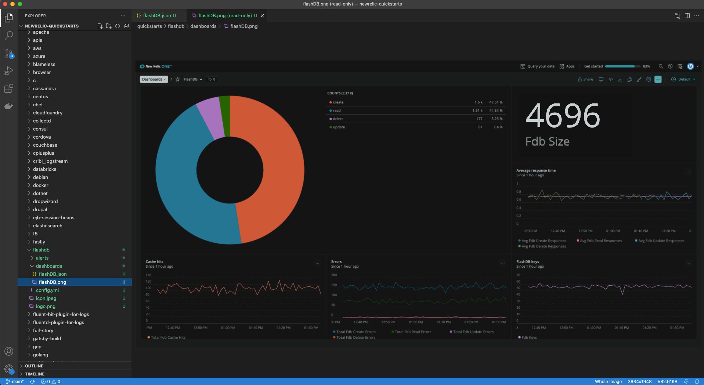

## Add your alerts to the quickstart

Next, add the static alerts you created previously to the quickstart. The _alerts_ directory contains the templates for static alerts.
To help you populate your yaml files, you can use New Relic's [NerdGraph API explorer](https://api.newrelic.com/graphiql) to get a JSON representation of each alert condition.

<Callout variant="tip">

NerdGraph is New Relic's GraphQL API.

</Callout>

Open the NerdGraph explorer and select your key from the dropdown menu.

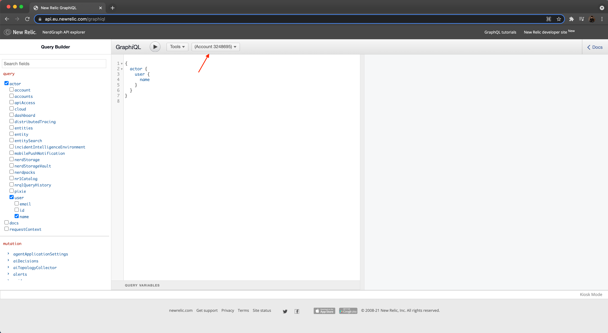

Building a query is simple in the explorer. Check the appropriate boxes to build a GraphQL query:

```js
{
  actor {
    account(id: {_your account id_}) {
      alerts {
        nrqlCondition(id: "{_nrql conditions's id_}") {
          ... on AlertsNrqlStaticCondition {
            id
            name
            nrql {
              query
            }
          }
          terms {
            operator
            priority
            threshold
            thresholdDuration
            thresholdOccurrences
          }
        }
      }
    }
  }
}
```

<Callout variant='tip'>

Under your alert policy, click on the condition to get its ID.

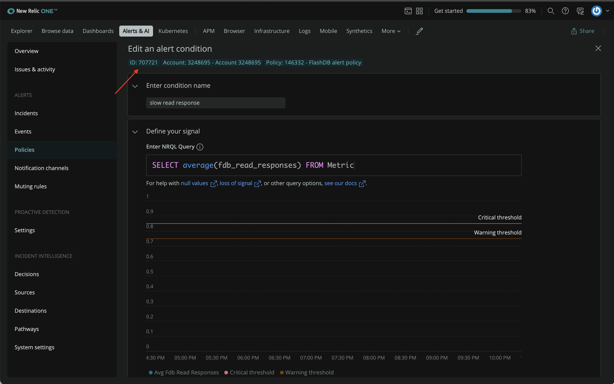

</Callout>

Running the above query in Graphql will respond with the details of your alert condition that you can use to update your quickstart.

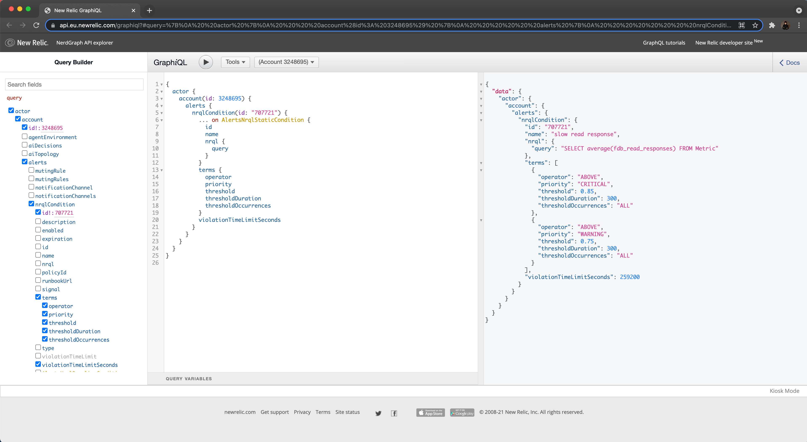

For static condition, take the static-alert.yml file and start populating it using the information returned from above query.
First, name the file as _read-response.yml_ and populate it:

```yml
---
# Name of the alert
name: slow read response

# Description and details
details: |+
  This alert is triggered when read operation takes > 0.85.

# Type of alert
type: STATIC

# NRQL query
nrql:
  query: "SELECT average(fdb_read_responses) FROM Metric"

# Function used to aggregate the NRQL query value(s) for comparison to the terms.threshold (Default: SINGLE_VALUE)
valueFunction: SINGLE_VALUE

# List of Critical and Warning thresholds for the condition
terms:
- priority: CRITICAL
  # Operator used to compare against the threshold.
  operator: ABOVE
  # Value that triggers a violation
  threshold: 0.85
  # Time in seconds; 120 - 3600
  thresholdDuration: 300
  # How many data points must be in violation for the duration
  thresholdOccurrences: ALL

# Adding a Warning threshold is optional
- priority: WARNING
  operator: ABOVE
  threshold: 0.75
 thresholdDuration: 300
  thresholdOccurrences: ALL

# Duration after which a violation automatically closes
# Time in seconds; 300 - 2592000 (Default: 86400 [1 day])
violationTimeLimitSeconds: 259200
```

Here, you added the pre-existing slow read response alert to the quickstart. Follow the same procedure to add the low cache hit ratio alert.
For your reference, here's the graphql response.

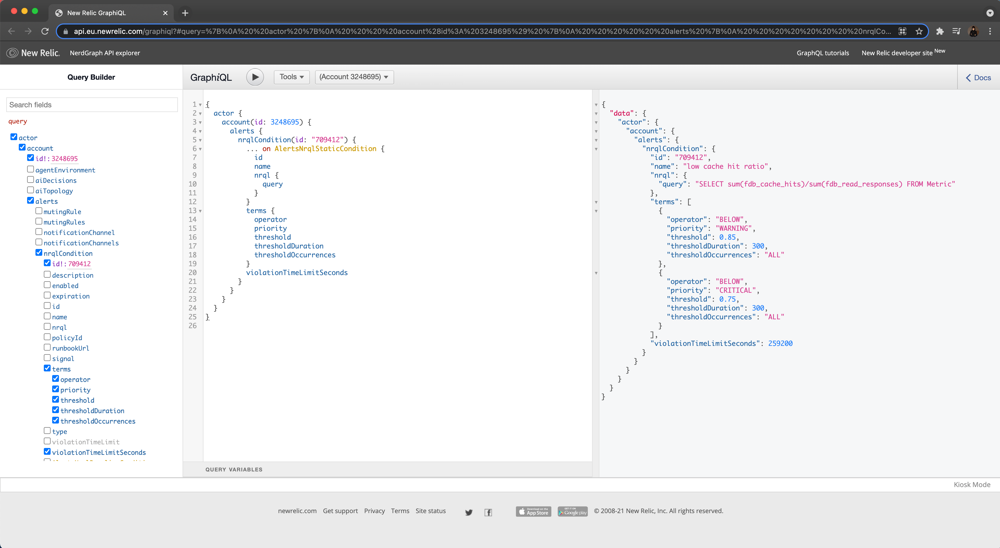

Create your _cache-hit-ratio.yml_ file based on the above response.

```yml
---
# Name of the alert
name: low cache hit ratio

# Description and details
details: |+
  This alert is triggered whenever the cache hit ratio for database is < 0.85.
  The cache hit ratio can be measured simply by: # of cache hits/ # of total read responses.
  It represents the proportion of block requests satisfied by the cache without requiring a disk read.
  A low cache hit score means that the database is inefficient.

# Type of alert
type: STATIC

# NRQL query
nrql:
  query: 'SELECT sum(fdb_cache_hits)/sum(fdb_read_responses) FROM Metric'

# Function used to aggregate the NRQL query value(s) for comparison to the terms.threshold
valueFunction: SINGLE_VALUE

# List of Critical and Warning thresholds for the condition
terms:
  - priority: CRITICAL
    # Operator used to compare against the threshold.
    operator: BELOW
    # Value that triggers a violation
    threshold: 0.75
    # Time in seconds; 120 - 3600
    thresholdDuration: 300
    # How many data points must be in violation for the duration
    thresholdOccurrences: ALL

  # Adding a Warning threshold is optional
  - priority: WARNING
    operator: BELOW
    threshold: 0.85
    thresholdDuration: 300
    thresholdOccurrences: ALL

# Duration after which a violation automatically closes
# Time in seconds; 300 - 2592000 (Default: 86400 [1 day])
violationTimeLimitSeconds: 259200
```

## Add a description

Your quickstart is almost ready to go live. But how will others know what your quickstart is for and what it can do?

To help others understand the purpose of your quickstart, add a description.

In the root directory of your pack, you can find a _config.yml_ file.
Open the file in your IDE and edit it as follow:

```yml
# Name of the pack (required)
name: flashdb

# Description of the pack (required)
description: |
  Flashdb is the fastest database in the space.
  The Flashdb quickstart allows you to get visibility into the performance of flashdb with the help of following features:

  Dashboards:
  - Database methods: Monitor the number of transactions for each database method
  - Database size: Monitor the size of database
  - Average response time: Monitor the average response time for each type of database transaction
  - Cache hits: Monitor the cache hits
  - Errors: Monitor the errors occured for each type of database transaction
  - Database keys: Monitor the keys for database

  Alerts:
  - Cache hit ratio: Alert is triggered when cache hit ratio falls below the set limit.
  - Read response: Alert is triggered when read responses are slow and exceeds a set limit

summary: |
  Flashdb is the fastest database in the space.
  This quickstart allows you to get visibility into the performance of flashdb.

# Support level: New Relic | Verified | Community (required)
level: Community

# Design
icon: icon.jpeg
logo: logo.png

# Authors of the pack (required)
authors:
  - { 'enter your name' }

# References to other packs (optional)
# References are grouped by the type: operating-system, database, webserver, queue, ..
# The reference under the type is a at least one system, so at least one operating-system, database, ..
references:
  - type: database
    name:
      - flashdb
```

Here's how your final _flashdb_ quickstart folder should look like.
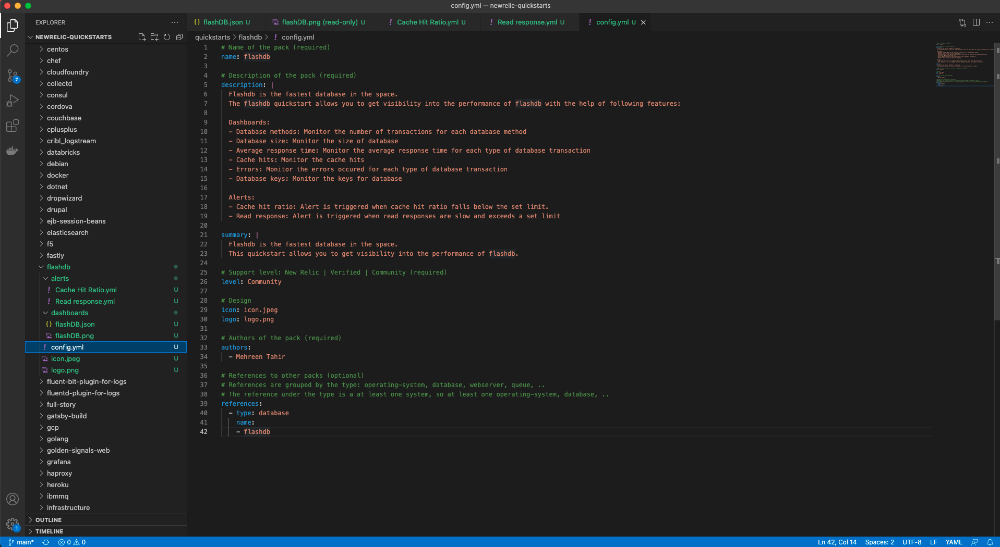

## Contribute quickstart to GitHub

Your quickstart is now ready to be published. You're going to commit your changes back to GitHub where it will be reviewed by New Relic.
Follow the [conventional commit syntax](https://github.com/newrelic/newrelic-observability-packs/blob/alerts-doc-update/CONTRIBUTING.md#using-conventional-commits) for New Relic to commit your changes.

```bash
git add -A
git commit -m "feat(flashdb): Added a quickstart for flashdb"
```

<Callout variant="important">

We, at New Relic, are always happy to receive contributions from the community. However, we are expecting a number of contributions for flashdb following the same lab course.
To help us manage your contributions efficiently, we encourage you to label your contribution following this particular lab as **lab** using `git tag` command.

</Callout>

Push your changes to GitHub:

```bash
git tag lab
git push
```

Once you've pushed your changes to GitHub, you can [create a pull request](https://help.github.com/en/github/collaborating-with-issues-and-pull-requests/creating-a-pull-request).

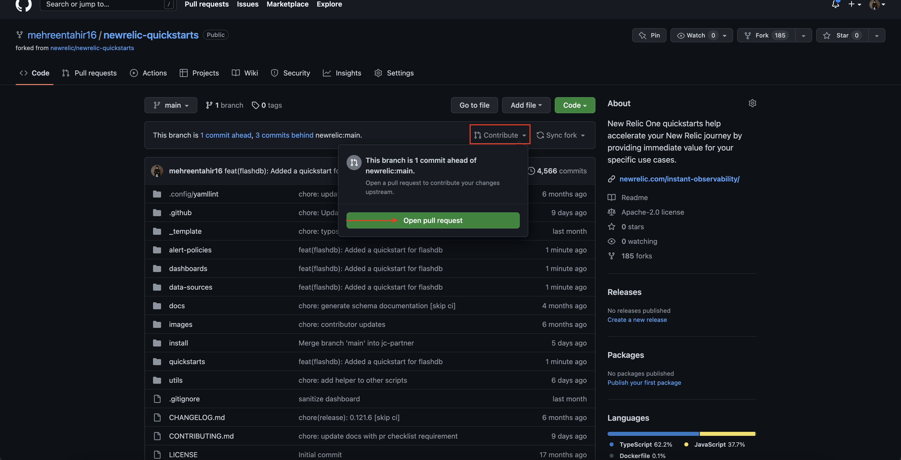

Submit and wait for the review. Thanks a lot for your submission!

<Callout variant="important">

At this stage, your quickstart will be automatically validated in GitHub. If this were a real-life submission, it would then be approved and incorporated into New Relic I/O for your users to see. As this is a lab, we will not actually review this PR. Feel free to delete it after it validates your work.

</Callout>

## Homework

If you haven't already, we encourage you to read through some related docs as:

- [Dashboards](https://docs.newrelic.com/docs/query-your-data/explore-query-data/dashboards/introduction-dashboards/)
- [Alerts](https://docs.newrelic.com/docs/alerts-applied-intelligence/#:~:text=Together%2C%20New%20Relic%20Alerts%20and,metrics%20you%20care%20about%20most.)

The above docs give you a head start on your observability journey with New Relic. We always welcome contributions from community so feel free to get in touch.
