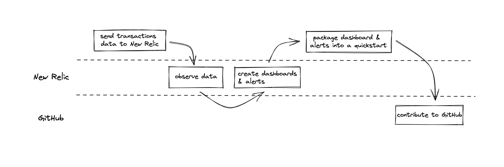

<Intro>

You’ve developed a new database called FlashDB, the lightest and fastest database in the space. Your database is already very popular among the developers. Now, you want to help users of FlashDB to quickly and easily observe it in New Relic.

To achieve your goal, contribute a quickstart to New Relic I/O so other users can quickly monitor FlashDB.

## Why quickstarts?

With New Relic you can collect, monitor, and report data from different sources. You can use dashboards to view, explore, customize, understand, and correlate the data you collect using different user-friendly charts. 
You can also set alert policies to monitor key performance metrics and receive notifications for anomalies. 

Traditionally, FlashDB users would have to spend crucial development hours creating dashboards, alerts, and other entities to monitor their database. But with quickstarts, you can do that work for them.
Quickstarts provide immediate value for your specific use case. They include:
- Clear instructions for instrumenting your services
- Observbility building blocks like dashboards and alerts

All of this is available through an open ecosystem where New Relic developers, partners, and customers contribute their best-practice solutions. 
You, as the developer of FlashDB, are a great candidate to contribute a quickstart to help your users of quickly monitor their instances.

</Intro>

<FlexWrapper>

<Objectives>

## Objectives

- Create a dashboard
- Create alerts 
- Create a quickstart
    - Package up your dashboard & alerts 
    - Add a description
    - Contribute it to GitHub

</Objectives>

<Requirements>

## Prerequisite

- Create a free [New Relic account](https://login.newrelic.com/login)
- Install [Docker](https://www.docker.com/) 

</Requirements>

</FlexWrapper>

