<Callout variant="course" title="Lab">

This procedure is a part of a lab that teaches you how to build a quickstart. If you haven't already, checkout the [_course introduction_](/contribute-to-quickstarts)

Each procedure in this lab builds on top of the last one, so make sure you [_create a dashboard_](/contribute-to-quickstarts/create-a-dashboard) before proceeding with this one.

</Callout>

With New Relic alerts, you can monitor your services and receive notifications about problems that you're interested in, so you can react fast to troubleshoot and resolve them. There are two types of alerts you can have in New Relic:

- Static
- Baseline

In this procedure, you learn how to create these alerts. 

<Callout variant='tip'>

It is assumed that you are already familiar with the alerts basics. If you're just getting started, visit the [alert documentation](https://docs.newrelic.com/docs/alerts-applied-intelligence/) to familiarize yourself with the basics before proceeding.

</Callout>

## Create an alert policy

Before you set alert conditions, you must create a policy. 

From **Alert & AI** in the left-hand navigation, go to the **Alert conditions (Policies)** section. Then, click **New alert policy**.


Name your policy "FlashDB alert policy". 


Use the default values for the rest of the fields, scroll down the page and click **Create policy without notifications**.

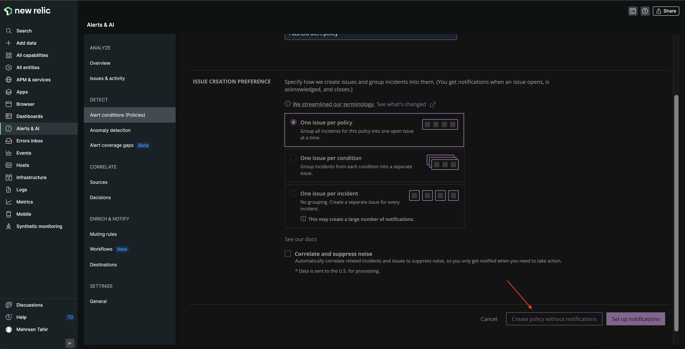

The next step is to add conditions to the alert policy. 

## Create alert conditions

You're going to add the following alert conditions:
- slow read responses
- low cache hit ratio

### Create a high response time alert condition

Under **FlashDB alert policy**, click **Create a condition**.

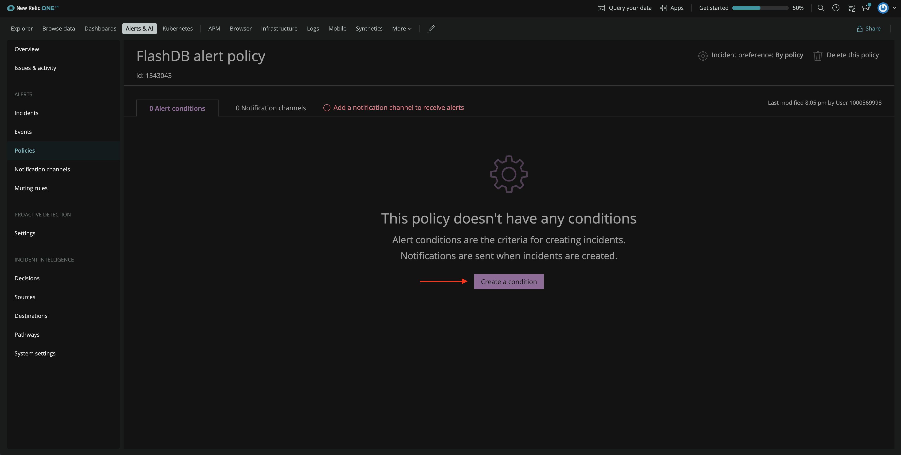

The next page asks you to choose a category for your condition. Choose NRQL, which allows you to create a condition using a NRQL query. Then, click **Next, define thresholds**.

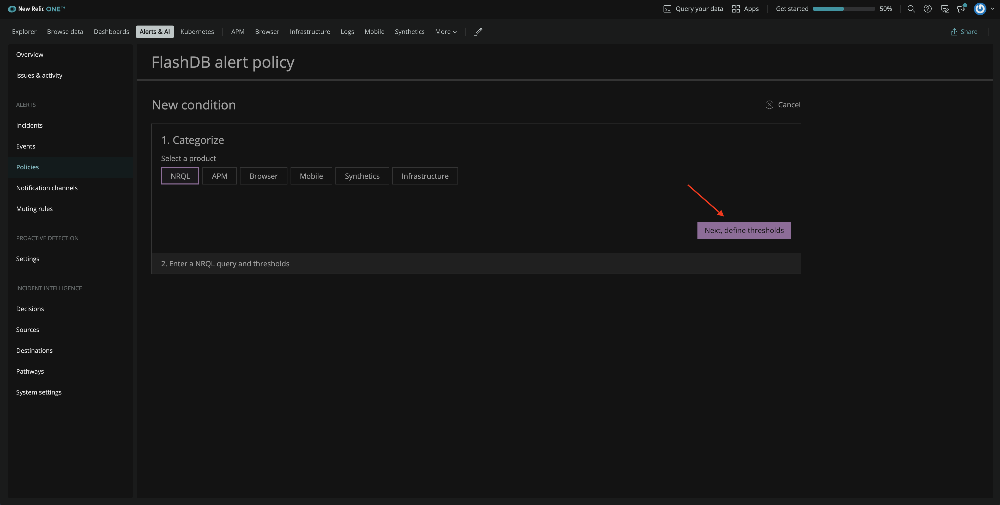

You want New Relic to notify you if the read operation is taking longer than expected. Name your alert condition "slow read responses" and enter the following NRQL query for your condition.

```sql
SELECT average(fdb_read_responses) FROM Metric
```

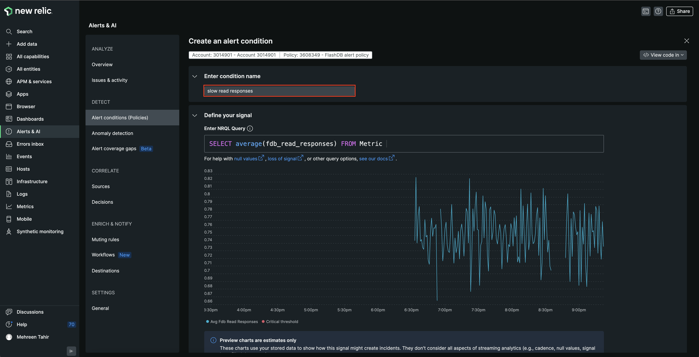

Here, you selected the average read response for FlashDB. 

Scroll down on the same page to define threshold. Select **Static** as the threshold type. It is the simplest threshold type and creates a condition based on the numeric value returned by the query. 
Set the critical threshold value at 0.9:

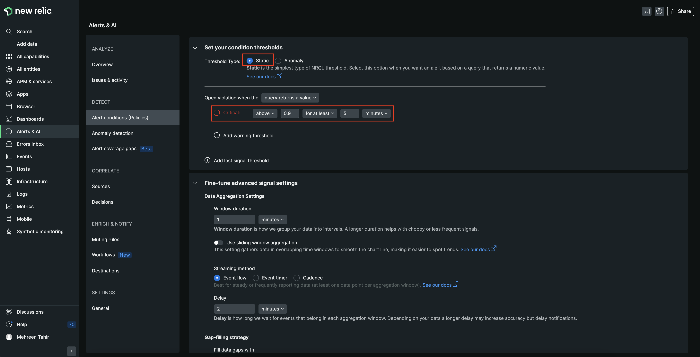

Here, you defined a condition that will open violation whenever read response time is above 0.9 for at least 5 minutes. 

Next, click **Add warning threshold**.

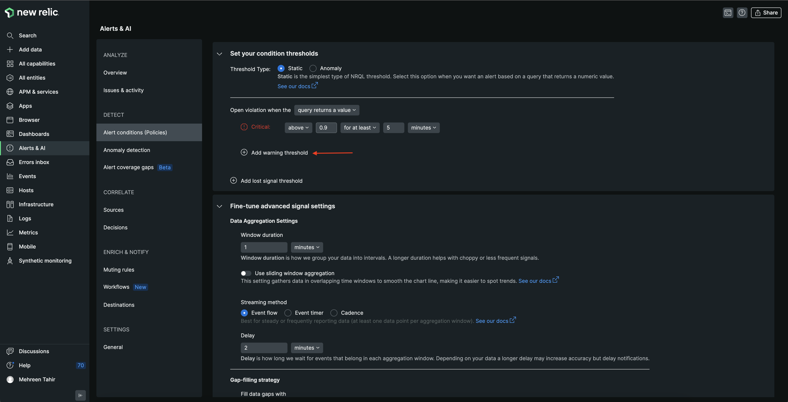

Enter the threshold value at 0.8 to get a warning when the read response is above 0.8 for at least 5 minutes.

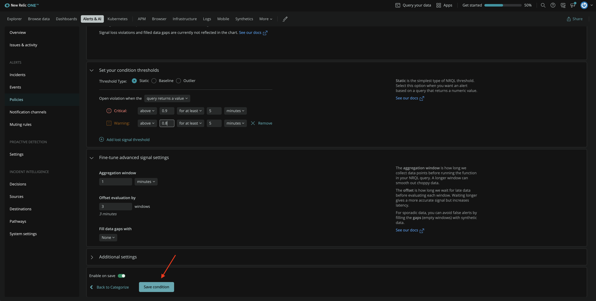

Use the default values for the rest of the fields, scroll down the page and click **Save condition**. 

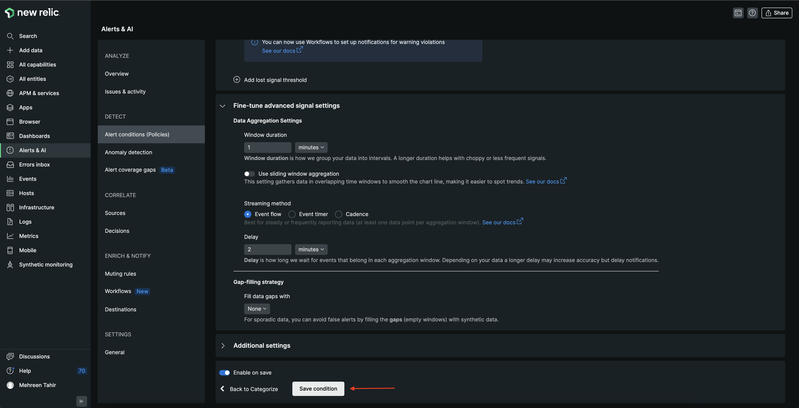

Now, You can see your new condition under your FlashDB alert policy. 

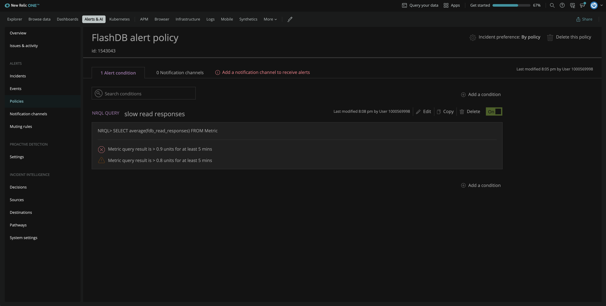

### Create a cache hit ratio condition 

You claimed that your database is fastest in the space, so you also want New Relic to notify you if your cache hit ratio is too low. Add another condition under the same policy by clicking **Add a condition**.

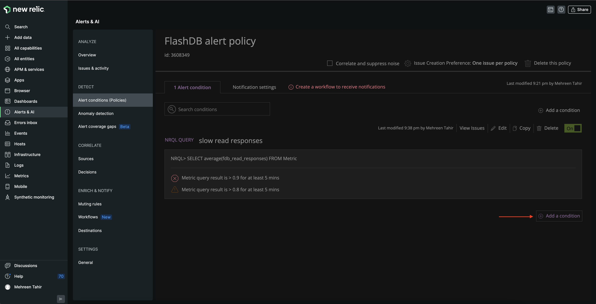

The next page asks you to choose the category for your condition. Choose NRQL and click **Next, define threshold**.

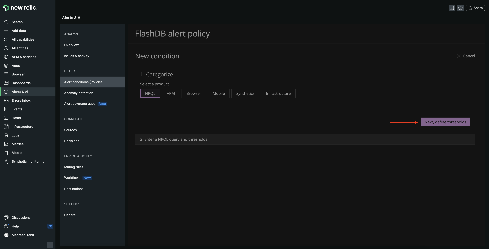

Enter the name "Low cache hit ratio" for your condition and use the following NRQL query.

```sql
SELECT sum(fdb_cache_hits)/sum(fdb_read_responses) FROM Metric
```

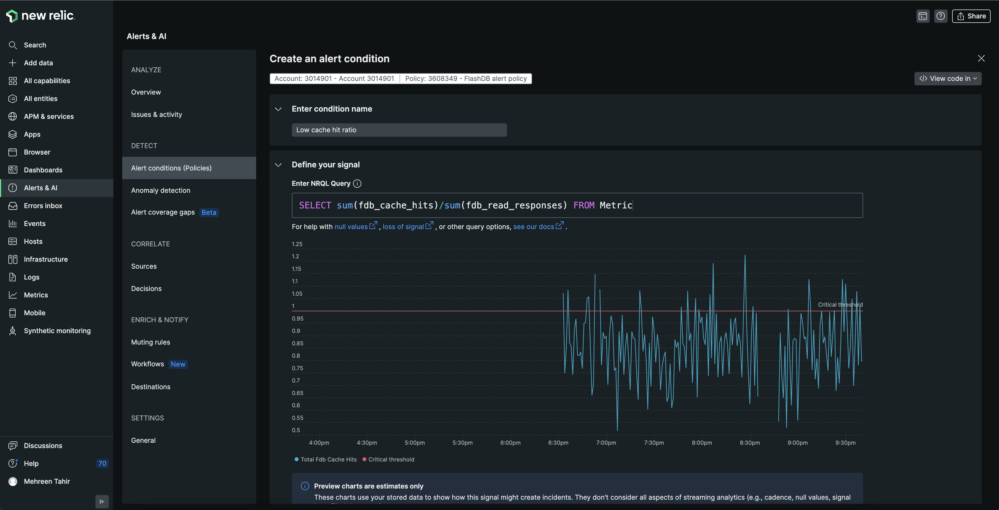

Under the **Threshold Type** , choose **Anomaly** and change the **Threshold direction** to **Lower only**. Next, set the critical and warning threshold at 3 and 2 standard deviations respectively.

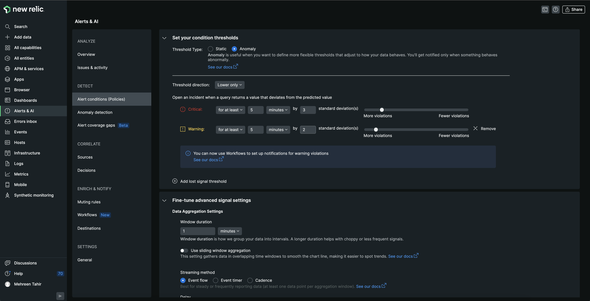

Save the condition to add it to your alert policy which now looks like the following.

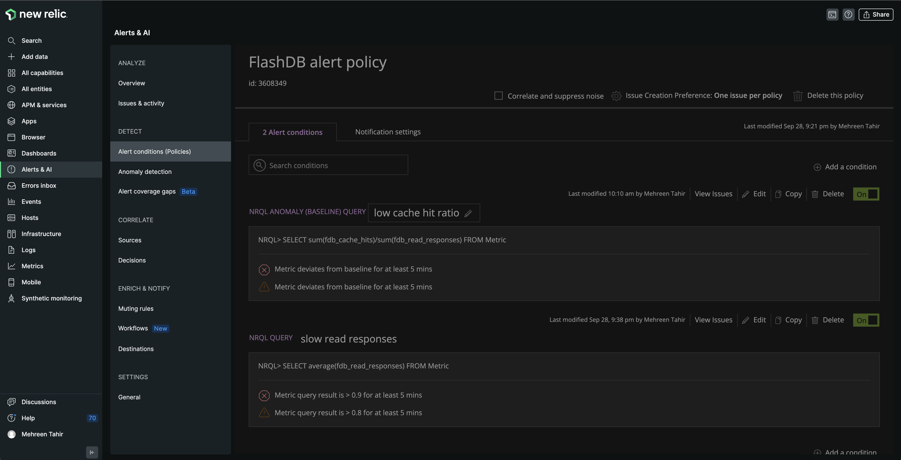

## Create a notification workflow

To receive notifications for any opened violations, you also need to create a notification workflow. 

First, move to the **Notification settings** tab and click **Create workflow**.

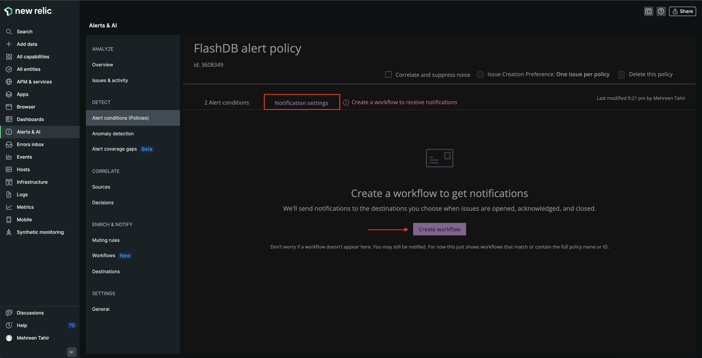

This takes you to **Create a new workflow to get notified** page. From the list of channel options, click Email.

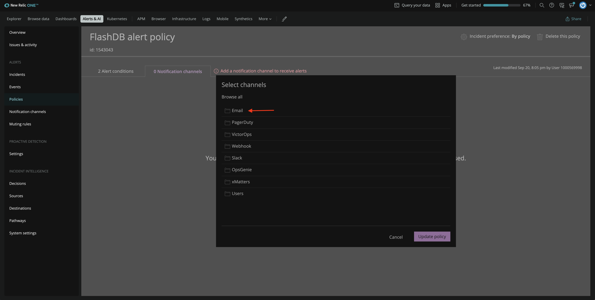

Enter the email you want to receive your notifications on, update the **Email subject** and click **Save**.

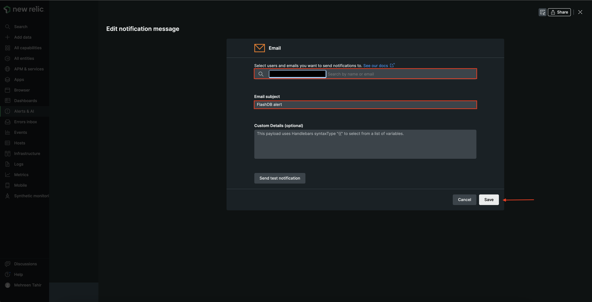

This takes you back to **Create a new workflow to get notified** page where you see the notification channel is now added. Next, click **Activate workflow**.

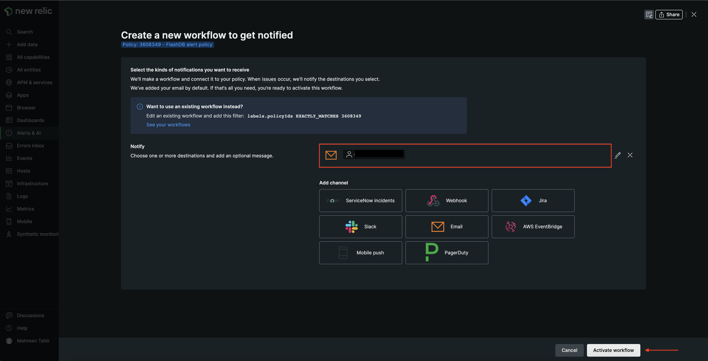

You see the workflow under **Notification settings** now.

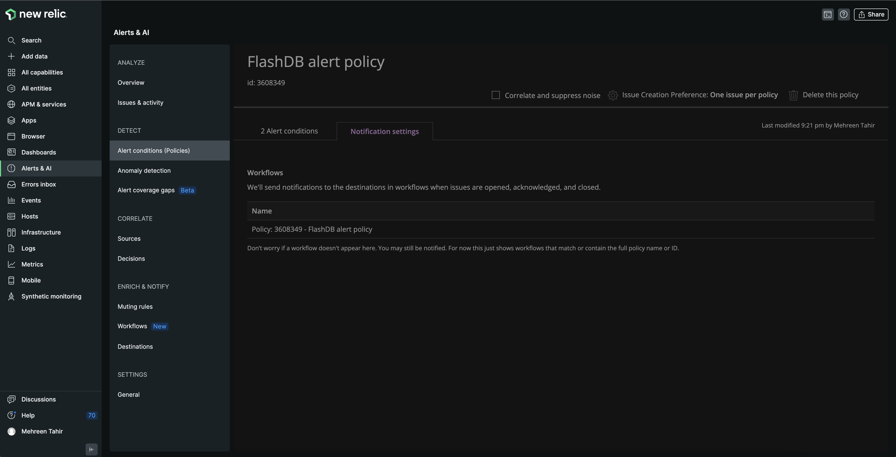

## Summary

During this procedure, you created FlashDB alert policy and added slow read responses and low cache hit ratio conditions to it. You also created a workflow to receive notifications about any opened violations.

<Callout variant="course" title="Lab">

This procedure is a part of course that teaches you how to build a quickstart. Continue on to next lesson: [_build a quickstart_](/contribute-to-quickstarts/build-a-quickstart)

</Callout>
