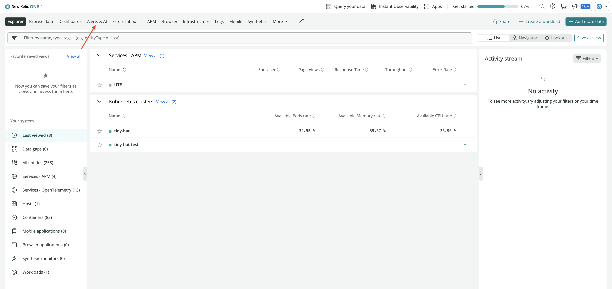
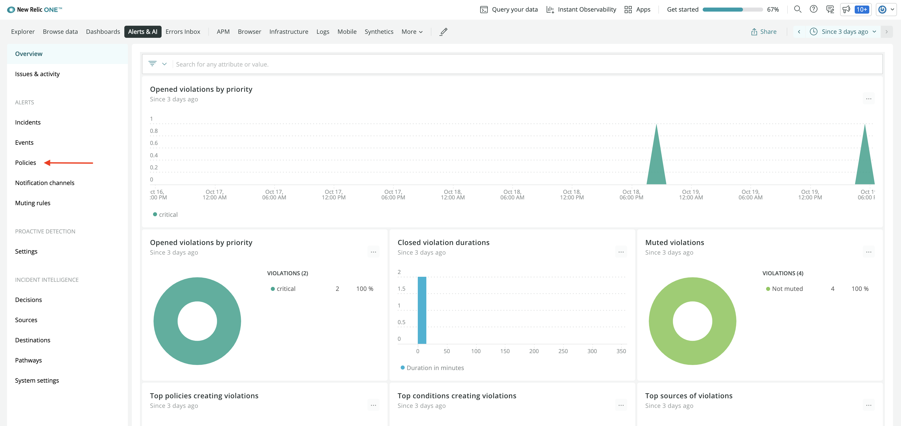
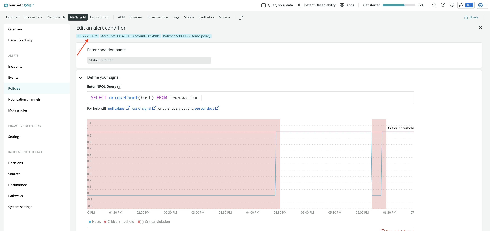
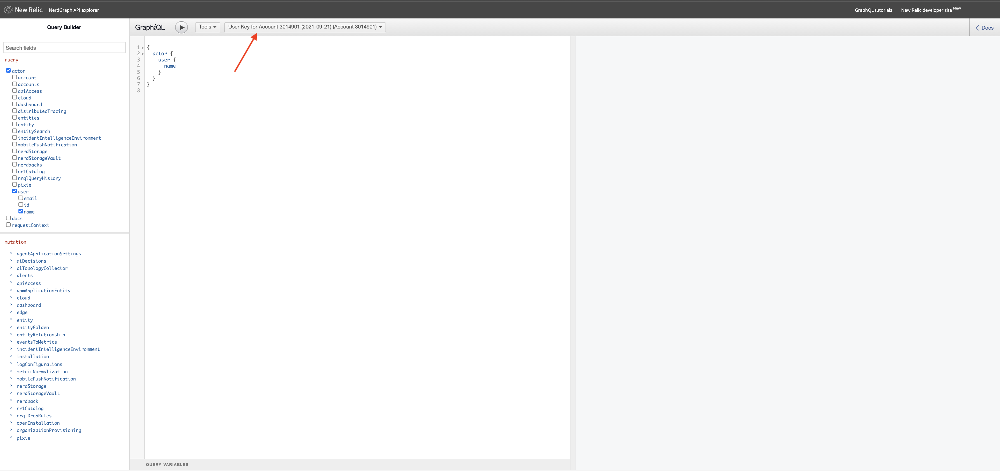
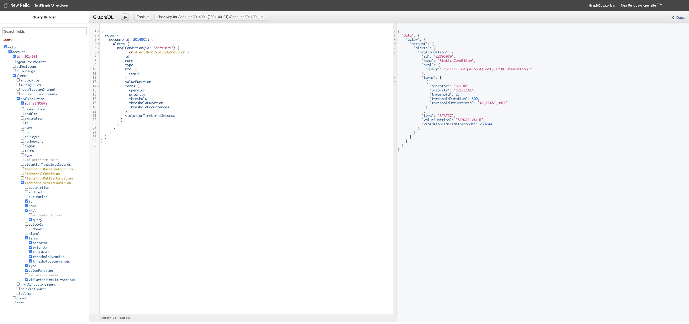
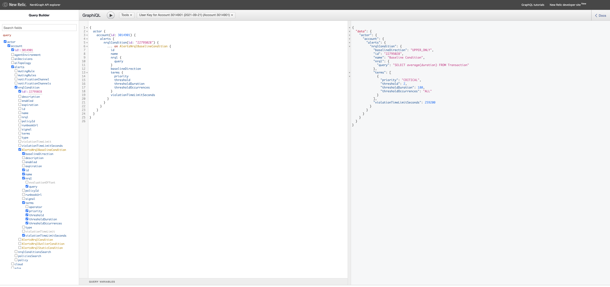
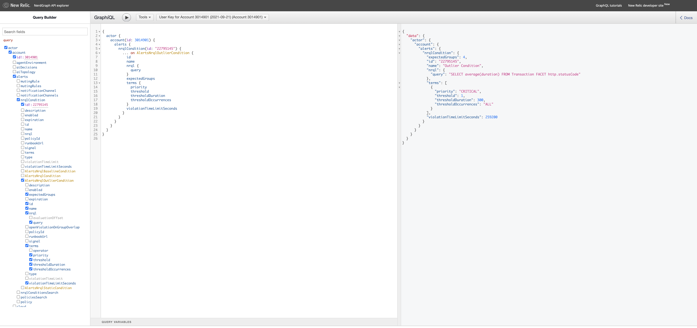

<Intro>

With a quickstart, you let your users quickly install dashboards, alerts, and other resources. Here, you learn how to use New Relic's GraphQL API, [NerdGraph](https://api.newrelic.com/graphiql), to query your existing alert conditions and configure them in your quickstart.

</Intro>

<Callout variant="important">

This guide assumes you already have alerts in your New Relic account and a quickstart that you want to add those alerts to. If you don't already have a quickstart, follow [our lab](/contribute-to-quickstarts/build-a-quickstart) to learn how to build one.

</Callout>

## Set up your quickstart's alerts directory

This guide assumes you have a quickstart. However, your quickstart may or may not already have alerts. Either way, to add alerts to your quickstart, you need an _alerts_ directory. If your quickstart already has one, you can skip this section.

The [__template_ directory](https://github.com/newrelic/newrelic-quickstarts/tree/main/_template) of [New Relic One quickstarts](https://github.com/newrelic/newrelic-quickstarts) contains an _alerts_ template folder. Copy this folder to your quickstart. From here, you use the YAML file that corresponds to the alert condition type you want to add to your quickstart.

Once your quickstart is ready to add alerts, you need to look up your alert condition's ID.

## Look up your alert's condition ID

To populate your alert configurations with NerdGraph, you first need to look up its identifier.

<Steps>

<Step>

From your [New Relic homepage](https://one.newrelic.com/), go to **Alerts & AI**.



</Step>

<Step>

Click **Policies** in left hand navigation.



</Step>

<Step>

Choose your policy from the list.


</Step>

<Step>

Here, you see the list of conditions. Choose the condition that you want to query. 


</Step>

<Step>

On the Next page, you see **ID**, **Account**, and **Policy** associated with the condition. Copy the ID.



</Step>

</Steps>

With this identifier, you can now query your alert conditions and use the response to build out alert resources in your quickstart.

## Query alert conditions in NerdGraph

There are three types of alerts you can have in New Relic:

- [Static](#query-your-static-alert-condition)
- [Baseline](#query-your-baseline-alert-condition)
- [Outlier](#query-your-outlier-alert-condition)

Jump to the appropriate section for the kind of alert you want to add to your quickstart.

### Query your static alert condition

<Steps>

<Step>

Open the [NerdGraph API explorer](https://api.newrelic.com/graphiql) and select your key from the dropdown menu.



</Step>

<Step>

Copy the following GraphQL query and paste it in the center pane of the explorer.

```js
{
  actor {
    account(id: REPLACE_ACCOUNT_ID) {
      alerts {
        nrqlCondition(id: REPLACE_CONDITION_ID) {
          ... on AlertsNrqlStaticCondition {
            id
            name
            type
            nrql {
              query
            }
            valueFunction
            terms {
              operator
              priority
              threshold
              thresholdDuration
              thresholdOccurrences
            }
            violationTimeLimitSeconds
          }
        }
      }
    }
  }
}

```

Here, you query `AlertsNrqlStaticCondition` for your condition's ID, name, query and more. These are the required fields you need to create the same alert in your quickstart.

<Callout variant="important">

Make sure you replace your account ID and condition ID in the above query.

</Callout>

</Step>

<Step>

Execute the query to get a JSON representation of the specified condition.



Next, use this response to add a static alert to your quickstart.

<Callout variant='tip'>

Notice the checkboxes in the left-hand pane get checked when you paste the query in the explorer. This query returns the fields required to add alert to the quickstart.
If you've set custom fields or want to query more information, feel free to either edit the query in the center pane of the explorer or check the corresponding box in the left-hand pane.

</Callout>

</Step>

<Step>

Populate _static-alert.yml_ from your _alerts_ quickstart folder with the data returned from your query. Given the example response from the last step, our file looks like:

```yml
---

# Name of the alert
name: Static Condition

# Description and details
details: |+
  This alert is triggered whenever the host count is < 2.

# Type of alert
type: STATIC

# NRQL query
nrql:
  query: "SELECT uniqueCount(host) FROM Transaction"

# Function used to aggregate the NRQL query value(s) for comparison to the terms.threshold (Default: SINGLE_VALUE)
valueFunction: SINGLE_VALUE

# List of Critical and Warning thresholds for the condition
terms:
- priority: CRITICAL
  # Operator used to compare against the threshold.
  operator: BELOW
  # Value that triggers a violation
  threshold: 2
  # Time in seconds; 120 - 3600
  thresholdDuration: 300
  # How many data points must be in violation for the duration
  thresholdOccurrences: AT_LEAST_ONCE

# Duration after which a violation automatically closes
# Time in seconds; 300 - 2592000 (Default: 86400 [1 day])
violationTimeLimitSeconds: 259200

```

Here, you added a static alert to your quickstart. If it's helpful, you can rename this file to whatever you want.

</Step>

</Steps>

### Query your baseline alert condition

<Steps>

<Step>

Open the [NerdGraph API explorer](https://api.newrelic.com/graphiql) and select your key from the dropdown menu.


</Step>

<Step>

Copy the following GraphQL query and paste it in the center pane of the explorer.

```js
{
  actor {
    account(id: REPLACE_ACCOUNT_ID) {
      alerts {
        nrqlCondition(id: REPLACE_CONDITION_ID) {
          ... on AlertsNrqlBaselineCondition {
            id
            name
            nrql {
              query
            }
            baselineDirection
            terms {
              priority
              threshold
              thresholdDuration
              thresholdOccurrences
            }
            violationTimeLimitSeconds
          }
        }
      }
    }
  }
}

```

Here, you query `AlertsNrqlBaselineCondition` for your condition's name, query, `baselineDirection`, and other fields required to add the condition to your quickstart.

<Callout variant="important">

Make sure you replace your account ID and condition ID in the above query.

</Callout>

</Step>

<Step>

Execute the query to get the configuration data of your alert.



Next, use this response to add baseline alert to your quickstart.

<Callout variant='tip'>

Notice the checkboxes in the left-hand pane get checked when you paste the query in the explorer. This query returns the fields required to add alert to the quickstart.
If you've set custom fields or want to query more information, feel free to either edit the query in the center pane of the explorer or check the corresponding box in the left-hand pane.

</Callout>

</Step>

<Step>

Populate _baseline-alert.yml_ from your _alerts_ quickstart folder with the data returned from your query. Given the example response from the last step, our file looks like:

```yml
---

# Name of the alert
name: Baseline Condition

# Description and details
details: |+
  This alert is triggered whenever the average Transaction duration deviates 2 standard deviations from the normal.

# Type of alert
type: BASELINE

# NRQL query
nrql:
  # Baseline alerts can use an optional FACET
  query: "SELECT average(duration) FROM Transaction"

# Direction in which baseline is set (Default: LOWER_ONLY)
baselineDirection: UPPER_ONLY

# List of Critical and Warning thresholds for the condition
terms:
- priority: CRITICAL
  # Value that triggers a violation
  threshold: 2
  # Time in seconds; 120 - 3600, must be a multiple of 60 for Baseline conditions
  thresholdDuration: 180
  # How many data points must be in violation for the duration
  thresholdOccurrences: ALL

# Duration after which a violation automatically closes
# Time in seconds; 300 - 2592000 (Default: 86400 [1 day])
violationTimeLimitSeconds: 259200

```

Here, you added a baseline alert to your quickstart. If it's helpful, you can rename this file to whatever you want.

</Step>

</Steps>

### Query your outlier alert condition

<Steps>

<Step>

Open the [NerdGraph API explorer](https://api.newrelic.com/graphiql) and select your key from the dropdown menu.


</Step>

<Step>

Copy the following GraphQL query and paste it in the center pane of the explorer.

```js
{
  actor {
    account(id: REPLACE_ACCOUNT_ID) {
      alerts {
        nrqlCondition(id: REPLACE_CONDITION_ID) {
          ... on AlertsNrqlOutlierCondition {
            id
            name
            nrql {
              query
            }
            expectedGroups
            terms {
              priority
              threshold
              thresholdDuration
              thresholdOccurrences
            }
            violationTimeLimitSeconds
          }
        }
      }
    }
  }
}

```

Here, you query `AlertsNrqlOutlierCondition` for required fields to add an outlier alert to your quickstart.

<Callout variant="important">

Make sure you replace your account ID and condition ID in the above query.

</Callout>

</Step>

<Step>

Execute the query to get the configuration data for your alert condition.



Next, use this response to add a outlier alert to your quickstart.

</Step>

<Step>

Populate _outlier-alert.yml_ from your _alerts_ quickstart folder with the data returned from your query. Given the example response from the last step, our file looks like:

```yml
---

# Name of the alert
name: Outlier Condition

# Description and details
details: |+
  This alert is triggered when any facet(s) deviate from the center of the group for at least 5 mins

# Type of alert
type: OUTLIER

# NRQL query
nrql:
  # Outlier alerts require FACET
  query: "SELECT average(duration) FROM Transaction FACET http.statusCode"

# Number of groups expected in the returned values for the condition (Default: 2)
expectedGroups: 4

# List of Critical and Warning thresholds for the condition
terms:
- priority: CRITICAL
  # Value that triggers a violation
  threshold: 1
  # Time in seconds; 120 - 3600
  thresholdDuration: 300
  # How many data points must be in violation for the duration
  thresholdOccurrences: ALL

# Duration after which a violation automatically closes
# Time in seconds; 300 - 2592000 (Default: 86400 [1 day])
violationTimeLimitSeconds: 2592000

```

Here, you added an outlier alert to your quickstart. If it's helpful, you can rename this file to whatever you want.

</Step>

</Steps>

## Summary

In this guide, you learned how to query your existing alert conditions using NerdGraph and how to use the query's JSON response to populate corresponding alert files in quickstart. Read our documentation to learn more about:

 - [Alerts](https://docs.newrelic.com/docs/alerts-applied-intelligence/)
 - [Building quickstarts](/contribute-to-quickstart/build-a-quickstart)