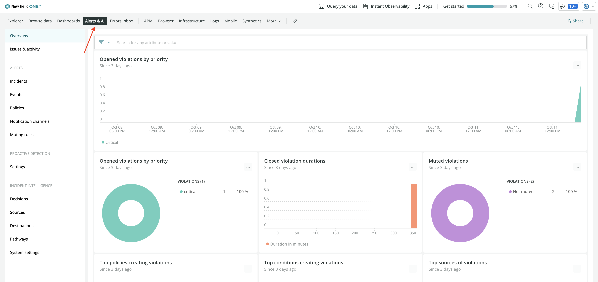

<Intro>

With a quickstart, you let your users quickly install dashboards, alerts, and other resources. Here, you learn how to use New Relic's GraphQL API, [NerdGraph](https://api.newrelic.com/graphiql), to query your existing alert conditions and configure them in your quickstart.

</Intro>

<Callout variant="important">

This guide assumes you already have alerts in your New Relic account and a quickstart that you want to add those alerts to. If you don't already have a quickstart, follow [our lab](/contribute-to-quickstarts/build-a-quickstart) to learn how to build one.

</Callout>

## Query an existing static alert in NerdGraph

Open the [NerdGraph API explorer](https://api.newrelic.com/graphiql) and select your key from the dropdown menu.


Copy the following GraphQL query and paste it in the center pane of the explorer.

```js
{
  actor {
    account(id: REPLACE_ACCOUNT_ID) {
      alerts {
        nrqlCondition(id: REPLACE_CONDITION_ID) {
          ... on AlertsNrqlStaticCondition {
            id
            name
            type
            nrql {
              query
            }
            valueFunction
            terms {
              operator
              priority
              threshold
              thresholdDuration
              thresholdOccurrences
            }
            violationTimeLimitSeconds
          }
        }
      }
    }
  }
}

```

Note here that you're building the query on `AlertsNrqlStaticCondition` to query the existing static alert. It returns alert's id, name, query and other information that you can use to update your quickstart. 

Replace your account ID and condition ID in the above query to get the details of your alert condition. By using the UI, the explorer automatically inserts your account ID, but you need to look up your condition's ID.

In your [New Relic homepage](https://one.newrelic.com/), go to **Alerts & AI**.


 
Click **Policies** in left hand navigation. 


Here, choose your policy from the list and click on the corresponding condition to get its ID. 


Insert this ID in the above query and execute it to get a JSON representation of the specified condition. 


You can use this response to add static alert to your quickstart. 

<Callout variant='tip'>

Notice that the checkboxes in the left-hand pane get checked when you paste the query in the explorer. This query returns the fileds required to add alert to the quickstart. 
If you've set custom fields or want to query more information, feel free to either edit the query in the center pane of the explorer or check the corresponding box in the left-hand pane.

</Callout>

The [__template_ directory](https://github.com/newrelic/newrelic-quickstarts/tree/main/_template) of [New Relic One quickstarts](https://github.com/newrelic/newrelic-observability-packs) contains the folder for alerts. You find the templates for static, baseline and outlier alerts inside this folder. 
If you don't already have an _alerts_ directory in your quickstart, copy this folder to your quickstart. From here, you use the corresponding yaml file to add alerts to your quickstart.

Use the _static-alert.yml_ file from _alerts_ folder and populate it using the information returned from above query. For reference, your _static-alert.yml_ file contains the following content.

```yml
---

# Name of the alert
name: Static Condition

# Description and details
details: |+
  This alert is triggered whenever the host count is < 2.

# Type of alert
type: STATIC

# NRQL query
nrql:
  query: "SELECT uniqueCount(host) FROM Transaction"

# Function used to aggregate the NRQL query value(s) for comparison to the terms.threshold (Default: SINGLE_VALUE)
valueFunction: SINGLE_VALUE

# List of Critical and Warning thresholds for the condition
terms:
- priority: CRITICAL
  # Operator used to compare against the threshold.
  operator: BELOW
  # Value that triggers a violation
  threshold: 2
  # Time in seconds; 120 - 3600
  thresholdDuration: 300
  # How many data points must be in violation for the duration
  thresholdOccurrences: AT_LEAST_ONCE

# Duration after which a violation automatically closes
# Time in seconds; 300 - 2592000 (Default: 86400 [1 day])
violationTimeLimitSeconds: 259200

```

Here, you added the pre-existing static alert to the quickstart. Follow the same procedure to add baseline and outlier alerts. 

## Query an existing baseline alert in NerdGraph

Use the following GraphQL query to query an existing baseline alert. 

```js
{
  actor {
    account(id: REPLACE_ACCOUNT_ID) {
      alerts {
        nrqlCondition(id: REPLACE_CONDITION_ID) {
          ... on AlertsNrqlBaselineCondition {
            id
            name
            nrql {
              query
            }
            baselineDirection
            terms {
              priority
              threshold
              thresholdDuration
              thresholdOccurrences
            }
            violationTimeLimitSeconds
          }
        }
      }
    }
  }
}

```

Note that you build the query on `AlertsNrqlBaselineCondition`. This will return you the id, name, query, baselineDirection and other information related to the specified baseline condition. 


Use the _baseline-alert.yml_ file from _alerts_ folder and populate it using the information returned from above query.

```yml
---

# Name of the alert
name: Baseline Condition

# Description and details
details: |+
  This alert is triggered whenever the average Transaction duration deviates 2 standard deviations from the normal.

# Type of alert
type: BASELINE

# NRQL query
nrql:
  # Baseline alerts can use an optional FACET
  query: "SELECT average(duration) FROM Transaction"

# Direction in which baseline is set (Default: LOWER_ONLY)
baselineDirection: UPPER_ONLY

# List of Critical and Warning thresholds for the condition
terms:
- priority: CRITICAL
  # Value that triggers a violation
  threshold: 2
  # Time in seconds; 120 - 3600, must be a multiple of 60 for Baseline conditions
  thresholdDuration: 180
  # How many data points must be in violation for the duration
  thresholdOccurrences: ALL 

# Duration after which a violation automatically closes
# Time in seconds; 300 - 2592000 (Default: 86400 [1 day])
violationTimeLimitSeconds: 259200

```
Here, you added an existing baseline alert to your quickstart.

## Query an existing outlier alert in NerdGraph

Use the following GraphQL query to query an existing outlier alert.

```js
{
  actor {
    account(id: REPLACE_ACCOUNT_ID) {
      alerts {
        nrqlCondition(id: REPLACE_CONDITION_ID) {
          ... on AlertsNrqlOutlierCondition {
            id
            name
            nrql {
              query
            }
            expectedGroups
            terms {
              priority
              threshold
              thresholdDuration
              thresholdOccurrences
            }
            violationTimeLimitSeconds
          }
        }
      }
    }
  }
}

```
Note that you build the query on `AlertsNrqlOutlierCondition` for outlier alert. This returns the JSON representation of the required fields to add outlier alert to your quickstart. 


Use the _outlier-alert.yml_ file from _alerts_ folder and populate it using the information returned from above query.

```yml
---

# Name of the alert
name: Outlier Condition

# Description and details
details: |+
  This alert is triggered when any facet(s) deviate from the center of the group for at least 5 mins

# Type of alert
type: OUTLIER

# NRQL query
nrql:
  # Outlier alerts require FACET
  query: "SELECT average(duration) FROM Transaction FACET http.statusCode"

# Number of groups expected in the returned values for the condition (Default: 2)
expectedGroups: 4

# List of Critical and Warning thresholds for the condition
terms:
- priority: CRITICAL
  # Value that triggers a violation
  threshold: 1
  # Time in seconds; 120 - 3600
  thresholdDuration: 300
  # How many data points must be in violation for the duration
  thresholdOccurrences: ALL 

# Duration after which a violation automatically closes
# Time in seconds; 300 - 2592000 (Default: 86400 [1 day])
violationTimeLimitSeconds: 2592000

```

Here, you added an outlier alert to your quickstart. 

## Summary

In this guide, you learned how to query your existing alert conditions using NerdGraph and how to use the query's JSON response to populate corresponding alert files in quickstart. Read our documentation to learn more about:

 - [Alerts](https://docs.newrelic.com/docs/alerts-applied-intelligence/)
 - [Building quickstarts](/contribute-to-quickstart/build-a-quickstart)