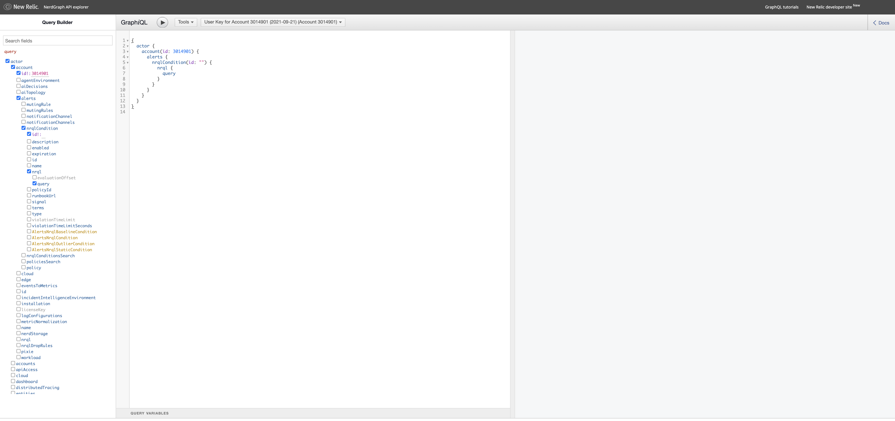
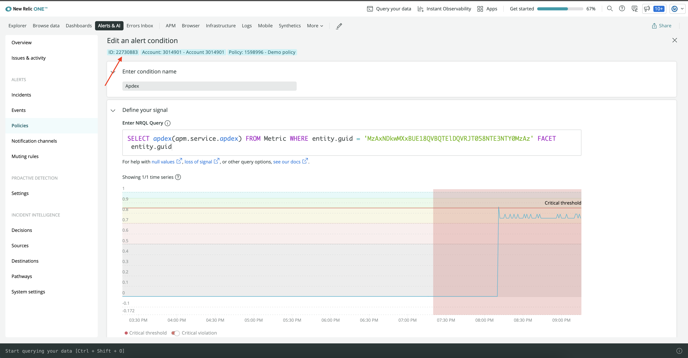
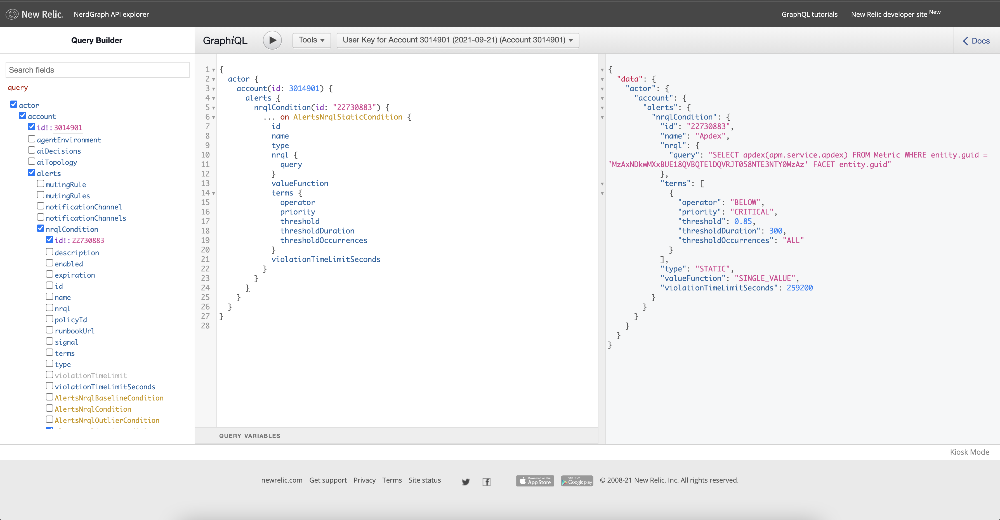
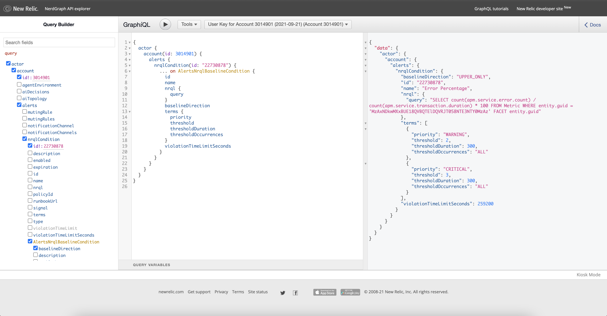
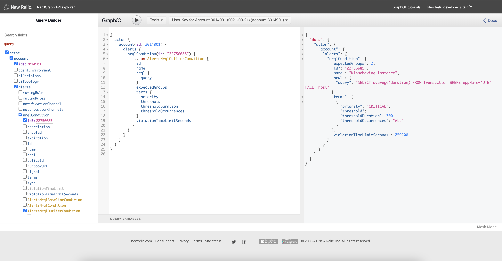

<Intro>

Quickstarts equips you with dashboards, alerts, and other observability building blocks to get value from your data faster. To help you query your existing alerts and add them to your [quickstart](/contribute-to-quickstarts/build-a-quickstart), we provide you with the New Relic's [Nerdgraph API explorer](https://api.newrelic.com/graphiql). Here you learn how to use the Nerdgraph to get a JSON representation of each alert condition and populate the corresponding alert file in quickstart.

</Intro>

<Callout variant="important">

It is assumed that you already have alerts and a quickstart. This guide will walk you through adding the alerts with Nerdgraph. Refer to [Build a quickstart](/contribute-to-quickstart/build-a-quickstart) for a detailed guide.

</Callout>

## Build a query in Nerdgraph

Open the [Nerdgraph API explorer](https://api.newrelic.com/graphiql) and select your key from the dropdown menu.


Building a query is simple in the explorer. Check the appropriate boxes to build a GraphQL query:

```js
{
  actor {
    account(id: REPLACE_ACCOUNT_ID) {
      alerts {
        nrqlCondition(id: REPLACE_CONDITION_ID) {
          ... on AlertsNrqlStaticCondition {
            id
            name
            nrql {
              query
            }
          }
        }
      }
    }
  }
}
```



Replace your account ID and condition ID in the above query to get the details of your alert condition. In [New Relic](https://one.newrelic.com/), go to **Alerts & AI** an then **Policies** in left hand navigation. Choose your policy from the list and click on the corresponding condition to get its ID. 



## Query an existing static alert in Nerdgraph

Build the following query for existing static alert in Nerdgraph:

```js
{
  actor {
    account(id: REPLACE_ACCOUNT_ID) {
      alerts {
        nrqlCondition(id: REPLACE_CONDITION_ID) {
          ... on AlertsNrqlStaticCondition {
            id
            name
            type
            nrql {
              query
            }
            valueFunction
            terms {
              operator
              priority
              threshold
              thresholdDuration
              thresholdOccurrences
            }
            violationTimeLimitSeconds
          }
        }
      }
    }
  }
}

```

The above query will return you the json representation of the specified static condition that you can use to update your quickstart. 



Use the _static-alert.yml_ file from quickstart template and start populating it using the information returned from above query.

```yml
---

# Name of the alert
name: Apdex

# Description and details
details: |+
  This alert is triggered whenever the apdex score is below 0.85 for at least 5 minutes.

# Type of alert
type: STATIC

# NRQL query
nrql:
  query: "SELECT apdex(apm.service.apdex) FROM Metric WHERE entity.guid = 'MzAxNDkwMXxBUE18QVBQTElDQVRJT058NTE3NTY0MzAz' FACET entity.guid"

# Function used to aggregate the NRQL query value(s) for comparison to the terms.threshold (Default: SINGLE_VALUE)
valueFunction: SINGLE_VALUE

# List of Critical and Warning thresholds for the condition
terms:
- priority: CRITICAL
  # Operator used to compare against the threshold.
  operator: BELOW
  # Value that triggers a violation
  threshold: 0.85
  # Time in seconds; 120 - 3600
  thresholdDuration: 300
  # How many data points must be in violation for the duration
  thresholdOccurrences: ALL 

# Duration after which a violation automatically closes
# Time in seconds; 300 - 2592000 (Default: 86400 [1 day])
violationTimeLimitSeconds: 259200

```

Here, you added the pre-existing apdex alert to the quickstart. Follow the same procedure to add baseline and outlier alerts. 

## Query an existing baseline alert in Nerdgraph

Build the following query for baseline alert in Nerdgraph:

```js
{
  actor {
    account(id: REPLACE_ACCOUNT_ID) {
      alerts {
        nrqlCondition(id: REPLACE_CONDITION_ID) {
          ... on AlertsNrqlBaselineCondition {
            id
            name
            nrql {
              query
            }
            baselineDirection
            terms {
              priority
              threshold
              thresholdDuration
              thresholdOccurrences
            }
            violationTimeLimitSeconds
          }
        }
      }
    }
  }
}

```

Note that here, we run query on AlertsNrqlBaselineCondition. The above query will return you the json representation of the specified baseline condition. 



Use the _baseline-alert.yml_ file from quickstart template and start populating it using the information returned from above query.

```yml
---

# Name of the alert
name: Error Percentage

# Description and details
details: |+
  This alert is triggered whenever error percentage deviates 3 standard deviations for at least 5 minutes from the baseline.  
  It also sends a warning signal if error percentage only deviates 2 standard deviations from the baseline.

# Type of alert
type: BASELINE

# NRQL query
nrql:
  # Baseline alerts can use an optional FACET
  query: "SELECT count(apm.service.error.count) / count(apm.service.transaction.duration) * 100 FROM Metric WHERE entity.guid = 'MzAxNDkwMXxBUE18QVBQTElDQVRJT058NTE3NTY0MzAz' FACET entity.guid"

# Direction in which baseline is set (Default: LOWER_ONLY)
baselineDirection: UPPER_ONLY

# List of Critical and Warning thresholds for the condition
terms:
- priority: CRITICAL
  # Value that triggers a violation
  threshold: 3
  # Time in seconds; 120 - 3600, must be a multiple of 60 for Baseline conditions
  thresholdDuration: 300
  # How many data points must be in violation for the duration
  thresholdOccurrences: ALL 

# Adding a Warning threshold is optional
- priority: WARNING
  threshold: 2
  thresholdDuration: 300
  thresholdOccurrences: ALL 

# Duration after which a violation automatically closes
# Time in seconds; 300 - 2592000 (Default: 86400 [1 day])
violationTimeLimitSeconds: 259200

```
Here, you added an existing baseline alert called Error Percentage to your quickstart.

## Query an existing outlier alert in Nerdgraph

Build the following query for outlier alert in Nerdgraph:

```js
{
  actor {
    account(id: REPLACE_ACCOUNT_ID) {
      alerts {
        nrqlCondition(id: REPLACE_CONDITION_ID) {
          ... on AlertsNrqlOutlierCondition {
            id
            name
            nrql {
              query
            }
            expectedGroups
            terms {
              priority
              threshold
              thresholdDuration
              thresholdOccurrences
            }
            violationTimeLimitSeconds
          }
        }
      }
    }
  }
}

```

The above query will return you the json representation of the specified outlier condition that you can use to update your quickstart. 



Use the _outlier-alert.yml_ file from quickstart template and start populating it using the information returned from above query.

```yml
---

# Name of the alert
name: Misbehaving instance

# Description and details
details: |+
  This alert is triggered when any facet(s) deviate from the center of the group for at least 5 mins

# Type of alert
type: OUTLIER

# NRQL query
nrql:
  # Outlier alerts require FACET
  query: "SELECT average(duration) FROM Transaction WHERE appName='UTE' FACET host"

# Number of groups expected in the returned values for the condition (Default: 2)
expectedGroups: 2

# List of Critical and Warning thresholds for the condition
terms:
- priority: CRITICAL
  # Value that triggers a violation
  threshold: 1
  # Time in seconds; 120 - 3600
  thresholdDuration: 300
  # How many data points must be in violation for the duration
  thresholdOccurrences: ALL 

# Duration after which a violation automatically closes
# Time in seconds; 300 - 2592000 (Default: 86400 [1 day])
violationTimeLimitSeconds: 2592000

```

Here, you added an outlier alert to your quickstart. 

## Summary

This guide teaches you to query your existing alert conditions using Nerdgraph and use the json response to populate corresponding alert files in quickstart. 
If you're not familiar with alerts, then check our [docs for alerts](https://docs.newrelic.com/docs/alerts-applied-intelligence/).
To learn more about the quickstarts and how to create one, please refer to [Build a quickstart](/contribute-to-quickstart/build-a-quickstart).