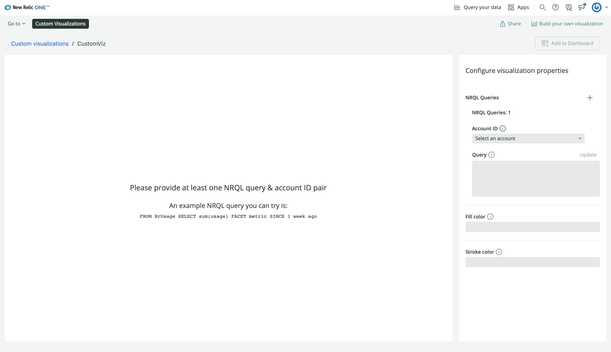
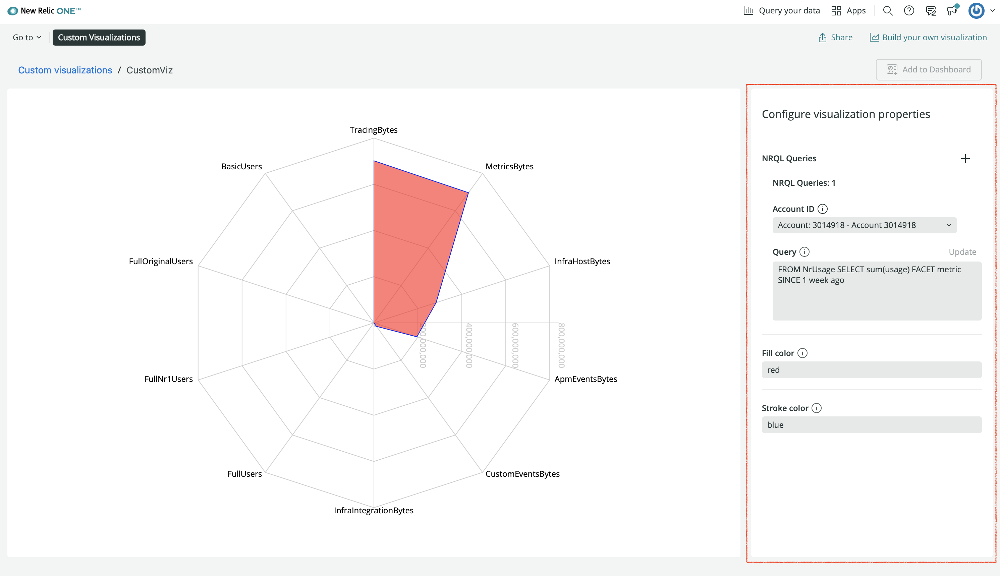
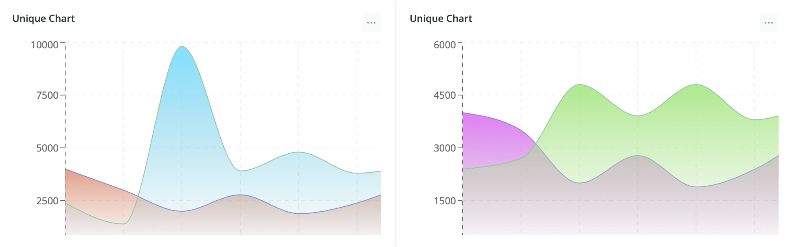
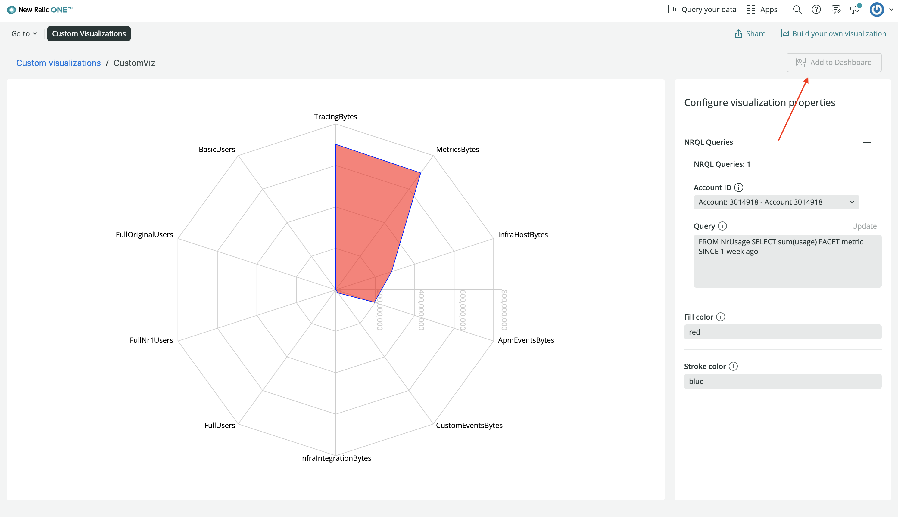
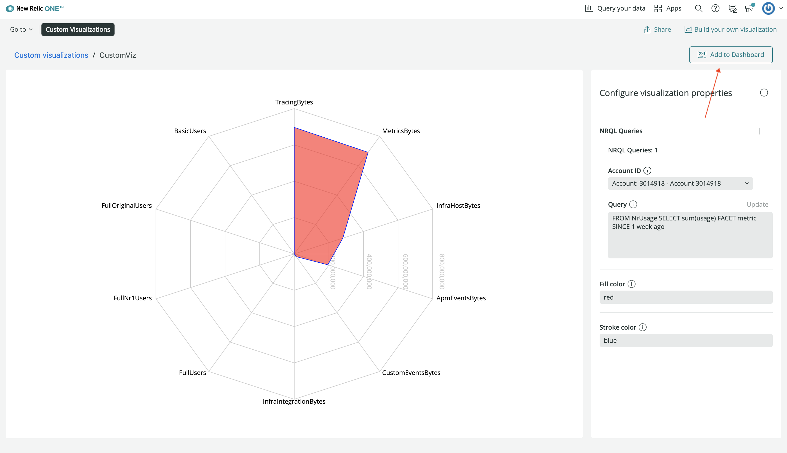
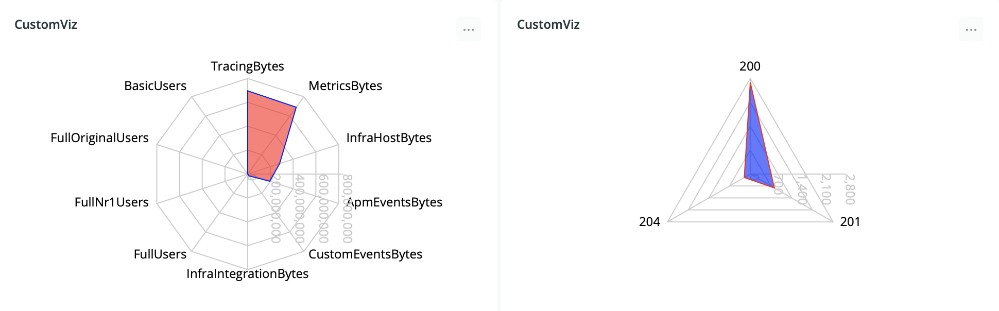

<Intro>

When you create a [dashboard](https://docs.newrelic.com/docs/query-your-data/explore-query-data/dashboards/introduction-dashboards/), you add a variety of charts to visualize your New Relic telemetry data. These charts, offered out-of-the-box, are [customizable](https://docs.newrelic.com/docs/query-your-data/explore-query-data/dashboards/manage-your-dashboard/) in that you can:

- Resize and arrange their positions in your dashboard
- Update their names, display options, and underlying data queries

But sometimes the charts we include in the platform aren't enough for you to get the most from your data. When you want to visualize your data in a specific way that isn't possible with our charts, you can build a custom visualization.

</Intro>

New Relic is programmable. This means that if the platform doesn't solve your specific problem, you can write and deploy your own code to fill in some of those gaps.

One area where programmability is valuable is in visualizing your data. While New Relic offers all the telemetry data that your apps and services report and provides many different kinds of charts to present that data, you might need to create something entirely unique.

With the New Relic One SDK, we've provided you all the tools you'll need to create your own visualizations.

## Build your custom visualization

With the New Relic One SDK, you can create a Nerdpack, which houses your visualization code. This code consists of a React component, logic, data queries, and external dependencies. The SDK also provides a component library that you can use to make NerdGraph requests, access platform state context, and more.

### Your first visualization

To build your first custom visualization, [install the New Relic One SDK](/automate-workflows/get-started-new-relic-cli) and make sure you have the latest version:

```sh
nr1 update
```

Create a Nerdpack and a visualization:

```sh
nr1 create --type nerdpack --name my-first-viz
cd my-first-viz
nr1 create --type visualization --name custom-viz
```

The visualization you created in the `my-first-viz` Nerdpack contains a default component to help you get started.

Serve your visualization locally:

```sh
nr1 nerdpack:serve
```

Then visit [New Relic](https://one.newrelic.com?nerdpacks=local) and navigate to **Apps > Custom Visualizations > CustomViz** to see it in action:



<Callout variant="important">

To view the locally served visualization, you must use the `nerdpacks=local` querystring.

</Callout>

Enter values into the fields under **Configure visualization properties** and see how the chart changes:



### Resources

Here is a list of resources for building custom visualizations:

- [Build a custom visualization for dashboards **(Guide)**](/build-apps/build-visualization)
- [Custom visualizations and the New Relic One SDK **(Guide)**](/build-apps/custom-visualizations-and-the-new-relic-one-sdk)
- [Dashboards and Custom Visualizations **(Video)**](https://www.youtube.com/watch?v=_F61mxtKfGA)

## Customize your visualization

You have a lot of control over how your visualization operates. You can choose what properties of the visualization are customizable, such as colors, sizes, and how you present your legend. You can choose whether it presents New Relic data or data from an external source. You can even install and use third-party components to create a specific look:



### Resources

Here is a list of resources for configuring custom visualizations:

- [Configuration options **(Documentation)**](/explore-docs/custom-viz/configuration-options)
- [Customize visualizations with configuration **(Guide)**](/build-apps/customize-visualizations-with-configuration)
- [Configuring custom visualizations for dashboards **(Video)**](https://www.youtube.com/watch?v=sFpG_iG7Xa8)

## Use your custom visualization

During development, you can serve your visualization locally. Under **Apps > Custom Visualizations**, you can view and configure your visualization to see how your data looks, but you can't instantiate that chart and use it in your account:



To do that, you need to publish it to the New Relic One catalog and subscribe to it from your account.

Because custom visualizations are Nerdpack artifacts, you publish and subscribe to them the same way you [publish and subscribe to New Relic One applications](/build-apps/publish-deploy). Once you've done so, you can add your custom visualization to a dashboard:



If you want to reuse your visualization to present different data or the same data in a new way, you can go back to **Apps > Custom Visualizations**, choose your visualization, configure another instance and add it to your dashboard:



### Resources

Here is a list of resources for using custom visualizations:

- [Add custom visualizations to your dashboards **(Documentation)**](https://docs.newrelic.com/docs/query-your-data/explore-query-data/dashboards/add-custom-visualizations-your-dashboards/)
- [New Relic Dashboards and Custom Visualizations: Flexibility with Less Toil **(Blog)**](https://blog.newrelic.com/product-news/dashboards-and-custom-visualizations/)
- [Dashboards and Custom Visualizations **(Video)**](https://www.youtube.com/watch?v=_F61mxtKfGA)
- [Custom Data Visualizations on New Relic **(Video)**](https://www.youtube.com/watch?v=HuR0EdHGz24)
