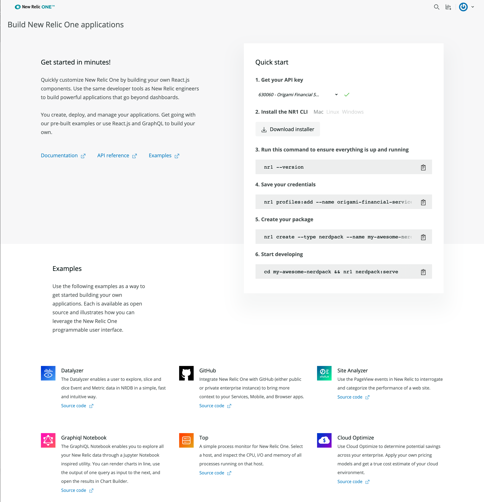

<Intro>

To build a [New Relic app](/build-apps/build-hello-world-app), you must install the New Relic One CLI. The CLI helps you build, publish, and manage your New Relic app.

 

</Intro>

We provide a variety of tools for building apps, including the New Relic One CLI (command line interface). This page explains how to use [CLI commands](#new-relic-one-cli-commands) to:

- Generate Nerdpack/Nerdlet templates

- Locally serve Nerdpacks (when developing)

- Publish and deploy

- Subscribe to Nerdpacks

- Add screenshots and metadata to the catalog

## Installing the New Relic One CLI

In New Relic, click **Instant Observability**, then check the **Apps** box in the **filter by** section. Click the [**Build on New Relic** launcher](https://one.newrelic.com/launcher/developer-center.launcher) and follow the quick start instructions. The quick start automatically generates an API key for the account you select, and gives you the pre-populated commands to create a profile, generate your first "Hello World" app, and serve it locally.

 

<Callout variant="tip">

Use the [NR1 VS Code extension](https://marketplace.visualstudio.com/items?itemName=new-relic.nr1) to build your apps.

</Callout>

## New Relic One CLI Commands

This table provides descriptions for the New Relic app commands. For more context, including usage and option details, click any individual command or the command category.

For details on user permissions, see [Permissions](/build-apps/permission-manage-apps).

For more on how to serve and publish your application, see our guide on [Deploying your New Relic app](/build-tools/new-relic-one-applications/publish-deploy).

### [Get started](/explore-docs/nr1-common)

|                                                                  |                                                                                                                                                             |
| ---------------------------------------------------------------- | ----------------------------------------------------------------------------------------------------------------------------------------------------------- |
| [`nr1 help`](/explore-docs/nr1-common/#nr1-help)                 | Shows all `nr1` commands or details about each command.                                                                                                     |
| [`nr1 update`](/explore-docs/nr1-common/#nr1-update)             | Updates to the latest version of the CLI.                                                                                                                   |
| [`nr1 create`](/explore-docs/nr1-common/#nr1-create)             | Creates a new component from a template (Nerdpack, Nerdlet, launcher, or catalog).                                                                          |
| [`nr1 profiles`](/explore-docs/nr1-common/#nr1-profiles)         | Manages the profiles you use to run CLI commands.                                                                                                           |
| [`nr1 autocomplete`](/explore-docs/nr1-common/#nr1-autocomplete) | Displays autocomplete installation instructions.                                                                                                            |
| [`nr1 nrql`](/explore-docs/nr1-common/#nr1-nrql)                 | Fetches data using [NRQL](https://newrelic.com/docs/query-data/nrql-new-relic-query-language/getting-started/introduction-nrql) (New Relic query language). |  |

### [Configure your CLI preferences](/explore-docs/nr1-config)

|                                                                   |                                                |
| ----------------------------------------------------------------- | ---------------------------------------------- |
| [`nr1 config:set`](/explore-docs/nr1-config/#nr1-configset)       | Sets a specific configuration value.           |
| [`nr1 config:get`](/explore-docs/nr1-config/#nr1-configget)       | Shows a specific configuration.                |
| [`nr1 config:list`](/explore-docs/nr1-config/#nr1-configlist)     | Lists your configuration choices.              |
| [`nr1 config:delete`](/explore-docs/nr1-config/#nr1-configdelete) | Removes the value of a specific configuration. |

### [Set up your Nerdpacks](/explore-docs/nr1-nerdpack)

|                                                                             |                                                                                                                |
| --------------------------------------------------------------------------- | -------------------------------------------------------------------------------------------------------------- |
| [`nr1 nerdpack:build`](/explore-docs/nr1-nerdpack/#nr1-nerdpackbuild)       | Assembles your Nerdpack into bundles.                                                                          |
| [`nr1 nerdpack:clone`](/explore-docs/nr1-nerdpack/#nr1-nerdpackclone)       | Clones an open source Nerdpack from [our GitHub repository](https://opensource.newrelic.com/explore-projects). |
| [`nr1 nerdpack:serve`](/explore-docs/nr1-nerdpack/#nr1-nerdpackserve)       | Serves your Nerdpack for testing and development purposes.                                                     |
| [`nr1 nerdpack:uuid`](/explore-docs/nr1-nerdpack/#nr1-nerdpackuuid)         | Shows or regenerates the UUID of a Nerdpack.                                                                   |
| [`nr1 nerdpack:publish`](/explore-docs/nr1-nerdpack/#nr1-nerdpackpublish)   | Publishes your Nerdpack to New Relic.                                                                          |
| [`nr1 nerdpack:deploy`](/explore-docs/nr1-nerdpack/#nr1-nerdpackdeploy)     | Deploys a Nerdpack version to a specific channel.                                                              |
| [`nr1 nerdpack:undeploy`](/explore-docs/nr1-nerdpack/#nr1-nerdpackundeploy) | Undeploys a Nerdpack version from a specific channel.                                                          |
| [`nr1 nerdpack:clean`](/explore-docs/nr1-nerdpack/#nr1-nerdpackclean)       | Cleans your developtment folders.                                                                              |
| [`nr1 nerdpack:validate`](/explore-docs/nr1-nerdpack/#nr1-nerdpackvalidate) | Validates the contents of your Nerdpack.                                                                       |
| [`nr1 nerdpack:info`](/explore-docs/nr1-nerdpack/#nr1-nerdpackinfo)         | Shows the state of your Nerdpack in the New Relic's registry.                                                  |

### [Manage your Nerdpack subscriptions](/explore-docs/nr1-subscription)

|                                                                                   |                                                        |
| --------------------------------------------------------------------------------- | ------------------------------------------------------ |
| [`nr1 subscription:set`](/explore-docs/nr1-subscription/#nr1-subscriptionset)     | Subscribes your account to a Nerdpack and channel.     |
| [`nr1 subscription:list`](/explore-docs/nr1-subscription/#nr1-subscriptionlist)   | Lists all the Nerdpacks your account is subscribed to. |
| [`nr1 subscription:unset`](/explore-docs/nr1-subscription/#nr1-subscriptionunset) | Unsubscribes your account from a Nerdpack.             |

### [Install and manage plugins](/explore-docs/nr1-plugins)

|                                                                            |                                              |
| -------------------------------------------------------------------------- | -------------------------------------------- |
| [`nr1 plugins:install`](/explore-docs/nr1-plugins/#nr1-pluginsinstall)     | Installs a plugin into the CLI.              |
| [`nr1 plugins:link`](/explore-docs/nr1-plugins/#nr1-pluginslink)           | Links a plugin into the CLI for development. |
| [`nr1 plugins:update`](/explore-docs/nr1-plugins/#nr1-pluginsupdate)       | Updates your installed plugins.              |
| [`nr1 plugins:uninstall`](/explore-docs/nr1-plugins/#nr1-pluginsuninstall) | Removes a plugin from the CLI.               |

### [Manage catalog information](/explore-docs/nr1-catalog)

|                                                                      |                                                             |
| -------------------------------------------------------------------- | ----------------------------------------------------------- |
| [`nr1 catalog:info`](/explore-docs/nr1-catalog/#nr1-cataloginfo)     | Shows the Nerdpack info stored in the catalog.              |
| [`nr1 catalog:submit`](/explore-docs/nr1-catalog/#nr1-catalogsubmit) | Gathers and submits the catalog info on the current folder. |
