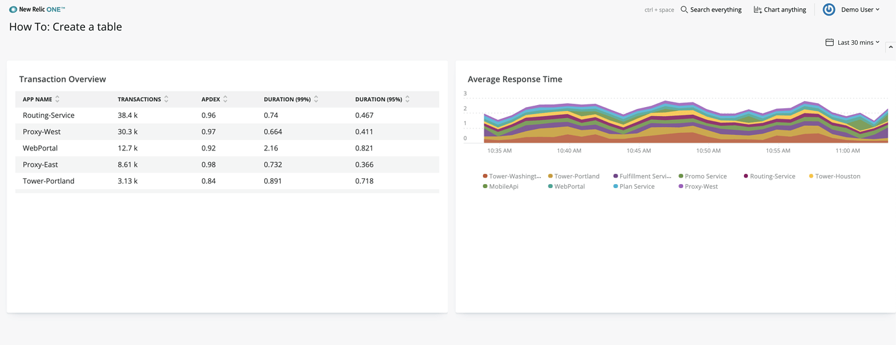

<Intro>
Tabulating data is a popular way of displaying information in an organized and legible way. For example, with the <a href="https://docs.newrelic.com/docs/chart-builder/use-chart-builder/get-started/introduction-chart-builder">New Relic One chart builder</a> you can create data tables from <a href="https://docs-dev.newrelic.com/docs/query-data/nrql-new-relic-query-language/getting-started/introduction-nrql">NRQL queries</a>. When you need to have more control over tables, or you're importing third-party data, you can build your own tables into your New Relic One application. In this guide, you are going to build a sample table using various components of the <var>nr1</var> library.

<Video id="28nnlbhrvg" type="wistia"/>
</Intro>

## Before you begin
This guide requires that you have the following:

- A New Relic account
- [NR1 CLI](https://one.newrelic.com/launcher/developer-center.launcher) (not to be confused with New Relic CLI)
- Git and node.js installed on your machine

Follow the [instructions in New Relic One](https://one.newrelic.com/launcher/developer-center.launcher) to create an API key and download and configure your NR1 CLI profile.

<br/>

<Steps>
<Step>

## Clone the example application repository

In this guide you are going to experiment with tables. To do that, you need a New Relic One application you can modify and test locally. There's a demo application for you in the [nr1-how-to](https://github.com/newrelic/nr1-how-to) repository.

Start by cloning the repository from GitHub to your local machine:

`git clone https://github.com/newrelic/nr1-how-to.git`

Then, navigate to:

`/nr1-how-to/create-a-table/nerdlets/create-a-table-nerdlet`

Edit the `index.json` file and set `this.accountId` to [your Account ID](https://docs.newrelic.com/docs/accounts/install-new-relic/account-setup/account-id) as shown in the example.

```js
export default class Nr1HowtoAddTimePicker extends React.Component {
    constructor(props){
        super(props)
        this.accountId = YOUR_ACCOUNT_ID;
    }
    ... 
}
```
</Step>
<Step>

Change the directory back to `/nr1-how-to/create-a-table/`. Your first usage of NR1 CLI is to update the app identifier and serve the demo app locally, so that you can test any change live in your browser.

```bash lineNumbers=false
nr1 nerdpack:uuid -gf
npm install
nr1 nerdpack:serve
```
</Step>
<Step>

Open [https://one.newrelic.com/?nerdpacks=local](https://one.newrelic.com/?nerdpacks=local) in your browser. You should see a **Create a table button** in your launcher: That's the demo application you are going to work on.


</Step>
<Step>

Go ahead and select the How-to application. Have a good look at it: There is a `TableChart` on the left side named **Transaction Overview**, with an **Average Response Time** `AreaChart` next to it. 

You are going to use `Table` components to add a new table to this application.



</Step>
<Step>

## Starting with the Table components

To start building the table, you are going to use the  `Table` components from the NR1 library. Details about the  `Table`  components can are on the  [New Relic developer website  3](https://developer.newrelic.com/client-side-sdk/index.html#components/Table).

To start building the table, in the index.js file, import the  `Table`  component.

```
import { Table } from 'nr1';

```

</Step>
<Step>

In the empty  `GridItem`  with the index.js file, we’re going to start building the table by adding the code below.

```
<Table items={this._getItems()}>

</Table>

```

Looking at the  `Table`  component added in the last step, we are using its  `item`  prop to provide the data that is used when rendering the table. The  `Table`  component renders a fixed number of headers and rows, as its children adding the  `TableHeader`  components and a function that returns  `TableRows`  are required.

</Step>
<Step>

## Adding the TableHeader and TableRows

Add the  `TableHeader`  and  `TableHeaderCell`  to the import statement at the top of your file with the other components imported from  `nr1`.

```
import { TableHeader, TableHeaderCell } from 'nr1';

```

</Step>
<Step>

Inside of the  `Table`  component, add the  `TableHeader`  and then a  `TableHeaderCell`  child for each heading to be displayed. Update your file with the code below.

```
<TableHeader>
    <TableHeaderCell>Application</TableHeaderCell>
    <TableHeaderCell>Size</TableHeaderCell>
    <TableHeaderCell>Company</TableHeaderCell>
    <TableHeaderCell>Team</TableHeaderCell>
    <TableHeaderCell>Commit</TableHeaderCell>
</TableHeader>

```

    </Step>
    <Step>

After building the table header, the  `Table`  needs to a function as its second child. As the data from the  `Table`  component  `items`  prop is mapped, this function is called and returns the  `TableRows`  needed to display the table data.

```
import { TableRow, TableRowCell } from 'nr1';

```

</Step>
<Step>

Add the code below under the  `TableHeader`  in the index.js file.

```
{({ item }) => (
 <TableRow>
    <TableRowCell>{item.name}</TableRowCell>
    <TableRowCell>{item.value}</TableRowCell>
    <TableRowCell>{item.company}</TableRowCell>
    <TableRowCell>{item.team}</TableRowCell>
    <TableRowCell>{item.commit}</TableRowCell>
</TableRow>
)}

```

</Step>
<Step>

Take a look at the application running in New Relic One; you should have a screen similar to below.

[](https://nr-production-discourse.s3.dualstack.us-east-1.amazonaws.com/original/3X/6/6/6678d070841e7281b2a353604c5a7e08d6317b13.png "added-table.png")

added-table.png3154×1140 273 KB

    </Step>
    <Step>

## Using pre-defined cells

For common cell patterns like users, metrics, or entity names, the nr1 library comes with pre-defined cells that can be in a  `TableRow`. Based on the data displayed in the table, an  `EntityTableRowCell`  and  `MetricTableRowCell`  are better options than the standard row used currently. Add in the  `EntityTableRowCell`  and  `MetricTableRowCell`  to your import statement.

```
import { EntityTableRowCell, MetricTableRowCell } from 'nr1';

```

</Step>
<Step>

Update the application table rows by replacing the function with the code below.

```
{({ item }) => (
    <TableRow>
        <EntityTitleTableRowCell value={item}/>
        <TableRowCell>{item.company}</TableRowCell>
        <TableRowCell>{item.team}</TableRowCell>
        <TableRowCell>{item.commit}</TableRowCell>
        <MetricTableRowCell type={MetricTableRowCell.TYPE.APDEX} value={item.value} />
    </TableRow>
)}

```

</Step>
<Step>

Now that the table rows are updated. Looking at the application in New Relic One looks similar to below, taking advantage of the pre-defined cells styling and additional detail.

[](https://nr-production-discourse.s3.dualstack.us-east-1.amazonaws.com/original/3X/1/6/166412f4953705c7a3ee2c70f32b19150253f892.png "predefined.png")

predefined.png3156×1126 270 KB

</Step>
<Step>

## Adding action to your table

Building action into your New Relic One application is a critical part of going beyond what’s possible with charts and dashboards. We are going to update our app to allow users to act on each row of data displayed in the table. Add the following helper method to your index.js file just below the  `_getItems()`  method.

```
_getActions() {
    return [
        {
            label: 'Alert Team',
            iconType: TableRow.ACTIONS_ICON_TYPE.INTERFACE__OPERATIONS__ALERT,
            onClick: (evt, { item, index }) => {
                alert(`Alert Team: ${item.team}`);
            },
        },
        {
            label: 'Rollback Version',
            iconType: TableRow.ACTIONS_ICON_TYPE.INTERFACE__OPERATIONS__UNDO,
            onClick: (evt, { item, index }) => {
                alert(`Rollback from: ${item.commit}`);
            },
        },
    ];
}

```

</Step>
<Step>

Find the  `TableRow`  component in your return statement and add the  `actions`  prop passing in the  `_getActions`  method. Your  `TableRow`  should look similar to below.

```
<TableRow actions={this._getActions()}>
```

The  `TableRow`  actions prop defines a set of actions that appear when the user hovers a table row. Actions have a mandatory text and onClick callback, but can also display an icon or be disabled if needed. Passing the  `_getActions`  method provides the table row an array of actions to display on hover.

</Step>
<Step>

Now when using the app, if a user hovers a`TableRow`, the actions available appear. When clicked, the appropriate function triggers with the selected table row data as an argument. Your application should look similar to below.

[](https://nr-production-discourse.s3.dualstack.us-east-1.amazonaws.com/original/3X/0/8/08015c5d8373e81aa9428d4c7cb4187ea792162a.png "hovered.png")

hovered.png3158×1348 283 KB

When an action is selected based on the provided callback function, an alert displays in your browser.

[](https://nr-production-discourse.s3.dualstack.us-east-1.amazonaws.com/original/3X/c/3/c306e78dedb896016251038af3df5921429284b9.png "clicked .png")

clicked .png3156×1292 326 KB

</Step>
<Step>

## How to create a table recap

Wrapping up this how-to example, you’ve successfully created a  `Table`  using various table components from the nr1 library. Then using the  `items`  and  `actions`  props on the table elements added a custom data set to display as a set of actions a user can trigger on each  `TableRow`.

More detail about all of the New Relic  `Table`  components, available props, and how to use them can be found on the  [developer website  3](https://developer.newrelic.com/client-side-sdk/index.html#components/Table).

To continue your learning, take a look at our  [self-paced workshop on Github](https://github.com/newrelic/nr1-workshop).

    </Step>
</Steps>

### Next steps

You'll get a URL to access New Relic One and see your application running locally: https://one.newrelic.com/?nerdpacks=local

One the New Relic home page, there's a new launcher to the Add time picker application.

Click the launcher, and the dashboard opens with your New Relic account transactions. 


### Related info

- [New Relic documentation](https://docs.newrelic.com)
- [Community page for how to add a time picker](https://discuss.newrelic.com/t/how-to-add-the-time-picker-to-nrql-queries/94268)
