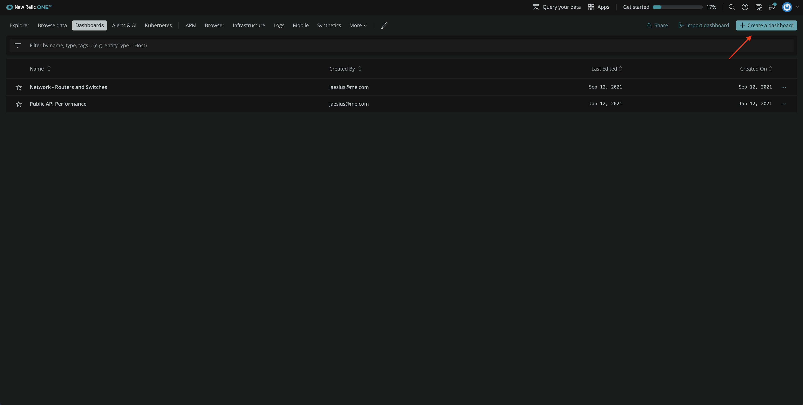
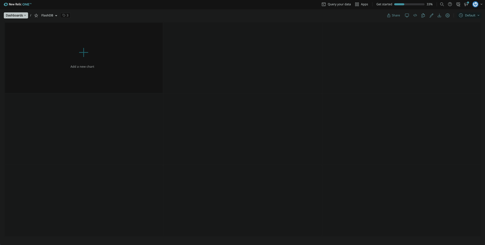
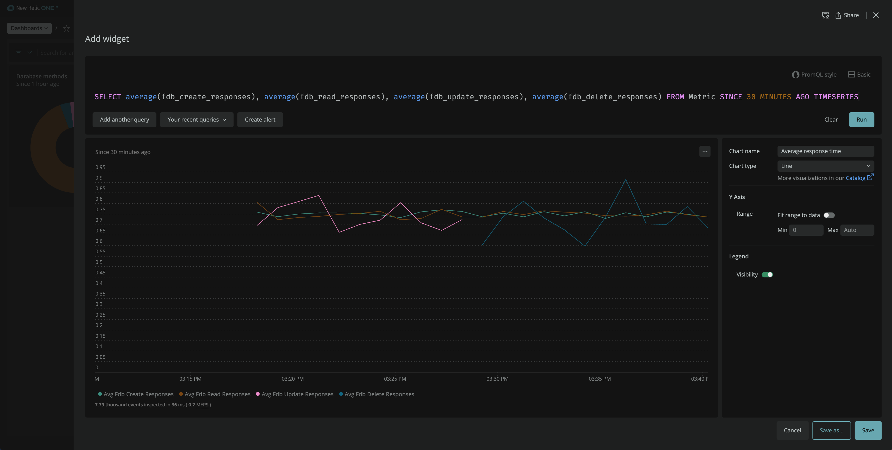
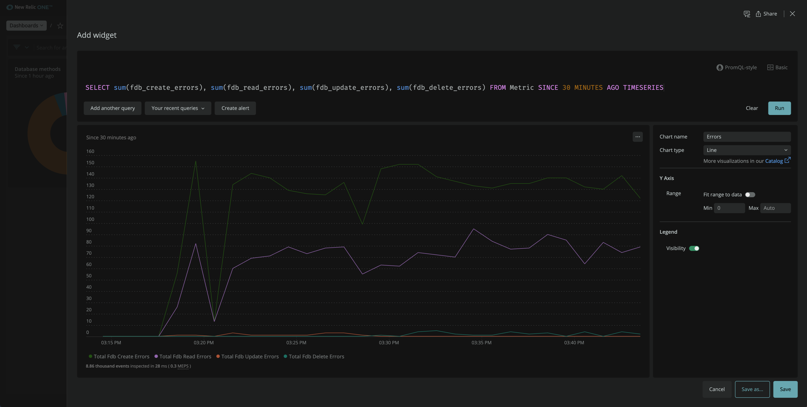
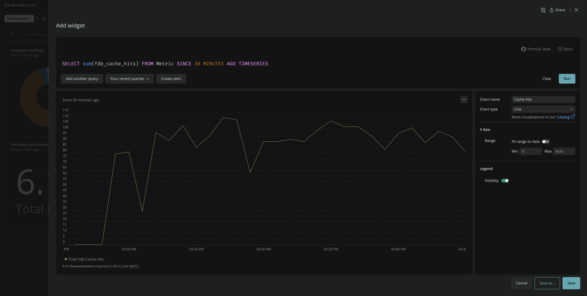
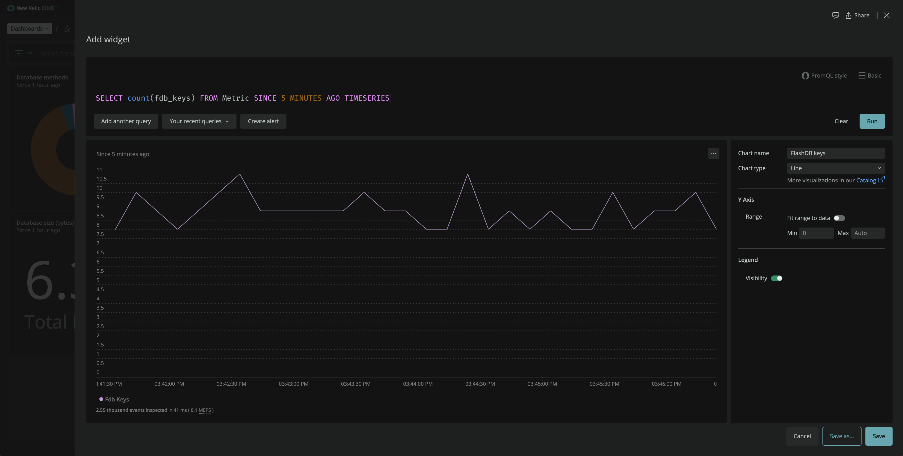

<Callout variant="course" title="Lab">

This procedure is a part of lab that teaches you how to build a quickstart. If you haven't already, checkout the [_lab introduction_](/instant-observability/build-a-quickstart)

Each procedure in this lab builds on top of the last one, so make sure you [_Deploy your application_](/instant-observability/build-a-quickstart/deploy-your-application) before proceeding with this one.

</Callout>

With New Relic dashboards, you observe and interpret the data you collect from your application. You gather the data you want to see into charts to customize the way you see it.

In this procedure, you create a dashboard in New Relic. 

## Create a dashboard

Navigate to [New Relic](https://one.newrelic.com/) and sign in with your account. Here, you see different tabs such as **Browse Data**, **Dashboards**, **Alerts & AI**. 


Move to **Dashboards** and click **Create a dashboard** in the top right corner. 



Name your dashboard "FlashDB" and click create.


## Add charts to your dashboard

Once the dashboard is in place, you can start creating charts. You're going to add the following charts:
- Database methods
- Average response time
- Errors
- Database size
- Cache hits
- Keys

### Database methods

Hover over the dashboard and click **Add a new chart**.



From this screen, you add charts using our query builder, or you choose to add text, images, or links using Markdown. Click **Add a chart**.


It takes you to a query builder option. Switch to the NRQL editor and edit the query as follows:

```sql
SELECT count(*) FROM fdb_method FACET method 
```


Click **Run** to see above results.

Here, you see the count of each FlashDB query, grouped by method. You can choose to present your results in different formats such as table, billboard, or pie chart. 


Change the chart type to pie, name your chart "Database methods", and click save.


The chart is now visible on your dashboard.


You can add more charts to your dashboard following the same pattern. To do so, click **+** in upper right hand corner. 


This takes you to the same **Add to your dashboard** page. Add another chart to your dashboard.

### Average response time
Run the following query to observe the **average response time** of flashDB queries. 

```sql
SELECT average(fdb_create_responses), average(fdb_read_responses), average(fdb_update_responses), average(fdb_delete_responses) FROM Metric SINCE 30 MINUTES AGO TIMESERIES
```

 

Here, you the observe average response time for different flashDB queries for past 30 minutes. Click **Save** to add this chart to your dashboard. Follow the same procedure to add the rest of the charts.

### Errors

For the Errors chart, use the following query:

```sql
SELECT sum(fdb_create_errors), sum(fdb_read_errors), sum(fdb_update_errors), sum(fdb_delete_errors) FROM Metric SINCE 60 MINUTES AGO TIMESERIES
```

Here, you observe errors for all database transactions for the past one hour.



### Database size

Use the following query to get Database size chart.

```sql
SELECT sum(mdb_size) FROM Metric
```


This chart shows you the database size. 

### Cache hits

For the cache hits charts, use the following query:

```sql
SELECT sum(fdb_cache_hits) FROM Metric SINCE 30 MINUTES AGO TIMESERIES
```



Here, you observe the total number of cache hits for past 30 minutes using line chart.

### Keys

Use the following query to get keys chart.

```sql
SELECT count(fdb_keys) FROM Metric SINCE 5 MINUTES AGO TIMESERIES
```



Here, you observe the flashDB key count for past 5 minutes. 

Your final dashboard will look similar to the following:


## Summary

In this procedure, you created a dashboard and added multiple charts to it to observe your services in New Relic.

<Callout variant="course" title="Lab">

This procedure is a part of lab that teaches you how to build a quickstart. Continue on to next procedure:  [_Create alerts_](/instant-observability/build-a-quickstart/create-alerts).

</Callout>