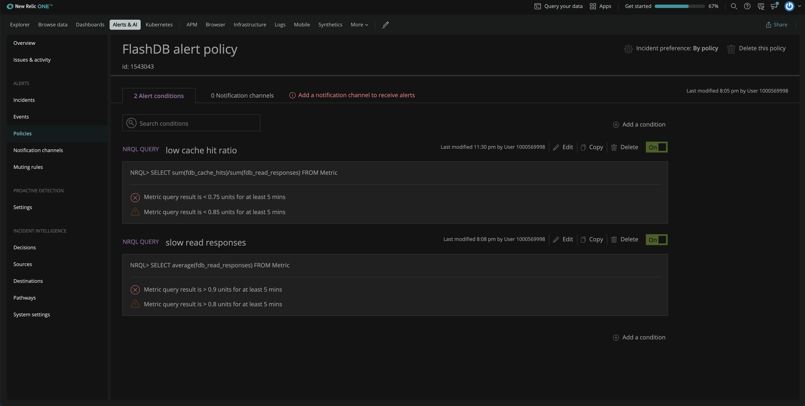

<Callout variant="course" title="Lab">

This procedure is a part of a lab that teaches you how to build a quickstart. If you haven't already, checkout the [_Lab introduction_](/instant-observability/build-a-quickstart)

Each procedure in this lab builds on top of the last one, so make sure you [_create a dashboard_](/instant-observability/build-a-quickstart/create-a-dashboard) before proceeding with this one.

</Callout>

New Relic alerts allow you to monitor your services and notify you about problems that you're interested in, so you can react fast to troubleshoot and resolve them.

>**Note:** It is assumed that you are already familiar with the alerts basics. If you're just getting started, visit the [alert documentation](https://docs.newrelic.com/docs/alerts-applied-intelligence/) to familiarize yourself with the basics before proceeding.

## Create an alert policy

Before you set alert conditions, you must create a policy. 
From **Alert & AI**, go to the **Alerts** section and click **Policies** from left-hand navigation. Then, click **New alert policy**.


Name your policy **FlashDB alert policy**. Use the default values for the rest of the fields and click **Create alert policy**.


The next step is to add alert conditions to the alert policy. You're going to add folloinwg alert conditions:
- slow read response
- low cache hit ratio

## Create alert conditions

Under **FlashDB alert policy**, click **Create a condition**.


The next page asks you to choose a category for your condition. Choose NRQL, which allows you to create a condition using a NRQL query. Then click **Next, define thresholds**.


You want to get notified if the read operation is taking longer than expected. Name your alert condition _slow read responses_ and enter the following NRQL query for your condition.

>```SQL
> SELECT average(fdb_read_responses) FROM Metric
>```


Here, you selected the average read response for FlashDB. 

Scroll down on the same page to define threshold. Select **Static** as the threshold type. It is the simplest threshold type and creates a condition based on the numeric value returned by the query. 
Set the critical threshold value at 0.9:


Here, you defined a condition that will open violation whenever read response time is above 0.9 for at least 5 minutes. You can also add a warning threshold by clicking **Add warning threshold**.


Enter the threshold value at 0.8 to get a warning when the read response is above 0.8 for at least 5 minutes.
Then, click **Save condition**. 


Now, You can see your new condition under your FlashDB alert policy. 


### Create a cache hit ratio condition 

Since you claimed that your database is fastest in the space so, you also want New Relic to notify you if your cache hit ratio is too low. Add another condition under the same policy by clicking **Add a condition**.


The next page asks you to choose the category for your condition. Choose NRQL and click **Next, define threshold**.


Enter the name Low cache hit ratio for your condition and use the following NRQL query.

>```SQL
> SELECT sum(fdb_cache_hits)/sum(fdb_read_responses) FROM Metric
>```


Next, add threshold values for critical violation and warning. The procedure is same as before. The only difference is that you want New Relic to notify you if the query returns a value _below_ 0.85 and open a critical violation if the value falls _below_ 0.75 for at least 5 minutes.


Save the condition to add it to your alert policy which now looks like the following.



## Add a notification channel

To receive notifications for any opened violation, you also need to add notification channel. 

First, move to the **Notification channels** tab and click **Add notification channels**.


From the list of channel options, click Email.


Select the email you want to receive your notifications on, and click **Update policy**.


## Summary

During this procedure, you created FlashDB alert policy and added slow read responses and low cache hit ratio conditions to it. Y ou also added a notoification channel to receive notifications about any opened violations.

<Callout variant="course" title="Lab">

This procedure is a part of lab that teaches you how to build a quickstart. Continue on to next lesson: [_Create a quickstart_](/instant-observability/build-a-quickstart/create-quickstart)

</Callout>