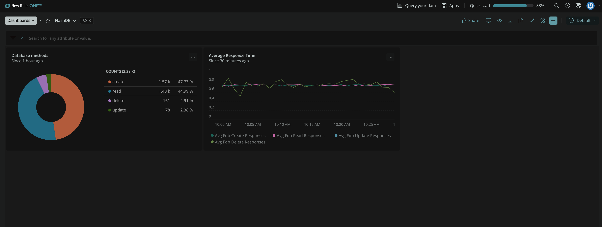

New Relic One dashboards allow you to quickly observe and make meaning of the information that you collect. You can gather and chart the specific data you want to see and customize it the way you want to see.

Throughout this lesson, you're going to create different charts in New Relic One dashboard to get insights from database transactions. 

<Callout variant='important'>

This lesson is a part of lab that teaches you to build quickstart. Before you proceed with this lesson, make sure you have your demo services up and running. 

</Callout>

You're going to create dashboard in New Relic One. Navigate to https://one.newrelic.com/ and sign in with your account. Here, you can see different tabs such as *Browse Data*, *Dashboards*, *Alerts & AI* etc. 
Move to *Dashboards* and click **Create a dashboard** in the top right corner. 


Name your dashboard and click create.


## Add charts to your dashboard

Once the dashboard is in place, you can start creating charts. Hover over the dashboard and click **Add a new chart** where you want to add the chart.


New Relic One allow you to add chart using query builder as well as text, images or links using Markdown. Click **Add a chart**.


It will take you to a query builder option. Edit the query as follow:

>```bash
>SELECT count(*) FROM fdb_method FACET method 
>```


Here, you group your results of fdb_method by attribute values. You can choose to present your results in different formats such as table, billboard, pie chart etc. 


Change the chart type to pie, name your chart and click save.


The chart is now visible on your dashboard.


You can add more charts to your dashboard following the same pattern. To add more charts to your dashboard, click **+** in upper right hand corner. 


This will take to the same _Add to your dashboard_ page, allowing you to add another chart, text, image or links. Add a few more charts to your dashboard following the same procedure as you did just now.
#### Average response time
Run the following query to observe the **average response time** of database transactions. 

>```bash
> SELECT average(fdb_create_responses), average(fdb_read_responses), average(fdb_update_responses), average(fdb_delete_responses) FROM Metric SINCE 30 MINUTES AGO TIMESERIES
>```


>**Note:** Make sure to click **Run** for the results to be visible. 

Click save to add this chart to your dashboard as well. Your dashboard will look similar to the following:



Add few more charts to your dashboard as follow:

#### Errors

>```bash
> SELECT sum(fdb_create_errors), sum(fdb_read_errors), sum(fdb_update_errors), sum(fdb_delete_errors) FROM Metric SINCE 60 MINUTES AGO TIMESERIES
>```

Here, you observe total errors for all database transactions for past one hour.


#### Database size

>```bash
> SELECT sum(mdb_size) FROM Metric
>```


#### Cache hits

>```bash
> SELECT sum(fdb_cache_hits) FROM Metric SINCE 30 MINUTES AGO TIMESERIES
>```


#### Keys

>```bash
> SELECT count(fdb_keys) FROM Metric SINCE 5 MINUTES AGO TIMESERIES
>```


Your final dashboard will look similar to the following:


<Callout variant='important'>

This lesson is a part of lab that teaches you to build quickstart. Continue on to next lesson:  [_Create New Relic Alerts_](/instant-observability/build-a-quickstart/create-alerts).

</Callout>