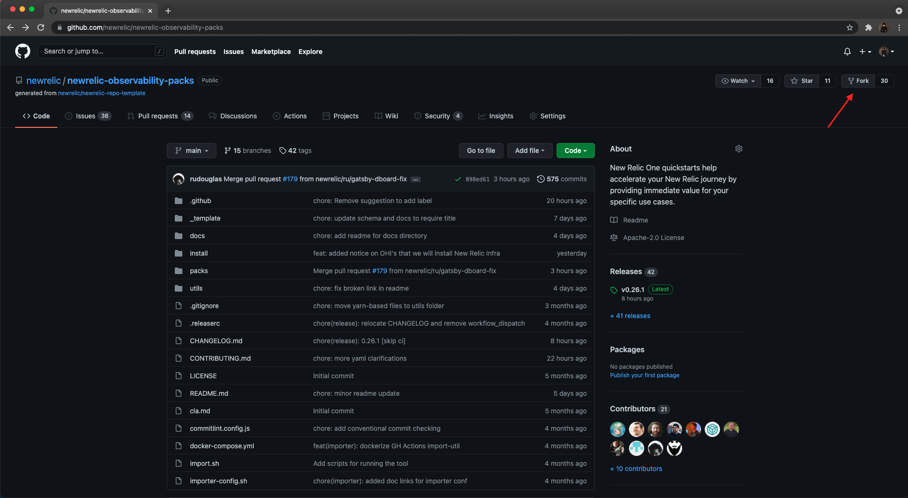
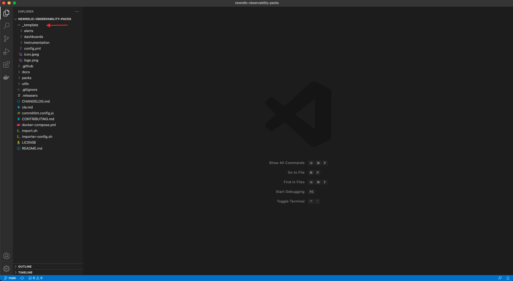
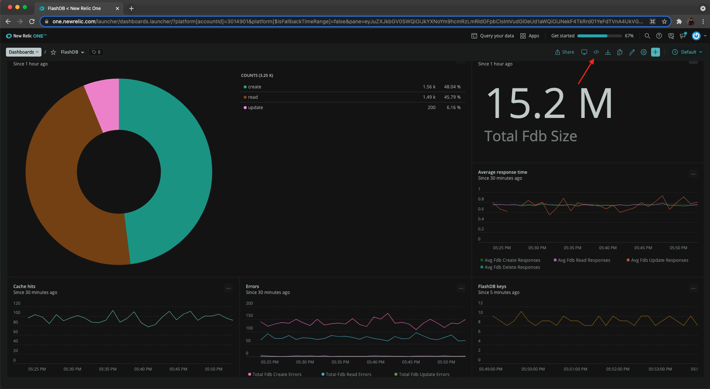
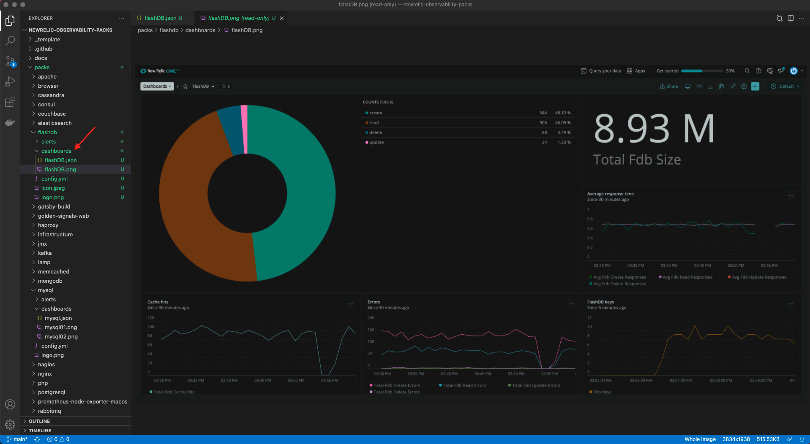

New Relic One quickstarts allow you to quickly and easily observe and monitor your services since they include observability building blocks like dashboards and alerts. 
All of this is available through an open ecosystem where you could contribute your best practices.

<Callout variant='important'>

This lesson is a part of lab that teaches you to build quickstart. Before proceeding with the lesson, make sure you have a GitHub account and completed the previous lessons to have your dashboards and alerts in place.

</Callout>

In this lesson, you'll package your dashboards and alerts into a quickstart and contribute your quickstart to New Relic One catalog.
To get started, navigate to GitHub repository of [New Relic One Observability Packs](https://github.com/newrelic/newrelic-observability-packs) and fork it.



Now, clone your own repository to your local machine with either using git or GitHub Desktop and open it in the IDE of your choice. Notice the directory structure. __template_ folder is of special importance since it contains the templates for observability building blocks in the quickstart. 



As you can see in the above image, the _\_template_ directory contains the folders for dashboards, alerts, and instrumentation. Each of these folders contain a template or template directories that you can use to create entities for your quickstart.

## Add dashboards to quickstart

Copy the _\_template_ directory and it's content to a new directory within the _packs_ folder. You don't need to copy the entire content but only the entities you want to create. Since you're only going to add dashboards and alerts to your quickstart, delete the _instrumentation_ directory. Choose a meaningful name for your recently created directory; which identifies the purpose of your quickstart. For FlashDB, just name it flashdb.


You're going to add existing dashboard to your quickstart. Copy your dashboard's JSON and save it as a JSON file in the _dashboards_ directory.



Here, you copied your dashboard's JSON to clipboard. You can simply replace the content of existing JSON file in _dashboards_ directory and rename it as **flashDB.json**. Here's what your _flashDB.json_ file should contain:

>```json
> {
    "name": "FlashDB",
    "description": null,
    "permissions": "PUBLIC_READ_WRITE",
    "pages": [
      {
        "name": "FlashDB",
        "description": null,
        "widgets": [
          {
            "visualization": {
              "id": "viz.pie"
            },
            "layout": {
              "column": 1,
              "row": 1,
              "height": 6,
              "width": 8
            },
            "title": "Database methods",
            "rawConfiguration": {
              "facet": {
                "showOtherSeries": true
              },
              "nrqlQueries": [
                {
                  "accountId": 3014901,
                  "query": "SELECT count(*) FROM fdb_method FACET method "
                }
              ]
            },
            "linkedEntityGuids": null
          },
          {
            "visualization": {
              "id": "viz.billboard"
            },
            "layout": {
              "column": 9,
              "row": 1,
              "height": 3,
              "width": 4
            },
            "title": "Database size (bytes)",
            "rawConfiguration": {
              "dataFormatters": [],
              "nrqlQueries": [
                {
                  "accountId": 3014901,
                  "query": "SELECT sum(fdb_size) FROM Metric"
                }
              ],
              "thresholds": []
            },
            "linkedEntityGuids": null
          },
          {
            "visualization": {
              "id": "viz.line"
            },
            "layout": {
              "column": 9,
              "row": 4,
              "height": 3,
              "width": 4
            },
            "title": "Average response time",
            "rawConfiguration": {
              "legend": {
                "enabled": true
              },
              "nrqlQueries": [
                {
                  "accountId": 3014901,
                  "query": "SELECT average(fdb_create_responses), average(fdb_read_responses), average(fdb_update_responses), average(fdb_delete_responses) FROM Metric SINCE 30 MINUTES AGO TIMESERIES"
                }
              ],
              "yAxisLeft": {
                "zero": true
              }
            },
            "linkedEntityGuids": null
          },
          {
            "visualization": {
              "id": "viz.line"
            },
            "layout": {
              "column": 1,
              "row": 7,
              "height": 3,
              "width": 4
            },
            "title": "Cache hits",
            "rawConfiguration": {
              "legend": {
                "enabled": true
              },
              "nrqlQueries": [
                {
                  "accountId": 3014901,
                  "query": "SELECT sum(fdb_cache_hits) FROM Metric SINCE 30 MINUTES AGO TIMESERIES"
                }
              ],
              "yAxisLeft": {
                "zero": true
              }
            },
            "linkedEntityGuids": null
          },
          {
            "visualization": {
              "id": "viz.line"
            },
            "layout": {
              "column": 5,
              "row": 7,
              "height": 3,
              "width": 4
            },
            "title": "Errors",
            "rawConfiguration": {
              "legend": {
                "enabled": true
              },
              "nrqlQueries": [
                {
                  "accountId": 3014901,
                  "query": "SELECT sum(fdb_create_errors), sum(fdb_read_errors), sum(fdb_update_errors), sum(fdb_delete_errors) FROM Metric SINCE 30 MINUTES AGO TIMESERIES"
                }
              ],
              "yAxisLeft": {
                "zero": true
              }
            },
            "linkedEntityGuids": null
          },
          {
            "visualization": {
              "id": "viz.line"
            },
            "layout": {
              "column": 9,
              "row": 7,
              "height": 3,
              "width": 4
            },
            "title": "FlashDB keys",
            "rawConfiguration": {
              "legend": {
                "enabled": true
              },
              "nrqlQueries": [
                {
                  "accountId": 3014901,
                  "query": "SELECT count(fdb_keys) FROM Metric SINCE 5 MINUTES AGO TIMESERIES"
                }
              ],
              "yAxisLeft": {
                "zero": true
              }
            },
            "linkedEntityGuids": null
          }
        ]
      }
    ]
  }
> ```

Next, create a screenshot of your dashboard and add it to _dashboards_ directory. Give it the same name as your JSON file. Your _dashboard_ directory should look similar to the following:



## Add alerts to quickstart

The next step is to add alerts to the quickstart. The _alerts_ directory contain the templates for static, outlier and baseline alerts. You're going to add existing alerts to the quickstart. 
To help you populate your .yml alert files, you can use New Relic One's [Graphql API](https://api.newrelic.com/graphiql) to get the json object. Open the Graphql APi and select your account from the drop down.


Building a query is simple in graphiql. All you need to do is check the appropriate boxes and it will do the rest. Build the query as follow in Graphql. 

>```json
>{
  actor {
    account(id: 3248695) {
      alerts {
        nrqlCondition(id: "{_enter nrql conditions's id_}") {
          ... on AlertsNrqlStaticCondition {
            id
            name
            nrql {
              query
            }
          }
          terms {
            operator
            priority
            threshold
            thresholdDuration
            thresholdOccurrences
          }
        }
      }
    }
  }
}
>

Running the above query in Graphql will respond with the details of your alert consition which you can use to update your quickstart.


For static condition, take the static-alert.yml file and start populating it using the information returned from above query. 
First, name the file as **Cache Hit Ratio.yml** and populate it as follow:

>```yml
> ---
># Name of the alert
name: low cache hit ratio
>
># Description and details
>details: |+
  This alert is triggered whenever the cache hit ratio for database is < 0.85.
  The cache hit ratio can be measured simply by: # of cache hits/ # of total read responses.
  Itrepresents the proportion of block requests satisfied by the cache without requiring a disk read. 
  A low cache hit score means that the database is inefficient.
>
># Type of alert
>type: STATIC
>
># NRQL query
>nrql:
>  query: "SELECT sum(fdb_cache_hits)/sum(fdb_read_responses) FROM Metric"
>
># Function used to aggregate the NRQL query value(s) for comparison to the terms.threshold
>valueFunction: SINGLE_VALUE 
>
># List of Critical and Warning thresholds for the condition
>terms:
>- priority: CRITICAL
>  # Operator used to compare against the threshold.
>  operator: BELOW 
>  # Value that triggers a violation
>  threshold: 0.75
>  # Time in seconds; 120 - 3600
>  thresholdDuration: 300
>  # How many data points must be in violation for the duration
>  thresholdOccurrences: ALL 
>
># Adding a Warning threshold is optional
>- priority: WARNING
>  operator: BELOW 
>  threshold: 0.85
>  thresholdDuration: 300
>  thresholdOccurrences: ALL
>
># Duration after which a violation automatically closes
># Time in seconds; 300 - 2592000 (Default: 86400 [1 day])
>violationTimeLimitSeconds: 259200
>___
>```

Here, you added the pre-existing low cache hit ratio alert to the quickstart. Follow the same procedure to add the slow read response alert.
For your reference, here's the graphql response.


Create your **Read response.yml** file based on the above response.

>```yml
> ---
># Name of the alert
>name: slow read response
>
># Description and details
>details: |+
>  This alert is triggered when read operation takes > 0.85.
>
># Type of alert
>type: STATIC
>
># NRQL query
>nrql:
>  query: "SELECT average(fdb_read_responses) FROM Metric"
>
># Function used to aggregate the NRQL query value(s) for comparison to the terms.threshold (Default: SINGLE_VALUE)
>valueFunction: SINGLE_VALUE 
>
># List of Critical and Warning thresholds for the condition
>terms:
>- priority: CRITICAL
>  # Operator used to compare against the threshold.
>  operator: ABOVE
>  # Value that triggers a violation
>  threshold: 0.85
>  # Time in seconds; 120 - 3600
>  thresholdDuration: 300
>  # How many data points must be in violation for the duration
>  thresholdOccurrences: ALL 
>
># Adding a Warning threshold is optional
>- priority: WARNING
>  operator: ABOVE 
>  threshold: 0.75
> thresholdDuration: 300
>  thresholdOccurrences: ALL 
>
># Duration after which a violation automatically closes
># Time in seconds; 300 - 2592000 (Default: 86400 [1 day])
>violationTimeLimitSeconds: 259200
>```

## Add quickstart description

Your quickstart is almost ready to go live. But how will other's know and understand what your quickstart is about and what it can do?
To help others understnad the purpose of your quickstart, you need to add quickstart's description. In the root directory of your pack, you can find a _config.yml_ file. 
Open the file in your IDE and edit it as follow:

>```yml
> 
># Name of the pack (required)
>name: flashdb
>
># Description of the pack (required)
>description: |
  Flashdb is the fastest database in the space. 
  The flashdb quickstart allows you to get visibility into the performance of flashdb with the help of following features:
>
  Dashboards:
  - Database methods: Monitor the number of transactions for each database method
  - Database size: Monitor the size of database
  - Average response time: Monitor the average response time for each type of database transaction
  - Cache hits: Monitor the cache hits
  - Errors: Monitor the errors occured for each type of database transaction
  - Database keys: Monitor the keys for database
> 
  Alerts:
  - Cache hit ratio: Alert is triggered when cache hit ratio falls below the set limit.
  - Read response: Alert is triggered when read responses are slow and exceeds a set limit
>
>summary: |
  Flashdb is the fastest database in the space. 
  This quickstart allows you to get visibility into the performance of flashdb.
>
># Support level: New Relic | Verified | Community (required)
>level: Community
>
># Design
>icon: icon.jpeg
>logo: logo.png
>
># Authors of the pack (required)
>authors:
>  - {"enter your name"}
>
># References to other packs (optional)
># References are grouped by the type: operating-system, database, webserver, queue, ..
># The reference under the type is a at least one system, so at least one operating-system, database, ..
>references:
>  - type: database
>    name:
>    - flashdb
>```

Here's how your final _flashdb_ quickstart folder should look like.


## Contribute quickstart to GitHub

Your quickstart is now ready to be published. You're going to commit your changes back to GitHub where it will be reviewed by New Relic. 
Follow the [conventional commit syntax](https://github.com/newrelic/newrelic-observability-packs/blob/alerts-doc-update/CONTRIBUTING.md#using-conventional-commits) for New Relic to commit your changes.

>```bash
> git add -A
> git commit -m "feat(flashdb): Added a quickstart for flashdb"
> ```

<Callout variant='important'>

We, at New Relic, are always happy to receive contributions from the community. However, we are expecting a number of contributions for flashdb following the same lab course. 
To help us manage your contributions efficiently, we encourage you to label your contribution following this particular lab as **lab**. You can simply using git tag command as follow:
>```bash
> git tag lab HEAD
> 

</Callout>

Push your changes to GitHub:
>```bash
> git Push
> ```

Once you've pushed your changes to GitHub, you can [create a pull request](https://help.github.com/en/github/collaborating-with-issues-and-pull-requests/creating-a-pull-request).


Submit and wait for the review. Thanks a lot for your submission!

## What's Next

If you haven't already, we encourgae you to read through the related docs as follow:

- [Dashboards](https://docs.newrelic.com/docs/query-your-data/explore-query-data/dashboards/introduction-dashboards/)
- [Alerts](https://docs.newrelic.com/docs/alerts-applied-intelligence/#:~:text=Together%2C%20New%20Relic%20Alerts%20and,metrics%20you%20care%20about%20most.)

The above docs will give you a head start on your observability journey with New Relic. We always welcome contributions from community so feel free to get in touch.
