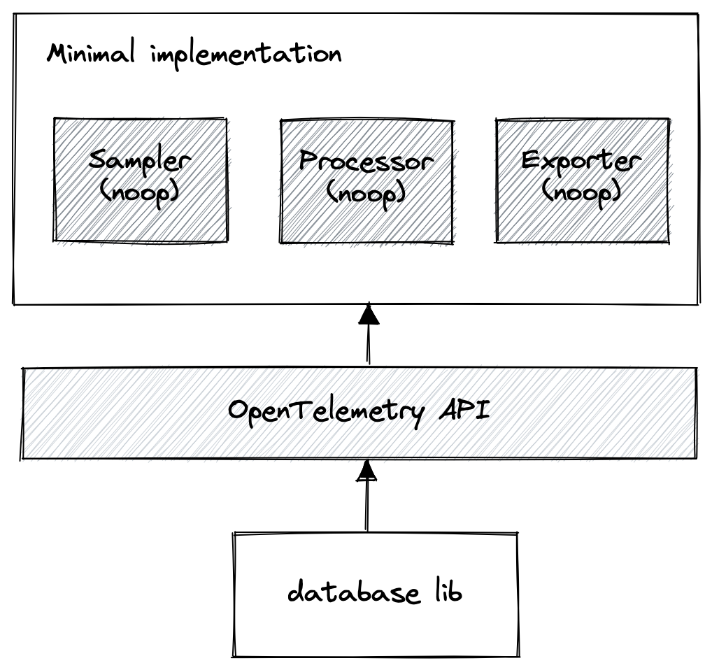

<Callout variant="course">

This lesson is a part of our OpenTelemetry masterclass. If you haven't already, checkout the [chapter introduction](/opentelemetry-masterclass/fundamentals).

Each lesson in this lab builds on the last one, so make sure you learn about [the interface with which you work with telemetry data](/opentelemetry-masterclass/fundamentals/defining-the-interface) before proceeding with this one.

</Callout>

The API defines the interface with which you work with data, but it also requires an implementation that does effectively nothing. This “minimal” implementation has very low overhead and no side effects.

The API is used by programs that deal with telemetry data, including instrumentation libraries, frameworks for interacting with certain technologies, like network requests or databases, and applications that use those tools. Only the application developer, however, knows how they want to use the data generated by the OpenTelemetry APIs. Having a minimal implementation allows developers to build API interactions into their code regardless of whether or not the application developer wants to use OpenTelemetry.

For example, imagine a database library developer wants to instrument their code so that their users have the option of using the telemetry data it generates. The developer configures their tracer provider, uses it to create a tracer, then uses that tracer to create spans throughout their code. They can do all of this, and more, without knowing or caring if the user even wants telemetry data, but with peace of mind that the instrumentation will be performant and without side effects.

If the user doesn’t want to use OpenTelemetry, the API uses its minimal implementation, which doesn’t actually generate any telemetry data.

If the user wants to use OpenTelemetry, they configure an implementation. The library, which uses the APIs, automatically starts generating and sending the appropriate data the way the user wanted it to.

This provides consistency for developers using OpenTelemetry APIs. It also relieves some burden off developers by not requiring some kind of special, instrumented version of their library. By removing these barriers, you can adopt OpenTelemetry much more easily, and greater adoption means less gaps and better telemetry data for everyone.

Like with the data model specification, it’s important to remember that the API specifications for each signal are at different stages of maturity. View the [OpenTelemetry status page](https://opentelemetry.io/status/) for the most up-to-date information of the maturity of API specifications.

Now that you’ve seen some examples of what the API specification defines, it’s important to take a step back in order to be clear about what it doesn’t define.

<Callout variant="course">

This lesson is a part of our OpenTelemetry masterclass. Continue on to the next lesson: [Separating concerns](/opentelemetry-masterclass/fundamentals/separating-concerns).

</Callout>
