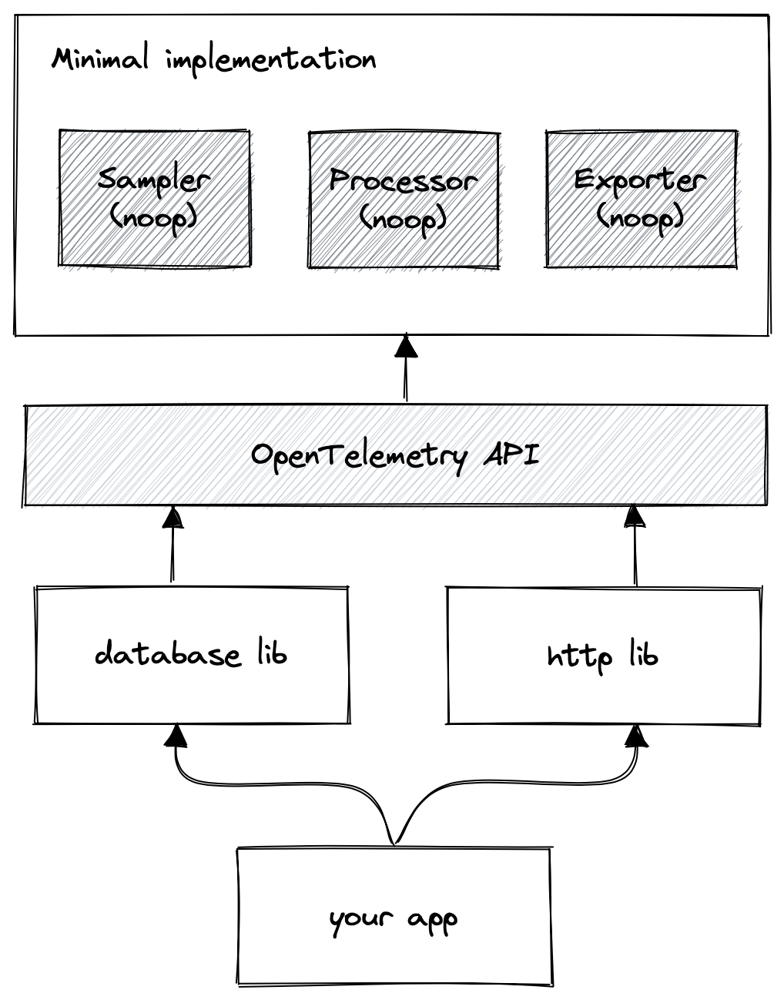
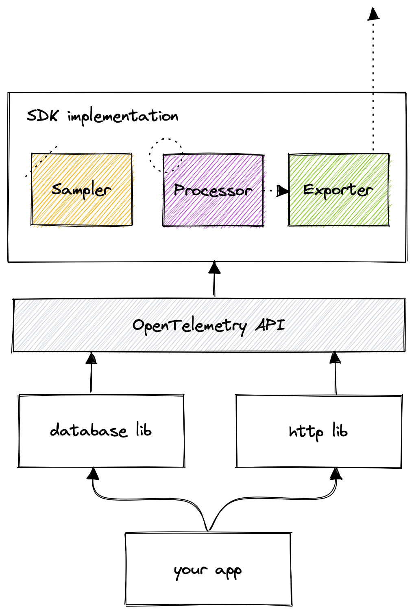

<Callout variant="course">

This lesson is a part of our OpenTelemetry masterclass. If you haven't already, checkout the [chapter introduction](/opentelemetry-masterclass/fundamentals).

Each lesson in this lab builds on the last one, so make sure you learn about [separating concerns](/opentelemetry-masterclass/fundamentals/separating-concerns) before proceeding with this one.

</Callout>

OpenTelemetry provides specifications for each of the signals it supports. You’ve already seen that these include descriptions of the data model and API, but they also include a description of the SDK. The SDK specification defines the requirements for implementing the logic behind the API. Before you learn more specifics about the SDK specification, you may find an illustration of how you might use the SDK valuable.

Imagine you’re building an application that is supported by libraries that are instrumented with OpenTelemetry. Until now, you haven’t defined how you want to use the telemetry data, so the API that those libraries interact with are using the minimal implementation. In other words, the libraries aren’t generating or sending data, but they’re equipped to. You’re now ready to configure the SDK to make use of that instrumentation.

You start by deciding how you want to use your telemetry data. For traces, you decide how you want to process spans, how you want to sample them, and how and where you want to send them, once collected. Once you know how you want the API to treat your data, you configure an implementation using interfaces from the SDK.

The specification defines three mechanisms for configuring the SDK:

- **Plugins** that provide interchangeable implementations
- **Constructors**, such as environment variables and objects, that hold configurations, accept plugins, or create resources
- A **Resource** that identifies your environment that produces telemetry data

Once you apply your plugins and configure your constructors, API interactions produce results the way you want them to. They no longer use the minimal implementation; they use the implementation you configured instead. Because the API doesn’t know or care what implementation is used, the instrumentation requires no code changes.

Now that you’ve seen a high level example of how the SDK works, it’s time to learn how the specification defines the plugin and constructor interfaces.

<Callout variant="course">

This lesson is a part of our OpenTelemetry masterclass. Continue on to the next lesson: [SDK plugins](/opentelemetry-masterclass/fundamentals/sdk-plugins).

</Callout>
